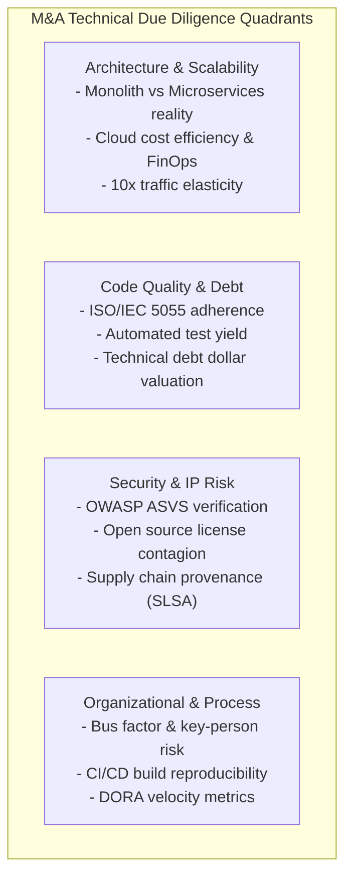

# Enterprise Technical Due Diligence (TDD) & M&A Codebase Audit Guide

This guide establishes the institutional auditing protocol utilized by Principal Codebase Auditors when evaluating software assets during **Mergers & Acquisitions (M&A)**, **Private Equity (PE) Buyouts**, **Venture Capital (VC) Growth Rounds**, and **Tier-1 Bank Vendor Procurement Acceptance**.

---

## 1. The Investor & Enterprise Mindset

In an M&A or procurement audit, the auditor's role is **risk underwriting** and **valuation protection**. A technical audit answers four critical commercial questions:
1. **Is the asset real and scalable?** Or is it a fragile prototype marketed as an enterprise platform?
2. **What is the true cost of ownership?** How much hidden technical debt must be funded immediately post-close to stabilize the software?
3. **What are the existential legal/security liabilities?** Are there open-source license contagions (AGPL), stolen IP, unpatched CVEs, or regulatory violations?
4. **Is the asset transferable?** Is the engineering team heavily reliant on a single "load-bearing engineer" who holds all architectural context in their head?



---

## 2. Red Flags: The "Deal-Breaker" Taxonomy

A veteran auditor watches for specific operational and architectural red flags that directly impact enterprise deal valuation:

### 1. "The Rewrite in a Trench Coat" (Metastasized Technical Debt)
*   **Definition:** A legacy codebase that has been cosmetically patched with modern frameworks on the surface (e.g. React or Next.js UI) while the underlying core is an unmaintainable, tightly coupled, monolithic labyrinth with 0 tests.
*   **Diagnostic Symptoms:**
    *   Files exceeding 3,000 LOC with dozens of business responsibilities.
    *   Zero automated integration tests; releases require weeks of manual testing.
    *   High regression rate: fixing one bug in payments breaks loan interest calculation.
    *   Engineering leadership secretly advocating for a ground-up rewrite.
*   **Commercial Impact:** Requires immediate post-acquisition capital expenditure ($500k – $3M+) and 6–18 months of stalled product feature delivery.

### 2. "The Load-Bearing Engineer" (Extreme Key-Person Risk)
*   **Definition:** An engineering organization where 70%+ of critical architectural commits, deployment credentials, and operational troubleshooting rest with a single individual.
*   **Diagnostic Metrics:**
    *   Git `shortlog -sn`: Single author accounts for $>65\%$ of commits over the last 12 months.
    *   Zero documented runbooks for environment setup or disaster recovery.
    *   Code reviews absent or rubber-stamped.
*   **Commercial Impact:** If the key person departs post-acquisition, the software cannot be reliably maintained or scaled. Deal requires substantial retention earn-outs or escrow holdbacks.

### 3. "Architectural Drift" (The Distributed Monolith)
*   **Definition:** A system claimed to be a "modern microservices architecture" that actually shares a single centralized database across all services, lacks API versioning, and requires simultaneous synchronized deployments of all services.
*   **Diagnostic Symptoms:**
    *   Multiple services directly reading/writing to foreign database tables without ownership encapsulation.
    *   Cascading distributed deadlocks and distributed transaction failures.
*   **Commercial Impact:** Suffers all the operational complexities of distributed systems with none of the independent scalability benefits.

### 4. "Licensing Contagion" (Viral Open-Source Infiltration)
*   **Definition:** Proprietary, closed-source enterprise software incorporating code or libraries governed by strong copyleft (GPL) or network copyleft (AGPL) licenses.
*   **Diagnostic Rules:**
    *   **AGPL-3.0 (Affero GPL):** Triggers mandatory disclosure of entire proprietary backend source code to any user interacting with the service over a network.
    *   **GPL-2.0 / GPL-3.0:** Triggers copyleft contagion if distributed to on-premise enterprise clients.
*   **Commercial Impact:** Threatens the intellectual property valuation of the entire software asset; requires emergency code excision and clean-room reimplementation prior to close.

---

## 3. Open Source License Risk Classification Matrix

| License Family | Example Licenses | Enterprise Risk Level | Commercial Guidance for Proprietary / Closed Source |
|---|---|---|---|
| **Network Copyleft** | AGPL-3.0, OSL-3.0, SSPL | **CRITICAL (Deal-Breaker)** | **Prohibited** in proprietary SaaS and backend architectures without commercial dual-license exception. Excision required. |
| **Strong Copyleft** | GPL-2.0, GPL-3.0 | **HIGH RISK** | **Prohibited** in distributed/on-premise enterprise software. Permitted only in internal-only tooling with zero client distribution. |
| **Weak Copyleft** | LGPL-2.1, LGPL-3.0, MPL-2.0, EPL-2.0 | **MEDIUM RISK** | Acceptable **only** if consumed as dynamically linked external libraries without modification to library source code. |
| **Permissive** | MIT, Apache-2.0, BSD-2/3-Clause, ISC | **ENTERPRISE SAFE** | Approved for enterprise proprietary commercial software. Requires standard copyright notice attribution in documentation. |
| **Public Domain** | Unlicense, CC0-1.0 | **SAFE** | Permitted without legal restriction. |

---

## 4. Technical Debt Financial Valuation Model

Enterprise auditors do not merely list defects; they calculate the **Capitalized Cost of Remediation (CoR)**.

$$\text{Total Remediation Effort (Hours)} = \sum_{i=1}^{4} \left( N_{i} \times H_{i} \right)$$

Where:
*   $N_{\text{P0}} =$ Count of Critical Flaws (Security/Data Corruption) $\rightarrow H_{\text{P0}} = 16 \text{ hours}$
*   $N_{\text{P1}} =$ Count of High Flaws (Architectural/Auth/Perf) $\rightarrow H_{\text{P1}} = 8 \text{ hours}$
*   $N_{\text{P2}} =$ Count of Medium Flaws (Smells/Swallowed Errors) $\rightarrow H_{\text{P2}} = 3 \text{ hours}$
*   $N_{\text{P3}} =$ Count of Low Flaws (Tech Debt/Complexity) $\rightarrow H_{\text{P3}} = 0.5 \text{ hours}$

$$\text{Remediation Valuation (USD)} = \text{Total Remediation Effort (Hours)} \times R_{\text{blended}}$$

*Standard Enterprise Blended Rate:* $R_{\text{blended}} = \$125.00/\text{hr}$ (Senior Enterprise Engineering Benchmark).

### Technical Debt Ratio (TDR):
$$\text{TDR} = \frac{\text{Remediation Valuation (USD)}}{\text{Estimated Asset Replacement Cost (USD)}} \times 100\%$$

*   $\text{TDR} \le 5\%$: **Healthy Asset (Grade A)**
*   $5\% < \text{TDR} \le 12\%$: **Manageable Debt (Grade B)**
*   $12\% < \text{TDR} \le 25\%$: **Significant Technical Drag (Grade C)**
*   $\text{TDR} > 25\%$: **Impaired Asset / Architectural Insolvency (Grade D/F)**

---

## 5. Due Diligence Verification Workflow

When executing an M&A or procurement codebase audit:

```
[Day 1: Ingestion & Static Probe]
  ├── Run audit_scanner.py (--format json)
  ├── Extract volume (LOC), language mix, and ISO-5055 pillar counts
  └── Scan commit log for author concentration and churn velocity

[Day 2: Forensic Deep-Dive]
  ├── Verify all P0/P1 security and architectural findings in source
  ├── Audit dependency manifests for AGPL/GPL license contagion
  └── Inspect container/IaC manifests for non-root, pinned builds

[Day 3: Synthesis & Executive Report]
  ├── Compute Technical Debt Valuation and TDR ratio
  ├── Benchmark against ISO/IEC 5055 and NIST SSDF outcomes
  └── Formulate Deal Recommendations (Escrow holdbacks, covenants, remediation milestones)
```
