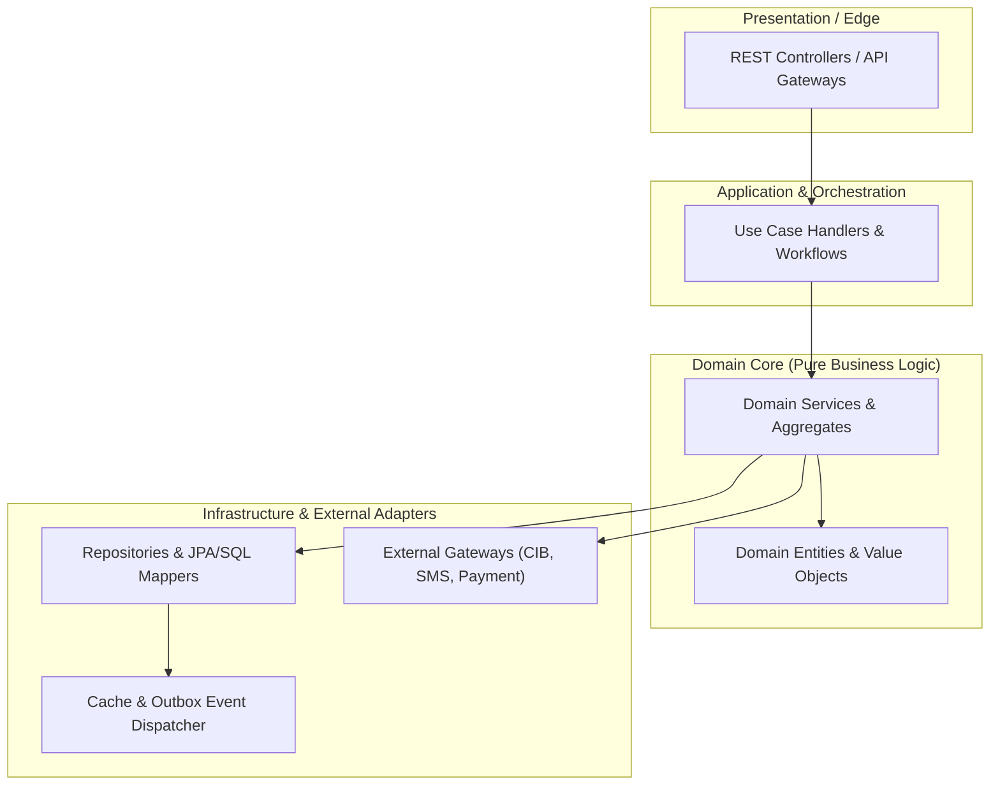
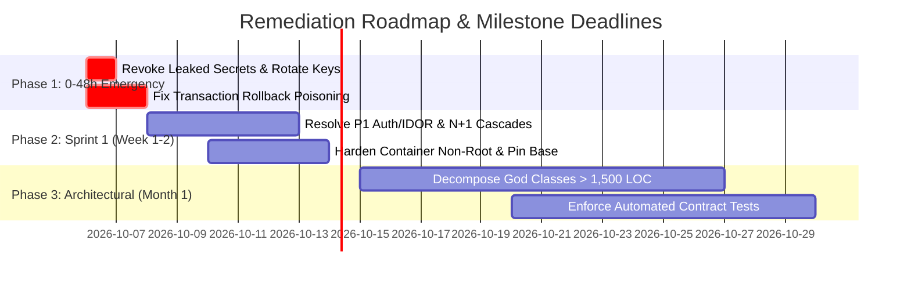

# Enterprise Codebase & Workspace Forensic Audit Report
## Institutional Software Quality, Security & Technical Due Diligence Assessment

**Target System:** {PROJECT_NAME}  
**Audit Scope:** Full Workspace, Multi-Module Repositories & Dependencies  
**Audit Standards:** 
- **ISO/IEC 5055:2021** (Automated Source Code Quality Measures)
- **NIST SP 800-218** (Secure Software Development Framework - SSDF v1.1)
- **OWASP ASVS v4.0.3** (Application Security Verification Standard Level 2/3)
- **Google SLSA Level 3** (Supply-chain Levels for Software Artifacts)
- **ISO/IEC 25010** (System and Software Quality Models)  

**Auditor:** Principal Enterprise Codebase Auditor (20+ Years Enterprise Practice)  
**Date of Assessment:** {AUDIT_DATE}  

---

## 1. Executive Summary & Investment Scorecard


### Overall Enterprise Health Grade: **GRADE {GRADE} ({HEALTH_SCORE} / 100)**
### Investment Risk Rating: **{INVESTMENT_RISK_RATING}** (e.g., LOW RISK | MODERATE RISK | HIGH RISK | DEAL-BREAKER)

| Metric | Measured Value | Enterprise Benchmark / SLA | Audit Verdict |
|---|---|---|---|
| **Overall Health Score** | **{HEALTH_SCORE} / 100** | $\ge 90.0$ (Grade A) | **{HEALTH_STATUS}** |
| **Technical Debt Valuation** | **${DEBT_VALUATION_USD}** | $\le 5\%$ of Replacement Cost | **{DEBT_STATUS}** |
| **Remediation Effort** | **{DEBT_HOURS} Hours** | ~{DEBT_DEV_MONTHS} Dev-Months | Engineering Capacity Req. |
| **Total Lines of Code (LOC)** | {TOTAL_LOC} | Across {LANG_COUNT} languages | High-Density Core |
| **Total Scanned Files** | {TOTAL_FILES} | 100% Repository Surface | Complete Non-Invasive Scope |
| **P0 - Critical Flaws (Blockers)** | **{P0_COUNT}** | 0 Tolerance (Must be 0) | **{P0_STATUS}** |
| **P1 - High Priority Flaws** | **{P1_COUNT}** | $\le 2$ | **{P1_STATUS}** |
| **P2 - Medium Smells & Risks** | **{P2_COUNT}** | $\le 10$ | **{P2_STATUS}** |
| **P3 - Low Debt & Hotspots** | **{P3_COUNT}** | Tracked in Backlog | **{P3_STATUS}** |
| **Key-Person / Bus Factor Risk** | **{BUS_FACTOR_RATING}** | Top Author $\le 40\%$ | **{BUS_FACTOR_STATUS}** |

> **Executive Recommendation:**  
> {EXECUTIVE_RECOMMENDATION_PARAGRAPH}

---

## 2. ISO/IEC 5055 Automated Quality Model

The codebase was evaluated against the four core quality characteristics defined by **ISO/IEC 5055**:

| Quality Characteristic | Primary CWE Focus Areas | Defect Count (P0/P1/P2/P3) | Characteristic Score | Audit Verdict |
|---|---|---|---|---|
| **Reliability** | CWE-398 (Error Handling), CWE-252 (Unchecked Return), Concurrency Races | {REL_P0} / {REL_P1} / {REL_P2} / {REL_P3} | **{REL_SCORE} / 100** | {REL_STATUS} |
| **Security** | CWE-89 (SQLi), CWE-79 (XSS), CWE-798 (Hardcoded Keys), CWE-918 (SSRF) | {SEC_P0} / {SEC_P1} / {SEC_P2} / {SEC_P3} | **{SEC_SCORE} / 100** | {SEC_STATUS} |
| **Performance Efficiency** | CWE-400 (Resource Exhaustion), CWE-1050 (N+1 Queries), Event-loop Blocks | {PERF_P0} / {PERF_P1} / {PERF_P2} / {PERF_P3} | **{PERF_SCORE} / 100** | {PERF_STATUS} |
| **Maintainability** | CWE-1061 (Complexity), CWE-1048 (Cohesion), Circular Dependencies | {MAIN_P0} / {MAIN_P1} / {MAIN_P2} / {MAIN_P3} | **{MAIN_SCORE} / 100** | {MAIN_STATUS} |

---

## 3. NIST SP 800-218 (SSDF) & SLSA Supply Chain Assurance

| SSDF Practice Group | Control Objective | Verification Evidence | Compliance Status |
|---|---|---|---|
| **PO: Prepare the Organization** | Secure coding standards and role access defined | Repository rules, documentation, and branch protections | {PO_STATUS} |
| **PS: Protect the Software** | Protection against tampering and unauthorized access | Commit signature checks, secret scanning, RBAC | {PS_STATUS} |
| **PW: Produce Well-Secured Software** | SAST, DAST, threat modeling, dependency vetting | Automated test yield, lockfile pinning, SCA coverage | {PW_STATUS} |
| **RV: Respond to Vulnerabilities** | Rapid patch triage, root-cause investigation | Issue SLAs, automated regression tests | {RV_STATUS} |

### Supply Chain (SLSA Level 3 & OpenSSF Scorecard)
- **Lockfile Determinism:** `{LOCKFILE_STATUS}` (Committed deterministic lockfiles verified)
- **Pinned Dependencies:** `{PINNED_STATUS}` (Zero floating wildcards in critical paths)
- **Container Hardening:** `{CONTAINER_STATUS}` (Non-root user, multi-stage builds, digest pinning)
- **Open-Source License Contagion:** `{LICENSE_CONTAGION_STATUS}` (Zero AGPL/GPL copyleft in proprietary code)

---

## 4. High-Priority Findings & Remediation Ledger

### [AUDIT-{DIMENSION}-{NUM}] {Concise Finding Title}

- **Severity:** `CRITICAL (P0)` | `HIGH (P1)`
- **Dimension:** `{DIMENSION_NAME}` (e.g. 02 Security & Secrets / 03 Architectural Topology / 07 Reliability)
- **Standard Mapping:** `ISO/IEC 5055 [CWE-XXX]` | `OWASP ASVS [V-X.X.X]` | `NIST SSDF [PW-X.X]`
- **CVSS v3.1 Vector:** `{CVSS_VECTOR}` (Score: `{CVSS_SCORE}`)
- **Location:** `[{FILE_PATH}]({FILE_LINK}#L{START_LINE}-L{END_LINE})`
- **Impact Radius:** {DETAILED_IMPACT_RADIUS_DESCRIPTION}

#### 1. Vulnerability & Anti-Pattern Root Cause
{DEEP_FORENSIC_EXPLANATION}

#### 2. Forensic Code Evidence
```{LANGUAGE}
// {FILE_PATH}#L{START_LINE}-L{END_LINE}
{DEFECTIVE_CODE_SNIPPET}
```

#### 3. Production-Grade Remediation (Exact Patch Diff)
```diff
--- a/{FILE_PATH}
+++ b/{FILE_PATH}
@@ -{START_LINE},5 +{START_LINE},8 @@
-{DEFECTIVE_LINES}
+{REMEDIATED_LINES}
```

#### 4. Verification Test Case
```{LANGUAGE}
{VERIFICATION_TEST_CODE}
```

---

## 5. Architectural Topology & Component Coupling



### Architectural Forensics:
- **Coupling & Layering:** {COUPLING_NOTES}
- **Cyclic Dependency Sweeps:** {CYCLIC_NOTES}
- **Leaky Database Abstractions:** {LEAKY_NOTES}

---

## 6. Git Churn, Complexity Hotspots & Team Concentration

| Hotspot File | LOC | Indentation Depth | Commit Churn (Last 100) | Risk Profile & Required Action |
|---|---|---|---|---|
| `{HOTSPOT_FILE_1}` | {LOC_1} | {NEST_1} | {CHURN_1} | Decompose into focused single-responsibility use cases |
| `{HOTSPOT_FILE_2}` | {LOC_2} | {NEST_2} | {CHURN_2} | Parameterize raw query concatenation |
| `{HOTSPOT_FILE_3}` | {LOC_3} | {NEST_3} | {CHURN_3} | Extract shared validation logic |

### Team Concentration & Bus Factor:
- **Top Contributor Share:** **{TOP_AUTHOR_SHARE_PCT}%** of total commits
- **Bus Factor Assessment:** **{BUS_FACTOR_ASSESSMENT}**
- **Action Required:** {BUS_FACTOR_MITIGATION}

---

## 7. Phased Remediation Roadmap



### Phase 1: 0–48 Hour Emergency Triage
- [ ] Revoke, rotate, and migrate any hardcoded credentials into Vault/Secrets Manager.
- [ ] Apply atomic patch diffs for all `P0` vulnerabilities.
- [ ] Purge any leaked `.env` files from working tree and git history (`git filter-repo`).

### Phase 2: Sprint 1 Tactical Hardening
- [ ] Fix all `P1` architectural defects (ORM N+1 queries, unhandled async rejections, BOLA/IDOR).
- [ ] Enforce container non-root execution and pin deterministic lockfiles.
- [ ] Replace assertion-free tests with behavioral assertions.

### Phase 3: Strategic Architectural Modernization
- [ ] Decompose identified God classes into atomic domain use cases.
- [ ] Establish automated ISO/IEC 5055 and NIST SSDF gates in CI/CD pipeline.
- [ ] Re-run `audit_scanner.py` to verify Health Score $\ge 90.0$ (Grade A).

---

## 8. Audit Governance & Sign-Off

- **Lead Auditor:** Principal Enterprise Codebase Auditor
- **Audit Methodology:** 4-Tier Zero-Token-Waste Funnel
- **Verification Hash:** `{AUDIT_HASH}`
- **Sign-Off Verdict:** `{FINAL_VERDICT_BADGE}`
