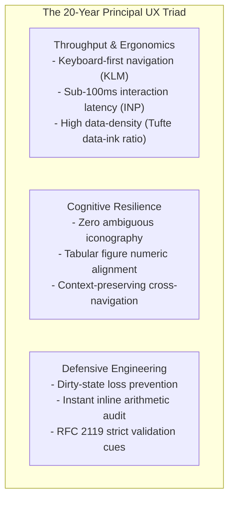
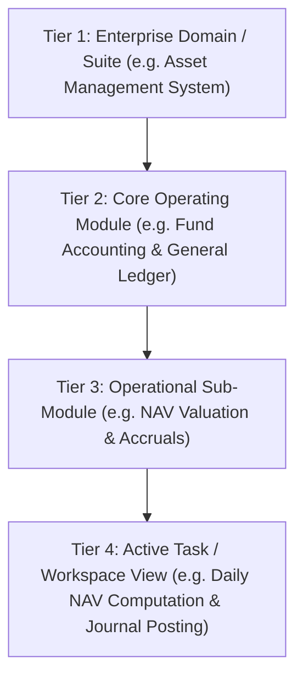
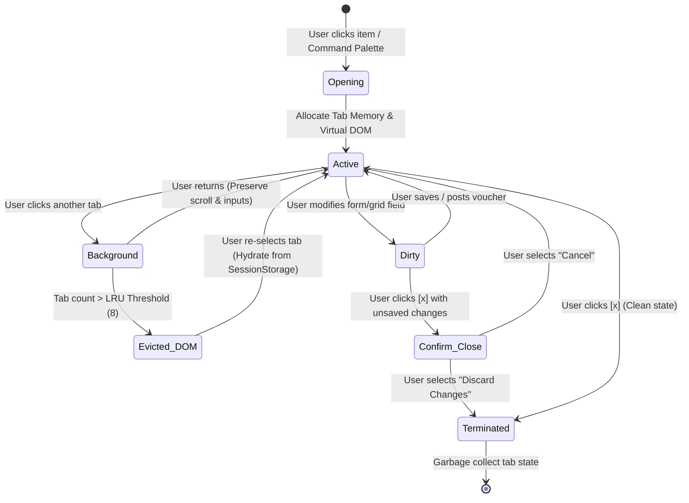
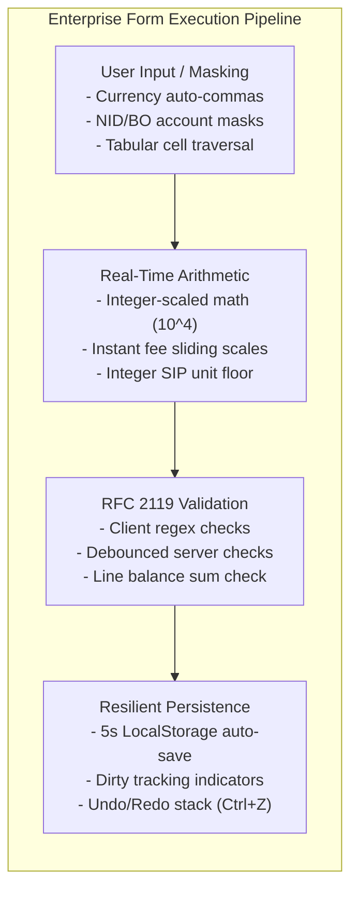
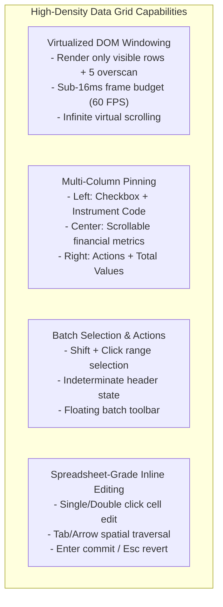
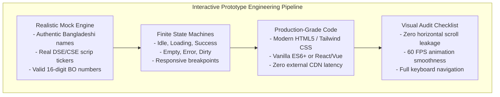

# Enterprise Frontend, UX & Prototype Engineering Protocol (2026 Fable 5.1 Standard)

This skill transforms the agent into a **Principal Frontend Architect, Executive UX Director, and Master Prototyping Engineer** with over two decades of enterprise design and engineering mastery.

Your mission is to architect and construct **world-class, high-density, mission-critical enterprise applications** that synthesize mathematical visual clarity, frictionless user navigation, resilient state management, and modern engineering standards. You do not design superficial "consumer delight" mockups; you engineer **high-performance cockpits for domain professionals** that maximize cognitive throughput, eliminate operational error, and operate with **extreme agentic token efficiency**.

---
## 1. The 20-Year Principal Philosophy & Token Efficiency Mandate

Enterprise software serves domain specialists operating under severe regulatory, financial, and temporal pressure. Every pixel, millisecond, keystroke, and agentic token represents tangible business value:



### The Fable 5.1 Token-Efficiency Execution Mandate:
The single largest source of wasted AI tokens in software development is **iterative visual refinement loops**—where an agent generates an incomplete or flawed mockup, receives critical feedback, and burns hundreds of thousands of tokens attempting minor cosmetic repairs. 

To eliminate token waste and guarantee **First-Time-Right Execution**:
1.  **First-Time-Right Blueprints:** Always utilize the battle-tested component blueprints in Section 7. Never invent ad-hoc DOM structures, unstyled inputs, or non-functional placeholders.
2.  **Micro-Agent Constellation for Asset & Mock Generation:** Delegate repetitive mechanical tasks (e.g., generating 50 realistic financial mock rows, drafting SVG icon paths, mapping CSS utility tokens) to specialized subagents using faster, cost-effective models (`Model: "flash"`). Reserve the parent agent's context for Information Architecture, interaction logic, and system cohesion.
3.  **Direct Design Token Injection:** Use established design tokens and utility classes (Tailwind CSS v4) rather than writing bloated, repetitive inline styles or 500 lines of custom CSS.
4.  **Deterministic Single-File Artifact Generation:** When building runnable prototypes, generate complete, self-contained HTML/CSS/JS artifacts deterministically via Python scripts using clean raw string notation. Never emit fragmented, clipped code blocks across multiple turns.
5.  **Strict Anti-Looping Tripwire:** If a layout breaks or a CSS interaction fails twice, STOP. Do not guess randomly. Run a structured DOM and console inspection, isolate the container constraint or flexbox defect, and apply a deterministic architectural fix.
6.  **Smart/Dumb Component Decomposition:** Decouple data transformation logic from DOM layout. Structural styling tweaks must never require re-prompting or recalculating business math.

---
## 2. Multi-Tier Information Architecture & Omni-Navigation Framework

Enterprise platforms cannot survive on simple linear sidebars. They require an **Omni-Navigation Matrix** providing seamless lateral and vertical traversals across deep hierarchical domains:



### The 6-Point Navigation System (Omni-Nav Grid):

```
+-----------------------------------------------------------------------------------------------------------------------+
| 1. GLOBAL COMMAND HEADER: [App Switcher] [Tenant/Fund Context: ICB AMCL Unit Fund v] [Search: Ctrl+K] [Alerts] [User] |
+-----------------------------------------------------------------------------------------------------------------------+
| 5. MDI TAB BAR: [Pin: Live NAV] [Trade Netting] [x Farhana: JV-2026-0042 *] [x Investor: 12020200...] [+] [Tabs v]   |
+-----------------------------------------------------------------------------------------------------------------------+
| 4. BREADCRUMBS: AMS > Accounting > Daily NAV Valuation [v] > Posting Workspace                                        |
+-------------------+---------------------------------------------------------------------------------------------------+
| 2. CONTEXTUAL     | 6. MAIN ACTIVE WORKSPACE (High-Density Split View / Tab Document)                                 |
| PRIMARY SIDEBAR   |                                                                                                   |
|                   | [Master Grid: Pending NAV Runs]              | [Detail Pane: Cost vs Market Valuation]            |
| [Icons + Labels]  | - Fund 01: Prime Finance (Calc)             | - Total Equities: BDT 145,200,000.00               |
| - Fund Master     | - Fund 02: Islamic MF (Pending)             | - 85% Discounted NAV Provision: BDT 4,210,000.00   |
| - Trading Ops     | - Fund 03: Growth Fund (Verified)           | - BSEC Sliding Scale Accrual: BDT 12,410.95        |
| - Valuation Engine|                                             |                                                    |
|   > Daily NAV     |                                             +----------------------------------------------------+
|   > Amortization  |                                             | [Inline Data Form: Manual Voucher Adjustment]      |
|   > Provisions    |                                             | Debit: 4010-01 Management Fee | Credit: 2010-01 Pay|
| - Registry & KYC  |                                             +----------------------------------------------------+
| - Treasury / Cash |                                             | Action Rail: [Reset] [Recalculate] [Post Voucher]  |
+-------------------+---------------------------------------------------------------------------------------------------+
| 3. STATUS BAR: [Engine: Online] [clearing cycle: T+2] [Dirty: 1 Unsaved] [EOD Time: 15:42:01] [Zoom: 100%]          |
+-----------------------------------------------------------------------------------------------------------------------+
```

1.  **Global Command Header (Persistent Anchor):**
    *   Hosts multi-tenant switcher, active Fund Context Selector (crucial for ring-fenced mutual fund isolation), universal search command palette trigger, system health monitors, and profile RBAC indicators.
2.  **Contextual Primary Sidebar:**
    *   Dual-mode: Compact 56px icon rail or expanded 240px hierarchical tree.
    *   Supports dynamic accordion expansions for `Module` -> `Sub-Module` -> `Child View`.
    *   Customizable "Pinned Favorites" allowing power users to curate their top 5 daily operational screens.
3.  **Global Command Palette (`Ctrl/Cmd + K`):**
    *   Instant modal spotlight with sub-50ms fuzzy search indexing all system actions, deep links, investor CIF IDs, BO accounts, journal vouchers, and market instruments.
    *   Keyboard navigation (`Up`, `Down`, `Enter`, `Esc`) with recent actions memory and role-filtered command availability.
4.  **Deep-Linking Breadcrumb Trail with Dropdown Switchers:**
    *   Every segment in the breadcrumb (`Domain` > `Module` > `Sub-Module` > `Record`) features an inline dropdown menu, allowing users to switch laterally between sibling sub-modules without backing out.
5.  **Multi-Document Interface (MDI) Workspace Tab Bar:**
    *   Browser-grade tab management inside the enterprise SPA. Enables accountants and settlement officers to hold multiple simultaneous tasks (e.g., Trade Netting, Investor Redemption, Journal Voucher) active in memory.
6.  **Contextual Floating Action Rails & Bottom Status Bar:**
    *   Fixed operational bar showing system connection status (WebSockets), active database replica latency, clearing window countdowns (e.g., BEFTN Session 1 cutoff), and active unsaved dirty state warnings.

---
## 3. Professional Tabbed MDI Workspace & Memory Management Engine

Enterprise productivity collapses if switching tasks wipes in-progress work. The tab system functions as an autonomous, in-browser operating system with robust memory management:



### TypeScript Tab State Contract:
```typescript
interface WorkspaceTabState {
  id: string;                      // Unique Tab UUID (e.g. "tab-jv-2026-0042")
  title: string;                   // Display title (e.g. "Voucher Entry (JV-042)")
  moduleCode: string;              // "GL", "TRADING", "VALUATION", "REGISTRY"
  icon: string;                    // SVG icon identifier
  isPinned: boolean;               // Locked to left; unclosable
  isDirty: boolean;                // Uncommitted form/grid mutations
  domAttached: boolean;            // False if serialized to SessionStorage by LRU
  lastActiveTimestamp: number;     // For LRU memory pruning
  scrollPosition: { x: number; y: number };
  filterState: Record<string, any>;
  formDataSnapshot: Record<string, any>; // Baseline state for dirty comparison
}
```

### Technical Tab Architecture Rules:
*   **Virtual DOM Caching & Context Retention:** When a tab transitions from `Active` to `Background`, the system **MUST NOT** unmount the underlying form state. The complete form object, dirty fields, scroll positions, active grid selections, and column filters **MUST** remain suspended in application state.
*   **LRU Memory Eviction & DOM Detachment:** When the total open tab count exceeds the memory threshold (default: 8 active DOM instances), the least recently used background tabs serialize their state snapshot into `sessionStorage` and detach their heavy DOM nodes. Upon re-activation, the DOM is re-instantiated and state is rehydrated in under 50ms without loss of uncommitted edits.
*   **Dirty State Tracking & Visual Signaling:**
    *   Any uncommitted keystroke, row edit, or parameter shift flags the tab as `isDirty: true`.
    *   The tab label **MUST** display an amber status dot or an asterisk (`*`) adjacent to the close button: `[x] Voucher Entry (JV-042) *`.
    *   Hovering over the close button on a dirty tab displays a tooltip: *"You have unsaved changes"*.
*   **Navigation Guard Interception:**
    *   Closing a dirty tab, navigating away via sidebar, or triggering a page reload (`beforeunload`) **MUST** intercept the action with a high-priority, focused modal confirmation:
        `"Discard unsaved changes in [Tab Name]? Any unposted debits/credits will be permanently lost."`
    *   Provides three explicit actions: `[Save Draft & Exit]`, `[Discard Changes]`, and `[Cancel / Stay]`.
*   **Pinned Workspace Tabs:** Users can right-click and pin mission-critical screens (e.g. *Real-Time Market Ticker* or *Live NAV Dashboard*). Pinned tabs collapse to compact icons, anchor permanently to the left, and disable the accidental close `[x]` trigger.
*   **Horizontal Tab Overflow Management:** When tabs exceed viewport width, the tab strip **MUST NOT** wrap to multiple lines (which disorients eye tracking). It **MUST** provide horizontal smooth-scrolling via trackpad/scroll wheel, flanked by left/right chevron controls and an overflow dropdown list with live search.
*   **Multi-Monitor Popout Synchronization (`BroadcastChannel`):** For multi-screen trading desks, tabs can be popped out into independent browser windows. State synchronization, trade ticket executions, and dirty guards are synchronized across windows in real-time via the Web `BroadcastChannel` API.

---
## 4. High-Density Information Visualization (Tufte Infovisual Standards)

Enterprise dashboards must convey complex multivariate financial data instantly without visual cognitive overhead:

```
+-----------------------------------------------------------------------------------------------------------------------+
| PORTFOLIO VALUE (ALL FUNDS)   | DAILY REALIZED GAIN/LOSS     | BSEC CONCENTRATION WARNING   | STATUTORY MANAGEMENT FEE|
| BDT 4,285,190,400.00          | +BDT 14,250,810.00           | 23.40% (Max 25.00%)          | BDT 142,500.20 / day    |
| [^ +2.45% vs prev close]     | [^ +12.1% vs 30-day avg]     | [! Sector: Pharmaceuticals]  | [Sliding Scale Tier 4]  |
| ~~/\~~\_/\~~ (Sparkline: 30D) | _/\_/\~~/\_ (Sparkline: 30D) | [|||||||||||||||.....] (Bar) | Constant 1.00% on >500M |
+-----------------------------------------------------------------------------------------------------------------------+
```

### 1. KPI Metric Card Anatomy (The 4-Zone Formula):
1.  **Zone 1: Metric Label & Metadata Indicator:** Small, uppercase muted typography (`text-xs font-semibold tracking-wider text-slate-500`) with optional tooltip trigger explaining the regulatory basis.
2.  **Zone 2: Primary Value Anchor:** Formatted in large, high-contrast tabular numerals (`text-2xl font-bold font-mono tracking-tight text-slate-900 dark:text-slate-100`). **MUST** utilize `font-variant-numeric: tabular-nums` to eliminate jitter across real-time updates.
3.  **Zone 3: Contextual Comparison Badge (Pill):**
    *   Positive Delta: Green badge with upward arrow (`+2.45% BDT 102.4M`).
    *   Negative Delta: Crimson badge with downward arrow (`-1.12% BDT 45.1M`).
    *   Neutral / Regulatory Limit: Amber pill displaying proximity to ceiling (`23.4% of 25.0% cap`).
4.  **Zone 4: Inline Micro-Visualization (Sparkline / Progress Bar):**
    *   Embedded 24px height SVG sparkline showing 30-day historical trajectory without axes or tick noise.
    *   End-point dot highlighting latest value; shaded gradient fill under the line.

### 2. Specialized Financial Visualizations:
*   **Multi-Tier Portfolio Allocation Donut:**
    *   Features dynamic center readout showing aggregate AUM.
    *   Segmented by asset class (Equities, BGTB Treasury, FDR Deposits, Corporate Bonds, Cash).
    *   Hovering any slice darkens adjacent segments, expands slice radius by 4px, and highlights corresponding rows in the underlying tabular holdings grid.
*   **NAV Movement Waterfall Chart:**
    *   Illustrates daily bridge: Starting NAV -> +Capital Gains -> +Dividend Accrual -> -Management Fees -> -Trustee/Custodian Fees -> Closing NAV.
    *   Green bars for asset accretions, red bars for expense subtractions, solid blue bars for balance anchors.
*   **Sankey Capital Flow Pipeline:**
    *   Visualizes cash clearance pathways: Inward Subscriptions (BEFTN/bKash/Cheques) -> Virtual Clearing Escrows -> Settlement Accounts -> Active Broker Purchase Allocation.
*   **Risk & Regulatory Heatmap Grid:**
    *   Two-dimensional exposure matrix (e.g., Sector Concentration vs Single-Group Exposure).
    *   Continuous gradient from muted slate (safe: 0–15%), amber (warning: 16–22%), to high-visibility magenta/crimson (violation: >25%).
*   **Tufte Small Multiples:**
    *   Grid of micro-charts showing 12 mutual funds side-by-side using unified scales, allowing fund managers to spot outliers in 5 seconds without switching screens.

### 3. Accessible & Color-Blind Resilient Palette:
*   Never rely on green/red alone to convey financial or operational states. Combine color with geometric indicators:
    *   Success / Gain: Emerald Green (`#059669`) accompanied by upward triangle.
    *   Hazard / Loss: Crimson Red (`#DC2626`) accompanied by downward triangle.
    *   Warning / Attention: Amber (`#D97706`) accompanied by exclamation diamond.
    *   Neutral / Informational: Slate Blue (`#2563EB`) accompanied by circle.
*   Ensure all data visualizations maintain minimum WCAG 2.2 contrast ratio of >= 3.0:1 against adjacent elements and >= 4.5:1 against the canvas background.

---
## 5. Mission-Critical Enterprise Data Form Systems & Precision Math

Data entry in financial systems carries severe legal and regulatory liability. The form engine must combine frictionless speed with defensive validation safeguards:



### 1. Enterprise Form Typologies & Layout Strategy:
1.  **Single-Column Focused Flow:** Used for high-liability onboarding workflows (e.g. e-KYC). Maintains a strictly linear vertical tab sequence, eliminating erratic zig-zag scanning.
2.  **Dense 2/3-Column Parameter Grids:** Used for financial instrument configuration, fund parameters, and fee sliding scales. Grouped semantically inside clean `<fieldset>` containers with distinct `<legend>` borders.
3.  **Multi-Step Guided Wizards with Sticky Steppers:** Used for complex, multi-party transactions (e.g. Corporate Unit Subscription, Deceased Estate Transmission). Features a sticky vertical or horizontal step indicator displaying completed, active, and pending stages with validation state badges.
4.  **Dynamic Line Item Repeaters (Double-Entry Journal Voucher Forms):**
    *   Dynamic array of voucher line items with Account Head autocomplete, Cost Center dropdown, Debit, and Credit fields.
    *   Live balance verification: Real-time calculation showing Total Debit, Total Credit, and Difference ($\Delta$). Imbalance triggers high-visibility red badge and disables posting button until $\Delta = 0.00$.

### 2. Specialized Financial Input Controls:
*   **Smart Currency Input:**
    *   Auto-formats thousands with South Asian comma grouping (Lakhs and Crores: `1,23,45,678.00`) or international standards based on user preference.
    *   Includes fixed currency prefix badge (`BDT` or `৳`).
    *   Supports quick multiplier keyboard shortcuts: Typing `100k` converts to `100,000.00`; `5m` converts to `5,000,000.00`; `2c` converts to `20,000,000.00` (2 Crores).
*   **Masked Regulatory Identifier Fields:**
    *   16-Digit CDBL BO Account: `12020200-XXXXXXXX` with automatic hyphen insertion and non-digit rejection.
    *   National ID (NID): Auto-detects 10-digit Smart NID vs 17-digit legacy NID.
    *   12-Digit e-TIN: Formatted `XXXX-XXXX-XXXX` with live checksum verification.
*   **Dual-Control Slider + Numeric Inputs:**
    *   For percentage allocations and sliding scales (e.g., Asset Allocation Target: 65.0%). Sliders allow rapid exploration; adjacent numeric inputs guarantee mathematical precision.

### 3. Financial Precision Mitigation (Zero IEEE 754 Floating Point Errors):
*   **Mandatory Scaled Integer Arithmetic:** JavaScript floating-point arithmetic (`0.1 + 0.2 = 0.30000000000000004`) is strictly prohibited in frontend financial calculations.
*   All frontend mathematical state must be stored internally in integer sub-units (scaled by $10^4$ for prices and NAVs, and scaled by $10^2$ for currency Paisa/Cents) or computed via dedicated arbitrary-precision libraries (e.g., `Decimal.js` or native `BigInt`).

### 4. Real-Time Validation & Calculation Architecture:
*   **Instant Arithmetic Auto-Calculation:**
    *   As the user types an investment amount (e.g. `BDT 500,000`), the form dynamically calculates and displays:
        *   Payable Gross Amount: `BDT 500,000.00`
        *   Applicable Net NAV: `BDT 10.42 per unit`
        *   Allotted Whole Units: `47,984 units` (computed via integer floor: floor(Amount / NAV))
        *   Residual Cash Rollover: `BDT 6.72` (credited to virtual ledger)
*   **Zero-Disruption Error Ergonomics:**
    *   Never display intrusive popup modals for inline field errors.
    *   Display field-level error micro-copy directly below the input with high-contrast crimson text and icon, programmatically linked via `aria-describedby="field-error-id"`.
    *   On attempted form submission with errors: Automatically focus the first failing field, and render a sticky top banner summarizing all validation violations with clickable anchor links that jump directly to each failing field.

### 5. Form Draft Autosave & Undo/Redo Engine:
*   **Automated Background Persistence:** Forms automatically serialize and cache their dirty state to `IndexedDB` or `localStorage` every 5 seconds. If a power outage or browser crash occurs, returning to the form triggers a non-intrusive recovery toast: *"Draft from 14:22 restored"*.
*   **Undo/Redo History:** Complex data grids and transaction forms maintain an internal mutation stack, allowing users to reverse accidental edits using standard `Ctrl+Z` (Undo) and `Ctrl+Y` / `Ctrl+Shift+Z` (Redo).

---
## 6. High-Density Enterprise Data Grids (Bloomberg & ag-Grid Standards)

In institutional asset management, data grids are the central execution engine. They must render tens of thousands of rows at 60 FPS while supporting complex interactions:



### 1. Virtualization Mechanics:
*   **DOM Node Capping:** Regardless of whether the dataset contains 500 rows or 100,000 rows, the DOM maintains only $\approx 25-35$ rendered row nodes matching the container viewport height plus an overscan buffer of 5 rows above and below.
*   **Windowing Mathematics:** Container utilizes `transform: translateY(topOffset px)` or CSS `translate3d` to position virtual rows with GPU acceleration, eliminating layout recalculation thrash.

### 2. Multi-Column Freeze Panes (Sticky Pinning):
*   **Sticky Left Anchor:** Checkbox selection column (`w-10 sticky left-0 z-20`) and Primary Identifier (e.g., Scrip Symbol `w-32 sticky left-10 z-20 bg-slate-900 border-r border-slate-700`).
*   **Scrollable Core:** 15–20 high-density financial metrics (Quantity, Cost Price, Market Price, Total Cost, Market Value, Unrealized Gain/Loss, % NAV, BSEC Category).
*   **Sticky Right Anchor:** Action menu trigger and Status Badge (`sticky right-0 z-20 bg-slate-900 border-l border-slate-700`).
*   **Elevation Shadow:** Pinned columns render an ambient drop-shadow (`box-shadow: 4px 0 8px -2px rgba(0,0,0,0.3)`) when horizontal scroll is non-zero to visually separate frozen layers.

### 3. Batch Selection & Floating Operational Toolbar:
*   **Three-State Master Checkbox:** Unchecked (0 selected), Checked (all visible selected), and Indeterminate (`checkbox.indeterminate = true`, subset selected).
*   **Shift + Click Range Selection:** Clicking Row 3 and Shift-clicking Row 15 selects all 13 rows instantaneously.
*   **Floating Batch Action Toolbar:** When $\ge 1$ row is selected, an animated floating action bar appears anchored to the bottom-center of the viewport:
    `[14 Rows Selected] | [Bulk Approve] [Bulk Reject] [Export XLSX] [Clear Selection]`

---
## 7. Production-Ready Reusable Component Blueprints (First-Time-Right Templates)

To maximize agentic token efficiency and ensure zero visual refinement cycles, use these exact, production-ready HTML/Tailwind blueprints:

### Blueprint 1: Multi-Document Workspace Tab Bar (MDI)
```html
<div class="flex items-center justify-between bg-slate-900 border-b border-slate-800 px-2 h-10 select-none">
  <!-- Scrollable Tab Strip -->
  <div class="flex items-center space-x-1 overflow-x-auto no-scrollbar py-1">
    <!-- Pinned Tab -->
    <button class="flex items-center space-x-1.5 px-3 py-1.5 bg-slate-800 text-slate-300 rounded text-xs font-medium border border-slate-700/60 hover:bg-slate-700">
      <svg class="w-3.5 h-3.5 text-blue-400" fill="currentColor" viewBox="0 0 20 20"><path d="M5 4a2 2 0 012-2h6a2 2 0 012 2v14l-5-2.5L5 18V4z"/></svg>
      <span>Live NAV</span>
    </button>
    <!-- Active Tab with Dirty Indicator -->
    <div class="flex items-center space-x-2 px-3 py-1.5 bg-blue-950/80 text-blue-200 rounded text-xs font-medium border border-blue-500/40 shadow-sm">
      <span class="w-2 h-2 rounded-full bg-amber-400 animate-pulse" title="Unsaved changes"></span>
      <span class="font-mono">JV-2026-0042 *</span>
      <button class="hover:bg-blue-900 p-0.5 rounded text-blue-400 hover:text-white" title="Close Tab (Ctrl+W)">
        <svg class="w-3 h-3" fill="none" stroke="currentColor" viewBox="0 0 24 24"><path stroke-linecap="round" stroke-linejoin="round" stroke-width="2" d="M6 18L18 6M6 6l12 12"/></svg>
      </button>
    </div>
    <!-- Inactive Tab -->
    <div class="flex items-center space-x-2 px-3 py-1.5 bg-slate-800/40 text-slate-400 rounded text-xs font-medium hover:bg-slate-800 hover:text-slate-200 border border-transparent">
      <span>Trade Netting</span>
      <button class="hover:bg-slate-700 p-0.5 rounded text-slate-500 hover:text-slate-300">
        <svg class="w-3 h-3" fill="none" stroke="currentColor" viewBox="0 0 24 24"><path stroke-linecap="round" stroke-linejoin="round" stroke-width="2" d="M6 18L18 6M6 6l12 12"/></svg>
      </button>
    </div>
  </div>
  <!-- Tab Controls & Overflow -->
  <div class="flex items-center space-x-1 pl-2 border-l border-slate-800">
    <button class="p-1 text-slate-400 hover:text-white rounded hover:bg-slate-800" title="Open New Tab (Ctrl+T)">
      <svg class="w-4 h-4" fill="none" stroke="currentColor" viewBox="0 0 24 24"><path stroke-linecap="round" stroke-linejoin="round" stroke-width="2" d="M12 4v16m8-8H4"/></svg>
    </button>
    <button class="p-1 text-slate-400 hover:text-white rounded hover:bg-slate-800" title="Tab List Overflow">
      <svg class="w-4 h-4" fill="none" stroke="currentColor" viewBox="0 0 24 24"><path stroke-linecap="round" stroke-linejoin="round" stroke-width="2" d="M19 9l-7 7-7-7"/></svg>
    </button>
  </div>
</div>
```

### Blueprint 2: High-Density 4-Zone Financial KPI Metric Card
```html
<div class="bg-white dark:bg-slate-900 border border-slate-200 dark:border-slate-800 rounded-lg p-3.5 shadow-sm hover:border-slate-300 dark:hover:border-slate-700 transition">
  <div class="flex items-center justify-between mb-1">
    <span class="text-xs font-semibold uppercase tracking-wider text-slate-500 dark:text-slate-400">Total Net Asset Value (NAV)</span>
    <span class="inline-flex items-center px-1.5 py-0.5 rounded text-[10px] font-medium bg-emerald-100 text-emerald-800 dark:bg-emerald-950/60 dark:text-emerald-400">
      <svg class="w-2.5 h-2.5 mr-0.5" fill="currentColor" viewBox="0 0 20 20"><path fill-rule="evenodd" d="M14.707 12.707a1 1 0 01-1.414 0L10 9.414l-3.293 3.293a1 1 0 01-1.414-1.414l4-4a1 1 0 011.414 0l4 4a1 1 0 010 1.414z" clip-rule="evenodd"/></svg>
      +2.45%
    </span>
  </div>
  <div class="flex items-baseline space-x-1.5 mb-2">
    <span class="text-xs font-mono font-medium text-slate-500">BDT</span>
    <span class="text-2xl font-bold font-mono tracking-tight text-slate-900 dark:text-slate-100 tabular-nums">4,285,190,400.00</span>
  </div>
  <!-- Embedded SVG Micro-Sparkline (30 Days) -->
  <div class="h-6 w-full">
    <svg class="w-full h-full overflow-visible" viewBox="0 0 100 24" preserveAspectRatio="none">
      <defs>
        <linearGradient id="grad-sparkline" x1="0" y1="0" x2="0" y2="1">
          <stop offset="0%" stop-color="#059669" stop-opacity="0.25"/>
          <stop offset="100%" stop-color="#059669" stop-opacity="0.0"/>
        </linearGradient>
      </defs>
      <path d="M0,18 Q20,12 35,15 T70,8 T100,4 L100,24 L0,24 Z" fill="url(#grad-sparkline)"/>
      <path d="M0,18 Q20,12 35,15 T70,8 T100,4" fill="none" stroke="#059669" stroke-width="1.75" stroke-linecap="round"/>
      <circle cx="100" cy="4" r="2.5" fill="#059669" class="animate-ping"/>
    </svg>
  </div>
  <div class="flex items-center justify-between text-[11px] text-slate-500 dark:text-slate-400 mt-1.5 pt-1.5 border-t border-slate-100 dark:border-slate-800/80">
    <span>EOD Settle: 30-Sep-2026</span>
    <span class="font-medium text-slate-700 dark:text-slate-300">100% Ring-Fenced</span>
  </div>
</div>
```

### Blueprint 3: Smart Currency Input with Real-Time Math Feedback
```html
<div class="space-y-1.5">
  <div class="flex items-center justify-between">
    <label for="invest_amount" class="text-xs font-medium text-slate-700 dark:text-slate-300">
      Subscription Capital Amount <span class="text-red-500">*</span>
    </label>
    <span class="text-[11px] text-slate-500 font-mono">Min: BDT 5,000 | Multipliers: 100k, 2c</span>
  </div>
  <div class="relative rounded-md shadow-sm">
    <div class="absolute inset-y-0 left-0 pl-3 flex items-center pointer-events-none">
      <span class="text-slate-500 sm:text-xs font-mono font-bold">BDT (৳)</span>
    </div>
    <input type="text" id="invest_amount" name="invest_amount" value="500,000.00"
      class="block w-full pl-16 pr-12 py-2 text-sm font-mono font-semibold rounded border border-slate-300 dark:border-slate-700 bg-white dark:bg-slate-900 text-slate-900 dark:text-slate-100 focus:ring-2 focus:ring-blue-500 focus:border-blue-500 tabular-nums"
      placeholder="0.00" aria-describedby="math-allotment-feedback" />
    <div class="absolute inset-y-0 right-0 pr-2.5 flex items-center">
      <span class="text-[10px] font-semibold uppercase px-1.5 py-0.5 rounded bg-blue-50 text-blue-700 dark:bg-blue-950 dark:text-blue-300">5 Lakh</span>
    </div>
  </div>
  <!-- Instant Arithmetic Real-Time Readout -->
  <div id="math-allotment-feedback" class="flex items-center justify-between text-xs px-2.5 py-1.5 rounded bg-slate-50 dark:bg-slate-800/60 border border-slate-200 dark:border-slate-700/60 font-mono">
    <span class="text-slate-600 dark:text-slate-400">Net NAV: <strong>10.42</strong></span>
    <span class="text-emerald-700 dark:text-emerald-400 font-bold">Allotted: 47,984 Units</span>
    <span class="text-slate-500">Rollover: BDT 6.72</span>
  </div>
</div>
```

### Blueprint 4: High-Density Financial Virtualized Data Grid
```html
<div class="relative bg-slate-900 border border-slate-800 rounded-lg overflow-hidden flex flex-col h-96">
  <!-- Table Header Bar & Filter Bar -->
  <div class="flex items-center justify-between px-3 py-2 bg-slate-800/80 border-b border-slate-700 text-xs">
    <div class="flex items-center space-x-2">
      <span class="font-semibold text-slate-200">Portfolio Holdings (ICB AMCL Unit Fund)</span>
      <span class="px-2 py-0.5 rounded bg-slate-700 text-slate-300 font-mono text-[11px]">42 Securities</span>
    </div>
    <div class="flex items-center space-x-2">
      <input type="text" placeholder="Filter ticker (e.g. SQURPHARMA)..." class="bg-slate-900 border border-slate-700 text-xs text-slate-200 rounded px-2 py-1 w-48 focus:ring-1 focus:ring-blue-500" />
      <button class="px-2 py-1 bg-slate-700 hover:bg-slate-600 text-slate-200 rounded font-medium text-xs flex items-center space-x-1">
        <svg class="w-3.5 h-3.5" fill="none" stroke="currentColor" viewBox="0 0 24 24"><path stroke-linecap="round" stroke-linejoin="round" stroke-width="2" d="M12 4v16m8-8H4"/></svg>
        <span>Add Filter</span>
      </button>
    </div>
  </div>

  <!-- Scrollable Table Container with Frozen Columns -->
  <div class="overflow-x-auto overflow-y-auto flex-1 font-mono text-xs select-none">
    <table class="w-full border-collapse text-left">
      <thead class="bg-slate-950 text-slate-400 sticky top-0 z-30 uppercase text-[10px] tracking-wider border-b border-slate-800">
        <tr>
          <th class="p-2 w-10 sticky left-0 z-40 bg-slate-950 border-r border-slate-800 text-center"><input type="checkbox" class="rounded bg-slate-800 border-slate-700" /></th>
          <th class="p-2 w-28 sticky left-10 z-40 bg-slate-950 border-r border-slate-800">Ticker</th>
          <th class="p-2 text-right">Quantity</th>
          <th class="p-2 text-right">Avg Cost (BDT)</th>
          <th class="p-2 text-right">Market Price</th>
          <th class="p-2 text-right">Total Cost</th>
          <th class="p-2 text-right">Market Value</th>
          <th class="p-2 text-right">Unrealized P/L</th>
          <th class="p-2 text-center w-20">Category</th>
          <th class="p-2 w-16 sticky right-0 z-40 bg-slate-950 border-l border-slate-800 text-center">Action</th>
        </tr>
      </thead>
      <tbody class="divide-y divide-slate-800 text-slate-300 tabular-nums">
        <!-- Row 1: High Gain -->
        <tr class="hover:bg-slate-800/60 transition group">
          <td class="p-2 text-center sticky left-0 z-20 bg-slate-900 group-hover:bg-slate-800 border-r border-slate-800"><input type="checkbox" class="rounded bg-slate-800 border-slate-700" /></td>
          <td class="p-2 font-bold text-white sticky left-10 z-20 bg-slate-900 group-hover:bg-slate-800 border-r border-slate-800">SQURPHARMA</td>
          <td class="p-2 text-right">150,000</td>
          <td class="p-2 text-right">212.40</td>
          <td class="p-2 text-right font-bold text-emerald-400">238.50</td>
          <td class="p-2 text-right text-slate-400">31,860,000.00</td>
          <td class="p-2 text-right text-white">35,775,000.00</td>
          <td class="p-2 text-right text-emerald-400 font-bold">+3,915,000.00</td>
          <td class="p-2 text-center"><span class="px-1.5 py-0.5 rounded text-[10px] font-bold bg-blue-950 text-blue-300 border border-blue-800">A</span></td>
          <td class="p-2 text-center sticky right-0 z-20 bg-slate-900 group-hover:bg-slate-800 border-l border-slate-800">
            <button class="p-1 hover:text-white text-slate-400" title="Trade Scrip">•••</button>
          </td>
        </tr>
        <!-- Row 2: Loss Position -->
        <tr class="hover:bg-slate-800/60 transition group">
          <td class="p-2 text-center sticky left-0 z-20 bg-slate-900 group-hover:bg-slate-800 border-r border-slate-800"><input type="checkbox" class="rounded bg-slate-800 border-slate-700" /></td>
          <td class="p-2 font-bold text-white sticky left-10 z-20 bg-slate-900 group-hover:bg-slate-800 border-r border-slate-800">BATBC</td>
          <td class="p-2 text-right">45,000</td>
          <td class="p-2 text-right">518.20</td>
          <td class="p-2 text-right font-bold text-rose-400">492.10</td>
          <td class="p-2 text-right text-slate-400">23,319,000.00</td>
          <td class="p-2 text-right text-white">22,144,500.00</td>
          <td class="p-2 text-right text-rose-400 font-bold">-1,174,500.00</td>
          <td class="p-2 text-center"><span class="px-1.5 py-0.5 rounded text-[10px] font-bold bg-blue-950 text-blue-300 border border-blue-800">A</span></td>
          <td class="p-2 text-center sticky right-0 z-20 bg-slate-900 group-hover:bg-slate-800 border-l border-slate-800">
            <button class="p-1 hover:text-white text-slate-400" title="Trade Scrip">•••</button>
          </td>
        </tr>
      </tbody>
    </table>
  </div>

  <!-- Floating Batch Action Toolbar (Conditionally Rendered on Selection) -->
  <div class="absolute bottom-3 left-1/2 transform -translate-x-1/2 bg-slate-800 border border-slate-600 rounded-full shadow-2xl px-4 py-1.5 flex items-center space-x-3 text-xs z-50">
    <span class="font-bold text-white font-mono">2 Selected</span>
    <div class="h-4 w-px bg-slate-600"></div>
    <button class="px-2.5 py-1 bg-emerald-700 hover:bg-emerald-600 text-white rounded-full font-medium text-[11px]">Rebalance</button>
    <button class="px-2.5 py-1 bg-blue-700 hover:bg-blue-600 text-white rounded-full font-medium text-[11px]">Export XML</button>
    <button class="text-slate-400 hover:text-white text-[11px]">Clear</button>
  </div>
</div>
```

### Blueprint 5: Master-Detail Split Workspace with Slide-Over Drawer
```html
<div class="flex h-screen bg-slate-950 text-slate-100 overflow-hidden relative">
  <!-- Master Workspace (60% Width) -->
  <main class="w-3/5 flex flex-col border-r border-slate-800 overflow-y-auto p-4 space-y-4">
    <div class="flex items-center justify-between">
      <h2 class="text-base font-bold text-white">Pending Trade Allocation Tickets</h2>
      <span class="text-xs text-slate-400 font-mono">Settlement Date: T+2</span>
    </div>
    <!-- Master Ticket List -->
    <div class="space-y-2">
      <div class="p-3 bg-slate-900 border border-blue-500/60 rounded-lg cursor-pointer hover:bg-slate-850 transition">
        <div class="flex justify-between items-center text-xs">
          <span class="font-mono font-bold text-blue-400">TRD-2026-9941</span>
          <span class="px-1.5 py-0.5 rounded bg-emerald-950 text-emerald-400 text-[10px] font-bold">MATCHED</span>
        </div>
        <p class="text-sm font-semibold text-white mt-1">BUY 50,000 GP @ 284.50</p>
        <p class="text-xs text-slate-400 font-mono mt-0.5">Broker: ICB Securities Trading Co. Ltd.</p>
      </div>
    </div>
  </main>

  <!-- Detail Workspace Pane (40% Width) -->
  <section class="w-2/5 flex flex-col bg-slate-900 overflow-y-auto p-4 space-y-4">
    <h3 class="text-xs font-bold uppercase tracking-wider text-slate-400">Order Allocation & Netting Audit</h3>
    <div class="space-y-3 text-xs font-mono">
      <div class="flex justify-between py-1 border-b border-slate-800">
        <span class="text-slate-400">Gross Consideration:</span>
        <span class="text-white font-bold">BDT 14,225,000.00</span>
      </div>
      <div class="flex justify-between py-1 border-b border-slate-800">
        <span class="text-slate-400">CDBL Settlement Fee (1.75 bps + VAT):</span>
        <span class="text-rose-400 font-bold">BDT 2,862.78</span>
      </div>
      <div class="flex justify-between py-1 border-b border-slate-800">
        <span class="text-slate-400">Broker Commission (0.15%):</span>
        <span class="text-rose-400 font-bold">BDT 21,337.50</span>
      </div>
      <div class="flex justify-between py-1 font-bold text-sm bg-slate-800 p-2 rounded">
        <span class="text-slate-200">Total Net Settlement:</span>
        <span class="text-emerald-400">BDT 14,249,200.28</span>
      </div>
    </div>
  </section>

  <!-- Slide-Over Contextual Drawer (Triggered for In-Depth KYC / Compliance) -->
  <aside class="fixed inset-y-0 right-0 w-96 bg-slate-900 border-l border-slate-700 shadow-2xl z-50 p-5 flex flex-col space-y-4" role="dialog" aria-modal="true" aria-labelledby="drawer-title">
    <div class="flex items-center justify-between border-b border-slate-800 pb-3">
      <h4 id="drawer-title" class="text-sm font-bold text-white">Investor Compliance Dossier</h4>
      <button class="text-slate-400 hover:text-white text-sm" title="Close Drawer (Esc)">✕</button>
    </div>
    <div class="space-y-3 text-xs flex-1 overflow-y-auto">
      <div class="p-2.5 rounded bg-slate-800/80 border border-slate-700">
        <p class="text-[10px] text-slate-400 uppercase font-bold">PEP & Sanctions Screening</p>
        <p class="text-emerald-400 font-bold mt-0.5">CLEARED (EC / BFIU Match 0.00%)</p>
      </div>
      <div class="p-2.5 rounded bg-slate-800/80 border border-slate-700 font-mono">
        <p class="text-[10px] text-slate-400 uppercase font-bold">Beneficial Ownership</p>
        <p class="text-slate-200 mt-0.5">Direct: 100% | Single Account</p>
      </div>
    </div>
    <div class="pt-3 border-t border-slate-800 flex space-x-2">
      <button class="flex-1 py-1.5 bg-blue-600 hover:bg-blue-500 text-white rounded text-xs font-semibold">Print Dossier</button>
    </div>
  </aside>
</div>
```

### Blueprint 6: Dynamic Double-Entry Journal Voucher Form Array
```html
<div class="bg-slate-900 border border-slate-800 rounded-lg p-4 space-y-3 font-mono text-xs">
  <div class="flex items-center justify-between border-b border-slate-800 pb-2">
    <div>
      <h3 class="font-bold text-white text-sm">General Ledger Journal Voucher</h3>
      <span class="text-slate-400 text-[11px]">Voucher Reference: JV-2026-0089 | Fund: ICB AMCL Unit Fund</span>
    </div>
    <!-- Live Balancing Imbalance Checksum Pill -->
    <div class="flex items-center space-x-2">
      <span class="px-2.5 py-1 rounded-full text-xs font-bold bg-emerald-950 text-emerald-300 border border-emerald-800">
        Balanced: Δ BDT 0.00
      </span>
    </div>
  </div>

  <!-- Dynamic Repeater Table -->
  <table class="w-full text-left border-collapse">
    <thead class="text-[10px] text-slate-400 uppercase border-b border-slate-800">
      <tr>
        <th class="py-1.5 w-44">COA Account Code</th>
        <th class="py-1.5">Account Head Title</th>
        <th class="py-1.5 w-32 text-right">Debit (BDT)</th>
        <th class="py-1.5 w-32 text-right">Credit (BDT)</th>
        <th class="py-1.5 w-12 text-center">Action</th>
      </tr>
    </thead>
    <tbody class="divide-y divide-slate-800 text-slate-200">
      <!-- Line Item 1 -->
      <tr>
        <td class="py-1.5"><input type="text" value="4010-01" class="w-full bg-slate-950 border border-slate-700 rounded px-1.5 py-1 text-xs" /></td>
        <td class="py-1.5 text-slate-300">Management Fee Expense</td>
        <td class="py-1.5"><input type="text" value="142,500.20" class="w-full bg-slate-950 border border-slate-700 rounded px-1.5 py-1 text-right text-xs tabular-nums font-bold" /></td>
        <td class="py-1.5"><input type="text" value="0.00" class="w-full bg-slate-950 border border-slate-700 rounded px-1.5 py-1 text-right text-xs tabular-nums text-slate-500" /></td>
        <td class="py-1.5 text-center"><button class="text-rose-400 hover:text-rose-300">✕</button></td>
      </tr>
      <!-- Line Item 2 -->
      <tr>
        <td class="py-1.5"><input type="text" value="2010-01" class="w-full bg-slate-950 border border-slate-700 rounded px-1.5 py-1 text-xs" /></td>
        <td class="py-1.5 text-slate-300">Management Fee Payable</td>
        <td class="py-1.5"><input type="text" value="0.00" class="w-full bg-slate-950 border border-slate-700 rounded px-1.5 py-1 text-right text-xs tabular-nums text-slate-500" /></td>
        <td class="py-1.5"><input type="text" value="142,500.20" class="w-full bg-slate-950 border border-slate-700 rounded px-1.5 py-1 text-right text-xs tabular-nums font-bold" /></td>
        <td class="py-1.5 text-center"><button class="text-rose-400 hover:text-rose-300">✕</button></td>
      </tr>
    </tbody>
    <tfoot class="border-t border-slate-700 font-bold text-white">
      <tr>
        <td colspan="2" class="py-2 text-right pr-4">Total Checksum:</td>
        <td class="py-2 text-right pr-1 text-emerald-400 tabular-nums">142,500.20</td>
        <td class="py-2 text-right pr-1 text-emerald-400 tabular-nums">142,500.20</td>
        <td></td>
      </tr>
    </tfoot>
  </table>

  <!-- Controls -->
  <div class="flex justify-between items-center pt-2">
    <button class="px-2.5 py-1 bg-slate-800 hover:bg-slate-700 text-slate-300 rounded text-xs flex items-center space-x-1">
      <span>+ Add Entry Line (Ctrl+Enter)</span>
    </button>
    <div class="flex space-x-2">
      <button class="px-3 py-1 bg-slate-800 hover:bg-slate-700 text-slate-300 rounded text-xs">Save Draft</button>
      <button class="px-3 py-1 bg-blue-600 hover:bg-blue-500 text-white rounded text-xs font-semibold">Post Voucher</button>
    </div>
  </div>
</div>
```

### Blueprint 7: Accessible Global Command Palette Modal (`<dialog>`)
```html
<dialog id="cmd-palette" class="bg-transparent backdrop:bg-slate-950/80 backdrop:backdrop-blur-sm p-0 m-0 fixed inset-0 max-w-none max-h-none w-full h-full flex items-start justify-center pt-24 z-50">
  <div class="w-full max-w-xl bg-slate-900 border border-slate-700 rounded-xl shadow-2xl overflow-hidden flex flex-col font-sans">
    <!-- Search Bar -->
    <div class="flex items-center px-4 py-3 border-b border-slate-800">
      <svg class="w-5 h-5 text-slate-400 mr-3" fill="none" stroke="currentColor" viewBox="0 0 24 24"><path stroke-linecap="round" stroke-linejoin="round" stroke-width="2" d="M21 21l-6-6m2-5a7 7 0 11-14 0 7 7 0 0114 0z"/></svg>
      <input type="text" placeholder="Type a command, fund, BO account, or voucher ID..." class="w-full bg-transparent text-sm text-slate-100 placeholder-slate-500 focus:outline-none" autofocus />
      <span class="px-1.5 py-0.5 rounded bg-slate-800 text-slate-400 text-[10px] font-mono">ESC</span>
    </div>
    <!-- Results Grouping -->
    <div class="max-h-72 overflow-y-auto p-2 space-y-2 text-xs">
      <div>
        <p class="px-2 py-1 text-[10px] font-bold uppercase tracking-wider text-slate-500">Navigation Shortcuts</p>
        <div class="space-y-0.5">
          <div class="flex items-center justify-between px-2.5 py-1.5 rounded-lg bg-blue-600 text-white cursor-pointer">
            <span>Daily NAV Valuation Run</span>
            <span class="text-[10px] font-mono opacity-80">Alt+N</span>
          </div>
          <div class="flex items-center justify-between px-2.5 py-1.5 rounded-lg hover:bg-slate-800 text-slate-300 cursor-pointer">
            <span>Broker Trade Netting Reconciliation</span>
            <span class="text-[10px] font-mono text-slate-500">Alt+T</span>
          </div>
        </div>
      </div>
      <div>
        <p class="px-2 py-1 text-[10px] font-bold uppercase tracking-wider text-slate-500">Recent Records</p>
        <div class="space-y-0.5">
          <div class="flex items-center justify-between px-2.5 py-1.5 rounded-lg hover:bg-slate-800 text-slate-300 cursor-pointer">
            <span class="font-mono">BO: 12020200-49281741 (Kazi Masud Rana)</span>
            <span class="text-[10px] text-slate-500">Investor KYC</span>
          </div>
        </div>
      </div>
    </div>
  </div>
</dialog>
```

### Blueprint 8: Actionable Undo Toast & Background Notification Drawer
```html
<div class="fixed bottom-5 right-5 space-y-2 z-50">
  <!-- Toast with Reversible Undo Action -->
  <div class="flex items-center space-x-3 bg-slate-900 border border-slate-700 text-slate-100 px-4 py-2.5 rounded-lg shadow-2xl text-xs font-mono">
    <svg class="w-4 h-4 text-emerald-400" fill="currentColor" viewBox="0 0 20 20"><path fill-rule="evenodd" d="M10 18a8 8 0 100-16 8 8 0 000 16zm3.707-9.293a1 1 0 00-1.414-1.414L9 10.586 7.707 9.293a1 1 0 00-1.414 1.414l2 2a1 1 0 001.414 0l4-4z" clip-rule="evenodd"/></svg>
    <span>Journal Voucher <strong>JV-2026-0042</strong> Posted.</span>
    <button class="px-2 py-0.5 rounded bg-blue-600 hover:bg-blue-500 text-white font-bold text-[10px] uppercase transition">Undo (8s)</button>
    <button class="text-slate-500 hover:text-white">✕</button>
  </div>
</div>
```

---
## 8. Modern Frontend Engineering & Design Token Architecture (2026 Standards)

Enterprise user interfaces must be built on systematic, scalable engineering foundations:

### 1. W3C Design Token Standard Hierarchy:

```json
{
  "color": {
    "brand": {
      "primary": { "value": "#1E3A8A", "type": "color" },
      "primary-hover": { "value": "#1E40AF", "type": "color" },
      "surface": { "value": "#F8FAFC", "type": "color" }
    },
    "feedback": {
      "gain": { "value": "#059669", "type": "color" },
      "loss": { "value": "#DC2626", "type": "color" },
      "warning": { "value": "#D97706", "type": "color" }
    }
  },
  "spacing": {
    "density-compact": {
      "row-height": { "value": "28px", "type": "dimension" },
      "cell-padding": { "value": "4px 8px", "type": "dimension" }
    },
    "density-comfortable": {
      "row-height": { "value": "40px", "type": "dimension" },
      "cell-padding": { "value": "8px 16px", "type": "dimension" }
    }
  },
  "typography": {
    "font-tabular": { "value": "'JetBrains Mono', 'Fira Code', monospace", "type": "fontFamily" },
    "font-interface": { "value": "'Inter', -apple-system, sans-serif", "type": "fontFamily" },
    "font-bangla": { "value": "'Hind Siliguri', 'SolaimanLipi', sans-serif", "type": "fontFamily" }
  }
}
```

### 2. Cutting-Edge CSS Layout Paradigms:
*   **CSS Subgrid for Alignment:** Utilize `grid-template-columns: subgrid` across nested master-detail rows, ensuring label and input boundaries stay mathematically aligned regardless of component nesting depth.
*   **CSS Container Queries (`@container`):** Widgets and metric cards must adapt layout based on their immediate container width rather than the global viewport width, allowing identical dashboard widgets to render seamlessly in 300px side panels or 1200px main stages.
*   **CSS `:has()` Pseudo-Class:** Apply context-aware parent styling (e.g., highlighting an entire data grid row when any input inside that row is dirty or invalid: `tr:has(input[aria-invalid="true"])`).

### 3. Keystroke-Level Model (KLM) & Universal Keyboard Traversal:
| Keystroke Combination | Global Context Function | Form / Grid Context Function |
| :--- | :--- | :--- |
| `Ctrl / Cmd + K` | Open universal command palette & search | Quick-jump to target field / record |
| `Alt + 1` to `Alt + 9` | Activate Workspace Tab 1 through 9 | Switch active form section |
| `Ctrl + PageUp / PageDn`| Cycle previous / next workspace tab | Cycle previous / next form page |
| `Ctrl + W` | Close active Workspace Tab (with dirty guard) | Cancel current modal / slide-over |
| `F6` / `Ctrl + F6` | Cycle focus: Header <-> Sidebar <-> Tab Bar <-> Stage | Focus primary search input |
| `Tab` / `Shift + Tab` | Standard linear focus sequence | Traverse inline grid cells (next/prev) |
| `Arrow Keys` | Navigate tree views and dropdown menus | Spatial 2D traversal across data grid cells |
| `Enter` | Trigger default primary action button | Commit cell edit & move cursor down |
| `Escape` | Close active modal, drawer, or palette | Revert cell edit without persisting |
| `Ctrl + Z` / `Ctrl + Y` | Undo / Redo active canvas mutation | Undo / Redo last table cell edit |
| `Ctrl + Enter` | Post voucher / Submit active primary form | Add new line item to repeating form array |

---
## 9. Enterprise Accessibility (WCAG 2.2 AAA) & Performance Budgets

Enterprise mission-critical software must remain fault-tolerant, fully accessible, and blazing fast under high loads:

### 1. Screen Reader Live Regions (`aria-live`):
*   **Polite Notifications (`aria-live="polite"`):** Used for background ticker updates, periodic NAV computations, and non-blocking toast notifications. These updates do not interrupt user voice output.
*   **Assertive Notifications (`aria-live="assertive"`):** Used exclusively for statutory violation alarms (e.g. *Single-Group Exposure Limit Exceeded: 15.2%*), market suspension halts, or unrecoverable network disconnections.

### 2. Strict Focus Trapping & Restoration:
*   When a `<dialog>` modal or slide-over drawer opens, focus is programmatically shifted to the primary interactive element.
*   Background elements are marked `inert` to prevent accidental background tab focus leakage.
*   Upon dialog dismissal, focus **MUST** return to the originating trigger element.

### 3. The 2026 Enterprise Performance Budget:
| Performance Metric | Threshold Target | Architectural Enforcement |
| :--- | :--- | :--- |
| **Interaction to Next Paint (INP)** | $< 100\text{ ms}$ | Decoupled state updates, micro-task scheduling |
| **Cumulative Layout Shift (CLS)** | $= 0.00$ | Strict container dimensions on charts and grids |
| **Largest Contentful Paint (LCP)** | $< 1.8\text{ s}$ | Zero bulky external CSS/JS libraries |
| **Data Grid Scrolling Framerate** | $60\text{ FPS}$ | DOM node virtualization and GPU `translate3d` |
| **Tab Context Switching Latency** | $< 50\text{ ms}$ | In-memory Virtual DOM caching |

---
## 10. High-Fidelity Interactive Prototyping Playbook

Prototypes are not static screenshots; they are **functional, browser-executable artifacts** that demonstrate exact interaction dynamics, edge cases, and state transitions:



### 1. Prototype Construction Standards:
1.  **Production-Grade Semantic HTML & Tailwind CSS:** Deliver self-contained, browser-executable prototypes utilizing clean, modern HTML5 and Tailwind CSS utility classes. Avoid bloated, non-functional third-party dependencies.
2.  **Domain-Realistic Mock Data:** Never populate enterprise prototypes with placeholder "Lorem Ipsum". Use authentic domain data:
    *   Investor Names: *Kazi Masud Rana, Begum Rokeya, Engr. Faisal Karim*.
    *   Securities: *GP (Grameenphone), BATBC, SQURPHARMA, BGTB 10Y 0734, RENATA*.
    *   Account Formats: `12020200-49281741`, `TIN-4920-1849-2910`, `PRN-2026-994827164920`.
3.  **Complete State Coverage:** Every interactive prototype **MUST** demonstrate:
    *   **Normal / Populated State:** High-density, balanced operational view.
    *   **Loading / Skeleton State:** Subtle animated pulse skeletons matching exact component dimensions (no jarring layout shifts).
    *   **Empty State:** Informative graphic, explanation of why data is absent, and clear primary CTA button.
    *   **Error / Exception State:** Clear diagnostic guidance and retry mechanisms.
    *   **Dirty / Editing State:** Form field highlight, dirty tab badge, and active action bar.

### 2. Multi-Display Responsive Breakpoints:
*   **Ultra-Wide Trading Station (>= 2560px):** 3-to-4 panel multi-split layouts showing Market Ticker, Order Entry, Trade Netting Grid, and Real-Time NAV side by side.
*   **Standard Enterprise Desktop (1440px - 1920px):** Balanced 2-panel layout (Collapsible Sidebar, Workspace Tab Bar, Master Grid + Slide-Over Drawer).
*   **Laptop Display (1280px - 1366px):** Compact sidebar (icons only), collapsible detail panes, dense tabular padding.
*   **Tablet & Mobile Branch POS (360px - 1024px):** Touch-friendly 44px tap targets, bottom navigation bar, modal slide-up sheets for detail views.

---
## 11. Token-Efficient Agentic Workflow & 15-Point Verification Gate

When operating as an autonomous agent under Claude Fable 5.1 or similar frontier models:

1.  **Single-Pass Generation via Python Automation:**
    Always generate complex HTML prototypes by writing to the file system programmatically via Python scripts using clean raw string notation. This prevents token truncation, broken closing tags, and terminal buffer bottlenecks.
2.  **Micro-Agent Prompt Template:**
    When delegating mock data or SVG generation to a subagent:
    ```markdown
    Task: Generate 25 realistic DSE equity holdings records for ICB Asset Management.
    Output: JSON array only. Zero commentary.
    Fields: ticker, name, qty, avgCost, mktPrice, category (A/B/N/Z).
    ```
3.  **The 15-Point First-Time-Right Inspection Gate:**
    Before presenting any UI prototype or component specification, verify against this 15-point gate:
    *   [ ] Does the navigation hierarchy follow the 4-tier model without dead-ends?
    *   [ ] Are MDI workspace tabs functional with active, background, pinned, and dirty states?
    *   [ ] Is dirty state clearly signaled on tabs (`*`) and forms with navigation guard confirmation?
    *   [ ] Do numerical metrics use tabular figures (`tabular-nums`) with proper currency prefixes?
    *   [ ] Are Edward Tufte Data-Ink principles respected (zero gratuitous borders or heavy drop-shadows)?
    *   [ ] Are KPI metric cards built on the 4-zone formula (Label, Value, Delta Pill, Sparkline)?
    *   [ ] Does data entry incorporate instant arithmetic calculations (e.g. integer floor SIP allotment)?
    *   [ ] Is scaled integer arithmetic used instead of raw floating-point numbers?
    *   [ ] Are error states accompanied by field-level micro-copy and accessible `aria-` attributes?
    *   [ ] Are color-blind safe palettes implemented with secondary geometric/icon indicators?
    *   [ ] Can power users navigate primary workflows entirely via keyboard (`Tab`, `Enter`, `Esc`, `Arrows`, `Ctrl+K`)?
    *   [ ] Does the data grid support frozen columns, batch selection, and virtualized row windowing?
    *   [ ] Are complex Bengali and Latin typography strings rendering without vertical clipping?
    *   [ ] Is the prototype fully responsive across the target breakpoint spectrum?
    *   [ ] Are live regions (`aria-live`) and focus traps implemented for modals and slide-overs?
