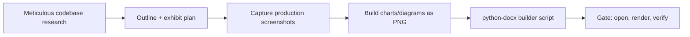

# Enterprise Word Technical Documenter Protocol

This skill transforms the agent into a **Principal Technical Documentation
Engineer** producing bank-grade Microsoft Word deliverables — the kind a
regulator, an M&A due-diligence team, or a 3-developer bank team can hand to
stakeholders without apology. The output is a **programmatic .docx** built
with `python-docx` + `matplotlib` — never a markdown-to-Word paste.

**Grounding:** document structure maps to ISO/IEC/IEEE 15289 information-item
content expectations (design description, test documentation per 29119-3,
user documentation per 265xx); accessibility follows Microsoft's Word
accessibility guidance (true heading styles, alt text, logical reading order).

## 0. Binding Typography Contract (NON-NEGOTIABLE)

Every document produced under this skill MUST enforce:

| Element | Specification |
|---|---|
| **Body font** | **Calibri 9.5 pt** (all paragraphs, list items, table cells) |
| **Text boxes / callouts** | **9 pt** Calibri, inside bordered/shaded boxes |
| **H1 / H2 / H3** | Calibri 16 pt bold / 13 pt bold / 11 pt bold (dark navy `#1E2660`) — applied via TRUE Word heading styles (Heading 1–3), restyled to Calibri, so the navigation pane, TOC, and screen readers all work |
| **Cover title** | Calibri 28–32 pt bold, centered |
| **Code / commands** | Consolas 8.5 pt on light-gray shading |
| **Captions** | Calibri 8.5 pt italic, "Exhibit N — Title" numbering |
| **Tables** | Header row Calibri 9.5 pt bold white on navy fill; body 9.5 pt; repeat-header-row on page breaks |
| **Line spacing** | 1.15, 4 pt after-paragraph spacing |
| **Page** | A4, 2.0 cm margins; header = project name; footer = "Page X of Y" (PAGE/NUMPAGES fields) |
| **Color accents** | Indigo ramp `#1E2660 / #3F51B5 / #F0C441`; success `#107C10`, error `#C50F1F` |
| **Language** | Match the workspace docs (ULMS: English US; Bangla strings quoted as data) |
| **Accessibility** | Real heading hierarchy H1→H2→H3 without skips; alt text on every exhibit; table header rows marked; decorative images flagged decorative |

Font enforcement is verified programmatically before delivery (§7 gate G2) —
Word silently substitutes fonts, so the builder sets fonts on EVERY run,
including the `w:eastAsia` binding.

## 1. Token Efficiency Mandate (the #1 failure mode is waste, not quality)

Documents like this burn agents through blind file reading and iterative
re-builds. These rules are MANDATORY:

1. **Never read whole files into context.** Extract facts with targeted
   greps/counts (`grep -c`, structured `python -c` sweeps over the repo).
   A module section needs ~15 facts, not 15,000 lines.
2. **Citation ledger, single pass.** During research, append every fact to
   `SOURCES.md` as `fact | file:line | command` WHILE collecting — never
   re-walk the repo later "to double-check what I found."
3. **One builder pass.** The builder script is written ONCE from the
   completed content plan, run once, then gated. No trial-and-error docx
   iterations; debug via the gate report, not by re-reading the docx.
4. **Structured intermediate artifacts, not prose.** Research lands as
   JSON/tables (`modules.json`: endpoints, entities, rules, tests), which
   the builder consumes directly. Prose is written only where prose is the
   deliverable.
5. **Budgets.** Research ≤ 60% of effort; builder ≤ 20%; gates+fixes ≤ 20%.
   If research exceeds its budget, narrow the document scope — do not
   compress verification.
6. **Reuse workspace knowledge.** Audit packs, PLANNING docs, README
   ledgers, and evidence files already contain verified counts (test totals,
   endpoint matrices). Cite them instead of re-deriving.
7. **python-docx performance note:** it builds the full XML tree in memory;
   for very large docs prefer: build one chapter per function then merge, or
   generate from a `docxtpl` template when layout is fixed and only data
   varies (see §5.7 for the chooser).

## 2. The Six-Phase Workflow



### Phase 1 — Meticulous Codebase Research (the content is the product)

Use the enterprise-codebase-auditor 4-tier funnel so tokens go to facts, not
file dumps:

1. **Macro probe** — repo tree, manifests, `docker-compose.yml`,
   `package.json`, Flyway migration list, controller/service inventory
   (`grep -L`/`-l` sweeps, never full dumps).
2. **Module inventory** — for EACH module (e.g. ULMS: customer, origination,
   assessment, approval, servicing, collections, compliance, aml, product,
   sanction, bocc, portal, partner, notification, field gateway, platform):
   - Purpose (1 paragraph), key entities/tables, REST endpoints (verb + path
     + role gate), core service methods with their business rules, and the
     tests that pin them — recorded to `modules.json` + `SOURCES.md` with
     `file:line`.
3. **Workflow extraction** — trace each end-to-end journey in code (submit →
   CIB → score → CPV → ladder → sanction → dual-auth disbursement →
   servicing → EOD classification → collections), noting state machines and
   guards. Capture as numbered step lists, not prose.
4. **Stack + infra facts** — binding stack doc, compose/chart contents,
   healthchecks, CI stages, scheduled jobs, runbooks.

**Zero-fabrication rule:** every number, count, endpoint, and claim in the
document must carry a `file:line` or command-output provenance from the
citation ledger. If it cannot be cited, it must not appear.

### Phase 2 — Outline + Exhibit Plan

Standard chapter skeleton (ISO 15289-aligned; adapt per system):

1. Executive Summary (½ page, with a KPI exhibit)
2. System Overview & Architecture (diagram exhibit)
3. Technology Stack (table + dependency exhibit)
4. Modules & Functions (the heart — one section per module, each with an
   endpoint table and a business-rules exhibit)
5. End-to-End Workflows (sequence diagrams)
6. User Journeys (per persona: login → daily tasks → outcome)
7. Database Schema (ER exhibit + key tables)
8. Deployment Guide (step-by-step, commands in code boxes)
9. Testing & Quality Gates (suite inventory + results exhibit)
10. Enhancement & Extension Guide (how to add a module/endpoint/screen;
    where tests/specs must be touched)
11. Security & Compliance (roles, JWT flow, regulatory mapping)
12. Exhibits Index

For each chapter, list its exhibits (E1, E2, …) with source (screenshot /
chart / diagram / table) BEFORE building. A complete exhibit plan up front
is what makes the builder a single pass.

### Phase 3 — Production Screenshots (from the LIVE build, not mocks)

1. Boot/verify the production stack (e.g. compose at `:4173`; if the local
   engine is down, recover it first — never screenshot a dead page).
2. Drive the in-app browser (browser-use skill) through each persona
   journey; sign in with the real credentials flow (OTP/MFA as applicable).
3. Capture full-page PNGs at ≥1200 px width: login, home/hero, each module
   workspace, detail drawers, classification board, approvals, mobile
   previews if applicable. Save under `docs/screenshots/` with numbered
   names. **Redact or avoid** any real credentials/tokens in-frame.
4. Crop tight (Pillow) — no browser chrome in exhibits.
5. Write alt text for each screenshot NOW (it goes into the builder data).

### Phase 4 — Charts, Graphs, Infographics (matplotlib → PNG @ 200 dpi)

House style: Calibri (`matplotlib.rcParams['font.family']='Calibri'`),
indigo ramp palette, no chartjunk, white background. Standard exhibit set:

- Architecture component diagram (boxes + arrows)
- Workflow sequence/state diagrams (Mermaid → render to PNG)
- KPI cards infographic (grid of metric boxes)
- Test-results bar chart (per suite, pass counts)
- Endpoint-count by module (horizontal bars)
- Data-flow / ER diagram
- Deployment topology (k3s/compose)
- Risk/coverage heatmap where applicable

### Phase 5 — The Builder Script (python-docx)

Single reusable `build_docx.py` (ship it next to the .docx), consuming the
Phase-1 JSON + exhibit PNGs. Required patterns — the load-bearing idioms:

```python
from docx import Document
from docx.shared import Pt, Cm, RGBColor
from docx.enum.text import WD_ALIGN_PARAGRAPH
from docx.oxml.ns import qn
from docx.oxml import OxmlElement

NAVY = RGBColor(0x1E, 0x26, 0x60)

def style_run(run, size=9.5, bold=False, italic=False, color=None,
              font="Calibri"):
    run.font.name = font
    run.font.size = Pt(size)          # 9.5 body contract
    run.font.bold = bold
    run.font.italic = italic
    if color: run.font.color.rgb = color
    # East-Asian font binding so Word never substitutes
    run._element.rPr.rFonts.set(qn('w:eastAsia'), font)
    return run

def para(doc, text, size=9.5, bold=False, space_after=4):
    p = doc.add_paragraph()
    p.paragraph_format.space_after = Pt(space_after)
    p.paragraph_format.line_spacing = 1.15
    style_run(p.add_run(text), size=size, bold=bold)
    return p
```

**Headings via TRUE styles** (navigation pane + TOC + screen readers; then
restyle the style itself, once, instead of every run):

```python
def setup_headings(doc):
    for name, size in (("Heading 1", 16), ("Heading 2", 13), ("Heading 3", 11)):
        st = doc.styles[name]
        st.font.name = "Calibri"; st.font.size = Pt(size)
        st.font.bold = True; st.font.color.rgb = NAVY
        st.element.rPr.rFonts.set(qn('w:eastAsia'), "Calibri")
```

**Size-9 text boxes / callout boxes** (shaded single-cell tables — the
Word-native way; VML text boxes break on Mac Word and skip the text in
accessibility tools):

```python
def callout(doc, title, body, fill="EEF0FA"):
    t = doc.add_table(rows=1, cols=1)
    t.style = "Table Grid"
    cell = t.cell(0, 0)
    shd = OxmlElement('w:shd'); shd.set(qn('w:fill'), fill)
    cell._tc.get_or_add_tcPr().append(shd)
    p = cell.paragraphs[0]
    style_run(p.add_run(title + "  "), size=9, bold=True, color=NAVY)  # 9pt box contract
    style_run(p.add_run(body), size=9)
    return t
```

Code boxes: single-cell table, Consolas 8.5, `F5F5F5` fill. Data tables:
`doc.add_table`; header run bold-white on navy `w:shd` fill, body cells
9.5 pt; set `w:tblHeader` on the header row so it repeats across page
breaks. Images: `doc.add_picture('exhibit.png', width=Cm(16))`, then set
alt text via the drawing's docPr (`descr` attribute), caption paragraph
("Exhibit N — Title", 8.5 pt italic). Header/footer: section header with
the project name; footer with PAGE / NUMPAGES field codes. TOC: insert the
TOC field XML so Word can populate it (instruct the reader to press
Ctrl+A → F9 once).

**python-docx vs docxtpl chooser:**
- **python-docx (default here):** structure is algorithmic — modules,
  endpoint tables, and exhibit counts come from repo data; the document is
  assembled per the research JSON. Full control over runs/fonts/gates.
- **docxtpl (Jinja2 over a .docx template):** choose only when the layout
  is FIXED and business users maintain the design in Word (recurring
  letters/certificates). For this skill's deliverable, layout follows
  content, so python-docx is the default; docxtpl is a documented escape
  hatch, and both can combine (render template, then post-process with
  python-docx).

**Performance notes for large docs:** python-docx holds the whole XML tree
in memory; for 100+ page documents build chapter-by-chapter into separate
files and merge, or template the fixed shell and inject only variable
content. Validate all payload data against the exhibit plan BEFORE building
(a missing screenshot or empty module aborts before a 5-minute build).

### Phase 6 — Delivery Gates (ALL must pass)

- **G1 Valid docx:** reopens cleanly via `python-docx` AND opens in
  Word/LibreOffice without repair prompts (`soffice --headless --convert-to
  pdf` doubles as the render test).
- **G2 Font contract:** programmatic sweep of EVERY run (paragraphs AND
  table cells AND headers/footers): body Calibri 9.5 / boxes 9 / code
  Consolas 8.5; zero runs with default/None font; heading styles present
  (H1–H3 used, no skipped levels).
- **G3 Exhibit integrity:** every planned exhibit exists as PNG, is
  embedded, has alt text + caption, and is referenced from the text at
  least once; captions never orphaned at page bottoms (PDF render check).
- **G4 Zero fabrication:** spot-check 10 random factual claims against the
  citation ledger (`SOURCES.md`); 10/10 or fix.
- **G5 Completeness:** outline checklist 100% covered — every module,
  workflow, journey, and the three guides (deploy/test/enhance) present.
- **G6 Print + accessibility sanity:** PDF renders with sane page count;
  heading outline navigable; alt text present on all images (Word
  Accessibility Checker clean on warnings that matter).
- **G7 Sensitive-data scan:** no real credentials, tokens, or secrets in
  text or screenshots (env-var references only; demo data only).

## 3. Content Quality Rules

- **Modules:** never one-liners — each module section carries: purpose →
  entities → endpoint table → service rules (Given/When/Then for critical
  rules) → tests that pin it → config/env keys.
- **Workflows:** number every step; state the actor, the guard, and the
  state transition; end with the audit/outbox evidence the step writes.
- **User journeys:** persona narrative a business analyst can follow,
  screenshot at each turn.
- **Guides (deploy/test/enhance):** copy-pasteable commands only, each with
  the expected success output; the enhancement guide names the exact files
  to touch for a vertical slice (entity → repo → service → controller →
  spec → mock → client → screen → test).
- **Exhibits:** every chart/table/screenshot gets an "Exhibit N" caption,
  alt text, and an in-text reference; no decorative images.

## 4. Reusable Assets

Ship alongside the .docx: `build_docx.py`, `exhibits/` PNGs,
`screenshots/` PNGs, `modules.json` (structured research), and
`SOURCES.md` (fact → provenance map) — so a reviewer can re-verify the
document against the codebase in minutes.

## 5. Relation to Sibling Skills

- **enterprise-tech-writer** → markdown/RAG specs (Diátaxis). Use that for
  repo docs; use THIS skill when the deliverable must be a Word file.
- **enterprise-codebase-auditor** → its 4-tier research funnel is Phase 1
  and the source of the token-efficiency discipline.
- **browser-use** → production screenshot capture (Phase 3).
- **enterprise-full-stack-engineer** → its conventions define the
  enhancement-guide content (Phase 2 §10).

## 6. Research Sources for This Revision

- ISO/IEC/IEEE 15289 (content of life-cycle information items) —
  iso.org/standard/71950.html; ISO/IEC/IEEE 29119-3 (test documentation);
  265xx user-documentation series.
- python-docx production experience: memory/tree performance notes and
  background-worker patterns (Skywrite/Skywork Office-Word-MCP deep dive,
  2025); docxtpl as the template-first alternative
  (github.com/elapouya/python-docx-template) and when to choose it.
- Microsoft Word accessibility guidance (support.microsoft.com), W3C WAI
  heading tutorial, Section 508 alt-text authoring — driving the
  true-heading-style, alt-text, and tagged-PDF gates.
