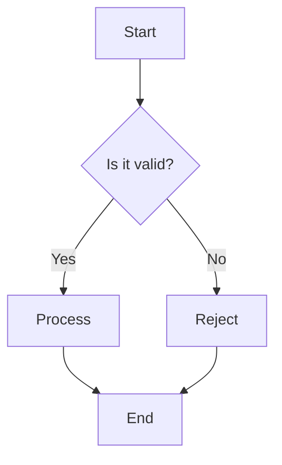

# Technical Document Writing Skill - ULMS Project

## Overview

This skill provides comprehensive guidance for creating, maintaining, and reviewing technical documentation for the **Unisoft Loan Management System (ULMS)** project. It ensures consistency, quality, and completeness across all project documentation.

## When to Use This Skill

Use this skill when:
- Creating new technical documentation for ULMS
- Updating existing project documents
- Reviewing documentation for quality assurance
- Onboarding new team members to documentation standards
- Preparing compliance or regulatory documentation

## Document Standards

### 1. Document Control Header

Every technical document MUST include:

```markdown
**Document Control**

| Field | Value |
|-------|-------|
| **Document Title** | [Full Document Title] |
| **Project Name** | Unisoft Loan Management System (ULMS) |
| **Document Version** | [X.Y] |
| **Date** | [YYYY-MM-DD] |
| **Prepared By** | [Name, Role] |
| **Reviewed By** | [Name, Role] |
| **Classification** | [Internal/Confidential/Restricted] |
| **Status** | [Draft/Review/Approved/Obsolete] |

**Revision History**

| Version | Date | Author | Description |
|---------|------|--------|-------------|
| 1.0 | [Date] | [Name] | Initial version |
| 1.1 | [Date] | [Name] | [Brief description of changes] |
```

### 2. Document Classification Levels

| Level | Access | Document Types |
|-------|--------|----------------|
| **Public** | Anyone | Marketing materials, public APIs |
| **Internal** | Project team | Technical specs, implementation guides |
| **Confidential** | Core team only | Architecture, security details |
| **Restricted** | Leadership only | Financials, contracts |

### 3. File Naming Conventions

```
[Category]_[DocumentType]_[Subject]_[Version].md

Examples:
- BRD_LoanManagementSystem_v1.0.md
- SRS_CIBIntegration_v2.1.md
- TECH_Architecture_Database_v1.0.md
- GUIDE_Developer_Setup_v1.0.md
- API_Reference_CreditScoring_v1.0.md
```

### 4. Directory Structure

```
docs/
├── 00-initiation/           # Project startup documents
├── 01-architecture/         # System design docs
├── 02-setup/               # Environment setup
├── 03-backend/             # Backend development
├── 04-frontend/            # Frontend development
├── 05-testing/             # Testing documentation
├── 06-deployment/          # DevOps & deployment
├── 07-operations/          # Runbooks & support
├── 08-compliance/          # Regulatory docs
├── templates/              # Document templates
└── archive/                # Obsolete versions
```

## Document Type Guidelines

### 1. Business Requirements Document (BRD)

**Purpose:** Define business needs and objectives

**Structure:**
```markdown
1. Executive Summary
   - Project overview
   - Key business drivers
   - Expected benefits

2. Business Objectives
   - Primary objectives
   - Success criteria (measurable)

3. Scope
   - In-scope items
   - Out-of-scope items
   - Assumptions and constraints

4. Business Requirements
   - Process requirements
   - Business rules

5. Functional Requirements
   - Feature descriptions
   - User stories

6. Non-Functional Requirements
   - Performance
   - Security
   - Compliance
```

**Writing Guidelines:**
- Use business language (avoid technical jargon)
- Include measurable success criteria
- Use tables for structured data
- Include diagrams for workflows
- Number all requirements (e.g., BR-001, FR-001)

### 2. Software Requirements Specification (SRS)

**Purpose:** Technical specification for development

**Structure:**
```markdown
1. Introduction
   - Purpose
   - Scope
   - Definitions

2. System Architecture
   - High-level design
   - Component diagram
   - Technology stack

3. Functional Requirements
   - Detailed specifications
   - Use cases
   - Data models

4. Non-Functional Requirements
   - Performance specs
   - Security requirements
   - Reliability targets

5. Interface Requirements
   - API specifications
   - UI/UX requirements
   - External system interfaces

6. Database Requirements
   - Schema design
   - Data retention policies

7. Appendices
   - Traceability matrix
   - Glossary
```

**Writing Guidelines:**
- Use precise technical language
- Include code examples where relevant
- Specify measurable metrics
- Use RFC 2119 keywords (MUST, SHOULD, MAY)
- Include acceptance criteria for each requirement

### 3. Architecture Document

**Purpose:** Describe system design and technical decisions

**Structure:**
```markdown
1. Architectural Overview
   - Design principles
   - High-level architecture diagram
   - Technology stack

2. Component Architecture
   - Component descriptions
   - Interaction diagrams
   - Interface definitions

3. Data Architecture
   - Data flow diagrams
   - Storage solutions
   - Caching strategy

4. Security Architecture
   - Authentication/Authorization
   - Data protection
   - Network security

5. Deployment Architecture
   - Infrastructure diagram
   - Scaling strategy
   - High availability design
```

**Writing Guidelines:**
- Use architecture diagrams (C4 model recommended)
- Explain rationale for design decisions
- Include alternatives considered
- Reference relevant patterns and principles

### 4. API Documentation

**Purpose:** Guide for API consumers

**Structure:**
```markdown
# [API Name]

## Base URL
`https://api.ulms.unisoft.com.bd/v1`

## Authentication
[Describe auth mechanism]

## Endpoints

### [Endpoint Name]

**Endpoint:** `METHOD /path`

**Description:** [What it does]

**Parameters:**
| Name | Type | Required | Description |
|------|------|----------|-------------|
| | | | |

**Request Example:**
```json
{
  "field": "value"
}
```

**Response Example:**
```json
{
  "success": true,
  "data": {}
}
```

**Error Codes:**
| Code | Description |
|------|-------------|
| 400 | Bad Request |
```

**Writing Guidelines:**
- Include working code examples
- Document all possible error responses
- Specify rate limits
- Include curl examples for testing

### 5. Developer Guide

**Purpose:** Step-by-step implementation instructions

**Structure:**
```markdown
1. Prerequisites
   - Required software
   - Required access/permissions
   - Environment variables

2. Installation
   - Step-by-step setup
   - Configuration
   - Verification steps

3. Usage
   - Common tasks
   - Code examples
   - Best practices

4. Troubleshooting
   - Common issues
   - Solutions
   - Debug tips

5. References
   - Related documentation
   - External resources
```

**Writing Guidelines:**
- Use imperative mood for instructions
- Include command examples
- Add screenshots/diagrams where helpful
- Test all instructions before publishing

## Markdown Standards

### 1. Formatting Conventions

```markdown
# Heading 1 - Document Title
## Heading 2 - Major Sections
### Heading 3 - Subsections
#### Heading 4 - Minor sections

**Bold** - Important terms, UI elements
*Italic* - Emphasis, book titles
`code` - Inline code, file names, commands

- Bullet list for unordered items
- Keep bullet points parallel in structure

1. Numbered list for sequential steps
2. Use for procedures and processes

| Table | Column 2 | Column 3 |
|-------|----------|----------|
| Data  | Data     | Data     |
```

### 2. Code Blocks

Specify language for syntax highlighting:

```java
public class Example {
    public static void main(String[] args) {
        System.out.println("Hello ULMS");
    }
}
```

```bash
# Bash commands
./gradlew bootRun
```

```yaml
# Configuration files
server:
  port: 8080
```

### 3. Diagrams

Use Mermaid for diagrams:



### 4. Links and References

```markdown
Internal links: [See Architecture Doc](./architecture.md)
External links: [Spring Boot](https://spring.io/projects/spring-boot)
Anchor links: [Go to Section](#section-name)
```

## Writing Style Guidelines

### 1. Tone and Voice

- **Professional but accessible:** Avoid overly academic language
- **Direct and concise:** Get to the point quickly
- **Active voice:** "The system validates the input" not "The input is validated by the system"
- **Present tense:** Use for descriptions and instructions

### 2. Language Standards

| Do | Don't |
|----|-------|
| Use "Click the Submit button" | Don't use "Click on the Submit button" |
| Use "Enter your username" | Don't use "Input your username" |
| Use "The system displays an error" | Don't use "An error is displayed" |
| Use "BRPD 15/2024 compliance" | Don't use "Compliance with BRPD 15/2024" |

### 3. Bangladesh-Specific Conventions

- Use **BDT** for currency (not Tk or ৳ in technical docs)
- Use **Lakhs/Crores** in business docs, millions in technical
- Use **Bengali (Bangla)** for UI labels, English for code
- Date format: **DD/MM/YYYY** or **ISO 8601 (YYYY-MM-DD)**
- Time format: **24-hour format** (14:30 not 2:30 PM)

### 4. Acronyms and Abbreviations

First use: spell out + acronym in parentheses
```markdown
Loan Management System (LMS)
Branch Officers Credit Committee (BOCC)
```

Subsequent uses: acronym only
```markdown
The LMS provides...
Submit to BOCC for review...
```

## Review and Approval Process

### 1. Document Lifecycle

```
Draft → Review → Revise → Approve → Publish → Maintain → Archive
```

### 2. Review Checklist

**Content Review:**
- [ ] All requirements from source documents included
- [ ] Technical accuracy verified
- [ ] Completeness check (no missing sections)
- [ ] Consistency with other documents
- [ ] Examples are correct and tested

**Style Review:**
- [ ] Follows markdown standards
- [ ] No spelling/grammar errors
- [ ] Consistent terminology
- [ ] Proper formatting
- [ ] Diagrams are clear

**Technical Review:**
- [ ] Architecture aligns with standards
- [ ] Security considerations addressed
- [ ] Scalability requirements included
- [ ] Integration points documented
- [ ] Error handling described

### 3. Approval Matrix

| Document Type | Author | Reviewer | Approver |
|---------------|--------|----------|----------|
| BRD | Business Analyst | Tech Lead, PM | Product Owner |
| SRS | Tech Lead | Senior Architect | CTO |
| Architecture | Solution Architect | Tech Lead | CTO |
| API Docs | Developer | Tech Lead | Tech Lead |
| Developer Guide | Developer | Peer Dev | Tech Lead |
| Test Plans | QA Lead | Tech Lead | PM |
| Deployment | DevOps Engineer | Tech Lead | CTO |

## Tools and Resources

### 1. Recommended Tools

| Purpose | Tool | Alternatives |
|---------|------|--------------|
| Markdown Editor | VS Code | Typora, MarkText |
| Diagramming | Draw.io | Lucidchart, Mermaid |
| API Documentation | Swagger/OpenAPI | Postman, Insomnia |
| Collaboration | Confluence | Notion, GitBook |
| Version Control | Git + GitHub | GitLab, Bitbucket |

### 2. VS Code Extensions for Documentation

```
- yzhang.markdown-all-in-one
- shd101wyy.markdown-preview-enhanced
- bierner.markdown-mermaid
- streetsidesoftware.code-spell-checker
- adamvoss.vscode-languagetool
```

### 3. Templates Location

All document templates are in:
```
docs/templates/
├── brd-template.md
├── srs-template.md
├── architecture-template.md
├── api-doc-template.md
├── developer-guide-template.md
└── release-notes-template.md
```

## Compliance Requirements

### 1. Regulatory Documentation

Documents requiring regulatory compliance:
- BRPD 15/2024 Loan Classification procedures
- CIB integration specifications
- IFRS-9 ECL calculation methodology
- ICT Security Guidelines V4.0 compliance
- Data protection and privacy policies

### 2. Audit Trail

All changes to compliance documents must include:
- Change description
- Business justification
- Approval authority
- Effective date
- Document version increment

## Best Practices

### 1. Documentation Principles

1. **DRY (Don't Repeat Yourself):** Link to source, don't copy
2. **Single Source of Truth:** One document per topic
3. **Living Documents:** Keep updated with code changes
4. **Audience-First:** Write for the intended reader
5. **Test Your Docs:** Verify all code examples work

### 2. Maintenance Schedule

| Document Type | Review Frequency | Owner |
|---------------|------------------|-------|
| Architecture | Quarterly | Solution Architect |
| API Docs | With each release | API Developer |
| Developer Guides | Monthly | Tech Lead |
| BRD/SRS | Per sprint | Business Analyst |
| Runbooks | Monthly | DevOps |

### 3. Common Mistakes to Avoid

- ❌ Outdated screenshots
- ❌ Hardcoded credentials in examples
- ❌ Missing error scenarios
- ❌ Assuming reader knowledge
- ❌ Inconsistent terminology
- ❌ Broken links
- ❌ No version control

## Quick Reference

### Document Type Selection

```
Business Need → BRD
Technical Specification → SRS
System Design → Architecture
API Details → API Documentation
How-to Instructions → Developer Guide
Process Definition → Standard Operating Procedure
Release Information → Release Notes
Incident Response → Runbook
```

### Emergency Contacts

| Issue | Contact |
|-------|---------|
| Documentation standards | Tech Lead |
| Compliance questions | Compliance Officer |
| Tool access | IT Support |
| Review scheduling | Project Manager |

---

**Version:** 1.0  
**Last Updated:** February 3, 2026  
**Owner:** Technical Writing Team

*© 2026 Unisoft Systems Limited. All Rights Reserved.*
