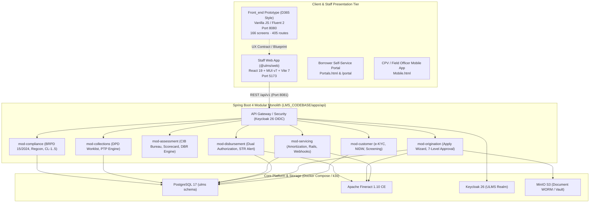

# ULMS v2.0 Architecture State (Fable 5.1 Standard)
**System:** Unisoft Loan Management System (ULMS v2.0) · ABC Bank Bangladesh  
**Status Date:** October 2026  
**Audited Machine:** Windows 11 (PowerShell) · Shifted Codebase  

---

## 1. High-Level System Topology

---

## 2. Active Local Runtime & Server Inventory

| Service | Technology | Location | Port | Health / Status |
|---|---|---|---|---|
| **D365 Style Frontend** | Vanilla HTML5/CSS3/ES6 (Zero-dep) | `Front_end/` | `8080` | **ONLINE (200 OK)** — 405/405 routes verified |
| **Staff React Web App** | React 19 + TS + Vite 7 + MUI v7 | `LMS_CODEBASE/apps/web` | `5173` | **ONLINE (200 OK)** — Vite preview running |
| **API Backend** | Spring Boot 4 / Java 21 / Gradle | `LMS_CODEBASE/apps/api` | `8081` | Requires JDK 21 installation on host |
| **Compose Stack** | Docker Compose (PG17, KC26, Fineract) | `LMS_CODEBASE/deploy/compose` | Various | Requires Docker Desktop on host |

---

## 3. Database Schema & Migration Lineage

PostgreSQL 17 migrations managed via Flyway (`LMS_CODEBASE/apps/api/src/main/resources/db/migration`):
- `V1__init.sql`: Base audit trail, idempotency keys, core tables
- `V2__origination_workflow.sql`: Loan applications, stages, document attachments
- `V3__customer_compliance.sql`: Customer master, KYC status, screening history
- `V4__actor_width.sql`: Expanded actor identifiers for Keycloak JWT sub
- `V5__credit_approval.sql`: 7-level credit approval ladder, sanction limits, delegations
- `V6__cib_compliance.sql`: Bangladesh Bank CIB report cache, facility lines, contracts
- `V7__concurrency_audit.sql`: Concurrency tokens, optimistic locking, audit integrity
- `V8__servicing_collections.sql`: Loan accounts mirror, repayments, payment intents, PTP
- `V9__collections_parity.sql`: Dunning actions, field agent task routing, evidence attachments
- `V10__regcon_reporting.sql`: Regulatory reporting calendar, submissions, CL-1..5 pack
- `V11__regcon_audit_g.sql`: Audit governance, immutable hash chains

---

## 4. Statutory Regulatory Constraints (Bangladesh Bank)

1. **BRPD Circular 15/2024 (7-Stage Loan Classification):**
   - STD-0: Current (0 DPD) — 1% general provision
   - STD-1: Watch (1–30 DPD) — 1% general provision
   - STD-2: Caution (31–60 DPD) — 1% general provision
   - SMA: Special Mention Account (61–90 DPD) — 5% general provision
   - SS: Substandard (91–180 DPD) — 20% specific provision, interest suspense
   - DF: Doubtful (181–365 DPD) — 50% specific provision, interest suspense
   - B/L: Bad/Loss (>365 DPD) — 100% specific provision, interest suspense
2. **Approval Hierarchy (7 Levels):**
   - L1: Credit Officer ($\le$ ৳5 Lakh)
   - L2: Branch Manager ($\le$ ৳25 Lakh)
   - L3: Regional Credit Head ($\le$ ৳1 Crore)
   - L4: Head of Credit ($\le$ ৳3 Crore)
   - L5: Chief Risk Officer ($\le$ ৳5 Crore)
   - L6: Credit Committee ($\le$ ৳10 Crore)
   - L7: Board / MD (> ৳10 Crore)
3. **Disbursement Dual-Authorization:**
   - Maker (Prepare) $\ne$ Checker (Authorize) $\ne$ Releaser (Disburse); 409 Conflict if same identity.
   - BFIU STR notification triggered on disbursements $\ge$ ৳10 Lakh.

---

## 5. Implementation Status & Remaining Scope (October 2026 Audit)

| Phase / Component | Status | Implemented | Remaining |
|---|---|---|---|
| **P0 Foundation** | ✅ Closed | Spring Boot 4 modular monolith, PG17 baseline, Keycloak seed, Fineract adapter | — |
| **P1 Origination** | ✅ Closed | Customer 360, NID mock, MinIO docs, autosave draft, 9-stage pipeline | — |
| **P2 Credit & Approval** | ✅ Closed | CIB parser, DBR oracle (50%), 7-level ladder, dual-auth, BRPD 15/2024 EOD batch | — |
| **P3 Servicing & Collections**| ✅ Closed | Repayments, payment rail sandbox, statements, DPD worklist, dunning, PTP | — |
| **P4 Compliance & Reporting** | 🟡 In Progress | Regcon, CL-1..5 pack generation, provision JV, WORM staging | IFRS-9 automated ECL engine, BB EDW filing |
| **P5 Hardening & UAT** | ⏳ Planned | — | ASVS L2 pen-test fixes, DR drills, ABC Bank UAT sign-off |
| **P6 Pilot Run** | ⏳ Planned | — | 4-week shadow & single-branch live operation at ABC Bank |
| **P7 Productization** | ⏳ Planned | — | Multi-bank config, tenancy branding for 62 scheduled banks |
| **React Staff Web App** | 🟡 In Progress | Unified D365 Shell + 166-Screen Mega Menu + 10 primary feature pages | 156 screen components in React |
| **Mobile Field App** | ⏳ Planned | Prototype `mobile.html` | Expo SDK 54 React Native app (`apps/mobile`) |
| **Borrower Portal** | 🟡 In Progress | Staff-embedded `/portal` route + `portals.html` | Dedicated standalone bundle (`apps/portal`) |
| **External Connectors** | 🟡 In Progress | Mocks (CIB, NIDW, Rails, Screening) | Production mTLS, bank SFTP, live MFS APIs, CBS adapter |

