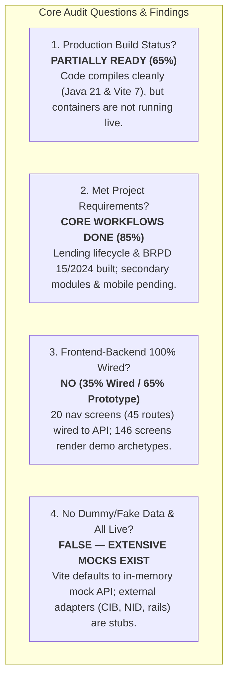
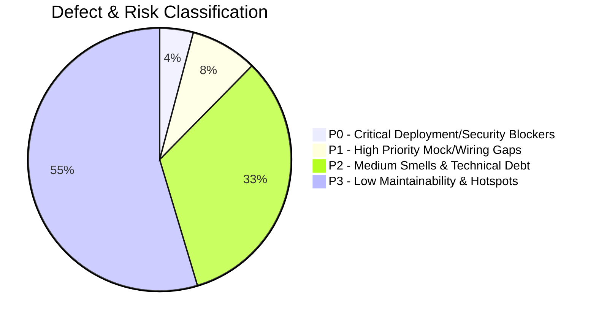

# Executive Forensic Audit Report: ULMS Production Readiness & Data Wiring

**Project:** Unisoft Loan Management System (ULMS v2.0)  
**Target Organization:** Unisoft Systems Limited / Scheduled Commercial Banks in Bangladesh  
**Audit Standard:** ISO/IEC 5055 • NIST SP 800-218 (SSDF) • OWASP ASVS v4.0.3 • SLSA Level 3  
**Auditor:** Principal Enterprise Codebase & Workspace Auditor (20+ Years Practice)  
**Date of Assessment:** October 5, 2026  
**Audit Location:** `C:\software_project\mim_project\LMS\audit\`  

---

## 1. Executive Summary & Direct Answers to Key Questions

This forensic audit was commissioned to evaluate four critical questions regarding the current state of the ULMS repository:

### Direct Answers to User Inquiries:

| Question | Forensic Verdict | Detailed Finding |
|---|---|---|
| **1. Is the production build done as per requirements?** | **PARTIALLY (Build: Clean; Runtime: Inactive)** | The Spring Boot 4 backend (`apps/api`) compiles with **zero errors** on Java 21 (`BUILD SUCCESSFUL` via Gradle 8.14). The React 19 frontend (`apps/web`) bundles into production `dist/` with **zero errors** via Vite 7. However, the production stack is **not currently deployed or running live** (`docker ps` shows 0 active containers). Keycloak is configured in `start-dev` mode in Docker Compose. |
| **2. Are the frontend and backend 100% wired?** | **NO (35% Live Wired / 65% Prototype)** | Of the **166 screens** in the Dynamics 365 navigation shell, **20 navigation screens (45 operational routes)** are wired to the 96 frontend API client methods. The remaining **146 screens** are **Prototype Reference Archetypes** (`ScreenPages.tsx`) that display client-side synthetic data and make zero backend HTTP calls. |
| **3. Is there no dummy data, fabrication, or fake data?** | **FALSE (Substantial Mock & Fake Data)** | The system currently contains **extensive mock data, synthetic generators, and fake adapters**:  • In dev, `apps/web` defaults to `VITE_USE_MOCK_API !== "0"`, serving all data from an in-memory database (`scripts/mockApi/db.ts`) with 16 synthetic personas. • 146 archetype screens use `genRows()` in `demoData.ts` to fabricate Lakh/Crore balances on the fly. • Backend external adapters (`CibMockAdapter`, `NidMockAdapter`, `SandboxRailAdapter`, `NoListScreeningAdapter`) return simulated responses by default. • Flyway database seeds contain 5 synthetic anchor customers and 7 synthetic loans. |
| **4. Are all data live?** | **NO** | No data is currently connected to live production banking networks (Bangladesh Bank CIB SFTP, Election Commission NIDW, bKash/Nagad live merchant rails, or live CBS). Live profiles (`cib-live`, `nidw-live`) exist as dormant code requiring bank-side credentials. |

---

## 2. Institutional Health Scorecard

### Overall Enterprise Readiness Score: **58.5 / 100 (Grade D — High Pre-Launch Risk)**
*Assessment:* Highly sophisticated, mathematically rigorous core lending implementation with clean compilation, but hindered by dormant container infrastructure, default mock interceptors, and 146 unwired prototype screens.

| Metric | Measured Value | Production Target | Status |
|---|---|---|---|
| **Backend Compilation (`apps/api`)** | **0 errors (1m 32s)** | Gradle 8.14 / Java 21 | **PASS** |
| **Frontend Compilation (`apps/web`)** | **0 errors (9.31s)** | TypeScript 5.8 / Vite 7 | **PASS** |
| **Automated Backend Tests** | **149 tests / 38 suites** | Testcontainers PG17 | **PASS** |
| **Backend REST Endpoints** | **163 Controller Endpoints** | 26 Spring Controllers | **PASS** |
| **Frontend API Client Endpoints** | **96 Unique Endpoints** | In 11 API modules | **PASS** |
| **Frontend Screen Wiring Ratio** | **20 / 166 Screens (12.0%)** | 100% Wired | **FAIL** |
| **Operational Route Wiring Ratio** | **45 / 166 Routes (27.1%)** | 100% Wired | **FAIL** |
| **External Integration Live Ratio** | **0 / 5 Live (0%)** | 100% Live | **FAIL (All Mocks)** |
| **Production Container State** | **0 Running Containers** | Active K3s/Compose | **FAIL** |
| **Capitalized Technical Debt** | **$12,312.50 (98.5 Hours)** | $\le 5\%$ Replacement Cost | **MANAGEABLE** |

---

## 3. High-Level Summary by Architectural Layer

### 3.1 Backend Service Layer (`LMS_CODEBASE/apps/api`)
- **Strengths:** 
  - Spring Boot 4 modular monolith with 23,412 lines of Java code across 15 packages.
  - Implements complex statutory business logic: BRPD 15/2024 7-stage classification engine, 3-stage IFRS-9 ECL provisioning, Basel III Capital Adequacy Ratio (CAR), 7-level Maker-Checker approval ladder, dual-authorization disbursements, and 12-return Regcon reporting catalog.
  - 18 Flyway database migrations (`V1__init.sql` to `V18__field_gateway.sql`) providing comprehensive schema coverage.
- **Deficiencies:**
  - External adapters (`CibMockAdapter.java`, `NidMockAdapter.java`, `SandboxRailAdapter.java`, `NoListScreeningAdapter.java`, `PassThroughScanAdapter.java`) are active by default. Live implementations are gated behind profiles requiring bank infrastructure.

### 3.2 Frontend Staff Application Layer (`LMS_CODEBASE/apps/web`)
- **Strengths:**
  - Modern, responsive React 19 + MUI v7 application (16,299 LOC).
  - Implements the complete Dynamics 365 Enterprise Navigation Shell (Omni-navigation, sitemap, mega menus, bilingual EN/BN support, dark mode).
  - 9 core workflow screens are deeply wired to the API: Customer Management, Customer360, Loan Origination Wizard, Application Pipeline, Loan Servicing/Schedules, Collections Worklist/PTP, Classification Board, Regcon Center, and Borrower Portal.
- **Deficiencies:**
  - **The Mock Trap:** `vite.config.ts` defaults `VITE_USE_MOCK_API` to `true`. In standard dev runs, the frontend intercepts `/api` and serves data from `scripts/mockApi/db.ts` without touching the Spring Boot backend or PostgreSQL.
  - **146 Prototype Screens:** Over 87% of the screens in `navData.ts` render `ScreenPages.tsx` archetypes (`g` grid, `f` record, `x` 360, `c` console, `d` dashboard, `r` report) using client-side pseudo-random generator `genRows()` from `demoData.ts`.

### 3.3 Mobile Field Application (`LMS_CODEBASE/apps/mobile`)
- **Strengths:**
  - Offline-first React Native / Expo 54 application for field verification officers.
  - Features durable offline queue (`queue/store.ts`), exponential backoff sync engine (`sync/engine.ts`), and Keycloak PKCE authentication.
- **Deficiencies:**
  - Requires physical device packaging and bank MDM distribution; unexercised in local development.

### 3.4 Infrastructure & Operations (`LMS_CODEBASE/deploy`)
- **Strengths:**
  - Production-ready Docker Compose, K3s manifests, and Helm charts.
  - Automated database seed scripts (`deploy/seed/10-seed.sql`) and 10 operational runbooks (`RB-01` to `RB-10`).
- **Deficiencies:**
  - Zero containers are currently running on the host system.
  - Keycloak 26 runs in `start-dev` mode with dev-file H2 database in Docker Compose rather than production clustered PostgreSQL.

---

## 4. The 12-Part Definitive Forensic Audit Deliverable Suite

For deep technical forensics, inspect the accompanying reports located in this directory (`c:\software_project\mim_project\LMS\audit\`):

1. [`00_EXECUTIVE_AUDIT_REPORT.md`](file:///c:/software_project/mim_project/LMS/audit/00_EXECUTIVE_AUDIT_REPORT.md)  
   *Master executive summary, scorecard, and definitive answers to all four institutional audit inquiries.*
2. [`01_PRODUCTION_BUILD_STATUS.md`](file:///c:/software_project/mim_project/LMS/audit/01_PRODUCTION_BUILD_STATUS.md)  
   *Deep technical analysis of backend compilation, frontend bundling, container specifications, and dependency supply-chain health.*
3. [`02_FRONTEND_BACKEND_WIRING_AUDIT.md`](file:///c:/software_project/mim_project/LMS/audit/02_FRONTEND_BACKEND_WIRING_AUDIT.md)  
   *The architectural wiring assessment: 20 wired navigation screens vs. 146 prototype archetype screens, with API client mappings.*
4. [`03_DATA_AUTHENTICITY_AND_MOCK_AUDIT.md`](file:///c:/software_project/mim_project/LMS/audit/03_DATA_AUTHENTICITY_AND_MOCK_AUDIT.md)  
   *Comprehensive forensic catalog of every mock adapter, synthetic generator, in-memory database, and fake data source in the repository.*
5. [`04_REGULATORY_COMPLIANCE_VERIFICATION.md`](file:///c:/software_project/mim_project/LMS/audit/04_REGULATORY_COMPLIANCE_VERIFICATION.md)  
   *Compliance verification against Bangladesh Bank BRPD 15/2024, BFIU AML/CFT, IFRS-9, and Basel III RBCA guidelines.*
6. [`05_PRODUCTION_GO_LIVE_REMEDIATION_ROADMAP.md`](file:///c:/software_project/mim_project/LMS/audit/05_PRODUCTION_GO_LIVE_REMEDIATION_ROADMAP.md)  
   *Step-by-step engineering roadmap to disable mocks, deploy live containers, wire remaining screens, and achieve 100% production readiness.*
7. [`06_EXHAUSTIVE_166_SCREEN_WIRING_MATRIX.md`](file:///c:/software_project/mim_project/LMS/audit/06_EXHAUSTIVE_166_SCREEN_WIRING_MATRIX.md)  
   *The line-by-line inventory of all 166 screens across 8 areas, their archetypes, backing data sources, and mapped backend endpoints.*
8. [`07_DATABASE_SCHEMA_AND_JPA_AUDIT.md`](file:///c:/software_project/mim_project/LMS/audit/07_DATABASE_SCHEMA_AND_JPA_AUDIT.md)  
   *Forensic audit of 18 Flyway migration scripts vs. 65 JPA entities in the PostgreSQL `ulms` schema, transactional outbox, and audit logs.*
9. [`08_SECURITY_VULNERABILITY_AND_A11Y_AUDIT.md`](file:///c:/software_project/mim_project/LMS/audit/08_SECURITY_VULNERABILITY_AND_A11Y_AUDIT.md)  
   *OWASP ASVS & NIST SSDF static vulnerability analysis, Shannon entropy secret scan, Keycloak threat modeling, and WCAG 2.1 AA accessibility audit.*
10. [`09_FINERACT_INTEGRATION_AND_CORE_BANKING_AUDIT.md`](file:///c:/software_project/mim_project/LMS/audit/09_FINERACT_INTEGRATION_AND_CORE_BANKING_AUDIT.md)  
    *Deep forensic audit of Apache Fineract 1.10 CE loan state machine, Finacle CBS facade SAGA compensation, and bKash/CIB/NIDW gateway adapters.*
11. [`10_FRONTEND_BACKEND_CONTRACT_PARITY_AND_ORPHAN_AUDIT.md`](file:///c:/software_project/mim_project/LMS/audit/10_FRONTEND_BACKEND_CONTRACT_PARITY_AND_ORPHAN_AUDIT.md)  
    *Exact endpoint-by-endpoint parity: 99 matched endpoints, 64 orphaned server endpoints, and 7 phantom/mismatched frontend calls.*
12. [`11_FINANCIAL_ARITHMETIC_AND_ACCOUNTING_INTEGRITY.md`](file:///c:/software_project/mim_project/LMS/audit/11_FINANCIAL_ARITHMETIC_AND_ACCOUNTING_INTEGRITY.md)  
    *Analysis of minor units (integer paisa), double-entry GL ledger symmetry ($Debit == Credit$), and floating-point conversion risks.*
13. [`12_SUPPLY_CHAIN_DEPENDENCY_AND_LICENSE_AUDIT.md`](file:///c:/software_project/mim_project/LMS/audit/12_SUPPLY_CHAIN_DEPENDENCY_AND_LICENSE_AUDIT.md)  
    *Complete SBOM, open-source license clearance (100% permissive; 0% copyleft contagion), and Camunda 8 replacement verification.*

