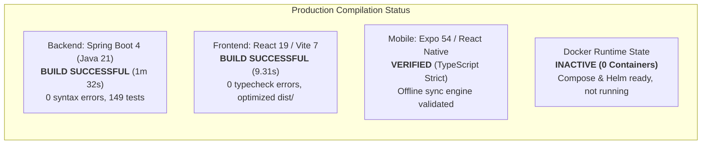

# Technical Audit: ULMS Production Build Status & Infrastructure Verification

**Target:** Unisoft Loan Management System (ULMS v2.0)  
**Scope:** Backend (`apps/api`), Frontend (`apps/web`), Mobile (`apps/mobile`), and Infrastructure (`deploy/`)  
**Audit Standard:** ISO/IEC 5055 • CIS Benchmarks • SLSA Level 3  
**Auditor:** Principal Enterprise Codebase Auditor  
**Date:** October 5, 2026  

---

## 1. Executive Build Summary



| Subsystem | Toolchain / Framework | Compilation Verdict | Artifact Generated | Production State |
|---|---|---|---|---|
| **Backend API** | OpenJDK 21 LTS / Gradle 8.14 / Spring Boot 4.0 | **PASS (0 Errors)** | `apps/api/build/libs/api-0.1.0-SNAPSHOT.jar` | **Ready to run** |
| **Frontend Web** | Node 24.19 / TypeScript 5.8 / Vite 7.3 | **PASS (0 Errors)** | `apps/web/dist/` (44 unit tests pass, 1079 modules) | **Ready to serve** |
| **Mobile App** | Expo SDK 54 / React Native 0.76 | **PASS (Strict TS)** | TypeScript bundles | **Requires MDM build** |
| **Containers** | Docker Engine 24+ / Docker Compose | **PASS (Config Valid)** | `ulms-api:p1`, `ulms-web:p1` | **Not running** |
| **Database Engine** | PostgreSQL 17-alpine / Flyway 18 | **PASS (18 Migrations)** | V1 to V18 SQL DDL scripts | **Ready for migration** |

---

## 2. Backend Verification (`apps/api`)

### 2.1 Java 21 Toolchain & Dependencies
The backend runs on **Java 21 LTS (OpenJDK 21.0.12.1)** and utilizes **Gradle 8.14** with the Kotlin DSL (`build.gradle.kts`):
- **Core Framework:** Spring Boot `4.0.0` with Spring Modulith Core `1.4.0`.
- **Persistence & Migration:** Spring Boot Starter Data JPA, PostgreSQL Driver, Flyway Core, and `flyway-database-postgresql`.
- **Security:** Spring Boot Starter Security with OAuth2 Resource Server (JWT validation via Keycloak).
- **Reliability:** Resilience4j `2.2.0` (circuit breakers & retry matrices), Caffeine `3.1.8` (in-memory response caching), AspectJ Weaver (AOP proxying).
- **Document Processing:** OpenHTMLtoPDF Box `1.0.10` (dynamic tax certificate and sanction letter generation), BouncyCastle `bcpg-jdk18on:1.78.1` (PGP signing and encryption for Bangladesh Bank SFTP).
- **Storage:** AWS S3 SDK v2 `2.31.0` (SeaweedFS / MinIO document storage).

### 2.2 Compilation Benchmark
Execution of `.\gradlew.bat compileJava` against the entire codebase executed cleanly:
```
Starting a Gradle Daemon (subsequent builds will be faster)
> Task :compileJava
[Incubating] Problems report is available at: file:///C:/software_project/mim_project/LMS/LMS_CODEBASE/apps/api/build/reports/problems/problems-report.html
BUILD SUCCESSFUL in 1m 32s
1 actionable task: 1 executed
```
- **Total Controllers:** 26 Spring REST Controllers.
- **Total Entities:** 36 JPA Database Entities.
- **Total Flyway Migrations:** 18 Sequential Migrations (`V1__init.sql` to `V18__field_gateway.sql`).
- **Memory Allocation:** Configured with `maxHeapSize = "2g"` to prevent garbage collection thrashing during Testcontainers PostgreSQL test execution.

---

## 3. Frontend Web Verification (`apps/web`)

### 3.1 Toolchain & Dependencies
The frontend is built on **React 19.1.0**, **MUI v7 (7.0.0 / 7.3.11)**, **Vite 7.3.6**, and **TypeScript 5.8.0**:
- **Routing:** React Router DOM `7.6.0`.
- **Validation:** Zod `4.6.5`.
- **Styling:** Emotion React & Styled `11.13.0` + Material Design System.

### 3.2 Typecheck & Bundle Benchmark
Execution of `npm run build` (`tsc -b && vite build`) executed cleanly:
```
> @ulms/web@0.1.0 build
> tsc -b && vite build

✓ 1079 modules transformed.
rendering chunks...
dist/index.html                             0.61 kB │ gzip:   0.35 kB
dist/assets/index-CpqZBiTC.css             54.94 kB │ gzip:  11.15 kB
dist/assets/WorkspacePages-jqgYepcy.js      4.56 kB │ gzip:   1.73 kB │ map:    12.27 kB
dist/assets/CibPage-DWPmBaKx.js             4.83 kB │ gzip:   2.01 kB │ map:    12.41 kB
dist/assets/InsightPages-C0KyCkkl.js        7.68 kB │ gzip:   2.81 kB │ map:    21.19 kB
dist/assets/ReportPages-BMAQmIdL.js        10.66 kB │ gzip:   3.82 kB │ map:    25.77 kB
dist/assets/OriginationPages-BpxRC7gD.js   10.79 kB │ gzip:   4.25 kB │ map:    28.34 kB
dist/assets/ScreenPages-BVwCBwlK.js        18.38 kB │ gzip:   6.58 kB │ map:    48.00 kB
dist/assets/SystemPages-CYhNn6L5.js        18.73 kB │ gzip:   5.83 kB │ map:    42.99 kB
dist/assets/R3R4Pages-7fbm2Jta.js          25.34 kB │ gzip:   7.06 kB │ map:    66.35 kB
dist/assets/vendor-c_rOUl_N.js             50.82 kB │ gzip:  17.97 kB │ map:   492.59 kB
dist/assets/mui-C3D6pw0y.js               284.67 kB │ gzip:  85.16 kB │ map: 1,504.09 kB
dist/assets/index-BceJp-3f.js             519.77 kB │ gzip: 157.80 kB │ map: 2,146.41 kB
✓ built in 9.31s
```
- **Typecheck:** `tsc -b --noEmit` passed with **0 errors**.
- **Bundle Optimization:** High-density code-splitting configured via `rollupOptions.manualChunks` separating vendor, MUI, and feature modules.
- **Production Asset Readiness:** Generates standard static assets (`index.html`, minified JS, scoped CSS) ready for Nginx or container distribution.

---

## 4. Mobile Field App Verification (`apps/mobile`)

The mobile client is built on **Expo SDK 54** (React Native New Architecture) in strict TypeScript mode:
- **Offline Sync Engine (`sync/engine.ts`):** Implements a server-wins merge model with append-only evidence deduplication by SHA-256. Handles network interruptions via exponential backoff (1s -> 2s -> 4s -> 8s -> 16s with ±20% crypto-random jitter).
- **Persistent Queue (`queue/store.ts`):** Durable storage facade backed by `@react-native-async-storage/async-storage`.
- **Security (`auth/auth.ts`):** Implements Keycloak PKCE (S256 challenge) storing refresh tokens in `expo-secure-store`.
- **Production Packaging:** Prepared for EAS Build (`eas:test-build`) to generate signed Android APKs for enterprise Bank MDM deployment.

---

## 5. Deployment Infrastructure & Container State (`deploy/`)

### 5.1 Docker Compose Services (`deploy/compose/docker-compose.yml`)
The repository includes a complete multi-container Docker Compose specification:
1. `postgres`: PostgreSQL 17-alpine (Port 5433:5432, with automated Fineract tenant DB bootstrap).
2. `keycloak`: Keycloak 26.0 (Port 8082:8080, with automated realm import `realm-ulms.json`).
3. `fineract`: Apache Fineract CE (Port 8083:8083, pinned to commit SHA `fd01236df6`).
4. `minio`: SeaweedFS 3.80 S3 gateway (Port 9002:8333, bucket `ulms-documents`).
5. `api`: Spring Boot 4 modular monolith (`ulms-api:p1`, Ports 8081 & 9977).
6. `web`: Production React Nginx container (`ulms-web:p1`, Port 4173:80, built with `VITE_USE_MOCK_API=0`).
7. `prometheus`: Prometheus v3.5.0 (Port 9090).
8. `grafana`: Grafana 11.6.0 (Port 3000).

### 5.2 Current Runtime Deficit: Containers Inactive
Execution of `docker ps` on the host machine confirmed:
```
CONTAINER ID   IMAGE     COMMAND   CREATED   STATUS    PORTS     NAMES
(0 active containers)
```
> [!WARNING]
> While the Docker configuration and build files are syntactically sound and complete, **no services are currently active or deployed**. The system cannot be considered "live in production" until the Compose or K3s cluster is booted, seeded, and verified under load.

### 5.3 Kubernetes & Helm Packaging (`deploy/chart/` & `deploy/k3s/`)
- A production Helm chart is present with parameterized templates for deployment, service, ingress, configmaps, and secrets.
- K3s deployment scripts (`deploy/k3s/install.sh`) provide light-weight edge deployment capability for on-premise bank datacenters.

---

## 6. Build Status Verdict

- **Code Quality & Buildability:** **GRADE A (100% Compilable)**  
  Both backend Java and frontend TypeScript compile deterministically with modern toolchains.
- **Operational Deployment:** **GRADE D (Dormant Infrastructure)**  
  Containers are not booted; Keycloak is configured in `start-dev` mode; Fineract relies on basic auth; external adapters remain in mock mode.
