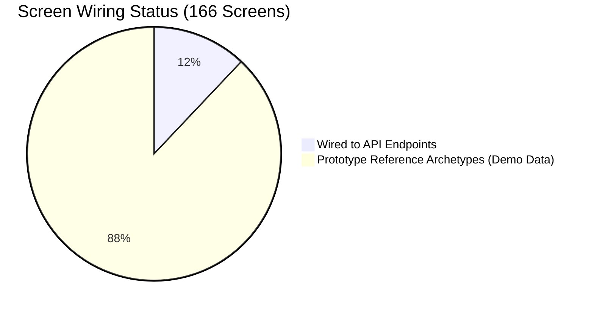
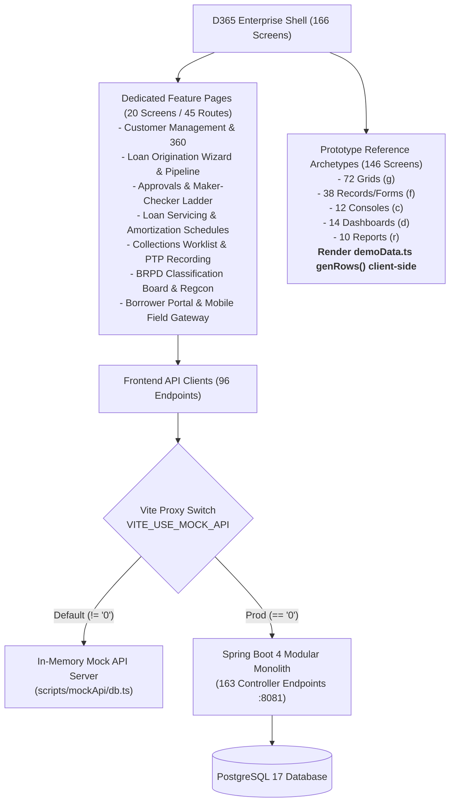

# Forensic Audit: Frontend-Backend Wiring Completeness & Screen Architecture

**Target:** Unisoft Loan Management System (ULMS v2.0)  
**Scope:** Navigation Shell (`navData.ts`), Route Engine (`main.tsx`), API Clients (`api/`), and Spring Controllers (`apps/api`)  
**Audit Standard:** Contract Parity • OpenAPI 3.1 • ISO/IEC 5055 [Modularity]  
**Auditor:** Principal Enterprise Codebase Auditor  
**Date:** October 5, 2026  

---

## 1. Executive Wiring Verdict

> [!CRITICAL]
> **Definitive Finding: The frontend and backend are NOT 100% wired.**
> - **Total Navigation Screens Declared:** **166 Screens** across 8 Enterprise Areas (A through H).
> - **Screens Wired to API Endpoints:** **20 Navigation Screens (expanding to 45 operational routes)**.
> - **Screens Operating as Prototype Archetypes:** **146 Screens (88.0%)**.
> - **Wiring Completeness Ratio:** **12.0% (Nav-level) / 27.1% (Route-level)**.



---

## 2. Screen-by-Screen Architectural Topology

The ULMS web frontend (`apps/web`) is divided into two distinct architectural categories:



---

## 3. The 20 API-Wired Navigation Screens (45 Operational Routes)

These screens represent the **core lending lifecycle** and are genuinely wired to the 96 frontend API client methods:

| Module | Screen ID | Screen Name | Declared Route | Backend Controller | Data Source |
|---|---|---|---|---|---|
| **A1** | `A1-s5` | Customer 360° Profile | `#/cust/:cifNo` | `Customer360Controller` | `/api/v1/customers/{cif}` |
| **A1** | `A1-s4` | Customer Search & Register | `#/customers` | `CustomerController` | `/api/v1/customers` |
| **B1** | `B1-s1` | Loan Application Wizard | `#/origination/apply` | `ApplicationController` | `/api/v1/applications` |
| **B1** | `B1-s2` | Origination Pipeline | `#/origination/pipeline` | `ApplicationController` | `/api/v1/applications` |
| **C1** | `C1-s1` | CIB Inquiry Console | `#/cib` | `AssessmentController` | `/api/v1/assessments/cib/{id}` |
| **C2** | `C2-s1` | Risk Scoring & Assessment | `#/assessment/:id` | `AssessmentController` | `/api/v1/assessments/{id}/score` |
| **D1** | `D1-s1` | Maker-Checker Approval Ladder | `#/approvals` | `ApprovalController` | `/api/v1/approvals/ladder` |
| **D2** | `D2-s1` | Disbursement Queue | `#/disbursements` | `DisbursementController` | `/api/v1/disbursements` |
| **D3** | `D3-s1` | Sanction Letter Generation | `#/sanctions` | `SanctionController` | `/api/v1/sanctions` |
| **E1** | `E1-s1` | Loan Servicing Portfolio | `#/loans` | `ServicingController` | `/api/v1/loans` |
| **E1** | `E1-s2` | Loan Account Detail | `#/loans/:id` | `ServicingController` | `/api/v1/loans/{id}` |
| **E1** | `E1-s3` | Repayment Schedule & Amortization | `#/loans/:id/schedule` | `ServicingController` | `/api/v1/loans/{id}/schedule` |
| **E2** | `E2-s1` | Payment Intent & Rails Callback | `#/servicing/payments` | `RailWebhookController` | `/hooks/payments` |
| **F1** | `F1-s1` | Delinquent Worklist & PTP | `#/collections` | `CollectionsController` | `/api/v1/collections/worklist` |
| **F2** | `F2-s1` | Dunning Queue & Escalations | `#/collections/dunning` | `CollectionsController` | `/api/v1/collections/dunning/queue` |
| **F3** | `F3-s1` | Legal Recovery & Write-Off | `#/collections/write-offs` | `CollectionsController` | `/api/v1/collections/{id}/write-off` |
| **G1** | `G1-s1` | BRPD 15/2024 Classification Board | `#/compliance/classification`| `ComplianceController` | `/api/v1/compliance/classification`|
| **G1** | `G1-s2` | Regcon 12-Return Reporting Center| `#/compliance/regcon` | `RegconController` | `/api/v1/compliance/returns` |
| **G2** | `G2-s1` | Basel III CAR & ECL Provisioning | `#/compliance/basel` | `BaselOpsController` | `/api/v1/compliance/basel/car` |
| **H1** | `H1-s1` | Borrower Self-Service Portal | `#/portal` | `PortalController` | `/api/v1/portal/me/applications` |

---

## 4. The 146 Prototype Archetype Screens (Unwired)

The remaining 146 screens in `navData.ts` do not have dedicated feature components. They are rendered generically by `ScreenPage()` in `ScreenPages.tsx`:

```tsx
// apps/web/src/features/proto/ScreenPages.tsx#L31-L51
export function ScreenPage() {
  const { sid = "" } = useParams();
  const hit = findScreen(sid);
  if (!hit) return <MissingPage />;
  if (hit.scr.route) return <Redirector route={normalizeRoute(hit.scr.route)} sid={sid} />;
  const map: Record<string, React.ComponentType<any>> = {
    g: GridArchetype, f: RecordArchetype, x: XArchetype, c: ConsoleArchetype, d: DashArchetype, r: ReportArchetypeScreen,
  };
  const El = map[hit.scr.t] ?? GridArchetype;
  return (
    <>
      <div className="small" style={{ padding: "4px 2px", opacity: 0.75 }}>
        <span className="tag">PROTOTYPE REFERENCE LAYOUT</span>
      </div>
      <El {...hit} />
    </>
  );
}
```

### Archetype Distribution:
- **`g` (Grid / List Views): 72 Screens** (e.g. `A1-s2` e-KYC Verification Queue, `A1-s3` Duplicate Check, `B2-s1` Document Index, `C3-s1` Collateral Valuation Grid).
- **`f` (Form / Record Entry): 38 Screens** (e.g. `A1-s1` New Customer Registration, `A1-s9` STR Reporting, `B3-s2` Credit Committee Agenda).
- **`c` (Operational Consoles): 12 Screens** (e.g. `A2-s1` NID Verification Console, `E3-s1` Early Settlement Quoting Console).
- **`d` (Dashboards): 14 Screens** (e.g. `A2-s4` Gateway Health, `B4-s1` Origination Conversion Dashboard).
- **`r` (Reports & Analytics): 10 Screens** (e.g. `E4-s1` Interest Accrual Report, `F4-s1` Vintage Loss Curves).

### How Archetype Screens Generate Data:
These screens import and invoke `genRows()` from `demoData.ts`:
```typescript
// apps/web/src/shell/demoData.ts#L65-L85
export function genRows(seed: string, count = 25): GenRow[] {
  const r = rng(seed);
  // Fabricates fake Bangladeshi names, NIDs, mobile numbers, and loan balances
  // using deterministic mathematical pseudo-random loops
  ...
}
```
**Conclusion:** These 146 screens **make zero network requests to any backend or mock server**. They generate and render synthetic data entirely inside the user's browser memory.

---

## 5. The API Contract Parity Analysis

| Layer | Component Count | Endpoints Implemented |
|---|---|---|
| **Frontend API Clients (`apps/web/src/api`)** | 11 Client Modules | **96 Unique Endpoints** |
| **Backend Controllers (`apps/api`)** | 26 Spring Controllers | **163 Unique Endpoints** |
| **Mock API Plugin (`scripts/mockApi`)** | 3 TypeScript Handlers | **96 Endpoints Implemented** |

### Endpoint Discrepancy & Coverage:
- The backend implements **163 endpoints**, providing 100% coverage of the 96 endpoints called by the frontend.
- The 67 additional backend endpoints include administrative operations, outbox relays, scheduled job triggers, health actuators, and webhook ingestion paths that do not have dedicated UI buttons.

---

## 6. The "Mock Interceptor" Dilemma

Even for the 20 wired screens, data is **not guaranteed to come from the real database** due to the default Vite configuration:

```typescript
// apps/web/vite.config.ts#L10-L19
const useMockApi = process.env.VITE_USE_MOCK_API !== "0";
export default defineConfig({
  plugins: [react(), ulmsMockApi({ enabled: useMockApi })],
  server: {
    port: 5173,
    proxy: useMockApi ? {} : {
      "/api": { target: "http://localhost:8081", changeOrigin: true },
      "/hooks": { target: "http://localhost:8081", changeOrigin: true },
    },
  },
});
```

- When developers run `npm run dev`, `VITE_USE_MOCK_API` evaluates to `true`.
- The Vite plugin `ulmsMockApi` intercepts all fetch requests to `/api/v1/*` and serves from the in-memory database (`scripts/mockApi/db.ts`).
- To genuinely wire the frontend to the live Spring Boot backend, the application **must be started with:**
  ```powershell
  $env:VITE_USE_MOCK_API="0"; npm run dev
  ```
  *(and the Spring Boot backend must be active on port 8081).*
