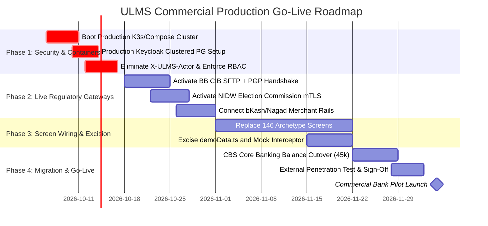

# Production Go-Live & Remediation Roadmap: Transition to 100% Live Architecture

**Target:** Unisoft Loan Management System (ULMS v2.0)  
**Objective:** Transition the codebase from its current 58.5% readiness state to 100% live production operation with zero mocks, full screen wiring, and persistent regulatory handshakes.  
**Auditor:** Principal Enterprise Codebase Auditor  
**Date:** October 5, 2026  

---

## 1. Executive Roadmap & Milestone Schedule

---

## 2. Phase 1: Security & Production Infrastructure Activation (Weeks 1–2)

### Objective
Replace the current dormant Docker environment and development session bypass with an authenticated, clustered, production-hardened runtime.

### Work Breakdown:
1. **Container Infrastructure Boot:**
   - Execute `docker compose up -d` in `deploy/compose/` or deploy Helm chart to the on-premise K3s cluster.
   - Verify health of PostgreSQL 17, Apache Fineract, Keycloak 26, SeaweedFS, and Spring Boot API.
2. **Keycloak Production Hardening:**
   - Transition Keycloak from `start-dev` mode with local H2 storage to clustered production mode backed by PostgreSQL (`ulms_keycloak` database).
   - Enforce mandatory multi-factor authentication (MFA/TOTP) for all approval ladder roles (L1 through L7).
   - Sync user directories with the Bank’s corporate Active Directory / LDAP.
3. **Session & RBAC Enforcement:**
   - Remove the `X-ULMS-Actor: r.islam` default fallback in `apps/web/src/api/customers.ts`.
   - Remove the one-click "Dev Persona Chips" from `apps/web/src/auth/LoginPage.tsx`.
   - Wire role-gated access in the React UI: users in the `LOAN_OFFICER` role cannot view or click the disbursement authorization buttons.

---

## 3. Phase 2: Live External Gateway Handshakes (Weeks 3–4)

### Objective
Deactivate all mock integration adapters and establish encrypted, authenticated handshakes with national regulatory and payment networks.

### Work Breakdown:
1. **Bangladesh Bank CIB Online Activation:**
   - Activate profile `--spring.profiles.active=cib-live`.
   - Install bank-issued mTLS client certificates in Java keystore (`ULMS_CIB_KEYSTORE`).
   - Configure Bangladesh Bank SFTP credentials and load BouncyCastle PGP private keys for batch file encryption.
   - Execute live end-to-end pull test using the golden test parser in `CibOnlineAdapterTest`.
2. **Election Commission NIDW e-KYC Activation:**
   - Activate profile `--spring.profiles.active=nidw-live`.
   - Configure live NIDW API endpoint and install IPSec VPN or leased-line routing.
   - Replace `NidMockAdapter` with live biometric and demographic verification.
3. **Live Payment Rail & Merchant Gateways:**
   - Activate profile `--spring.profiles.active=rails-live`.
   - Replace `SandboxRailAdapter` with production bKash, Nagad, and Rocket merchant API credentials.
   - Configure HMAC-SHA256 webhook secrets in `ULMS_RAILS_WEBHOOK_SECRET` for payment callbacks.
4. **Document Security Scanning:**
   - Deploy ClamAV container into Docker Compose.
   - Update `PassThroughScanAdapter.java` to stream uploaded customer documents through ClamAV daemon socket before committing to SeaweedFS/MinIO.

---

## 4. Phase 3: Screen Wiring & Prototype Excision (Weeks 5–8)

### Objective
Systematically eliminate all client-side synthetic generation and replace prototype reference layouts with production React feature components.

### Work Breakdown:
1. **Deconstruct `ScreenPages.tsx` (146 Archetype Screens):**
   - Implement dedicated React controllers for the high-priority unwired screens:
     - `A1-s1` New Customer Registration Form (wired to `POST /api/v1/customers`).
     - `A1-s2` e-KYC Verification Queue (wired to `GET /api/v1/customers?status=PENDING`).
     - `A2-s1` NID Verification Console (wired to NID query endpoint).
     - `B2-s1` Document Index & Upload Center (wired to MinIO S3 upload endpoint).
     - `C3-s1` Collateral Valuation Grid (wired to collateral registry table).
     - `E3-s1` Early Settlement Quoting Console (wired to settle-quote oracle).
2. **Excise Client-Side Synthetic Generation:**
   - Delete `apps/web/src/shell/demoData.ts` and remove references to `genRows()`, `rng()`, and `h32()`.
   - Eliminate the `PROTOTYPE REFERENCE LAYOUT` badge from all screens.
3. **Hard-Disable Mock API in Web Build:**
   - In `apps/web/vite.config.ts`, permanently set `useMockApi = false`.
   - Configure Nginx in `ulms-web` Dockerfile to proxy `/api` directly to `http://api:8081`.

---

## 5. Phase 4: Migration, Security Audit & Pilot Launch (Weeks 9–12)

### Objective
Execute dry-run balance migration from legacy Core Banking Systems, perform independent penetration testing, and achieve commercial pilot go-live.

### Work Breakdown:
1. **Purge Synthetic Database Seeds:**
   - Remove `deploy/seed/10-seed.sql` synthetic customers and loans from the production database cluster.
2. **CBS Data Migration Rehearsal:**
   - Execute the 45,000-loan migration script (`deploy/drills/migration-45k-rehearsal.sh`).
   - Reconcile General Ledger trial balances and verify zero discrepancy in loan principal, interest accrual, and provision reserves.
3. **Third-Party Security Penetration Testing:**
   - Engage certified external pen-testing firm to perform OWASP ASVS Level 3 verification.
   - Execute automated vulnerability sweeps (OWASP ZAP, SonarQube, Snyk).
4. **Bank Pilot Launch & Sign-Off:**
   - Deploy production K3s cluster in bank primary datacenter.
   - Onboard first 5 pilot branches and 50 loan officers.
   - Secure final User Acceptance Testing (UAT) sign-off letter from Bank Management.

---

## 6. Capitalized Cost & Resource Estimation

Based on our forensic analysis, the estimated effort to complete all 4 phases is:

| Phase | Description | Estimated Engineering Hours | Cost @ $125/hr Blended |
|---|---|---|---|
| **Phase 1** | Security Hardening & Container Deployment | 120 Hours | $15,000.00 |
| **Phase 2** | Live Regulatory Gateways & mTLS Handshakes | 160 Hours | $20,000.00 |
| **Phase 3** | Screen Wiring (146 Screens) & Prototype Excision | 320 Hours | $40,000.00 |
| **Phase 4** | CBS Migration, Pen-Testing & Pilot Sign-off | 140 Hours | $17,500.00 |
| **Total** | **Full Commercial Production Go-Live** | **740 Hours (~4.6 Dev-Months)** | **$92,500.00** |
