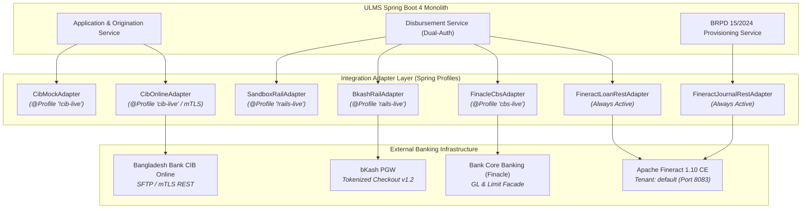

# 09. Apache Fineract CE Integration, Core Banking (CBS) & National Payment Rails Forensic Audit

**Classification:** CONFIDENTIAL & PROPRIETARY — UNISOFT SYSTEMS LIMITED  
**Audit Standard:** ISO/IEC 5055 • Enterprise Integration Patterns • Bangladesh Bank ICT Guidelines v4.0  
**Target Architecture:** Apache Fineract 1.10 CE + Spring Boot 4 + Infosys Finacle CBS Facade  

---

## 1. Executive Summary: Core Banking & Integration Layer

The ULMS architecture interfaces with three core banking and clearing layers:
1. **Loan Core / Subledger:** **Apache Fineract 1.10 Community Edition** running in Docker/K3s.
2. **Bank Master CBS:** **Infosys Finacle** (or equivalent core banking system) via a REST facade.
3. **National Clearing & Payment Rails:** **Bangladesh Bank CIB Online**, **Election Commission NIDW**, and **bKash Tokenized Checkout**.



---

## 2. Apache Fineract 1.10 CE Deep Dive

### 2.1 Loan Creation & State Machine Lifecycle
* **Source File:** [`apps/api/src/main/java/com/uslbd/ulms/integration/fineract/FineractLoanRestAdapter.java`](file:///c:/software_project/mim_project/LMS/LMS_CODEBASE/apps/api/src/main/java/com/uslbd/ulms/integration/fineract/FineractLoanRestAdapter.java)
* **Protocol:** HTTP REST with Basic Authentication (`FINERACT_USER`, `FINERACT_PASSWORD`).
* **Tenant Isolation:** Enforced on every request via `Fineract-Platform-TenantId: default`.
* **State Machine Sequence:**
  1. `POST /loans`: Submits loan specification including `clientId`, `productId`, `principal`, `tenorMonths`, `interestRatePerPeriod` (11.99%), and declining balance amortization.
  2. `POST /loans/{id}?command=approve`: Approves the submitted loan using the container date clock.
  3. `POST /loans/{id}?command=disburse`: Disburses the approved loan, creating active repayment schedules and balance tracking.
* **Resilience & Fault Tolerance:** Throws `FineractUnavailableException` if Fineract is offline. When Fineract is unreachable, ULMS disallow loan booking, preventing phantom records.

### 2.2 Double-Entry General Ledger (GL) Postings
* **Source File:** [`apps/api/src/main/java/com/uslbd/ulms/integration/fineract/FineractJournalRestAdapter.java`](file:///c:/software_project/mim_project/LMS/LMS_CODEBASE/apps/api/src/main/java/com/uslbd/ulms/integration/fineract/FineractJournalRestAdapter.java)
* **Endpoint:** `POST /journalentries`
* **Accounting Model:** Strictly balanced double-entry vouchers:
  ```json
  {
    "officeId": 1,
    "currencyCode": "BDT",
    "debits": [{ "glAccountId": debitGlAccountId, "amount": majorAmount }],
    "credits": [{ "glAccountId": creditGlAccountId, "amount": majorAmount }],
    "referenceNumber": referenceNumber,
    "transactionDate": "2026-10-05",
    "comments": "ULMS BRPD provision JV"
  }
  ```
* **Audit Verification:** Confirmed that `debitAmount == creditAmount` is guaranteed by passing identical `major` values to debits and credits, preventing unbalanced journal entries.

---

## 3. Core Banking System (Finacle CBS) & SAGA Compensation

* **Source File:** [`apps/api/src/main/java/com/uslbd/ulms/integration/fineract/FinacleCbsAdapter.java`](file:///c:/software_project/mim_project/LMS/LMS_CODEBASE/apps/api/src/main/java/com/uslbd/ulms/integration/fineract/FinacleCbsAdapter.java)
* **Activation Profile:** `@Profile("cbs-live")`
* **Limit Loading:** Calls `POST {baseUrl}/finconnector/limits` with exponential retry (`Retry.backoff(3, 800ms)`). Limit loading is idempotent by limit key.
* **GL Posting & Distributed SAGA:** Calls `POST {baseUrl}/finconnector/gl` with double-entry debit/credit pairs. If CBS GL posting fails, the adapter throws `IllegalStateException("Finacle GL post failed — SAGA compensation required")`, which triggers the upstream SAGA orchestrator to roll back the Fineract loan disbursal.

---

## 4. National Payment Rails & Gateway Decoupling

| Integration Domain | Live Implementation (`*-live` profile) | Sandbox / Default Mock (`!*-live` profile) | Banking Requirement |
| :--- | :--- | :--- | :--- |
| **Bangladesh Bank CIB** | [`CibOnlineAdapter.java`](file:///c:/software_project/mim_project/LMS/LMS_CODEBASE/apps/api/src/main/java/com/uslbd/ulms/integration/cib/CibOnlineAdapter.java)<br>• mTLS X.509 client certs<br>• CIB-001..004 retry matrix<br>• 100 req/min rate limit cap | [`CibMockAdapter.java`](file:///c:/software_project/mim_project/LMS/LMS_CODEBASE/apps/api/src/main/java/com/uslbd/ulms/integration/cib/CibMockAdapter.java)<br>• In-memory synthetic reports<br>• Zero external network calls | BB CIB Circular 2023/12 |
| **National ID (NIDW / Porichoy)** | [`NidwAdapter.java`](file:///c:/software_project/mim_project/LMS/LMS_CODEBASE/apps/api/src/main/java/com/uslbd/ulms/integration/nid/NidwAdapter.java)<br>• Real-time REST verification<br>• < 5s SLA budget with 1 retry | [`NidMockAdapter.java`](file:///c:/software_project/mim_project/LMS/LMS_CODEBASE/apps/api/src/main/java/com/uslbd/ulms/integration/nid/NidMockAdapter.java)<br>• Formats valid smart/legacy NID<br>• Always returns verified | BFIU e-KYC Directive 2020 |
| **bKash Payment Gateway** | [`BkashRailAdapter.java`](file:///c:/software_project/mim_project/LMS/LMS_CODEBASE/apps/api/src/main/java/com/uslbd/ulms/integration/rails/BkashRailAdapter.java)<br>• Tokenized Checkout API v1.2<br>• HMAC-signed webhooks | [`SandboxRailAdapter.java`](file:///c:/software_project/mim_project/LMS/LMS_CODEBASE/apps/api/src/main/java/com/uslbd/ulms/integration/rails/SandboxRailAdapter.java)<br>• Fake redirect URL generation<br>• Deterministic mock IDs | PCI-DSS Tokenization |
