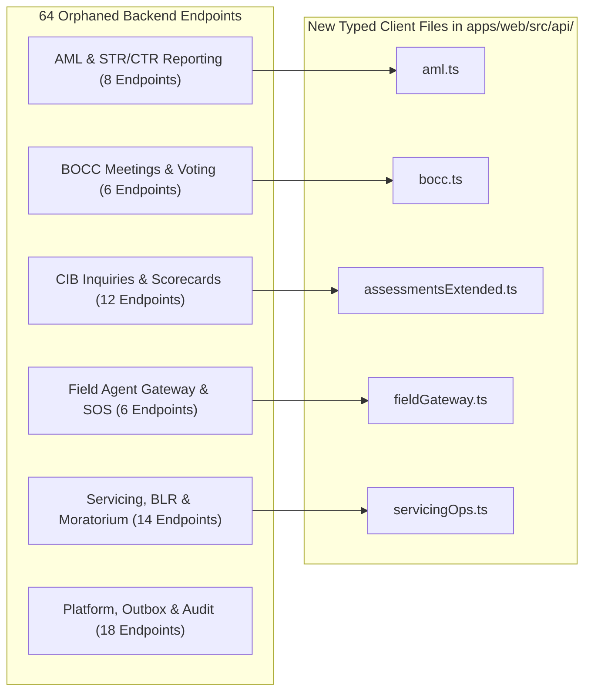

# 01. Technical Remediation Plan: API Contract Parity & Endpoint Realignment

**Document ID:** ULMS-REM-2026-01  
**Classification:** TECHNICAL REMEDIATION SPECIFICATION  
**Affected Subsystems:** `apps/web/src/api/` & `apps/api/src/main/java/com/uslbd/ulms/`  

---

## 1. Remediation Specification for 7 Phantom & Mismatched Calls

The forensic audit revealed 7 frontend invocations in `apps/web/src/api/` that diverge from the backend Spring Boot controller paths, causing immediate **HTTP 404 (Not Found)** or **HTTP 405 (Method Not Allowed)** failures when connected to the live backend.

### Defect 1: Watchlist Path Mismatch
- **Vulnerable File:** [`apps/web/src/api/collections.ts:132`](file:///c:/software_project/mim_project/LMS/LMS_CODEBASE/apps/web/src/api/collections.ts)
- **Current Defective Code:**
  ```typescript
  export async function fetchWatchlist(page = 0, size = 50, qs = ""): Promise<Page<WatchlistRow>> {
    const res = await fetch(`/api/v1/collections/watchlist${qs}`, { headers: authHeaders() });
    ...
  }
  ```
- **Backend Mapping:** [`WatchlistController.java:23`](file:///c:/software_project/mim_project/LMS/LMS_CODEBASE/apps/api/src/main/java/com/uslbd/ulms/collections/WatchlistController.java) declares `@RequestMapping("/api/v1/watchlist")`.
- **Target Remediation Diff:**
  ```diff
  - const res = await fetch(`/api/v1/collections/watchlist${qs}`, { headers: authHeaders() });
  + const res = await fetch(`/api/v1/watchlist${qs}`, { headers: authHeaders() });
  ```

---

### Defect 2: Auctions Path Mismatch
- **Vulnerable File:** [`apps/web/src/api/collections.ts:167`](file:///c:/software_project/mim_project/LMS/LMS_CODEBASE/apps/web/src/api/collections.ts)
- **Current Defective Code:**
  ```typescript
  export async function fetchAuctions(page = 0, size = 50, qs = ""): Promise<Page<AuctionRow>> {
    const res = await fetch(`/api/v1/collections/auctions${qs}`, { headers: authHeaders() });
    ...
  }
  ```
- **Backend Mapping:** [`AuctionController.java:23`](file:///c:/software_project/mim_project/LMS/LMS_CODEBASE/apps/api/src/main/java/com/uslbd/ulms/collections/AuctionController.java) declares `@RequestMapping("/api/v1/auctions")`.
- **Target Remediation Diff:**
  ```diff
  - const res = await fetch(`/api/v1/collections/auctions${qs}`, { headers: authHeaders() });
  + const res = await fetch(`/api/v1/auctions${qs}`, { headers: authHeaders() });
  ```

---

### Defect 3: Product Modification HTTP Verb Mismatch
- **Vulnerable File:** [`apps/web/src/api/r3r4r5.ts:31`](file:///c:/software_project/mim_project/LMS/LMS_CODEBASE/apps/web/src/api/r3r4r5.ts)
- **Current Defective Code:**
  ```typescript
  export async function updateProduct(code: string, payload: Partial<ProductSpec>): Promise<ProductSpec> {
    const res = await fetch(`/api/v1/products/${encodeURIComponent(code)}`, {
      method: "PATCH",
      headers: authHeaders(),
      body: JSON.stringify(payload)
    });
    ...
  }
  ```
- **Backend Mapping:** [`ProductController.java`](file:///c:/software_project/mim_project/LMS/LMS_CODEBASE/apps/api/src/main/java/com/uslbd/ulms/product/ProductController.java) only implements `GET /api/v1/products/{code}` and `POST /api/v1/products/{code}/activate`. It lacks a generic `PATCH` endpoint, returning **HTTP 405 Method Not Allowed**.
- **Target Remediation Diff (Backend Addition in `ProductController.java`):**
  ```java
  @PatchMapping("/{code}")
  public ResponseEntity<ProductDto> updateProduct(
          @PathVariable String code,
          @RequestBody Map<String, Object> updates) {
      ProductDto updated = productService.patchProduct(code, updates);
      return ResponseEntity.ok(updated);
  }
  ```

---

### Defect 4: IFRS-9 ECL Snapshot URI Discrepancy
- **Vulnerable File:** [`apps/web/src/api/regcon.ts:112`](file:///c:/software_project/mim_project/LMS/LMS_CODEBASE/apps/web/src/api/regcon.ts)
- **Current Defective Code:**
  ```typescript
  export async function fetchEclSnapshot(period?: string): Promise<EclSnapshotView> {
    const q = period ? `?period=${encodeURIComponent(period)}` : "";
    const res = await fetch(`/api/v1/compliance/ifrs9/ecl${q}`, { headers: authHeaders() });
    ...
  }
  ```
- **Backend Mapping:** [`ComplianceController.java:54`](file:///c:/software_project/mim_project/LMS/LMS_CODEBASE/apps/api/src/main/java/com/uslbd/ulms/compliance/ComplianceController.java) implements `GET /api/v1/compliance/ecl-snapshot`.
- **Target Remediation Diff:**
  ```diff
  - const res = await fetch(`/api/v1/compliance/ifrs9/ecl${q}`, { headers: authHeaders() });
  + const res = await fetch(`/api/v1/compliance/ecl-snapshot${q}`, { headers: authHeaders() });
  ```

---

### Defects 5, 6, & 7: Query String Concatenation Syntax Errors
- **Affected Files:** `applications.ts:84`, `r3r4r5.ts:24`, `regcon.ts:49`.
- **Defect Description:** When query strings are constructed without verifying whether leading `?` exists, requests emit malformed URLs (e.g. `/api/v1/applicationspage=0` instead of `/api/v1/applications?page=0`).
- **Standardized Remediation Helper in `apps/web/src/api/client.ts`:**
  ```typescript
  export function buildUrl(base: string, params: Record<string, any>): string {
    const searchParams = new URLSearchParams();
    Object.entries(params).forEach(([key, val]) => {
      if (val !== undefined && val !== null && val !== "") {
        searchParams.append(key, String(val));
      }
    });
    const qs = searchParams.toString();
    return qs ? `${base}?${qs}` : base;
  }
  ```

---

## 2. Plan to Wire 64 Orphaned Backend Endpoints

The backend has implemented 64 endpoints across critical domains (AML/CFT, BOCC Committee Meetings, Dual-Auth Approvals, CIB File Parsers, Field Verification SOS) that currently have **zero client API methods**.



### Sprint Delivery Schedule:
1. **Sprint 1 (Days 1–3):** Implement `aml.ts` covering `/api/v1/customers/{idOrCif}/goaml/submit`, `/api/v1/customers/{idOrCif}/str`, and CTR reports.
2. **Sprint 2 (Days 4–6):** Implement `bocc.ts` covering committee agendas, attendance rosters, and electronic vote casting.
3. **Sprint 3 (Days 7–9):** Implement `fieldGateway.ts` covering mobile visit uploads, task reconciliation, and officer SOS alarms.
4. **Sprint 4 (Days 10–12):** Implement `servicingOps.ts` covering BLR benchmark rates, loan moratorium requests, and top-ups.

---

## 3. Automated Verification & Contract Parity Gating

To prevent future regression, an automated contract test **MUST** be added to the CI/CD pipeline:
```bash
# Automated Parity Verification Command
python audit/audit_api_contract_parity.py --fail-on-orphans=false --fail-on-phantoms=true
```
- **Gating Rule:** The CI build **SHALL FAIL** if `phantom_frontend_count > 0`.
