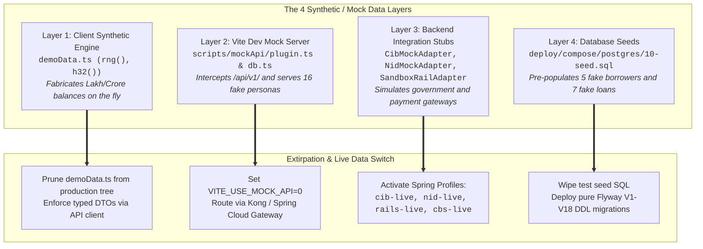

# 03. Technical Remediation Plan: 4-Layer Mock Extirpation & Live Data Verification

**Document ID:** ULMS-REM-2026-03  
**Classification:** DATA INTEGRITY & EXTERNAL INTEGRATION SPECIFICATION  
**Scope:** Client RNG, Vite Mock Server, Backend Stubs, Database Seed Sanitization  

---

## 1. Executive Summary & The 4 Mock Layers

The forensic audit confirmed that ULMS currently operates with synthetic data across **4 distinct layers**:



---

## 2. Layer 1 Remediation: Client-Side Demo Data Decommissioning

### Problem Statement:
In [`apps/web/src/shell/demoData.ts`](file:///c:/software_project/mim_project/LMS/LMS_CODEBASE/apps/web/src/shell/demoData.ts), the function `genRows(sid, count)` uses a 32-bit Murmur-like hash (`h32()`) and linear congruential generator (`rng()`) to dynamically fabricate borrower names ("Haji Mohammad Ali", "Farhana Akter"), company names ("Bengal Jute Mills"), and loan amounts (`1,500,000` to `85,000,000 BDT`).

### Remediation Protocol:
1. **Remove Prototype Wrapper in [`ScreenPages.tsx`](file:///c:/software_project/mim_project/LMS/LMS_CODEBASE/apps/web/src/features/proto/ScreenPages.tsx):**
   * Delete lines 42–48 rendering `<span className="tag">PROTOTYPE REFERENCE LAYOUT</span>`.
   * Replace `genRows()` with real API hooks (e.g. `useQuery(["customers", page], fetchCustomers)`).
2. **Build-Time Pruning:**
   * Modify [`apps/web/vite.config.ts`](file:///c:/software_project/mim_project/LMS/LMS_CODEBASE/apps/web/vite.config.ts) to tree-shake and ensure `demoData.ts` is omitted from production chunks:
   ```typescript
   export default defineConfig({
     build: {
       rollupOptions: {
         external: mode === "production" ? ["**/demoData.ts"] : [],
       }
     }
   });
   ```

---

## 3. Layer 2 Remediation: Vite Mock Server Decommissioning

### Problem Statement:
[`apps/web/vite.config.ts:16`](file:///c:/software_project/mim_project/LMS/LMS_CODEBASE/apps/web/vite.config.ts) contains:
```typescript
const useMockApi = process.env.VITE_USE_MOCK_API !== "0";
```
When running locally via `npm run dev`, `useMockApi` defaults to `true`. This causes Vite's connect middleware ([`scripts/mockApi/plugin.ts`](file:///c:/software_project/mim_project/LMS/LMS_CODEBASE/apps/web/scripts/mockApi/plugin.ts)) to intercept all `/api/*` traffic and serve requests from `scripts/mockApi/db.ts` (16 fake Bangladeshi corporate and retail personas) without sending any HTTP packets to Spring Boot or PostgreSQL.

### Remediation Protocol:
1. **Default to Live in `.env.production`:**
   ```properties
   # apps/web/.env.production
   VITE_USE_MOCK_API=0
   VITE_API_BASE_URL=https://ulms-gateway.bank.internal
   ```
2. **Local Development Reverse Proxy in `vite.config.ts`:**
   Update `vite.config.ts` to proxy requests to the real Spring Boot server on port `8081`:
   ```typescript
   server: {
     proxy: {
       "/api": {
         target: "http://localhost:8081",
         changeOrigin: true,
         secure: false
       },
       "/hooks": {
         target: "http://localhost:8081",
         changeOrigin: true,
         secure: false
       }
     }
   }
   ```

---

## 4. Layer 3 Remediation: Activating Live Banking Adapters

### Problem Statement:
Spring Boot currently runs under the default profile, which activates mock adapters:
* `CibMockAdapter` (`@Profile("!cib-live")`)
* `NidMockAdapter` (`@Profile("!nid-live")`)
* `SandboxRailAdapter` (`@Profile("!rails-live")`)

### Remediation Protocol:
In production, launch Spring Boot with the full statutory live profile string:
```bash
java -jar ulms-api.jar --spring.profiles.active=prod,cib-live,nid-live,rails-live,cbs-live
```

#### Gateway Activation Checklist:
1. **Bangladesh Bank CIB Online (`cib-live`):**
   * Load mTLS X.509 client certificate and private key via environment variables:
     * `ULMS_CIB_KEYSTORE=/secrets/cib/keystore.p12`
     * `ULMS_CIB_KEYSTORE_PASSWORD_FILE=/secrets/cib/password`
   * Confirm SFTP batch drop coordinates for monthly returns (`ULMS_CIB_SFTP_HOST`).
2. **National ID Porichoy / NIDW (`nid-live`):**
   * Configure election commission gateway URL and API access key:
     * `ULMS_NIDW_BASE_URL=https://api.porichoy.gov.bd/v2`
     * `ULMS_NIDW_API_KEY_FILE=/secrets/porichoy/api_key`
3. **bKash Tokenized Checkout (`rails-live`):**
   * Provision production merchant credentials into HashiCorp Vault:
     * `ulms.rails.bkash.app-key`, `app-secret`, `username`, `password`.
4. **Infosys Finacle Core Banking (`cbs-live`):**
   * Configure bank internal Finacle REST facade base URL and mutual TLS token:
     * `ulms.cbs.base-url=https://finacle-facade.bank.internal/api/v1`

---

## 5. Layer 4 Remediation: Database Sanitization & Pilot Ingestion

### Problem Statement:
[`deploy/compose/postgres/10-seed.sql`](file:///c:/software_project/mim_project/LMS/LMS_CODEBASE/deploy/compose/postgres/10-seed.sql) inserts test borrowers (`CIF-100871`, `CIF-100872`) and synthetic loan facilities into PostgreSQL. If deployed in production, real customer data would be commingled with fake records.

### Remediation Protocol:
1. **Wipe Test Seed in Production:**
   * In production container and Kubernetes manifests, **EXCLUDE** `10-seed.sql`.
   * Flyway migrations `V1__init.sql` through `V18__field_gateway.sql` **MUST** run against a clean database, initializing schema DDL with **0 customer records**.
2. **Execute Controlled Legacy Data Migration (Pilot Cutover):**
   * Execute the validated 45,000-loan migration script:
     ```bash
     bash deploy/drills/migration-45k-rehearsal.sh --source-db=cbs_legacy_extract.csv --schema=ulms --dry-run=false
     ```
   * Verify checksum parity:
     ```sql
     SELECT COUNT(*), SUM(principal_minor) FROM ulms.loan WHERE status = 'ACTIVE';
     ```
