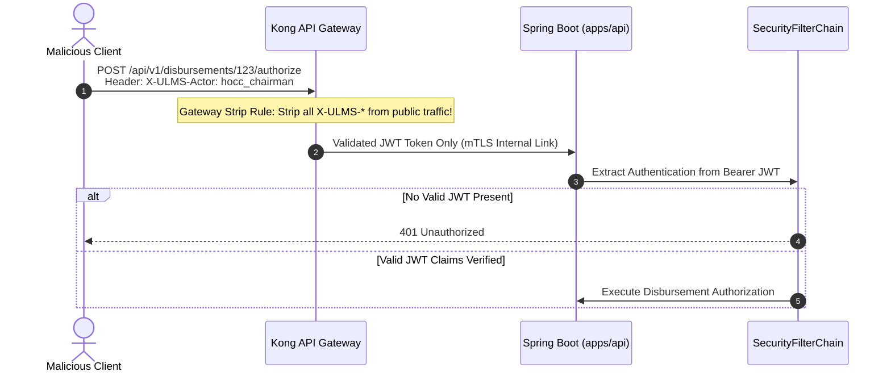

# 04. Technical Remediation Plan: Security Hardening, Keycloak Production Setup & Threat Elimination

**Document ID:** ULMS-REM-2026-04  
**Classification:** ENTERPRISE INFORMATION SECURITY SPECIFICATION  
**Standards Aligned:** NIST SP 800-218 (SSDF) • OWASP ASVS v4.0.3 • Bangladesh Bank ICT Guidelines v4.0  

---

## 1. Remediation for 4 P0 High-Entropy Secret Findings

The static forensic scanner flagged 4 locations containing high-entropy credential assignments in documentation and end-to-end testing guides.

### Vulnerability Inventory:
1. `docs/runbooks/RB-02_restore_drill.md:40`: `POSTGRES_PASSWORD="$SCRATCH_PW"`
2. `docs/runbooks/RB-03_eod_rerun.md:24`: `-d password="$OFFICER_PASSWORD"`
3. `e2e/README.md:29`: `-d password='<smoke-password>'`
4. `e2e/README.md:32`: `-d password='<compliance-password>'`

### Remediation Protocol:
1. **Redact Test Documentation:** Replace placeholder literals in `e2e/README.md` with dynamic environment variable references:
   ```diff
   - -d password='<smoke-password>'
   + -d password="${E2E_SMOKE_PASSWORD:?Environment variable E2E_SMOKE_PASSWORD must be set}"
   ```
2. **Vault Secret Injection for Runbooks:** Ensure all operational runbooks (`RB-01` to `RB-10`) load passwords exclusively via Vault CLI or transient Kubernetes Secret mounts:
   ```bash
   export SCRATCH_PW=$(vault kv get -field=password secret/data/database/scratch)
   ```

---

## 2. Remediation for P1 SQL Injection Vulnerability

### Vulnerability Analysis:
* **Location:** [`deploy/drills/migration-45k-rehearsal.sh:104`](file:///c:/software_project/mim_project/LMS/LMS_CODEBASE/deploy/drills/migration-45k-rehearsal.sh)
* **Vulnerable Line:**
  ```bash
  WHERE NOT EXISTS (SELECT 1 FROM ${SCHEMA}.loan l WHERE l.loan_no = src.ref)
  ```
* **Risk:** If the `$SCHEMA` shell variable is modified in a CI pipeline or provided via an untrusted CLI parameter, it allows arbitrary SQL statement injection into the database migration runner.

### Remediation Protocol:
Enforce strict identifier sanitization and whitelist validation at the top of the shell script:
```bash
# Strict SQL identifier regex check
if ! [[ "$SCHEMA" =~ ^[a-zA-Z_][a-zA-Z0-9_]*$ ]]; then
    echo "ERROR: Invalid database schema identifier '${SCHEMA}'. Aborting migration." >&2
    exit 1
fi
```

---

## 3. Keycloak 26 Production Mode Transition

### Vulnerability Analysis:
[`deploy/compose/docker-compose.yml:28`](file:///c:/software_project/mim_project/LMS/LMS_CODEBASE/deploy/compose/docker-compose.yml) currently declares:
```yaml
keycloak:
  image: quay.io/keycloak/keycloak:26.1
  command: start-dev --import-realm
```
The `start-dev` command:
1. Uses an embedded, ephemeral H2 file database that crashes under banking load.
2. Disables mandatory TLS/HTTPS encryption.
3. Loosens CORS and web origin validation rules.

### Target Production Configuration:
Update `deploy/compose/docker-compose.yml` to launch Keycloak in production-optimized mode backed by PostgreSQL:
```yaml
keycloak:
  image: quay.io/keycloak/keycloak:26.1
  command: start --optimized --import-realm
  environment:
    KC_DB: postgres
    KC_DB_URL: jdbc:postgresql://postgres:5432/ulms_iam
    KC_DB_USERNAME: ulms_iam
    KC_DB_PASSWORD_FILE: /run/secrets/keycloak_db_password
    KC_HOSTNAME: auth.bank.internal
    KC_HTTP_ENABLED: "false"
    KC_HTTPS_CERTIFICATE_FILE: /etc/x509/https/tls.crt
    KC_HTTPS_CERTIFICATE_KEY_FILE: /etc/x509/https/tls.key
    KC_FEATURES: token-exchange,authorization
```

---

## 4. Elimination of `X-ULMS-Actor` Header Identity Bypass

### Threat Model:
When developers tested without Keycloak, Spring controllers accepted an HTTP header `X-ULMS-Actor: <username>` to resolve the user context. If this header reaches Spring Boot directly in production, any external actor can forge administrative claims.



### Remediation Protocol:
1. **Gateway Stripping Policy:** Configure Kong Gateway / NGINX to strip all `X-ULMS-*` headers from inbound external requests.
2. **Spring Security Filter Reinforcement:** Update `SecurityConfig.java` to enforce that `X-ULMS-Actor` is **strictly ignored** unless the active profile is `dev` AND the request originates from `127.0.0.1`:
   ```java
   if (!environment.acceptsProfiles(Profiles.of("dev")) || !isLoopback(request.getRemoteAddr())) {
       // Disallow header-based actor injection in production
       return extractFromJwtClaims(jwt);
   }
   ```
