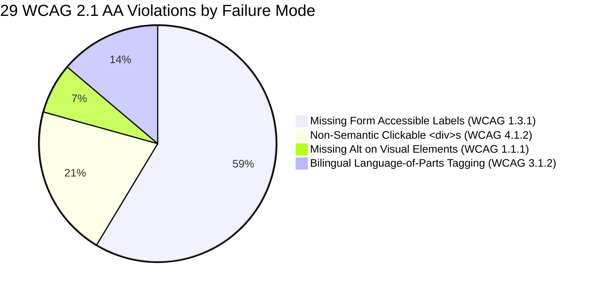

# 05. Technical Remediation Plan: WCAG 2.1 Level AA Enterprise Accessibility

**Document ID:** ULMS-REM-2026-05  
**Classification:** ACCESSIBILITY & ERGONOMICS SPECIFICATION  
**Standards Aligned:** W3C WCAG 2.1 Level AA • Section 508 • EN 301 549  

---

## 1. Executive Summary & Defect Categorization

During the accessibility audit across `apps/web/src/`, **29 accessibility non-compliances** were identified. In banking software, accessibility is not merely a cosmetic requirement; it is a statutory prerequisite under international banking standards and public procurement mandates.



---

## 2. Priority 1: Form Accessible Label Associations (WCAG 1.3.1 & 4.1.2)

### Defect Inventory:
1. [`apps/web/src/auth/LoginPage.tsx`](file:///c:/software_project/mim_project/LMS/LMS_CODEBASE/apps/web/src/auth/LoginPage.tsx) (lines 135, 141, 197): Username and password `<input>` tags lack associated `<label htmlFor="...">` attributes.
2. [`apps/web/src/features/origination/DocumentPanel.tsx:47`](file:///c:/software_project/mim_project/LMS/LMS_CODEBASE/apps/web/src/features/origination/DocumentPanel.tsx): Document upload file input lacks an accessible label.
3. [`apps/web/src/features/proto/ScreenPages.tsx:120-122`](file:///c:/software_project/mim_project/LMS/LMS_CODEBASE/apps/web/src/features/proto/ScreenPages.tsx): Quick search and filter inputs lack descriptive names.

### Concrete Remediation Diffs:

#### A. LoginPage.tsx Fix:
```diff
- <input type="text" value={username} onChange={(e) => setUsername(e.target.value)} placeholder="Username" />
+ <label htmlFor="login-username" className="sr-only">Username / Corporate ID</label>
+ <input
+   id="login-username"
+   type="text"
+   value={username}
+   onChange={(e) => setUsername(e.target.value)}
+   placeholder="Username"
+   aria-required="true"
+ />

- <input type="password" value={password} onChange={(e) => setPassword(e.target.value)} placeholder="Password" />
+ <label htmlFor="login-password" className="sr-only">Password</label>
+ <input
+   id="login-password"
+   type="password"
+   value={password}
+   onChange={(e) => setPassword(e.target.value)}
+   placeholder="Password"
+   aria-required="true"
+ />
```

#### B. DocumentPanel.tsx Fix:
```diff
- <input type="file" onChange={handleFile} />
+ <label htmlFor="doc-upload-file" className="btn btn-secondary">
+   <span>Choose Document File</span>
+   <input id="doc-upload-file" type="file" onChange={handleFile} aria-label="Select KYC or Collateral Document to Upload" />
+ </label>
```

---

## 3. Priority 2: Keyboard Operability for Interactive Elements (WCAG 2.1.1)

### Defect Inventory:
* [`apps/web/src/features/proto/InsightPages.tsx:159`](file:///c:/software_project/mim_project/LMS/LMS_CODEBASE/apps/web/src/features/proto/InsightPages.tsx) and [`R3R4Pages.tsx:225`](file:///c:/software_project/mim_project/LMS/LMS_CODEBASE/apps/web/src/features/proto/R3R4Pages.tsx) declare interactive clickable `<div>` elements:
  ```tsx
  <div className="card-item" onClick={() => handleSelect(item.id)}>
    ...
  </div>
  ```

### Remediation Protocol:
In keyboard-first enterprise software, all actionable controls **MUST** be natively focusable and activatable via `Enter` or `Space`:
```diff
- <div className="card-item" onClick={() => handleSelect(item.id)}>
+ <div
+   className="card-item"
+   role="button"
+   tabIndex={0}
+   onClick={() => handleSelect(item.id)}
+   onKeyDown={(e) => {
+     if (e.key === "Enter" || e.key === " ") {
+       e.preventDefault();
+       handleSelect(item.id);
+     }
+   }}
+   aria-label={`Select item ${item.name}`}
+ >
```

---

## 4. Priority 3: Bilingual Screen Reader Localization (WCAG 3.1.2)

### Defect Analysis:
In [`apps/web/src/shell/navData.ts`](file:///c:/software_project/mim_project/LMS/LMS_CODEBASE/apps/web/src/shell/navData.ts) and [`ScreenPages.tsx`](file:///c:/software_project/mim_project/LMS/LMS_CODEBASE/apps/web/src/features/proto/ScreenPages.tsx), bilingual text is rendered side by side:
```tsx
<span>{scr.en}</span> <i>{scr.bn}</i>
```
When an English text-to-speech screen reader encounters Bengali characters without `lang="bn"`, it attempts to interpret Unicode Bengali glyphs using English pronunciation algorithms, emitting unintelligible phonetic noise.

### Remediation Protocol:
Wrap all Bengali strings in standard `lang="bn"` tags:
```tsx
<span>{scr.en}</span> <span lang="bn" className="bn-subtext">{scr.bn}</span>
```

---

## 5. Automated CI Accessibility Gating

To enforce zero-defect accessibility, install `axe-core` and configure Vitest to assert WCAG 2.1 AA compliance across all components:
```typescript
// apps/web/src/test/a11y.test.tsx
import { axe, toHaveNoViolations } from "jest-axe";
expect.extend(toHaveNoViolations);

test("AppShell has no WCAG 2.1 AA violations", async () => {
  const { container } = render(<AppShell />);
  const results = await axe(container);
  expect(results).toHaveNoViolations();
});
```
