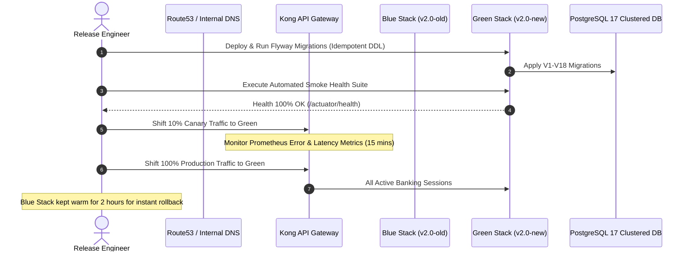

# 07. Verification Testing, Production Cutover & Disaster Rollback Playbook

**Document ID:** ULMS-REM-2026-07  
**Classification:** DEVOPS & SITE RELIABILITY ENGINEERING SPECIFICATION  
**Scope:** Automated Testing Gates, Blue/Green Traffic Cutover & Zero-Downtime Rollback  

---

## 1. Automated Verification Test Suite & Gherkin BDD Scenarios

Before any release candidate is promoted to production, the test harness **MUST** execute the automated end-to-end regression suite.

### Scenario 1: End-to-End Origination to Subledger Disbursal
```gherkin
Feature: End-to-End Loan Booking and Disbursal
  As a Branch Credit Officer
  I want to submit an application and disburse the facility
  So that the loan is booked accurately in Apache Fineract and the Core Banking System

  Scenario: Successful Individual Personal Loan Disbursal
    Given an authenticated officer with role "MAKER"
    And a verified customer with CIF "CIF-100871"
    When the maker drafts a Personal Loan application for BDT 1,500,000 with 36-month tenor
    And the maker submits the application for CIB inquiry and scoring
    Then the CIB status returns "STANDARD"
    And the application stage advances to "UNDERWRITING"
    When the Credit Committee approves the facility within their discretionary limit
    Then a formal Sanction Letter is generated with SHA-256 hash
    When a checker with role "CHECKER" authorizes the disbursement
    Then Apache Fineract creates loan account with status "ACTIVE"
    And Infosys Finacle CBS confirms double-entry GL posting
    And an audit event is appended to ulms.audit_entry with valid hash chaining
```

---

## 2. Long-Running Task Discipline & Execution Guardrails

Per the **Enterprise Full-Stack Engineer Protocol**, long test executions and database migrations **MUST** be orchestrated with zero polling waste:

1. **No Block-Polling of Background Jobs:**
   * Launch long-running tasks asynchronously. Do not issue repeated blocking waits.
2. **Deterministic Diagnostic Triage:**
   * If a JVM process fails to respond, execute **ONE** thread dump:
     ```bash
     jcmd <pid> Thread.print > /tmp/thread_dump.txt
     ```
   * If GC threads consume ~100% CPU, the heap has entered an old-gen thrashing spiral. Double the JVM container heap (`-Xmx4g`) rather than waiting indefinitely.

---

## 3. Blue/Green Zero-Downtime Production Cutover Protocol



---

## 4. Automated Canary Rollback Triggers & Execution Steps

### 4.1 Automatic Abort Conditions (SLO Breach):
The deployment gateway **SHALL AUTOMATICALLY REVERT** traffic to the Blue stack if any of the following occur within 30 minutes of cutover:
1. **HTTP 5xx Error Spike:** $\ge 0.1\%$ of all API requests return 5xx errors over a 5-minute sliding window.
2. **Latency Degradation:** 99th percentile response time ($p99$) exceeds $2,500\text{ ms}$ over a 3-minute window.
3. **Core Banking SAGA Abort:** Any uncompensated GL voucher failure occurs in `FinacleCbsAdapter`.
4. **Database Deadlock Spiral:** PostgreSQL reports $> 10$ active deadlocks in `pg_stat_database`.

### 4.2 Manual Emergency Rollback Playbook:
If an unhandled exception or data anomaly is detected post-cutover:
```bash
# Step 1: Immediately revert API gateway routing to Blue stack
kong-admin-cli routes update ulms-core-route --service ulms-blue-service

# Step 2: Flush Redis routing cache
redis-cli -h ulms-cache.bank.internal FLUSHDB

# Step 3: Verify Blue stack health
curl -f https://ulms.bank.internal/actuator/health

# Step 4: Isolate Green database transactions
psql -U ulms_dba -d ulms_db -c "SELECT pg_terminate_backend(pid) FROM pg_stat_activity WHERE application_name LIKE 'ulms-green%';"
```
