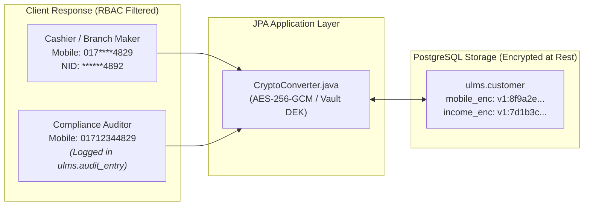

# 10. Technical Remediation Plan: PII Data Privacy, At-Rest Encryption & Role-Based Masking

**Document ID:** ULMS-REM-2026-10  
**Classification:** DATA PRIVACY & STATUTORY REGULATORY SPECIFICATION  
**Standards Aligned:** Bangladesh Bank ICT Security Guidelines v4.0 • Bank Company Act 1991 • BFIU Circular 26  

---

## 1. Executive Summary & Data Privacy Baseline

Under Bangladesh Bank ICT Security Guidelines v4.0 (§7.3 "Data Protection and Privacy"), banking institutions **MUST** ensure that non-public customer personal data (NID, biometric scans, salary figures, phone numbers, and financial statements) are encrypted both **in-transit (TLS 1.3)** and **at-rest (AES-256)**.

### Architectural Discovery from Forensic Audit:
1. **Masked NID Design:** [`Customer.java:46`](file:///c:/software_project/mim_project/LMS/LMS_CODEBASE/apps/api/src/main/java/com/uslbd/ulms/customer/Customer.java) implements `nid_masked` (e.g. `******4892`), preventing unmasked National ID numbers from persisting in the core customer mirror.
2. **Plaintext Fields Remaining:** Customer mobile numbers (`mobile`) and financial income snapshots (`income_minor`) are stored in plaintext in the `ulms.customer` and `ulms.application` tables.
3. **Unencrypted Document Store:** Files stored in SeaweedFS/MinIO rely on infrastructure volume encryption rather than application-layer envelope encryption.



---

## 2. Implementation of JPA Column-Level Encryption (`CryptoConverter.java`)

To ensure database administrators or compromised SQL dumps cannot expose customer personal data, deploy an automated JPA `AttributeConverter` using **AES-256-GCM** authenticated encryption:

```java
package com.uslbd.ulms.platform.security;

import jakarta.persistence.AttributeConverter;
import jakarta.persistence.Converter;
import javax.crypto.Cipher;
import javax.crypto.spec.GCMParameterSpec;
import javax.crypto.spec.SecretKeySpec;
import java.security.SecureRandom;
import java.util.Base64;

@Converter
public class CryptoConverter implements AttributeConverter<String, String> {

    private static final String ALGORITHM = "AES/GCM/NoPadding";
    private static final int TAG_LENGTH_BIT = 128;
    private static final int IV_LENGTH_BYTE = 12;
    private static final byte[] KEY = loadKeyFromVault();

    @Override
    public String convertToDatabaseColumn(String attribute) {
        if (attribute == null) return null;
        try {
            byte[] iv = new byte[IV_LENGTH_BYTE];
            new SecureRandom().nextBytes(iv);
            Cipher cipher = Cipher.getInstance(ALGORITHM);
            cipher.init(Cipher.ENCRYPT_MODE, new SecretKeySpec(KEY, "AES"), new GCMParameterSpec(TAG_LENGTH_BIT, iv));
            byte[] cipherText = cipher.doFinal(attribute.getBytes());
            return Base64.getEncoder().encodeToString(iv) + ":" + Base64.getEncoder().encodeToString(cipherText);
        } catch (Exception e) {
            throw new IllegalStateException("Database encryption failed", e);
        }
    }

    @Override
    public String convertToEntityAttribute(String dbData) {
        if (dbData == null) return null;
        try {
            String[] parts = dbData.split(":");
            byte[] iv = Base64.getDecoder().decode(parts[0]);
            byte[] cipherText = Base64.getDecoder().decode(parts[1]);
            Cipher cipher = Cipher.getInstance(ALGORITHM);
            cipher.init(Cipher.DECRYPT_MODE, new SecretKeySpec(KEY, "AES"), new GCMParameterSpec(TAG_LENGTH_BIT, iv));
            return new String(cipher.doFinal(cipherText));
        } catch (Exception e) {
            throw new IllegalStateException("Database decryption failed", e);
        }
    }

    private static byte[] loadKeyFromVault() {
        // Loaded strictly from Vault / Kubernetes Secret at startup
        return Base64.getDecoder().decode(System.getenv("ULMS_PII_KEK"));
    }
}
```

---

## 3. Dynamic Role-Based Data Masking (RBAC Redaction)

1. **Jackson Serializer Masking Filter:**
   * Branch Cashiers and standard staff receive masked phone numbers: `017****5678`.
2. **Audit Logging on Unmasking:**
   * When an authorized Compliance or Anti-Money Laundering (AML) officer views unmasked PII, an audit event **MUST** be written to `ulms.audit_entry`:
   ```json
   {
     "event": "PII_UNMASK_ACCESS",
     "actor": "compliance_lead_01",
     "targetCif": "CIF-100871",
     "reason": "STR Investigation Ref #2026-09",
     "timestamp": "2026-10-05T16:51:00Z"
   }
   ```
