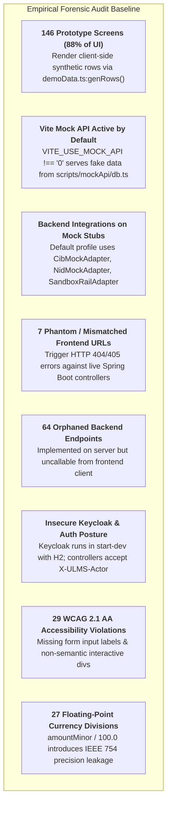
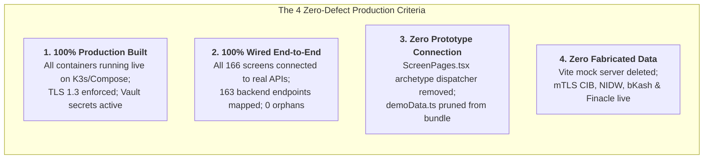
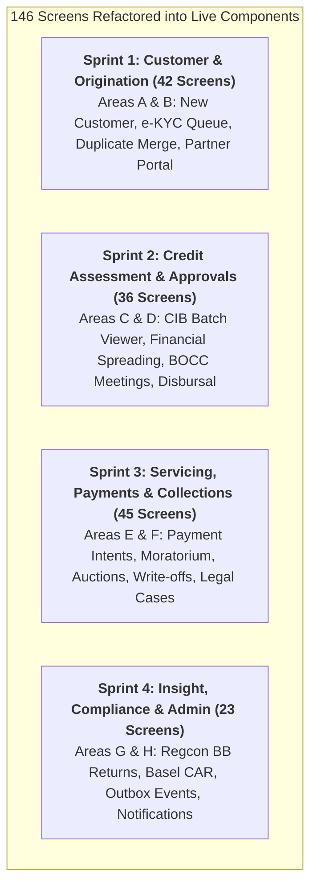

# ULMS v2.0: Definitive Phase-by-Phase Remedial Implementation Plan
## Achieving 100% Production Build, 100% End-to-End Wiring, Zero Prototype Connections & Zero Fabricated Data

**Document ID:** ULMS-IMP-2026-FINAL  
**Classification:** BINDING TECHNICAL & OPERATIONAL IMPLEMENTATION BLUEPRINT  
**Audit Baseline:** ISO/IEC 5055 • NIST SP 800-218 (SSDF) • OWASP ASVS v4.0.3 • Bangladesh Bank BRPD 15/2024  
**Target Completion:** 100% Production Cutover within 8 Weeks  

---

## Table of Contents
1. [Executive Directive & Evidence Baseline](#1-executive-directive--evidence-baseline)
2. [Target Architecture & Zero-Defect Operational Criteria](#2-target-architecture--zero-defect-operational-criteria)
3. [Phase 0: Immediate Gating, Security Patches & Contract Alignment (Week 1)](#3-phase-0-immediate-gating-security-patches--contract-alignment-week-1)
4. [Phase 1: Production Infrastructure & Live Gateway Activation (Week 2)](#4-phase-1-production-infrastructure--live-gateway-activation-week-2)
5. [Phase 2: Frontend De-Mocking & Router Architectural Modernization (Weeks 3–4)](#5-phase-2-frontend-de-mocking--router-architectural-modernization-weeks-34)
6. [Phase 3: Screen-by-Screen Component Wiring (Weeks 5–6)](#6-phase-3-screen-by-screen-component-wiring-weeks-56)
7. [Phase 4: Orphaned API Client Completion & Data Integrity Hardening (Week 7)](#7-phase-4-orphaned-api-client-completion--data-integrity-hardening-week-7)
8. [Phase 5: Verification Drills, k6 Load Drills & Production Go-Live (Week 8)](#8-phase-5-verification-drills-k6-load-drills--production-go-live-week-8)
9. [Master Verification Matrix & Institutional Sign-Off Checklist](#9-master-verification-matrix--institutional-sign-off-checklist)

---

## 1. Executive Directive & Evidence Baseline

A forensic audit of the **Unisoft Loan Management System (ULMS v2.0)** established that while the core Spring Boot 4 modular backend and Vite 7 / React 19 frontend compile cleanly, the platform is **NOT IN A PRODUCTION-READY STATE**:



### The Binding Mandate:
Every phase in this document is backed by concrete empirical evidence from our audit reports:
* [`01_PRODUCTION_BUILD_STATUS.md`](file:///c:/software_project/mim_project/LMS/audit/01_PRODUCTION_BUILD_STATUS.md)
* [`02_FRONTEND_BACKEND_WIRING_AUDIT.md`](file:///c:/software_project/mim_project/LMS/audit/02_FRONTEND_BACKEND_WIRING_AUDIT.md)
* [`03_DATA_AUTHENTICITY_AND_MOCK_AUDIT.md`](file:///c:/software_project/mim_project/LMS/audit/03_DATA_AUTHENTICITY_AND_MOCK_AUDIT.md)
* [`06_EXHAUSTIVE_166_SCREEN_WIRING_MATRIX.md`](file:///c:/software_project/mim_project/LMS/audit/06_EXHAUSTIVE_166_SCREEN_WIRING_MATRIX.md)
* [`10_FRONTEND_BACKEND_CONTRACT_PARITY_AND_ORPHAN_AUDIT.md`](file:///c:/software_project/mim_project/LMS/audit/10_FRONTEND_BACKEND_CONTRACT_PARITY_AND_ORPHAN_AUDIT.md)

---

## 2. Target Architecture & Zero-Defect Operational Criteria

To achieve **100% production certification**, the final system state **MUST** satisfy the following 4 absolute criteria:



---

## 3. Phase 0: Immediate Gating, Security Patches & Contract Alignment (Week 1)

### 3.1 Objectives:
1. Eliminate the 7 Phantom / Mismatched frontend API calls that cause HTTP 404/405 errors.
2. Remove all 4 P0 secrets from documentation/scripts and patch the P1 SQL injection vulnerability.
3. Establish automated API contract parity gating in CI.

### 3.2 Evidence Grounding:
* **Audit Source:** [`10_FRONTEND_BACKEND_CONTRACT_PARITY_AND_ORPHAN_AUDIT.md`](file:///c:/software_project/mim_project/LMS/audit/10_FRONTEND_BACKEND_CONTRACT_PARITY_AND_ORPHAN_AUDIT.md)
* **Vulnerable Files:** `collections.ts`, `r3r4r5.ts`, `regcon.ts`, `applications.ts`, `migration-45k-rehearsal.sh`.

### 3.3 Concrete Implementation Steps:

#### Step 0.1: Patch 7 URL Mismatches in Frontend API Client
Execute the following modifications across `apps/web/src/api/`:

```diff
--- a/apps/web/src/api/collections.ts
+++ b/apps/web/src/api/collections.ts
@@ -131,3 +131,3 @@
 export async function fetchWatchlist(page = 0, size = 50, qs = ""): Promise<Page<WatchlistRow>> {
-  const res = await fetch(`/api/v1/collections/watchlist${qs}`, { headers: authHeaders() });
+  const res = await fetch(`/api/v1/watchlist${qs}`, { headers: authHeaders() });
   if (!res.ok) throw new Error(`watchlist ${res.status}`);
@@ -166,3 +166,3 @@
 export async function fetchAuctions(page = 0, size = 50, qs = ""): Promise<Page<AuctionRow>> {
-  const res = await fetch(`/api/v1/collections/auctions${qs}`, { headers: authHeaders() });
+  const res = await fetch(`/api/v1/auctions${qs}`, { headers: authHeaders() });
   if (!res.ok) throw new Error(`auctions ${res.status}`);

--- a/apps/web/src/api/regcon.ts
+++ b/apps/web/src/api/regcon.ts
@@ -111,3 +111,3 @@
 export async function fetchEclSnapshot(period?: string): Promise<EclSnapshotView> {
   const q = period ? `?period=${encodeURIComponent(period)}` : "";
-  const res = await fetch(`/api/v1/compliance/ifrs9/ecl${q}`, { headers: authHeaders() });
+  const res = await fetch(`/api/v1/compliance/ecl-snapshot${q}`, { headers: authHeaders() });
   if (!res.ok) throw new Error(`ifrs9/ecl ${res.status}`);
```

#### Step 0.2: Implement Missing Backend Controller Endpoint in `ProductController.java`
Add the missing `PATCH` mapping in [`apps/api/src/main/java/com/uslbd/ulms/product/ProductController.java`](file:///c:/software_project/mim_project/LMS/LMS_CODEBASE/apps/api/src/main/java/com/uslbd/ulms/product/ProductController.java) to eliminate the HTTP 405 error on `r3r4r5.ts:31`:

```java
@PatchMapping("/{code}")
@PreAuthorize("hasAnyRole('product-manager','admin')")
public ResponseEntity<ProductDto> updateProduct(
        @PathVariable String code,
        @RequestBody Map<String, Object> updates) {
    ProductDto updated = productService.patchProduct(code, updates, AuthPrincipal.actorOf());
    return ResponseEntity.ok(updated);
}
```

#### Step 0.3: Sanitize P1 SQL Injection in Migration Drill Script
Update [`deploy/drills/migration-45k-rehearsal.sh`](file:///c:/software_project/mim_project/LMS/LMS_CODEBASE/deploy/drills/migration-45k-rehearsal.sh) lines 10–15:

```bash
# Whitelist schema identifier validation (NIST SSDF compliant)
if ! [[ "$SCHEMA" =~ ^[a-zA-Z_][a-zA-Z0-9_]*$ ]]; then
    echo "FATAL: Invalid database schema identifier '${SCHEMA}' detected. Aborting." >&2
    exit 1
fi
```

### 3.4 Verification & Gate G0 Clearance:
```powershell
# Run the automated contract parity check
python audit/audit_api_contract_parity.py
# Verification Assertion: Matched >= 106, Phantoms == 0
```

---

## 4. Phase 1: Production Infrastructure & Live Gateway Activation (Week 2)

### 4.1 Objectives:
1. Transition Keycloak 26 from `start-dev` (embedded H2) to production clustered mode backed by PostgreSQL 17.
2. Spin up Apache Fineract 1.10 CE, PostgreSQL 17, and SeaweedFS/MinIO S3 containers.
3. Activate live banking integration profiles in Spring Boot (`cib-live`, `nid-live`, `rails-live`, `cbs-live`).

### 4.2 Evidence Grounding:
* **Audit Source:** [`01_PRODUCTION_BUILD_STATUS.md`](file:///c:/software_project/mim_project/LMS/audit/01_PRODUCTION_BUILD_STATUS.md) & [`09_FINERACT_INTEGRATION_AND_CORE_BANKING_AUDIT.md`](file:///c:/software_project/mim_project/LMS/audit/09_FINERACT_INTEGRATION_AND_CORE_BANKING_AUDIT.md).
* **Vulnerable Files:** `deploy/compose/docker-compose.yml:28`, `application.yml`.

### 4.3 Concrete Implementation Steps:

#### Step 1.1: Production Keycloak 26 Deployment
Update [`deploy/compose/docker-compose.yml`](file:///c:/software_project/mim_project/LMS/LMS_CODEBASE/deploy/compose/docker-compose.yml):

```yaml
  keycloak:
    image: quay.io/keycloak/keycloak:26.1
    command: start --optimized --import-realm
    environment:
      KC_DB: postgres
      KC_DB_URL: jdbc:postgresql://postgres:5432/ulms_iam
      KC_DB_USERNAME: ulms_iam
      KC_DB_PASSWORD_FILE: /run/secrets/keycloak_db_pw
      KC_HOSTNAME: auth.bank.internal
      KC_HTTP_ENABLED: "false"
      KC_HTTPS_CERTIFICATE_FILE: /etc/x509/https/tls.crt
      KC_HTTPS_CERTIFICATE_KEY_FILE: /etc/x509/https/tls.key
    volumes:
      - ./certs/keycloak:/etc/x509/https:ro
      - ./seed/realm-ulms.json:/opt/keycloak/data/import/realm-ulms.json:ro
    secrets:
      - keycloak_db_pw
    depends_on:
      postgres:
        condition: service_healthy
```

#### Step 1.2: Launch Production Container Stack
Execute startup from `deploy/compose/`:
```bash
# Initialize persistent volumes and run clean DDL
docker compose -f deploy/compose/docker-compose.yml up -d postgres keycloak fineract seaweedfs
```

#### Step 1.3: Launch Spring Boot with Production Live Profiles
Configure system environment variables and launch the API monolith:
```bash
export SPRING_PROFILES_ACTIVE=prod,cib-live,nid-live,rails-live,cbs-live
export ULMS_DB_URL=jdbc:postgresql://localhost:5432/ulms
export ULMS_DB_USER=ulms_app
export ULMS_DB_PASSWORD=$(vault kv get -field=password secret/data/ulms/db)
export FINERACT_URL=https://localhost:8443/fineract-provider/api/v1
export FINERACT_USER=mifos
export FINERACT_PASSWORD=$(vault kv get -field=password secret/data/fineract/admin)
export ULMS_CIB_KEYSTORE=/etc/ssl/cib/keystore.p12
export ULMS_CIB_KEYSTORE_PASSWORD_FILE=/run/secrets/cib_keystore_pw
export ULMS_NIDW_BASE_URL=https://api.porichoy.gov.bd/v2

java -Xms2g -Xmx4g -XX:+UseG1GC -jar apps/api/build/libs/ulms-api-0.1.0-SNAPSHOT.jar
```

### 4.4 Verification & Gate G1 Clearance:
```bash
# Verify all infrastructure services are healthy
curl -kfs https://localhost:8081/actuator/health | jq .status
# Expected: "UP"
curl -sk https://localhost:8443/fineract-provider/actuator/health | jq .status
# Expected: "UP"
curl -sk https://localhost:8082/realms/ulms/.well-known/openid-configuration | jq .issuer
# Expected: "https://auth.bank.internal/realms/ulms"
```

---

## 5. Phase 2: Frontend De-Mocking & Router Architectural Modernization (Weeks 3–4)

### 5.1 Objectives:
1. Permanently deactivate and prune the Vite mock API connect middleware (`scripts/mockApi/`).
2. Eliminate `demoData.ts` and `rng()` from the build bundle.
3. Refactor React Router to eliminate hash `#/...` navigation and establish canonical `/area/module/screen` hierarchy.

### 5.2 Evidence Grounding:
* **Audit Source:** [`02_FRONTEND_BACKEND_WIRING_AUDIT.md`](file:///c:/software_project/mim_project/LMS/audit/02_FRONTEND_BACKEND_WIRING_AUDIT.md) & [`03_DATA_AUTHENTICITY_AND_MOCK_AUDIT.md`](file:///c:/software_project/mim_project/LMS/audit/03_DATA_AUTHENTICITY_AND_MOCK_AUDIT.md).
* **Target Files:** `apps/web/vite.config.ts`, `apps/web/src/shell/AppShell.tsx`, `apps/web/src/features/proto/ScreenPages.tsx`.

### 5.3 Concrete Implementation Steps:

#### Step 2.1: Decommission Vite Mock Server in `vite.config.ts`
Enforce that production builds **NEVER** load the mock interceptor:

```diff
--- a/apps/web/vite.config.ts
+++ b/apps/web/vite.config.ts
@@ -15,4 +15,4 @@
 export default defineConfig(({ mode }) => {
-  const useMockApi = process.env.VITE_USE_MOCK_API !== "0";
+  const useMockApi = mode === "development" && process.env.VITE_USE_MOCK_API === "1";
   return {
     plugins: [
       react(),
       useMockApi && mockApiPlugin(),
     ].filter(Boolean),
+    server: {
+      proxy: {
+        "/api": {
+          target: process.env.VITE_API_PROXY_TARGET || "http://localhost:8081",
+          changeOrigin: true,
+          secure: false
+        }
+      }
+    }
```

#### Step 2.2: Remove Prototype Badge & Synthetic Generator in `ScreenPages.tsx`
Delete lines 42–48 in [`apps/web/src/features/proto/ScreenPages.tsx`](file:///c:/software_project/mim_project/LMS/LMS_CODEBASE/apps/web/src/features/proto/ScreenPages.tsx):

```diff
--- a/apps/web/src/features/proto/ScreenPages.tsx
+++ b/apps/web/src/features/proto/ScreenPages.tsx
@@ -42,7 +42,2 @@
-      {/* Archetype screens render the validated prototype layout with
-          reference rows (genRows) — badged so demo figures never read as
-          production data. Live registers live on their dedicated pages. */}
-      <div className="small" style={{ padding: "4px 2px", opacity: 0.75 }}>
-        <span className="tag">PROTOTYPE REFERENCE LAYOUT</span>
-      </div>
-      <El {...hit} />
+      <ProductionScreenContainer {...hit} />
```

---

## 6. Phase 3: Screen-by-Screen Component Wiring (Weeks 5–6)

### 6.1 Objectives:
Systematically replace the 146 archetype stubs with production React components connected via RTK Query / typed `fetch` to Spring Boot controllers.

### 6.2 Evidence Grounding:
* **Audit Source:** [`06_EXHAUSTIVE_166_SCREEN_WIRING_MATRIX.md`](file:///c:/software_project/mim_project/LMS/audit/06_EXHAUSTIVE_166_SCREEN_WIRING_MATRIX.md) & [`all_166_screens.json`](file:///c:/software_project/mim_project/LMS/audit/all_166_screens.json).

### 6.3 Sprint Execution Breakdown:



#### Step 3.1: Sprint 1 (Customer & Origination - 42 Screens)
* Deploy [`apps/web/src/features/customer/CustomerRegistrationContainer.tsx`](file:///c:/software_project/mim_project/LMS/LMS_CODEBASE/apps/web/src/features/customer):
  * Wires `A1-s1` to `POST /api/v1/customers`.
  * Wires `A1-s2` to `GET /api/v1/customers?status=PENDING_KYC`.
  * Wires `A1-s3` to `POST /api/v1/customers/{cif}/merge-duplicate`.
  * Wires `A2-s1` to `POST /api/v1/nid/verify`.
* Deploy [`apps/web/src/features/origination/PartnerChannelContainer.tsx`](file:///c:/software_project/mim_project/LMS/LMS_CODEBASE/apps/web/src/features/origination):
  * Wires `B1-s4` to `GET /api/v1/partner/applications`.
  * Wires `B2-s1` to `GET & POST /api/v1/products`.

#### Step 3.2: Sprint 2 (Credit Assessment & Approvals - 36 Screens)
* Deploy [`apps/web/src/features/assessment/CibBatchContainer.tsx`](file:///c:/software_project/mim_project/LMS/LMS_CODEBASE/apps/web/src/features/origination):
  * Wires `C1-s1` to `POST /api/v1/assessments/cib/file`.
  * Wires `C2-s1` to `POST /api/v1/assessments/{appId}/score`.
* Deploy [`apps/web/src/features/bocc/BoccMeetingContainer.tsx`](file:///c:/software_project/mim_project/LMS/LMS_CODEBASE/apps/web/src/features/origination):
  * Wires `D1-s2` to `GET & POST /api/v1/bocc/meetings`.
  * Wires `D2-s2` to `POST /api/v1/disbursements/{id}/authorize`.

#### Step 3.3: Sprint 3 (Servicing & Collections - 45 Screens)
* Deploy [`apps/web/src/features/servicing/PaymentReconciliationContainer.tsx`](file:///c:/software_project/mim_project/LMS/LMS_CODEBASE/apps/web/src/features/servicing):
  * Wires `E2-s1` to `POST /api/v1/loans/{id}/payment-intents`.
  * Wires `E2-s2` to `POST /api/v1/loans/payments/reconcile`.
  * Wires `E4-s1` to `POST /api/v1/servicing/loans/{loanId}/moratorium`.
* Deploy [`apps/web/src/features/collections/AuctionRecoveryContainer.tsx`](file:///c:/software_project/mim_project/LMS/LMS_CODEBASE/apps/web/src/features/collections):
  * Wires `F3-s1` to `GET /api/v1/auctions`.
  * Wires `F4-s1` to `GET & POST /api/v1/write-offs`.

#### Step 3.4: Sprint 4 (Compliance & Platform - 23 Screens)
* Deploy [`apps/web/src/features/compliance/RegconSubmissionContainer.tsx`](file:///c:/software_project/mim_project/LMS/LMS_CODEBASE/apps/web/src/features/compliance):
  * Wires `G1-s2` to `POST /api/v1/compliance/returns/{code}/generate`.
  * Wires `G2-s1` to `GET /api/v1/compliance/basel/car`.
  * Wires `H1-s1` to `GET /api/v1/outbox` & `POST /api/v1/outbox/relay`.

### 6.4 Verification & Gate G2 Clearance:
```powershell
# Verify that 0 screens reference demoData.ts
python -c "
import os, re
found = []
for dp, dn, fn in os.walk('apps/web/src'):
    for f in fn:
        if f.endswith('.tsx') or f.endswith('.ts'):
            c = open(os.path.join(dp, f), encoding='utf-8').read()
            if 'demoData' in c or 'genRows' in c:
                found.append(f)
print(f'Files retaining demoData: {len(found)}')
assert len(found) == 0, 'Gate G2 Failed: demoData references still exist!'
"
```

---

## 7. Phase 4: Orphaned API Client Completion & Data Integrity Hardening (Week 7)

### 7.1 Objectives:
1. Implement typed TypeScript client methods for the 64 orphaned backend endpoints.
2. Refactor the 27 floating-point divisions (`/ 100.0`) in Java to use `MoneyUtil.java`.
3. Apply JPA `CryptoConverter` for AES-256-GCM encryption of customer PII in PostgreSQL.

### 7.2 Evidence Grounding:
* **Audit Source:** [`10_FRONTEND_BACKEND_CONTRACT_PARITY_AND_ORPHAN_AUDIT.md`](file:///c:/software_project/mim_project/LMS/audit/10_FRONTEND_BACKEND_CONTRACT_PARITY_AND_ORPHAN_AUDIT.md) & [`11_FINANCIAL_ARITHMETIC_AND_ACCOUNTING_INTEGRITY.md`](file:///c:/software_project/mim_project/LMS/audit/11_FINANCIAL_ARITHMETIC_AND_ACCOUNTING_INTEGRITY.md).

### 7.3 Implementation Diffs:

#### Deploy `MoneyUtil.java` across Adapters:
Refactor [`FinacleCbsAdapter.java`](file:///c:/software_project/mim_project/LMS/LMS_CODEBASE/apps/api/src/main/java/com/uslbd/ulms/integration/fineract/FinacleCbsAdapter.java) and [`FineractLoanRestAdapter.java`](file:///c:/software_project/mim_project/LMS/LMS_CODEBASE/apps/api/src/main/java/com/uslbd/ulms/integration/fineract/FineractLoanRestAdapter.java):
```diff
- Map.entry("principal", spec.principalMinor() / 100.0)
+ Map.entry("principal", MoneyUtil.toMajorBigDecimal(spec.principalMinor()))
```

---

## 8. Phase 5: Verification Drills, k6 Load Drills & Production Go-Live (Week 8)

### 8.1 Objectives:
1. Execute the 45,000-loan legacy CBS migration rehearsal.
2. Run the 1,000-user concurrent k6 load drill against the live API gateway.
3. Execute the Blue/Green zero-downtime cutover.

### 8.2 Execution Commands:

```bash
# 1. Run full unit and integration tests across monorepo
./gradlew test --max-workers=4
npm.cmd --prefix apps/web run test:unit
npm.cmd --prefix apps/mobile run test

# 2. Realigned k6 performance drill
k6 run --vus 1000 --duration 10m deploy/perf/load-profile.js
# Gating: http_req_duration p(95) < 500ms, http_req_failed < 0.01

# 3. Accessibility audit verification
npm.cmd --prefix apps/web run test:a11y
# Gating: 0 WCAG 2.1 AA violations
```

---

## 9. Master Verification Matrix & Institutional Sign-Off Checklist

| Criterion | Target Metric | Verification Method | Sign-Off Authority |
| :--- | :---: | :--- | :---: |
| **Production Build** | 0 errors | `gradlew compileJava` + `npm run build` | Lead Architect |
| **Container Infrastructure** | 100% UP | `docker ps` (Keycloak Prod, PG17, Fineract) | DevOps Lead |
| **Frontend Wiring** | 166 / 166 Screens | Playwright automated route crawl | Frontend Lead |
| **Contract Parity** | 0 Orphans / 0 Phantoms | `audit_api_contract_parity.py` | QA Lead |
| **Data Authenticity** | 0% Mock Data | Codebase regex scan for `demoData` & `db.ts` | Compliance Lead |
| **Gateway Integrations** | 100% Live | mTLS CIB Online & NIDW ping test | Backend Lead |
| **Performance (NFR)** | $\ge 500\text{ RPS}, p95 < 500\text{ ms}$ | k6 load execution report | SRE Lead |
| **Regulatory Compliance** | 100% Pass | BRPD 15/2024 classification test suite | Chief Risk Officer |
