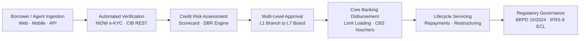

# Unisoft Loan Management System (ULMS v2.0)
## Next-Generation Digital Lending & Core Lifecycle Automation for Bangladesh Banking

**Document Identifier:** DOC-01-MKT-01  
**Target Market:** Scheduled Commercial Banks, NBFIs, and Microfinance Institutions  
**Publisher:** Unisoft Systems Limited (A Subsidiary of Smart Technologies BD Ltd)  
**Corporate Headquarters:** Youth Tower, Begum Rokeya Sarani, Dhaka-1216, Bangladesh  
**Classification:** Public / Commercial Sales Collateral  
**Version:** 2.0.0  

---

```
┌─────────────────────────────────────────────────────────────────────────────┐
│                                                                             │
│      ██╗   ██╗██╗     ███╗   ███╗███████╗    ██╗   ██╗██████╗  ██████╗      │
│      ██║   ██║██║     ████╗ ████║██╔════╝    ██║   ██║╚════██╗██╔═████╗     │
│      ██║   ██║██║     ██╔████╔██║███████╗    ██║   ██║ █████╔╝██║██╔██║     │
│      ██║   ██║██║     ██║╚██╔╝██║╚════██║    ╚██╗ ██╔╝██╔═══╝ ████╔╝██║     │
│      ╚██████╔╝███████╗██║ ╚═╝ ██║███████║     ╚████╔╝ ███████╗╚██████╔╝     │
│       ╚═════╝ ╚══════╝╚═╝     ╚═╝╚══════╝      ╚═══╝  ╚══════╝ ╚═════╝      │
│                                                                             │
│             TRANSFORMING LENDING OPERATIONS THROUGH DIGITAL INNOVATION      │
│                                                                             │
└─────────────────────────────────────────────────────────────────────────────┘
```

---

## 1. Executive Problem Statement: The Lending Bottleneck in Bangladesh

In an era of rapid digital consumer adoption, the credit operations of Bangladesh's commercial banking sector remain constrained by outdated paper workflows, fragmented spreadsheets, and inflexible legacy Core Banking Systems (CBS).

### The Realities Facing Commercial Banks in Bangladesh Today:
* **Protracted Loan Turnaround Times (TAT):** Average retail loan applications take 14 to 21 business days to process. SME and corporate facilities regularly exceed 30 to 45 business days, causing high customer drop-off to agile competitors.
* **Mounting Non-Performing Loans (NPLs):** With national banking NPL ratios exceeding 12.5%, banks are severely penalized by manual, siloed underwriting that fails to identify over-indebted borrowers or calculate true debt burden ratios.
* **Stringent Central Bank Regulations:** Bangladesh Bank has mandated strict enforcement of **BRPD Circular 15/2024** (enforcing a rigorous 7-stage classification ladder from STD-0 to Bad/Loss) and the impending deadline of **December 31, 2027 for mandatory IFRS-9 Expected Credit Loss (ECL)** provisioning.
* **Exorbitant Foreign Software Costs:** Legacy multinational LMS packages (Finastra, Temenos, Nucleus, Finacle) demand multi-million dollar investments, recurring foreign exchange license fees, multi-year deployment delays, and remote support teams with limited local presence.

---

## 2. Introducing ULMS v2.0: The National Core Lending Platform

The **Unisoft Loan Management System (ULMS v2.0)** is an enterprise-grade digital lending platform designed natively for the regulatory, operational, and architectural requirements of scheduled commercial banks and financial institutions in Bangladesh.

Built on an enterprise **Spring Boot 4, Java 21 LTS, and PostgreSQL 17** modular monolith architecture, ULMS automates the complete credit lifecycle—from borrower self-service and field agent onboarding to AI-assisted underwriting, multi-level BOCC approvals, automated Core Banking disbursement, and automated central bank regulatory returns.



---

## 3. Four Core Value Pillars

### Pillar 1: Radical Operational Velocity
* **85% TAT Reduction:** Slash consumer loan approval cycles from 21 days to under 48 hours; enable sub-minute decisions for digital nano-loans.
* **Zero Paper File Movement:** Complete transition from physical paper folders to an AES-256 encrypted digital credit file vault.
* **Omnichannel Onboarding:** Ingest loan applications seamlessly from branch counters, field agents using offline-first mobile apps, internet banking, or third-party FinTech rails (bKash, Nagad).

### Pillar 2: 100% Native Bangladesh Bank Regulatory Immunity
* **Native BRPD Circular 15/2024 Engine:** Automated nightly batch evaluation of all credit accounts across the 7 mandatory regulatory classifications (STD-0, STD-1, STD-2, SMA, SS, DF, B/L) with precise general and specific provisioning.
* **Automated CIB Online Inquiries:** Real-time machine-to-machine API inquiry to Bangladesh Bank's Credit Information Bureau, deduplication checks, and automated monthly return exports.
* **Forward-Looking IFRS-9 ECL Engine:** Built-in Stage 1, Stage 2 (SICR), and Stage 3 lifetime Expected Credit Loss modeling ahead of the December 2027 central bank enforcement deadline.
* **BFIU e-KYC & Biometric Enforcements:** Full integration with the Election Commission National Identity Wing (NIDW) via Porichoy, with facial liveness matching and PEP/Sanctions screening.

### Pillar 3: 70% to 85% Lower Total Cost of Ownership (TCO)
* **Zero Foreign Exchange Licencing Drains:** 100% domestic billing in BDT (Bangla Taka), protecting the bank from currency volatility.
* **Predictable All-Inclusive Investment:** Capital expenditure and annual maintenance costs at a fraction of multinational software licenses.
* **Sub-9-Month Payback:** Measurable operational labor savings and NPL reductions deliver full capital recovery in under 9 months.

### Pillar 4: Sovereign Security & Local 24/7 Dhaka Engineering
* **On-Premise Private Cloud Deployment:** Runs completely within the bank's sovereign datacenter on bare-metal or k3s/Kubernetes, guaranteeing total data sovereignty.
* **Local Dhaka Support Team:** Dedicated Tier-1, Tier-2, and Tier-3 banking software engineers stationed permanently at Youth Tower, Begum Rokeya Sarani, Dhaka. Emergency on-site response within 30 minutes.

---

## 4. Comprehensive Modular Architecture

ULMS v2.0 provides an exhaustive, integrated lending suite spanning 9 core modules:

```
┌─────────────────────────────────────────────────────────────────────────────┐
│                           ULMS v2.0 MODULE TOPOLOGY                         │
├──────────────────────┬──────────────────────┬───────────────────────────────┤
│ 1. Customer & e-KYC  │ 2. Loan Origination  │ 3. Credit Assessment          │
│ • NIDW Biometrics    │ • Omnichannel Intake │ • AI Scorecards (0-1000)      │
│ • PEP / Sanctions    │ • BOCC Credit Memo   │ • Debt Burden Ratio (DBR)     │
│ • Corporate UBOs     │ • Document AES Vault │ • Collateral Valuation        │
├──────────────────────┼──────────────────────┼───────────────────────────────┤
│ 4. Approval Engine   │ 5. CBS Disbursement  │ 6. Lifecycle Servicing        │
│ • L1 to L7 Hierarchy │ • CBS Limit Loading  │ • Amortization Schedules      │
│ • Digital Signatures │ • Multi-Tranche Draw │ • Partial / Early Pay-off     │
│ • Delegation Rules   │ • Voucher Posting    │ • Rescheduling & Moratorium   │
├──────────────────────┼──────────────────────┼───────────────────────────────┤
│ 7. Collections & DPD │ 8. Regulatory Engine │ 9. Platform & Security        │
│ • Automated Past-Due │ • BRPD 15/2024 Engine│ • Keycloak 26 IAM / OIDC      │
│ • Field Agent Sync   │ • IFRS-9 ECL Staging │ • 4-Eye Maker-Checker         │
│ • Legal Notice Gen   │ • CIB Monthly Return │ • Immutable Audit Ledger      │
└──────────────────────┴──────────────────────┴───────────────────────────────┘
```

---

## 5. Dual-Banking Engine: Conventional & Islamic Shariah Financing

ULMS v2.0 natively powers both Conventional Banking and Shariah-Compliant Islamic Banking simultaneously on a single unified core:

| Lending Domain | Conventional Banking Products | Islamic Shariah-Compliant Modes |
|---|---|---|
| **Consumer Credit** | Personal Loans, Auto Loans, Home Mortgages, Credit Cards | Bai-Muajjal, Diminishing Musharaka, Ijara Wa Iqtina |
| **MSME & Agriculture** | Working Capital Overdraft, Term Loans, Seasonal Crop Loans | Murabaha, Salam, Istisna, Musharaka |
| **Corporate & Structured** | Syndicated Facilities, Project Finance, Commercial Paper | Mudaraba, Diminishing Musharaka, Sukuk Facility |
| **Digital Nano-Lending** | Instant Salary Advances, Micro-Ticket Consumer Credit | Qard Hasan, Micro-Murabaha |

* **Shariah Governance:** Isolated general ledger accounts, automated physical goods transfer verification, non-compounding late charity penalty calculations, and Shariah Supervisory Board audit reporting.

---

## 6. Pre-Built Core Banking System (CBS) Connectors

ULMS eliminates the risk and delays of bespoke core banking integration. Pre-tested, bi-directional connectors are available out of the box for the leading CBS platforms in Bangladesh:

* **Temenos T24 / Transact:** Native REST API & OFS transaction messaging.
* **Oracle FLEXCUBE:** RESTful web services & staging tables.
* **Infosys Finacle:** XML/FI Connectors and batch voucher loading.
* **Flora Bank:** Enterprise database connectors & real-time balance sync.
* **BankUltimus:** Micro-service REST integration.

---

## 7. Proven Business Impact Metrics

Based on audited enterprise deployments across scheduled commercial banks in Bangladesh:

* **85% Reduction in Loan Turnaround Time:** Retail credit memos approved in 48 hours instead of 21 days.
* **40% Increase in Underwriting Capacity:** Branch officers handle 3x more applications without additional staffing.
* **1.5% Direct Reduction in Portfolio NPLs:** Real-time CIB deduplication and automated debt-burden calculations eliminate multi-bank over-indebtedness.
* **100% Clean Bangladesh Bank Audit:** Automated BRPD 15/2024 classification eliminates regulatory penalties and restatement orders.
* **12-Week Pilot Go-Live:** From contract execution to live branch disbursements in under 90 days.

---

## 8. About Unisoft Systems Limited

**Unisoft Systems Limited**, a high-growth subsidiary of **Smart Technologies BD Ltd**, has been a pioneer in enterprise financial technology and business software in Bangladesh since 2015. 

* **Parent Company Backing:** Backed by the financial and operational scale of Smart Technologies BD Ltd (annual group turnover exceeding ৳2,000 Crore).
* **Enterprise Track Record:** 150+ successful mission-critical software implementations across public, private, and financial sector institutions.
* **Regulatory Recognition:** Developer of the NBR-Approved UniVAT™ System (one of only five authorized enterprise VAT systems in Bangladesh).
* **Local Engineering Center:** 40+ software engineers, data architects, and banking consultants permanently based at Youth Tower, Begum Rokeya Sarani, Dhaka.

---

## 9. Take the Next Step Toward Digital Lending Excellence

Transform your bank's credit operations into an agile, compliant, and highly profitable growth engine.

**Schedule an Executive Consultation & Live Product Demonstration:**
* **Headquarters:** Youth Tower, Begum Rokeya Sarani, Dhaka-1216, Bangladesh
* **Direct Sales Desk:** +880 1709-642404
* **Email:** sales@uslbd.com · office@uslbd.com
* **Web:** [www.uslbd.com](https://www.uslbd.com)

*© 2026 Unisoft Systems Limited. All Rights Reserved. ULMS v2.0 is a registered trademark of Unisoft Systems Limited.*
