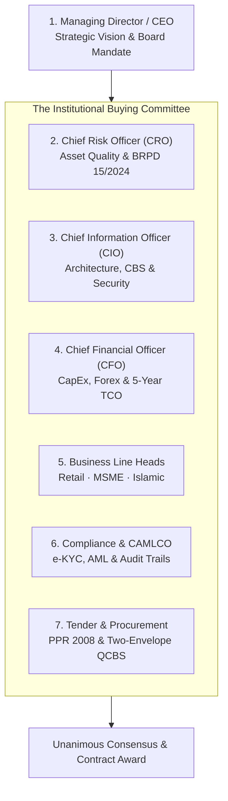

# Enterprise Buyer Persona & Buying Committee Decision Matrix
## Navigating Multi-Stakeholder Consensuses in Bangladesh Commercial Banks

**Document Identifier:** DOC-08-SALES-02  
**Target Sales Stage:** Discovery, Account Mapping & Pitch Customization  
**Author:** Head of Business Development & Lead Solutions Consultant  
**Publisher:** Unisoft Systems Limited (A Subsidiary of Smart Technologies BD Ltd)  
**Classification:** Internal Commercial Strategy Asset  
**Version:** 2.0.0  

---

## 1. Overview of the Bank Buying Committee Dynamics

Selling core lending software to a scheduled commercial bank in Bangladesh is a **multi-stakeholder consensus sale**. Bank procurement is inherently risk-averse, hierarchical, and bureaucratic. A single unaddressed concern from a gatekeeper—such as the Chief Risk Officer on BRPD 15/2024 compliance, or the CISO on data residency—will derail a multi-crore deal even if the Managing Director favors the project.

To achieve deal velocity, Unisoft sales representatives must engage every stakeholder simultaneously with tailored value propositions, directly addressing their fears and supplying them with the exact data needed to approve the procurement.

---

## 2. Exhaustive Persona Profiles & Strategic Plays

---

### PERSONA 1: The Managing Director / Chief Executive Officer (MD/CEO)
* **Institutional Role:** Supreme executive authority; answers to the Board of Directors and central bank regulators.
* **Core Personality:** Strategic, legacy-conscious, driven by market reputation, profitability, and risk containment.
* **Key Performance Indicators (KPIs):**
  * Return on Equity (ROE) and Return on Assets (ROA)
  * Net Interest Margin (NIM) and Cost-to-Income Ratio
  * Headline Gross NPL Ratio (<5% target)
  * Bank Industry Ranking & Market Share Growth
* **Greatest Fears & Anxieties:**
  * Public central bank reprimands, fines, or regulatory sanctions
  * Massive failed IT implementation making headlines in financial newspapers
  * Falling behind agile competitor banks in digital lending
* **What They Care About in ULMS:**
  * **Proof of Delivery:** Unisoft’s 10-year track record and parent company strength (Smart Technologies BD Ltd).
  * **Speed to Value:** Live pilot branches in 12 weeks instead of a 2-year quagmire.
  * **Dramatic Cost Reduction:** Freeing up tens of crores in capital compared to multinational software vendors.
* **Winning Pitch Talk-Track:**
  > *"Mr. Managing Director, while foreign software vendors ask your bank to spend $5 Million USD and wait two years to see if their software can adapt to Bangladesh Bank rules, ULMS v2.0 is already 100% compliant with BRPD Circular 15/2024 and live in Bangladesh today. We will collapse your loan turnaround time from 21 days to 48 hours and deliver full payback to your balance sheet in under 9 months."*
* **Key Collateral to Share:** `DOC-01_Product_Overview_Brochure.md`, `DOC-03_Executive_One_Pager_Why_ULMS.md`, `DOC-05_Case_Study_Tier1_Bank.md`.

---

### PERSONA 2: The Chief Risk Officer (CRO) / Head of Credit Risk
* **Institutional Role:** Guardian of credit quality; oversees Credit Risk Management (CRM), collections, and provisioning.
* **Core Personality:** Skeptical, analytical, detail-oriented, highly conservative, regulatory-focused.
* **Key Performance Indicators (KPIs):**
  * Non-Performing Loan (NPL) Volume and Provisioning Coverage Ratio
  * Portfolio Delinquency Ratios (Early DPD 1–30, 31–60)
  * 100% Compliance with Bangladesh Bank BRPD Circular 15/2024
  * Readiness for Mandatory IFRS-9 ECL Impairment (Dec 2027)
* **Greatest Fears & Anxieties:**
  * Understated credit risk leading to sudden central bank restatements and capital shortfall penalties
  * Hidden over-indebtedness due to delayed or manual CIB inquiries
  * Unaudited manual overrides by branch managers in credit committees
* **What They Care About in ULMS:**
  * **Automated 7-Stage Classification Engine:** Native BRPD 15/2024 rules running automatically every night.
  * **Real-Time CIB Online REST Gateway:** Immediate machine inquiry before any credit memo can be printed.
  * **Built-in IFRS-9 ECL Engine:** Stage 1, Stage 2 (SICR), and Stage 3 forward-looking impairment models.
  * **Strict 4-Eye Maker-Checker:** Every override is cryptographically logged with IP and user timestamp.
* **Winning Pitch Talk-Track:**
  > *"Mr. Risk Officer, ULMS v2.0 was engineered around BRPD 15/2024. The system calculates exact DPD every midnight, nets eligible collateral per Bangladesh Bank formulas, and stages accounts from STD-0 to Bad/Loss with zero manual intervention. We eliminate the human error that leads to regulatory fines, and our built-in IFRS-9 engine solves your 2027 central bank audit requirement today."*
* **Key Collateral to Share:** `DOC-35_BRPD_15_2024_Compliance_Paper.md`, `DOC-36_IFRS9_ECL_Calculation_Dossier.md`, `DOC-37_CIB_Online_Integration_Dossier.md`.

---

### PERSONA 3: The Chief Information Officer (CIO) / Chief Technology Officer (CTO)
* **Institutional Role:** Custodian of enterprise IT architecture, core banking systems, datacenter, and cybersecurity.
* **Core Personality:** Pragmatic, defensive, cautious regarding vendor promises, protective of existing core banking stability.
* **Key Performance Indicators (KPIs):**
  * System Uptime (99.9% target) and Disaster Recovery (RPO < 15 min, RTO < 2 hr)
  * Seamless Integration with Core Banking (Temenos T24, FLEXCUBE, Finacle, Flora Bank)
  * Adherence to Bangladesh Bank ICT Security Guidelines V4.0
  * Minimal infrastructure overhead and zero vendor lock-in
* **Greatest Fears & Anxieties:**
  * Software vendor going bankrupt or abandoning support
  * LMS corrupting or crashing the Core Banking System database
  * Security breaches, unauthorized data exfiltration, or failed vulnerability assessments
* **What They Care About in ULMS:**
  * **Clean, Non-Disruptive Architecture:** Spring Boot 4 modular monolith with strict boundary enforcement (ADR-001).
  * **Open Standard Tech Stack:** Java 21 LTS, React 19, PostgreSQL 17, Keycloak 26, containerized on private k3s/Kubernetes.
  * **Pre-Built CBS Connectors:** Proven REST/SOAP connectors that isolate core banking ledgers.
  * **Local Engineering Center:** 40+ software engineers permanently stationed at Youth Tower, Dhaka.
* **Winning Pitch Talk-Track:**
  > *"Mr. CIO, we do not require you to rip and replace anything. ULMS operates as a specialized digital lending layer that interfaces cleanly with your existing CBS via standard REST APIs. The platform runs entirely on-premises in your private datacenter on modern Spring Boot 4 and PostgreSQL 17, with Keycloak 26 identity and zero proprietary lock-in. And if you ever need an engineer on-site, our team is at Youth Tower, 20 minutes from your datacenter."*
* **Key Collateral to Share:** `DOC-27_Architecture_Integration_Annex.md`, `DOC-28_ICT_Security_Compliance_Annex.md`, `DOC-30_SLA_Local_Support_Framework.md`.

---

### PERSONA 4: The Chief Financial Officer (CFO) / Head of Finance
* **Institutional Role:** Gatekeeper of capital allocation, budget expenditure, taxation, and return on investment.
* **Core Personality:** Frugal, numbers-driven, skeptical of soft benefits, sensitive to foreign exchange drains.
* **Key Performance Indicators (KPIs):**
  * CapEx vs. OpEx Optimization
  * 5-Year Total Cost of Ownership (TCO)
  * Internal Rate of Return (IRR) and Net Present Value (NPV)
  * Elimination of Foreign Currency (USD) Liabilities & NBR Tax Efficiency
* **Greatest Fears & Anxieties:**
  * Uncontrollable project scope creep and ballooning change-order consulting fees
  * US Dollar currency depreciation increasing foreign software licensing bills annually
  * Purchasing expensive software licenses that end up underutilized by branch staff
* **What They Care About in ULMS:**
  * **100% Domestic BDT Billing:** Zero USD foreign exchange approvals required from Bangladesh Bank.
  * **Transparent All-Inclusive Pricing:** Milestone-based implementation and a capped 20% AMC.
  * **Audited Sub-9-Month Payback:** Tangible cost offsets through labor savings and lower provisioning charges.
  * **NBR VAT Compliance:** Unisoft is the creator of the NBR-Approved UniVAT™ system, guaranteeing full tax legitimacy.
* **Winning Pitch Talk-Track:**
  > *"Mr. CFO, every dollar you spend on a foreign LMS is subject to currency depreciation, central bank outward remittance approvals, and high withholding taxes. ULMS is billed 100% in local currency (BDT) at 80% lower cost. Over 5 years, we save your bank more than ৳18 Crore in direct IT spend while delivering full capital payback in under 9 months."*
* **Key Collateral to Share:** `DOC-24_Master_RFP_Financial_Proposal.md`, `DOC-31_Commercial_Pricing_Matrix.md`, `DOC-32_TCO_and_ROI_Calculator_Guide.md`.

---

### PERSONA 5: Head of Retail Banking / Head of SME Banking
* **Institutional Role:** P&L owners of loan asset portfolios; manage branch loan officers and sales targets.
* **Core Personality:** Commercial, aggressive, competitive, impatient with slow bureaucratic processes.
* **Key Performance Indicators (KPIs):**
  * Loan Disbursement Volume and Portfolio Growth Targets
  * Customer Turnaround Time (TAT) and Application Conversion Rate
  * Cross-Sell Ratio and Customer Satisfaction (NPS)
  * Field Officer Productivity
* **Greatest Fears & Anxieties:**
  * Losing creditworthy borrowers to competitors who approve loans faster
  * Branch officers drowning in paper credit memos instead of meeting borrowers
  * Complex software that branch staff reject in favor of offline Excel spreadsheets
* **What They Care About in ULMS:**
  * **48-Hour Loan Approval:** Slashing consumer approval times from 21 days to 48 hours.
  * **Modern, Intuitive Interface:** Dynamics 365-style responsive web portal with bilingual (Bangla/English) support.
  * **Offline Mobile Field Agent App:** Field officers can verify borrower premises, take photos, and sync offline.
  * **Automated Credit Memo Generation:** Pre-populating 90% of the BOCC memo automatically.
* **Winning Pitch Talk-Track:**
  > *"Your branch officers spend 70% of their day manually retyping salary slips and chasing paper files. ULMS automates data extraction, checks CIB in seconds, and auto-generates the complete credit memo. Your team will process 3x more loans with zero increase in branch headcount, cutting approval times to 48 hours."*
* **Key Collateral to Share:** `DOC-16_Master_Demo_Script_Role_Based.md`, `DOC-18_Solution_Brief_Retail.md`, `DOC-19_Solution_Brief_MSME_Agri.md`.

---

### PERSONA 6: Head of Islamic Banking / Shariah Board Secretary
* **Institutional Role:** Oversees Shariah-compliant financing operations across full-fledged Islamic banks and Islamic windows.
* **Core Personality:** Theologically rigorous, principled, protective of Islamic banking integrity.
* **Key Performance Indicators (KPIs):**
  * 100% Adherence to AAOIFI & Bangladesh Bank Islamic Banking Guidelines
  * Shariah Supervisory Board Audit Clearance
  * Growth in Murabaha, Ijara, and Diminishing Musharaka Financing Portfolios
  * Complete Segregation of Islamic Funds from Conventional Operations
* **Greatest Fears & Anxieties:**
  * Software using conventional interest formulas (compounding) under the hood with Islamic labels
  * Failure to demonstrate actual asset possession and title transfer during Murabaha transactions
  * Shariah Board rejecting the software during annual inspection
* **What They Care About in ULMS:**
  * **Native Islamic Architecture:** Real asset-backed workflows (vendor purchase order, delivery goods receipt, cost-plus sale contract).
  * **Isolated Islamic Ledgers:** Complete balance-sheet segregation ensuring zero contamination.
  * **Charity Fund Automation:** Non-compounding late penalty fees routed automatically to charity accounts.
* **Winning Pitch Talk-Track:**
  > *"Muhtaram, ULMS does not disguise conventional loans behind Islamic terminology. Our engine was architected from the ledger up for Murabaha, Ijara, and Diminishing Musharaka. The system enforces the physical sequence of asset purchase, possession, and deferred sale before contract execution, complete with an immutable audit log for your Shariah Supervisory Board."*
* **Key Collateral to Share:** `DOC-20_Solution_Brief_Islamic.md`.

---

### PERSONA 7: Head of Internal Control & Compliance (ICC) / Chief AML Officer (CAMLCO)
* **Institutional Role:** Oversees audit defense, fraud prevention, BFIU anti-money laundering, and operational risk.
* **Core Personality:** Highly skeptical, process-bound, rules-driven, focused on evidence and paper trails.
* **Key Performance Indicators (KPIs):**
  * Zero Audit Citations from Bangladesh Bank Inspection Teams
  * 100% Compliance with BFIU Circulars 25, 26, and 31 (e-KYC & Beneficial Ownership)
  * Timely Submission of Suspicious Transaction Reports (STRs)
* **Greatest Fears & Anxieties:**
  * Unauthorized disbursements or collusive staff fraud bypassing credit authority limits
  * Central bank fines for onboarding unverified or PEP-sanctioned individuals
  * Lost or altered digital records during external audit inspections
* **What They Care About in ULMS:**
  * **Strict 7-Level Approval Delegation Matrix:** Enforced cryptographically with digital audit signatures.
  * **Automated PEP & Sanctions Screening:** Real-time checking against UN and local proscribed lists.
  * **Immutable Audit Trail:** Every field modification, login, approval, and rejection logged with IP and timestamp.
* **Winning Pitch Talk-Track:**
  > *"ULMS provides your compliance division with an uncompromised digital audit defense. Every transaction enforces the four-eye maker-checker principle, biometric e-KYC verifies borrower authenticity with the Election Commission, and every audit log is tamper-evident. When Bangladesh Bank inspectors arrive, your team can export complete audit dossiers in two clicks."*
* **Key Collateral to Share:** `DOC-28_ICT_Security_Compliance_Annex.md`, `DOC-38_AML_eKYC_BFIU_Compliance_Paper.md`.

---

### PERSONA 8: Head of Procurement / Tender Committee Chair
* **Institutional Role:** Administers the formal RFP process under Public Procurement Rules (PPR 2008) and bank policy.
* **Core Personality:** Procedural, risk-averse, focused on vendor solvency, contract clarity, and lowest evaluated bid.
* **Key Performance Indicators (KPIs):**
  * On-Time Tender Completion with Zero Formal Vendor Disputes or Lawsuits
  * Strict Two-Envelope Separation (Technical & Financial)
  * Verified Legal and Financial Solvency of the Selected Vendor
* **Greatest Fears & Anxieties:**
  * Audit objections regarding irregular procurement procedures or favoritism
  * Awarding to a vendor that goes bankrupt or fails to deliver, forcing tender re-issuance
* **What They Care About in ULMS:**
  * **Airtight Two-Envelope Submissions:** Professionally structured bids ready for QCBS evaluation.
  * **Unassailable Corporate Standing:** Backed by Smart Technologies BD Ltd, 10 years in business, audited balance sheets, NBR tax clearance.
* **Winning Pitch Talk-Track:**
  > *"Our tender submission complies 100% with PPR 2008 two-envelope guidelines. All statutory tax clearances (TIN, BIN), audited financials for the past 3 fiscal years, and bank solvency certificates are included. As a subsidiary of Smart Technologies BD Ltd, Unisoft possesses the balance sheet and institutional longevity to guarantee complete contract execution."*
* **Key Collateral to Share:** `DOC-23_Master_RFP_Technical_Proposal.md`, `DOC-24_Master_RFP_Financial_Proposal.md`, `DOC-25_Vendor_PreQualification_EOI.md`, `DOC-26_Functional_Compliance_Matrix.md`.

---

## 3. Cross-Persona Consensus Matrix

Use this matrix to identify common alignment points and neutralize conflicting priorities across departments:

| Buying Stage | Lead Department | Supporting Departments | Primary Consensus Blocker | How ULMS Overcomes the Blocker |
|---|---|---|---|---|
| **Stage 1: Initial Discovery** | Business Lines (Retail/SME) | IT, Risk | "We don't have budget for a new system this year." | Present `DOC-03` & `DOC-32` showing that ULMS pays for itself in 8.5 months through operational savings. |
| **Stage 2: Solution Mapping** | IT (CIO/CTO) | Business, Security | "We don't want another siloed software that can't talk to our CBS." | Present `DOC-27` demonstrating out-of-the-box connectors for Temenos, FLEXCUBE, Finacle, and Flora Bank. |
| **Stage 3: Risk Clearance** | Risk (CRO) | Compliance, Legal | "Does this strictly comply with BRPD Circular 15/2024?" | Share `DOC-35` detailing the exact mathematical staging and provisioning engine embedded in the core code. |
| **Stage 4: Tender Bidding** | Procurement | Technical Evaluation Committee | "Foreign vendors have stronger global branding." | Deploy `DOC-11`–`DOC-14` battlecards and `DOC-30` showing local Dhaka 24/7 on-site engineering SLA. |
| **Stage 5: Board Approval** | MD / CEO | CFO, Board ICT Committee | "What is the downside risk if implementation stalls?" | Present `DOC-05` and `DOC-29` guaranteeing a bounded 12-week pilot with milestone-based billing. |

---

*Unisoft Systems Limited — Enterprise Sales Enablement Division.*
