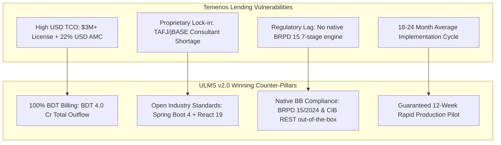

# Competitive Battlecard: ULMS v2.0 vs. Temenos LMS / Transact
## Head-to-Head Competitive Intelligence, Trap-Setting Questions & Differentiation Playbook

**Document Identifier:** DOC-12-BAT-02  
**Target Competitor:** Temenos AG (Temenos Transact / Temenos Lending Suite)  
**Author:** Lead Competitive Intelligence Architect & Head of Banking Strategy  
**Publisher:** Unisoft Systems Limited (A Subsidiary of Smart Technologies BD Ltd)  
**Classification:** Strictly Confidential — Internal Sales Team Only  

---

## 1. Executive Competitor Profile

| Parameter | Temenos Transact / Lending | Unisoft ULMS v2.0 |
|---|---|---|
| **Headquarters & Origin** | Geneva, Switzerland | Dhaka, Bangladesh (Smart Technologies Group) |
| **Bangladesh Footprint** | leading state-owned and private banks (verify current references before live use) | 150+ Enterprise Deployments, National Banking Footprint |
| **Primary Architecture** | Proprietary TAFJ/jBASE Runtime, Heavy Enterprise Monolith | Modular Monolith (Spring Boot 4, PostgreSQL 17, React 19) |
| **Average Deal Size** | $2.5M – $5.0M USD (৳30 – ৳60 Crore BDT) | BDT 4.00 Crore Turnkey (License + Impl + Training) |
| **Implementation Horizon**| 18 to 24 Months | 12 Weeks (Guaranteed Pilot Go-Live) |
| **Local Support Model** | Offshore Support Centers (India/Europe); fly-in consultants | 24/7/365 On-Site Engineering Team in Dhaka |

---

## 2. Competitor Strengths (Where Temenos Excels)
* **Established Global Brand:** Widely recognized by international rating agencies and multinational bank boards.
* **Core Banking Footprint:** Incumbent CBS in several leading Tier-1 and state-owned commercial banks in Bangladesh.
* **Broad Functional Scope:** Global treasury, multi-currency processing, and complex international trade finance.

---

## 3. Competitor Critical Vulnerabilities (Where ULMS Wins)

### 1. The Core Banking Coupling Trap:
* **The Reality:** Temenos strongly pushes banks to adopt its full Transact stack. Deploying Temenos Lending as a standalone LMS alongside a non-Temenos CBS (e.g., Finacle or Misys) is notoriously complex, brittle, and expensive.
* **The Pitch:** *"ULMS v2.0 is CBS-agnostic. Whether your bank runs Temenos, Finacle, or an in-house CBS, ULMS integrates via standard REST/ISO-20022 connectors within 4 weeks without disrupting your core ledger."*

### 2. Astronomical Foreign Currency Total Cost of Ownership:
* **The Reality:** Temenos contracts are denominated in US Dollars or Swiss Francs. Under Bangladesh Bank foreign exchange rationing, remitting millions of dollars abroad requires central bank approval and creates heavy forex depreciation losses.
* **The Pitch:** *"ULMS is 100% invoiced in Bangladeshi Taka (BDT) with full NBR VAT compliance. You eliminate all forex risk, avoid Bangladesh Bank remittance delays, and save ৳89.30 Crore over 5 years (DOC-32 TCO variance)."*

### 3. Lack of Native Bangladesh Bank Regulatory Automation:
* **The Reality:** Temenos requires expensive external system integrators to write custom code for Bangladesh Bank BRPD Circular 15/2024 (7-stage classification), CIB Online REST inquiries, and BFIU e-KYC guidelines.
* **The Pitch:** *"ULMS v2.0 was architected specifically for Bangladesh Bank regulations. The 7-stage BRPD 15 engine, real-time CIB parser, and Election Commission NIDW biometric matching work on Day 1 out of the box."*

---

## 4. Head-to-Head Feature Comparison Matrix

| Functional Dimension | Temenos Lending | Unisoft ULMS v2.0 | Win Evaluation |
|---|---|---|---|
| **BRPD 15/2024 7-Stage Classification** | Requires Custom Build ($150k+ change order) | **Native Deterministic Engine Included** | **ULMS Decisive Win** |
| **Real-Time CIB Online REST Integration** | Requires Custom Middleware | **Certified Pre-Built Connector** | **ULMS Decisive Win** |
| **Election Commission e-KYC Integration** | Requires 3rd-Party Gateway | **Native Face Match & OCR Liveness** | **ULMS Decisive Win** |
| **Islamic Shariah Modes (Murabaha, Ijara)**| Complex Module Upgrade ($300k+) | **Native Multi-Asset Shariah Engine** | **ULMS Decisive Win** |
| **Field Collection Offline Mobile App** | Basic / Third-party Dependent | **Native Expo 54+ App with GPS Geotagging** | **ULMS Decisive Win** |
| **Time to Market** | 18–24 Months | **12 Weeks Turnkey Pilot** | **ULMS Decisive Win** |
| **5-Year Total Cost of Ownership** | ৳89.30 Crore BDT equivalent | **৳7.50 Crore BDT (incl. AMC)** | **ULMS saves ৳89.30 Cr** |

---

## 5. Trap-Setting RFP Questions to Disqualify Temenos

Arm your internal champion (CIO, CRO, or Head of Procurement) with these mandatory RFP evaluation criteria:

1. **For the RFP Technical Committee:**
   > *"Does the proposed loan management platform provide a pre-built, production-certified connector for Bangladesh Bank's CIB Online REST API, or does this require bespoke development and separate consulting charges?"*  
   *(Temenos must answer 'Custom Development', incurring heavy technical score penalties).*

2. **For the Risk & Compliance Committee:**
   > *"Can the system automatically classify loans into STD-0, STD-1, STD-2, SMA, SS, DF, and B/L per BRPD Circular 15/2024, deduct eligible collateral according to Bangladesh Bank haircuts, and generate regulatory returns CL-1 through CL-5 natively without spreadsheet export?"*  
   *(Temenos cannot do this natively).*

3. **For the Tender & Commercial Committee:**
   > *"Is the vendor willing to execute a 100% BDT-denominated contract with a fixed-fee implementation warranty, guaranteeing zero foreign currency outflow and 30-minute metro on-site SLA (2-hour nationwide)?"*  
   *(Temenos will refuse foreign exchange indemnification).*

---

*Unisoft Systems Limited — Competitive Intelligence & Banking Sales Operations.*
