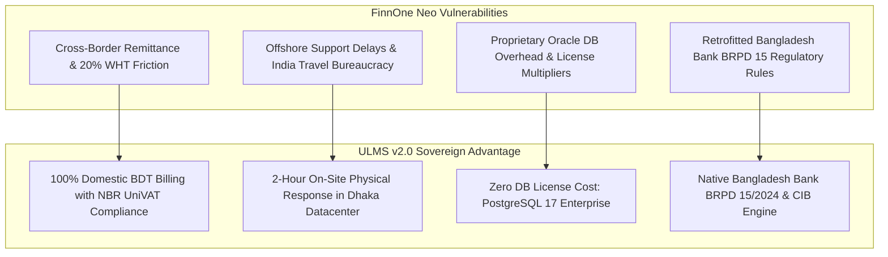

# Competitive Battlecard: ULMS v2.0 vs. Nucleus Software FinnOne Neo
## Head-to-Head Competitive Intelligence, Cross-Border Vulnerabilities & Differentiation Playbook

**Document Identifier:** DOC-13-BAT-03  
**Target Competitor:** Nucleus Software Exports Limited (FinnOne Neo Lending Suite)  
**Author:** Lead Competitive Intelligence Architect & Head of Banking Strategy  
**Publisher:** Unisoft Systems Limited (A Subsidiary of Smart Technologies BD Ltd)  
**Classification:** Strictly Confidential — Internal Sales Team Only  

---

## 1. Executive Competitor Profile

| Parameter | Nucleus Software FinnOne Neo | Unisoft ULMS v2.0 |
|---|---|---|
| **Headquarters & Origin** | Noida, India | Dhaka, Bangladesh (Smart Technologies Group) |
| **Bangladesh Footprint** | Several NBFIs & Private Commercial Banks | 150+ Enterprise Deployments, National Banking Footprint |
| **Primary Architecture** | Proprietary Java EE Monolith, Oracle DB Dependent | Modular Monolith (Spring Boot 4, PostgreSQL 17, React 19) |
| **Pricing & Currency** | USD Denominated ($1.2M – $2.5M USD) | 100% BDT Denominated (BDT 4.00 Crore Turnkey) |
| **Cross-Border Tax Burden**| 20% Withholding Tax (WHT) + Cross-border Remittance Friction | 100% Domestic Billing; 0% Cross-Border Tax Penalties |
| **Local Presence** | Small liaison office / remote flying engineers | Dedicated 40+ Person Engineering HQ in Begum Rokeya Sarani, Dhaka |

---

## 2. Competitor Strengths (Where FinnOne Neo Excels)
* **Established Retail Lending Reputation:** Extensive adoption across Indian non-banking financial companies (NBFCs) and retail banks.
* **Granular LOS Features:** Deep consumer loan origination rule engines for personal, auto, and home financing.
* **Regional Brand Equity:** Recognized across South Asia and the Middle East for specialized retail loan servicing.

---

## 3. Competitor Critical Vulnerabilities (Where ULMS Wins)

### 1. The Cross-Border Payment and Tax Penalty Trap:
* **The Reality:** Contracting with Nucleus Software requires cross-border remittances to India. The National Board of Revenue (NBR) enforces a mandatory **20% Advance Income Tax (AIT) withholding** on foreign software royalties, plus central bank approvals for outward foreign exchange remittances.
* **The Pitch:** *"With FinnOne, your bank pays a 20% tax surcharge on every invoice and navigates central bank forex red tape. ULMS is 100% domestically billed in BDT by Unisoft Systems Limited (backed by Smart Technologies BD Ltd), with zero remittance delays and full NBR tax credits."*

### 2. The Offshore Support Bottleneck:
* **The Reality:** Nucleus relies heavily on offshore development teams in Noida, India. When critical production issues arise or urgent custom patches are needed for Bangladesh Bank circulars, banks face visa delays, remote communication bottlenecks, and expensive fly-in consulting fees.
* **The Pitch:** *"When an auditor from Bangladesh Bank is sitting in your boardroom demanding an explanation, Unisoft's senior software architects can be physically on-site in your Motijheel or Gulshan datacenter within 30 minutes (metro) / 2 hours (national)."*

### 3. Costly Infrastructure Sizing (Oracle Lock-In):
* **The Reality:** FinnOne Neo requires expensive Oracle Database Enterprise Edition licenses and high-spec proprietary application servers, adding millions of Taka in mandatory third-party software overhead.
* **The Pitch:** *"ULMS v2.0 runs on high-performance PostgreSQL 17, cutting your relational database licensing fees to zero while delivering sub-second response times on commodity server hardware."*

---

## 4. Head-to-Head Feature Comparison Matrix

| Functional Dimension | FinnOne Neo | Unisoft ULMS v2.0 | Win Evaluation |
|---|---|---|---|
| **Contract Currency & Tax** | USD ($1.5M+) + 20% WHT | **100% BDT (BDT 4.0 Cr) + NBR Tax Credit** | **ULMS Decisive Win** |
| **BRPD 15/2024 7-Stage Classification** | Custom Adaptation (Scripted) | **Native Deterministic Core Engine** | **ULMS Decisive Win** |
| **Bangladesh Bank CIB Online Gateway** | Custom Integration Layer | **Native Automated REST Parser** | **ULMS Decisive Win** |
| **Election Commission e-KYC Verification**| Third-Party Middleware | **Integrated Face Match & NID OCR** | **ULMS Decisive Win** |
| **Database Licensing Cost** | Requires Oracle DB ($150k+ extra) | **Zero Cost: PostgreSQL 17** | **ULMS Decisive Win** |
| **On-Site SLA in Dhaka** | Remote or 48-72h Flight Notice | **Guaranteed 30-Minute Metro / 2-Hour National On-Site** | **ULMS Decisive Win** |
| **Implementation Timeline** | 9 to 14 Months | **12 Weeks Turnkey Pilot** | **ULMS Decisive Win** |

---

## 5. Trap-Setting RFP Questions to Disqualify FinnOne Neo

1. **For the Procurement & Finance Committee:**
   > *"Is the bidding vendor an incorporated legal entity in Bangladesh capable of issuing VAT invoices directly under NBR SRO regulations, or does the contract require cross-border outward foreign exchange remittance subject to withholding tax?"*
2. **For the ICT Architecture Committee:**
   > *"Does the proposed solution mandate proprietary commercial RDBMS licenses (such as Oracle Enterprise Edition) with core-based pricing, or can it operate natively on enterprise open-source PostgreSQL 17?"*
3. **For the Operations & Recovery Committee:**
   > *"Does the field collection module feature native offline caching with automatic GPS geotagging and SMS dispatch over local telecom aggregators (Grameenphone, Robi, Banglalink) without third-party global SMS gateway costs?"*

---

*Unisoft Systems Limited — Competitive Intelligence & Banking Sales Operations.*
