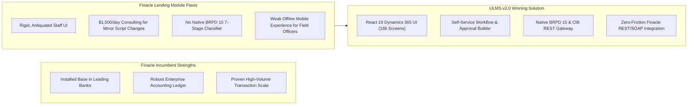

# Competitive Battlecard: ULMS v2.0 vs. Infosys Finacle Lending
## Coexistence Strategy, Competitive Teardown & Win Themes for Finacle CBS Accounts

**Document Identifier:** DOC-14-BAT-04  
**Target Competitor:** Infosys Limited (Finacle Core Banking & Lending Solution)  
**Author:** Lead Competitive Intelligence Architect & Head of Banking Strategy  
**Publisher:** Unisoft Systems Limited (A Subsidiary of Smart Technologies BD Ltd)  
**Classification:** Strictly Confidential — Internal Sales Team Only  

---

## 1. Executive Context: The "Finacle Account" Dynamic

In Bangladesh, Infosys Finacle is a dominant incumbent Core Banking System (CBS) across major institutions including several leading conventional and Islamic banks (verify current CBS references before live use).

When a bank running Finacle CBS looks to modernize its lending, Infosys attempts to sell the **Finacle Lending / Origination Module** as an "add-on". However, banks consistently face three critical pain points:
1. **Exorbitant Change Order Costs:** Modifying a simple Finacle loan origination workflow requires costly Finacle Scripting or engagement with Infosys Bangalore consulting teams.
2. **Slow Digital Agility:** Finacle’s lending module is designed as an internal back-office ledger, not a modern digital origination, credit scoring, or field recovery app.
3. **Rigid Infrastructure Requirements:** Demands massive Oracle infrastructure and dedicated application tier hardware.

**Our Core Positioning:**  
We do NOT ask the bank to replace Finacle CBS. We position **ULMS v2.0 as the Specialized Digital Lending Front-End** that integrates seamlessly with Finacle via Finacle Integrator (FI) / REST APIs, delivering an agile, modern lending experience while preserving Finacle as the core GL!

---

## 2. Competitor Strengths vs. Vulnerabilities

---

## 3. The 3 Winning Value Pillars for Finacle Accounts

### Pillar 1: "Keep Finacle for the Ledger, Use ULMS for the Lending Experience"
* **The Problem:** Loan officers hate using Finacle’s dense, 1990s-style character-heavy screens to originate loans. It takes 45 minutes of manual typing to create a single facility.
* **The ULMS Solution:** ULMS provides an ultra-modern React 19 interface (166 validated screens) with automated NIDW autofill, instant CIB scorecards, and single-click BOCC credit memos. Staff onboarding takes 2 days instead of 3 weeks.
* **The Handoff:** Once sanctioned in ULMS, the loan account is opened and disbursed in Finacle automatically via standard Finacle Connect REST calls.

### Pillar 2: Eliminating the Finacle "Change-Order Tax"
* **The Problem:** Whenever Bangladesh Bank issues a new circular (e.g., changes to SME interest rate caps or down payment rules for loan rescheduling), Infosys charges $25,000 to $50,000 in custom modification fees with a 4-month delivery lag.
* **The ULMS Solution:** ULMS features a bank-tunable business rule engine. Credit risk officers can update interest formulas, approval bands, and scoring weights via UI dropdowns in 5 minutes without writing a single line of code or paying any vendor fees.

### Pillar 3: Specialized Field Agent & Recovery Mobility
* **The Problem:** Finacle lacks an offline-first mobile application for rural credit officers and recovery agents visiting factory floors or agricultural farms.
* **The ULMS Solution:** ULMS includes a native Expo 54+ mobile app with offline SQLite storage, biometric customer verification, photo capture, GPS geotagging, and instant digital collection receipts over local SMS gateways.

---

## 4. Head-to-Head Capability Matrix

| Feature / Dimension | Infosys Finacle Lending Module | ULMS v2.0 + Finacle CBS Connector |
|---|---|---|
| **User Experience & Design** | Legacy ERP Interface, dense menus | **React 19, Modern Design System** |
| **Loan Origination TAT** | 14 to 21 Days Average | **Under 48 Hours End-to-End** |
| **BRPD Circular 15/2024 Engine** | Requires Custom Bespoke Scripts | **Native 7-Stage Classifier Included** |
| **CIB Online REST Integration** | Requires Custom Middleware Build | **Certified Built-in REST Connector** |
| **Approval Ladder Configuration** | Rigid, requires IT code change | **7-Level Configurable DOA Ladder** |
| **Turnkey Delivery Timeline** | 12 to 18 Months | **12 Weeks Production Pilot** |
| **Total License & Integration Cost**| $1.5M – $3.0M USD (৳18 – ৳36 Cr) | **BDT 4.00 Crore Fixed BDT Turnkey** |

---

## 5. Trap-Setting Discovery Questions for Finacle Banks

1. **For the Head of Retail Banking & Branch Operations:**
   > *"How many screens and how many minutes does it currently take your branch credit officers to input a personal loan application in Finacle? Can your officers generate a complete, formatted BOCC credit memo with one click?"*
2. **For the Head of Credit Risk & CRO:**
   > *"When you need to adjust your debt burden ratio (DBR) calculations or change delegation authority limits, can your risk team do that directly in the UI, or are you forced to raise an expensive development ticket with Infosys?"*
3. **For the Chief Information Officer:**
   > *"Would you prefer to spend 18 months and $2M+ USD trying to customize Finacle's lending module, or integrate a pre-built, BRPD 15-compliant lending front-end into Finacle within 12 weeks for a fraction of the cost?"*

---

*Unisoft Systems Limited — Competitive Intelligence & Banking Sales Operations.*
