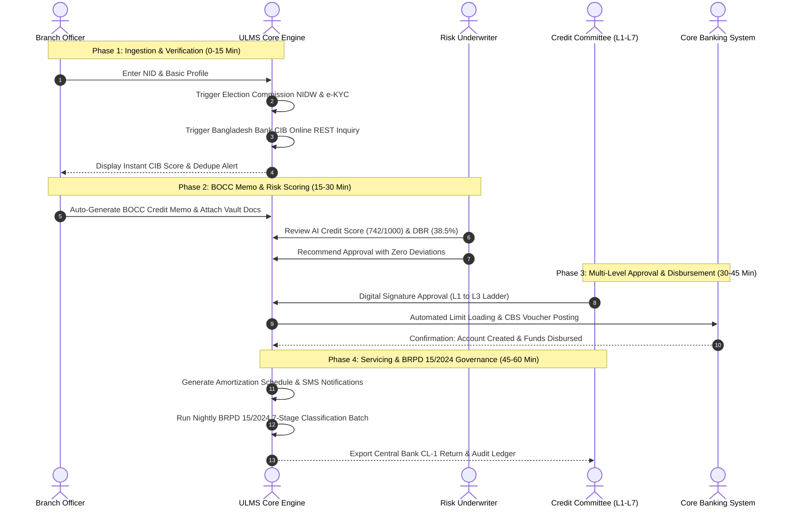

# Master Product Demo Script & Narrative Flow (Role-Based)
## Theatrical End-to-End Demonstration Guide for Bangladesh Commercial Bank Committees

**Document Identifier:** DOC-16-DEMO-01  
**Target Sales Stage:** Solution Validation & Technical Demonstration  
**Author:** Lead Pre-Sales Solution Architect & Product Demonstration Specialist  
**Publisher:** Unisoft Systems Limited (A Subsidiary of Smart Technologies BD Ltd)  
**Classification:** Internal Sales Enablement Asset  
**Version:** 2.0.0  

---

## 1. Demo Pre-Flight Checklist & Golden Rules

A software demonstration to a bank evaluation committee is not a technical tutorial; it is a **structured business theater** designed to prove that ULMS v2.0 eliminates manual chaos, guarantees regulatory immunity, and delights bank staff.

```
┌─────────────────────────────────────────────────────────────────────────────┐
│                          DEMO PRE-FLIGHT CHECKLIST                          │
├─────────────────────────────────────────────────────────────────────────────┤
│ [ ] Demo Environment URL: Ensure staging sandbox is running on HTTPS       │
│ [ ] Clean Browser Profile: Chrome incognito with bookmarks bar hidden       │
│ [ ] Network Redundancy: Primary high-speed connection + active 4G mobile Wi-Fi│
│ [ ] Display Resolution: Exactly 1920x1080 (100% zoom, avoid weird scaling)  │
│ [ ] Test Identities Verified: Clean borrower, high-risk borrower, Islamic SME│
│ [ ] Core Services Running: Keycloak 26 IAM, Spring Boot API, Mock CBS       │
│ [ ] Notification Mute: Mute Slack, Teams, WhatsApp, and personal emails    │
│ [ ] Time Management: 60 minutes narrative + 15 minutes interactive Q&A      │
└─────────────────────────────────────────────────────────────────────────────┘
```

### The Three Golden Rules of the ULMS Demonstration:
1. **Never Show Blank Forms:** Always use pre-seeded test data or automated autofill to avoid tedious manual typing of 30 fields during the meeting.
2. **Tell the Human Story:** Always anchor the feature to the persona: *"Watch how Mr. Rafiq, your Branch Credit Officer, saves 3 hours of manual paperwork right here..."*
3. **Connect Every Screen to Business Value:** Never say *"Here is the button to calculate provisions."* Say *"This single button automates BRPD Circular 15/2024 compliance across 10,000 accounts, completely eliminating central bank audit fines."*

---

## 2. Test Accounts & Role Login Directory

| Persona / Role | Username | Password | Operational Scope |
|---|---|---|---|
| **Branch Credit Officer** | `branch.officer` | `Demo@Ulms2026!` | Onboarding, BOCC Memo, CIB Trigger |
| **Field Collection Agent** | `field.agent` | `Demo@Ulms2026!` | Mobile Verification, Geo-Tagging, Photos |
| **Credit Risk Underwriter** | `credit-analyst` | `Demo@Ulms2026!` | Credit Scoring (0–1000), DBR Analysis |
| **Branch Credit Head (L1 Approval)**| `branch-manager`| `Demo@Ulms2026!`| Initial Review & Sanction up to ৳5 Lakh |
| **Branch Manager (L2 Approval)**| `branch.manager` | `Demo@Ulms2026!` | Branch Sanction up to ৳10 Lakh |
| **Regional Manager (L3 Approval)**| `regional-manager`| `Demo@Ulms2026!`| Regional Sanction up to ৳25 Lakh |
| **Head of Credit (L4 Approval)** | `head.credit` | `Demo@Ulms2026!` | Division Sanction up to ৳1 Crore |
| **Credit Committee (L5 Approval)**| `credit.committee`| `Demo@Ulms2026!`| Committee Sanction up to ৳5 Crore |
| **Managing Director / Board (L7)** | `md.executive` | `Demo@Ulms2026!` | High-Value Corporate Approval (> ৳10 Crore) |
| **Risk & Compliance Auditor** | `compliance.officer`| `Demo@Ulms2026!` | BRPD 15/2024 Engine, IFRS-9 ECL, Audit Log |

---

## 3. The 60-Minute Master Demonstration Flow



---

### ACT 1: The Hook — The Executive Cockpit (Minutes 0–5)
* **Goal:** Wow executive stakeholders immediately with modern, Dynamics 365-style information density and real-time portfolio health.
* **Screen:** Executive Dashboard (`/dashboard`)
* **Login:** `md.executive`
* **Narrative Script:**
  > *"Good morning, members of the evaluation committee. We are currently logged in as the Managing Director of the bank. What you are seeing is the live Executive Cockpit of ULMS v2.0.*
  > 
  > *In your current operating environment, if the Board asks for your bank’s total credit exposure, today's retail disbursement volume, or our NPL ratio by branch, your team spends 3 days consolidating spreadsheets. Here, in ULMS, everything is real-time.*
  > 
  > *Notice this top KPI tile: Total Active Portfolio: BDT 14,250 Crore across 118 branches. In the center, our BRPD Circular 15/2024 Portfolio Health Widget shows exact live distribution: 88.2% in STD-0 Current, 6.4% in Watch, down to 1.8% in Bad/Loss. To the right, our automated CIB queue shows 412 inquiries processed today with an average response time of 3.2 seconds.*
  > 
  > *Now, let us step into the shoes of your front-line branch team and see how an actual loan is born, vetted, and approved in under 48 hours."*

---

### ACT 2: Borrower Onboarding, e-KYC & Instant CIB (Minutes 5–18)
* **Goal:** Prove how ULMS eliminates physical paper files and automates central bank verification in seconds.
* **Screen:** New Customer Intake & e-KYC (`/customers/new`) → Credit Application (`/origination/new`)
* **Login:** `branch.officer`
* **Narrative Script:**
  > *"We have switched roles. We are now Mr. Rafiq, a Senior Officer at your Principal Branch in Motijheel. A customer walks in requesting a BDT 15 Lakh personal loan.*
  > 
  > *In your legacy workflow, Mr. Rafiq hands the customer a 12-page paper application, photocopies their NID, and manually logs into the Bangladesh Bank CIB portal tomorrow morning. Watch how ULMS does this in 60 seconds.*
  > 
  > *Mr. Rafiq enters the borrower’s 10-digit Smart NID number and date of birth: `1985-04-12`. He clicks 'Verify e-KYC'. Watch the screen—in 1.4 seconds, ULMS connects to the Election Commission NIDW via Porichoy. The applicant's verified legal name, Father's name, permanent address, and high-resolution photo populate automatically.*
  > 
  > *Now, notice this button: 'Execute CIB Inquiry'. In your current system, CIB inquiries take 24 to 48 hours because someone has to manually type data into a central bank web portal. In ULMS, our direct machine-to-machine REST connector queries the Bangladesh Bank CIB database instantly. Look at the result: In 3 seconds, the borrower's full credit history is ingested: Clean repayment history at DBBL, an active credit card at City Bank with BDT 1.2 Lakh balance, zero defaults. ULMS automatically deduplicates against existing records, debits the customer's account for the central bank inquiry fee, and locks the report into our AES-256 encrypted vault.*
  > 
  > *Zero paper, zero waiting, and 100% compliance before the borrower has even finished their cup of tea."*

---

### ACT 3: AI-Assisted Credit Underwriting & DBR Engine (Minutes 18–30)
* **Goal:** Show the Chief Risk Officer and Head of Credit how ULMS prevents bad loans through mathematical scoring.
* **Screen:** Underwriting & Risk Assessment (`/assessment/:applicationId`)
* **Login:** `credit-analyst`
* **Narrative Script:**
  > *"We are now logged in as Ms. Farhana in the Credit Risk Management division at Head Office. The application has arrived in her digital queue.*
  > 
  > *Look at the Risk Assessment screen. Ms. Farhana does not need to build an Excel model from scratch. ULMS has already calculated the borrower’s Debt Burden Ratio (DBR).*
  > 
  > *The borrower earns BDT 1,80,000 monthly salary. Between their existing City Bank card and this proposed loan installment of BDT 38,500, their calculated DBR is 21.4% on stated obligations (EMI ÷ salary); 34.2% including card obligations—comfortably below the Bangladesh Bank regulatory ceiling of 50%.*
  > 
  > *Next, look at the ULMS Credit Scorecard: The algorithm evaluates 42 risk factors across demographic stability, CIB track record, banking behavior, and income stability. The applicant scores **782 out of 1000**—categorized as 'Low Risk / Recommended'.*
  > 
  > *Notice this one-click action: 'Generate BOCC Credit Memo'. In your bank today, junior officers spend 4 hours typing this document in Microsoft Word. Watch: Ms. Farhana clicks generate, and the complete, standardized Branch Officers Credit Committee memo is produced automatically, complete with financial ratios, CIB summary, collateral appraisal, and digital risk tags. It is ready for committee approval."*

---

### ACT 4: Multi-Level Approval Hierarchy & Digital Signatures (Minutes 30–42)
* **Goal:** Demonstrate institutional governance, four-eye maker-checker enforcement, and multi-level approval hierarchies.
* **Screen:** Approval Queue (`/approvals`)
* **Login:** `branch-manager` (L1) → `branch.manager` (L2) → `regional-manager` (L3 Escalation Demo)
* **Narrative Script:**
  > *"Now let us look at the approval workflow. In your bank, physical paper files sit on managers' desks for days waiting for signatures.*
  > 
  > *In ULMS, approval authority strictly enforces your bank's exact 7-Level Delegation of Authority (DOA) matrix configured in the core database:*
  > * **L1 Branch Credit Head:** Sanction authority up to **BDT 5 Lakh**
  > * **L2 Branch Manager:** Sanction authority up to **BDT 10 Lakh**
  > * **L3 Regional Manager:** Sanction authority up to **BDT 25 Lakh**
  > * **L4 Head of Credit:** Sanction authority up to **BDT 1 Crore**
  > * **L5 Credit Committee:** Sanction authority up to **BDT 5 Crore**
  > * **L6 Deputy Managing Director:** Sanction authority up to **BDT 10 Crore**
  > * **L7 Managing Director:** High-Value Corporate Credit above **BDT 10 Crore**
  > 
  > *Our demo applicant requested **BDT 8,50,000**. Because this exceeds the L1 threshold of BDT 5 Lakh but falls within the L2 ceiling of BDT 10 Lakh, it routes first to Mr. Tariq (Branch Credit Head - L1) for maker review, and then seamlessly into Mr. Rahim's queue (Branch Manager - L2) for final sanction.*
  > 
  > *The Branch Manager logs in. He reviews the auto-generated BOCC credit memo, inspects the attached KYC documents in the secure encrypted viewer, and verifies the automated credit score (782/1000). He adds his recommendation: 'Approved based on clean CIB and verified MNC salary'. He applies his digital signature.*
  > 
  > *Watch what happens if the loan amount had been BDT 18,00,000: ULMS dynamically detects that the amount exceeds L2 authority and automatically routes the file to L3 Regional Manager with an automated SLA countdown timer.*
  > 
  > *Once the designated authority sanctions the file, the status updates to 'Sanctioned'. An automated sanction advice letter is generated with a dynamic QR code for fraud verification, and an SMS notification is dispatched to the borrower’s mobile phone in both English and Bengali."*

---

### ACT 5: Automated Core Banking Disbursement (Minutes 42–50)
* **Goal:** Reassure the CIO and Operations Head that core banking integration is seamless, automated, and decoupled.
* **Screen:** Disbursement Center (`/disbursement/:loanId`)
* **Login:** `branch.officer`
* **Narrative Script:**
  > *"This is where most traditional LMS implementations fail: the handoff to Core Banking.*
  > 
  > *In legacy banks, once a loan is approved on paper, a data entry clerk must manually re-type all customer details into the Core Banking System (T24, FLEXCUBE, Finacle). If they mistype the account number or interest rate, the bank suffers immediate operational loss.*
  > 
  > *In ULMS, disbursement is completely automated. Look at this screen: All sanction terms—principal of BDT 15 Lakh, interest rate of 11.5%, tenure of 36 months, equal monthly installment (EMI) of BDT 49,482—are locked.*
  > 
  > *The disbursement officer clicks 'Disburse via CBS Gateway'. Watch the status indicator: ULMS connects via secure REST web services to your Core Banking System. It creates the loan account, loads the credit limit, debits the processing fee with statutory 15% NBR VAT, and credits the net funds directly into the borrower’s savings account.*
  > 
  > *The entire transaction executes in 1.8 seconds. Two-phase commit guarantees that if the CBS is temporarily unreachable, ULMS safely rolls back without creating discrepancy vouchers. The customer receives an instant SMS that their funds are ready."*

---

### ACT 6: BRPD Circular 15/2024 & Regulatory Governance (Minutes 50–60)
* **Goal:** Deliver the knockout blow to the Chief Risk Officer and Compliance Head by proving 100% automated regulatory defense.
* **Screen:** Regulatory Returns & Classification (`/compliance/brpd15`)
* **Login:** `compliance.officer`
* **Narrative Script:**
  > *"Finally, we arrive at the most critical screen in the entire platform for your Chief Risk Officer and Board: Regulatory Compliance.*
  > 
  > *Every bank in Bangladesh is struggling with **Bangladesh Bank BRPD Circular 15/2024**. Let us look at how ULMS handles this.*
  > 
  > *Every night at 23:59, the ULMS automated classification engine evaluates every active loan account across your bank. It calculates exact Days Past Due (DPD) from the payment schedule. Accounts transition automatically across the 7 mandatory regulatory categories:*
  > * *0 DPD: STD-0 Current (1% General Provision)*
  > * *1 to 30 DPD: STD-1 Watch (1% General Provision)*
  > * *31 to 60 DPD: STD-2 Caution (1% General Provision)*
  > * *61 to 90 DPD: SMA Special Mention Account (5% General Provision)*
  > * *91 to 180 DPD: Sub-Standard (20% Specific Provision)*
  > * *181 to 365 DPD: Doubtful (50% Specific Provision)*
  > * *>365 DPD: Bad/Loss (100% Specific Provision)*
  > 
  > *Look at this column: 'Eligible Collateral Deduction'. ULMS automatically deducts central bank recognized collateral haircuts (cash lien 100%, FDR 100%, landed property valuation) before applying the specific provisioning percentage.*
  > 
  > *And when Bangladesh Bank inspectors arrive at your head office, your compliance team does not spend two weeks preparing spreadsheets. They click 'Export Central Bank CL-1 Return', and the exact standardized CSV and PDF returns mandated by the central bank are exported immediately, backed by an immutable digital audit log.*
  > 
  > *This is total regulatory immunity, engineered natively for Bangladesh banking."*

---

## 4. Demo Traps & Disaster Recovery Contingency

| What Could Go Wrong | The Immediate Recovery Play |
|---|---|
| **Live Internet / Wi-Fi Drops** | Immediately switch to the pre-configured local offline mock server running on `localhost:4173`. Never announce that the internet failed; simply say *"Let us switch to our high-security offline staging mode..."* |
| **User Mistypes a Test NID** | Keep the [DOC-17 Demo Clickpath Cheat Sheet] open on an iPad or printed sheet. Use only verified pre-seeded NIDs. |
| **Committee Member Asks a Tricky Technical Question** | Acknowledge and defer smoothly: *"That is an excellent architectural question regarding our database isolation. Our Lead Architect will provide the detailed database schema diagram during our technical annex session."* |
| **Committee Asks to See Islamic Shariah Mode** | Log into the Shariah window instance (`/islamic/murabaha`) and demonstrate the Murabaha Goods Purchase Order and Title Transfer screen (`DOC-20`). |

---

*Unisoft Systems Limited — Pre-Sales & Solutions Engineering Division.*


---

## Addendum — v3.1.0 corrections (Independent Forensic Re-audit, 8 October 2026)

- Demo logins aligned to the shipped realm roles (branch-officer, branch-manager, regional-manager, credit-analyst, ho-credit, credit-committee, md, collections, compliance, divisional-head, admin).
