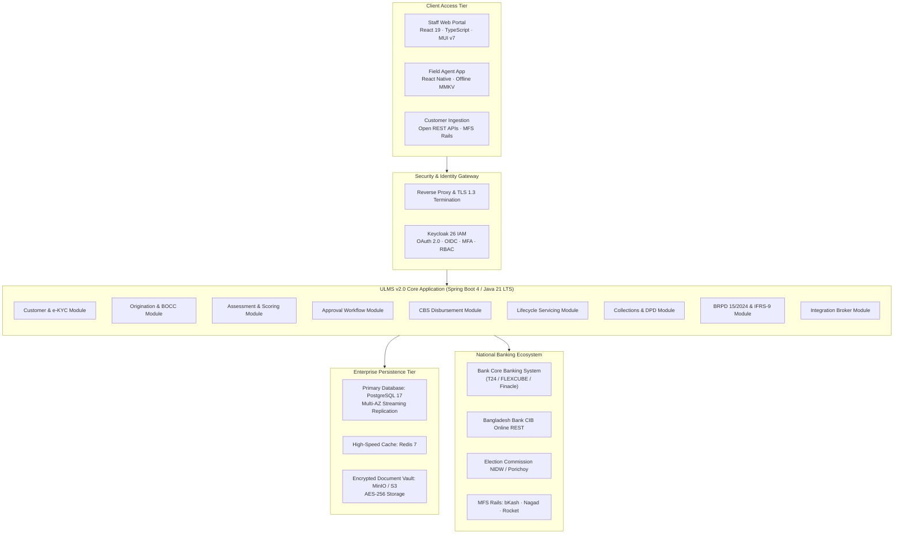

# Master RFP Technical Proposal Template (Envelope-1)
## Quality and Cost-Based Selection (QCBS) Technical Bid for Bangladesh Scheduled Commercial Banks

**Document Identifier:** DOC-23-BID-01  
**Procurement Reference:** Standard Two-Envelope Banking RFP Submission  
**Author:** Head of Bid Management & Principal Solutions Architect  
**Publisher:** Unisoft Systems Limited (A Subsidiary of Smart Technologies BD Ltd)  
**Classification:** Master Bid Proposal Asset  
**Version:** 2.0.0  

---

## 1. Letter of Technical Proposal Submission

*[To be printed on Unisoft Systems Limited Official Letterhead]*

**Date:** [Insert Date]  
**To:**  
The Chairman, Proposal Evaluation Committee / Head of Procurement  
[Insert Bank Name]  
[Insert Bank Head Office Address, Dhaka, Bangladesh]  

**Subject: Technical Proposal Submission for the Procurement of an Enterprise Loan Management System (LMS) — Tender Ref No: [Insert Tender Reference Number]**

Dear Sir/Madam,

We, the undersigned, offer to provide the enterprise software solution and implementation services for the **Loan Management System (LMS)** in accordance with your Request for Proposal (RFP) dated [Insert Date] and our Technical Proposal.

We are hereby submitting our Proposal, which includes this **Technical Proposal (Envelope-1)** and a **Financial Proposal (Envelope-2)** sealed under separate envelopes in strict adherence to the two-envelope Quality and Cost Based Selection (QCBS) guidelines.

We hereby declare that:
1. All the information and statements made in this Technical Proposal are true and we accept that any misinterpretation or misrepresentation contained in this Proposal may lead to our disqualification by the Bank.
2. Our Proposal shall remain valid for the period of **120 (One Hundred Twenty) calendar days** from the tender closing deadline.
3. We have no conflict of interest in relation to this procurement process.
4. We confirm that our proposed system, **Unisoft Loan Management System (ULMS v2.0)**, complies 100% with all mandatory regulatory directives of Bangladesh Bank, including BRPD Circular 15/2024, CIB Online integration protocols, and IFRS-9 ECL staging requirements.

We remain,

Yours sincerely,

_____________________________________________  
**[Authorized Signatory Name]**  
[Designation: Managing Director / Director of Enterprise Solutions]  
**Unisoft Systems Limited**  
Youth Tower, Begum Rokeya Sarani, Dhaka-1216, Bangladesh  
Phone: +880 1709-642404 | Email: office@uslbd.com | Web: www.uslbd.com  

---

## 2. Executive Summary & Bidder Standing

### 2.1 Corporate Background & Financial Solvency
**Unisoft Systems Limited** is a premier banking software engineering enterprise established in 2015 as a key subsidiary of **Smart Technologies BD Ltd**—one of Bangladesh’s largest ICT conglomerates with an annual group turnover exceeding **BDT 2,000 Crore (USD ~170 Million)** and over 25 years of institutional operations.

```
┌─────────────────────────────────────────────────────────────────────────────┐
│                     UNISOFT SYSTEMS LIMITED AT A GLANCE                     │
├───────────────────────────────┬─────────────────────────────────────────────┤
│ Corporate Entity              │ Unisoft Systems Limited                     │
│ Parent Conglomerate           │ Smart Technologies BD Ltd                   │
│ Years of Continuous Operation │ 10+ Years (Founded in 2015)                 │
│ Enterprise Implementations    │ 150+ Delivered Systems                      │
│ Permanent Engineering Team    │ 40+ Certified Software Engineers in Dhaka   │
│ On-Time Project Delivery Rate │ 98% Across Public and Private Sectors       │
│ Regulatory Accreditations     │ NBR-Approved UniVAT™ System Developer       │
│ Physical Headquarters         │ Youth Tower, Begum Rokeya Sarani, Dhaka     │
│ Quality & Security Standards  │ ISO 9001:2015 · ISO/IEC 27001:2022 Certified│
└───────────────────────────────┴─────────────────────────────────────────────┘
```

### 2.2 Core Strategic Advantage for the Bank
1. **Sovereign Local Technology:** 100% developed, owned, and supported within Bangladesh, eliminating foreign currency licensing liabilities and cross-border tax frictions.
2. **Native Regulatory Precision:** Built specifically for Bangladesh Bank regulations, ensuring day-one compliance with **BRPD Circular 15/2024**, real-time **CIB Online REST**, and **IFRS-9 ECL** standards.
3. **Rapid 12-Week Time-to-Value:** Proven deployment methodology enabling pilot branch live transactions within 90 days of contract signing.
4. **Immediate On-Site Physical Engineering Support:** Dedicated 24/7 support engineers stationed permanently in Dhaka, offering an unmatched 30-minute emergency response SLA.

---

## 3. Understanding of the Terms of Reference (ToR)

Unisoft has conducted a thorough technical and operational evaluation of the Bank’s Terms of Reference. We understand that the Bank seeks to achieve four strategic objectives:

1. **Digitalize End-to-End Lending Operations:** Eliminate manual paper files and physical Branch Officers Credit Committee (BOCC) dossiers across all retail, SME, and corporate loan products.
2. **Automate Central Bank Risk Management:** Automate the 7-stage loan classification rules under BRPD 15/2024, real-time CIB inquiries, and forward-looking IFRS-9 provisioning.
3. **Ensure Flawless Core Banking Integration:** Interoperate with the Bank's Core Banking System via secure APIs without causing ledger disruption or operational lockup.
4. **Empower Field Agents & Rural Branches:** Provide mobile-first capabilities allowing credit officers to onboard borrowers, capture documents, and perform physical premise verifications offline.

ULMS v2.0 is purposefully engineered to satisfy and exceed every requirement stipulated in the Bank's ToR.

---

## 4. Proposed Technical Architecture & Technology Stack

### 4.1 Modular Monolith Philosophy (ADR-001 Alignment)
Rather than introducing the operational complexity and failure points of distributed microservices, ULMS v2.0 is architected as an **Enterprise Modular Monolith** in accordance with modern engineering standards. This guarantees **transactional ACID integrity**, sub-millisecond inter-module communication, and operational simplicity while maintaining strict domain boundary isolation.



### 4.2 Comprehensive Technology Stack Specification

| Architecture Layer | Component Technology | Version | Enterprise Justification |
|---|---|---|---|
| **Programming Language** | Java (Eclipse Temurin LTS) | Java 21 LTS | High-performance virtual threads, memory safety, long-term enterprise support |
| **Backend Framework** | Spring Boot / Spring Modulith | 4.x / 3.4+ | Industry standard for core banking; strict domain boundary compilation |
| **Frontend Framework** | React / TypeScript / Vite | React 19 / Vite 7 | Modern Dynamics 365 UI density, sub-second HMR, high responsiveness |
| **Mobile Architecture** | React Native / Expo | Expo 54+ | Offline-first database (MMKV), biometric authentication, photo geo-tagging |
| **Primary Database** | PostgreSQL Enterprise | PostgreSQL 17 | Robust ACID compliance, native JSONB support, zero licensing fees |
| **In-Memory Cache** | Redis Enterprise | Redis 7.2+ | Sub-millisecond session caching and real-time score computation |
| **Identity & Access** | Keycloak | Keycloak 26 | Certified OAuth 2.0 / OIDC, Multi-Factor Authentication, Single Sign-On |
| **Document Storage** | MinIO Enterprise Object Store | Latest Stable | S3-compatible, on-premises private datacenter, AES-256 encrypted |
| **Containerization** | Docker / Lightweight Kubernetes| k3s / K8s 1.30+ | Lightweight on-premise container orchestration with automated failover |

---

## 5. Scope of Functional Modules

ULMS v2.0 delivers 9 comprehensive functional modules covering 100% of the credit lifecycle:

### Module 1: Customer Onboarding & Digital e-KYC
* Real-time automated verification via Election Commission NIDW / Porichoy API.
* AI-driven optical character recognition (OCR) of Smart National Identity Cards.
* Facial liveness detection and biometric matching (>95% confidence threshold).
* Automated screening against United Nations Sanctions and local BFIU PEP lists.
* Capture and verification of Ultimate Beneficial Ownership (UBO $\ge 20\%$) for corporate entities.

### Module 2: Loan Origination & BOCC Credit Memo Automation
* Omnichannel intake across branch counters, mobile field agents, and internet banking.
* Automated Branch Officers Credit Committee (BOCC) credit memo compiler.
* Multi-document attachment repository in an AES-256 encrypted digital vault.
* Automated fee deduction handling with statutory 15% NBR VAT calculation.

### Module 3: Credit Risk Assessment & AI Scorecard Engine
* Automated Debt Burden Ratio (DBR) computation comparing total liabilities against net income.
* Multi-dimensional credit scoring algorithm (0 to 1000 scale) with custom bank parameter weights.
* Collateral management module with automated market valuation haircuts.
* Automated exception and deviation tagging requiring higher approval delegation.

### Module 4: Approval Hierarchy & Digital Signature Engine
* Flexible 7-level approval hierarchy (L1 Branch to L7 Board Committee) mapped to loan amount bands.
* Cryptographic digital signatures and tamper-evident decision logs.
* Automated generation of formal Sanction Advice letters with dynamic anti-fraud QR codes.
* Multilingual SMS and email notifications to borrowers upon approval.

### Module 5: Automated Core Banking Disbursement
* Direct integration with Core Banking (Temenos T24, Oracle FLEXCUBE, Finacle, Flora Bank).
* Automated credit limit creation, fee voucher posting, and net disbursement to savings accounts.
* Multi-tranche disbursement tracking for construction and project finance facilities.
* Two-phase commit transactional rollback ensuring zero orphan financial records.

### Module 6: Lifecycle Loan Servicing & Repayment
* Flexible amortization engines: Equal Monthly Installment (EMI), reducing balance, balloon, bullet.
* Standing instructions, automated BEFTN / NPSB / RTGS clearing, and MFS auto-debit.
* Early settlement, partial prepayments, and interest rebate calculations.
* Rescheduling, restructuring, and moratorium management in compliance with central bank circulars.

### Module 7: Collections, Delinquency & NPA Management
* Automated Days Past Due (DPD) counter updating nightly at 23:59.
* Dynamic collection queues: Early bucket soft collections (DPD 1–30) to field recovery (DPD 60+).
* Automated generation and dispatch of legal demand notices per the Artha Rin Adalat Ain, 2003.
* Field recovery agent mobile tracking with real-time receipt generation.

### Module 8: Bangladesh Bank Regulatory Returns & IFRS-9 ECL
* **Native BRPD Circular 15/2024 Engine:** Automated nightly staging across STD-0, STD-1, STD-2, SMA, SS, DF, and Bad/Loss.
* Automated general and specific provisioning computation after eligible collateral netting.
* **IFRS-9 Expected Credit Loss (ECL):** Built-in Stage 1 (12-Month) and Stage 2/3 (Lifetime) forward-looking ECL engine.
* Automated export of central bank CL-1 through CL-5 regulatory reporting returns.

### Module 9: Platform Administration, Security & Audit
* Comprehensive Role-Based Access Control (RBAC) powered by Keycloak 26.
* Enforced four-eye maker-checker principle across all critical financial actions.
* Immutable audit trails recording user identity, client IP, timestamp, and field-level diffs.

---

## 6. Core Banking System (CBS) Integration Methodology

Unisoft adopts an API-first integration approach using pre-tested connectors:

```
┌─────────────────────────────────────────────────────────────────────────────┐
│                    CBS INTEGRATION CONNECTIVITY MATRIX                      │
├─────────────────────┬───────────────────────┬───────────────────────────────┤
│ Core Banking System │ Primary Protocol      │ Integration Capabilities      │
├─────────────────────┼───────────────────────┼───────────────────────────────┤
│ Temenos T24 / Transact│ Native REST / OFS   │ Customer sync, Limit loading, │
│                     │ XML Messaging         │ Disbursement vouchers, EOD    │
├─────────────────────┼───────────────────────┼───────────────────────────────┤
│ Oracle FLEXCUBE     │ RESTful Web Services  │ Account validation, Balance   │
│                     │ FCUBS Gateway         │ query, Auto-posting vouchers  │
├─────────────────────┼───────────────────────┼───────────────────────────────┤
│ Infosys Finacle     │ Finacle Integrator(FI)│ Customer dedupe, Limit setup, │
│                     │ XML / HTTP Connectors │ Transaction posting, Repayments│
├─────────────────────┼───────────────────────┼───────────────────────────────┤
│ Flora Bank          │ Enterprise DB Staging │ Direct database staging table │
│                     │ & REST Services       │ sync, Real-time voucher post  │
└─────────────────────┴───────────────────────┴───────────────────────────────┘
```

---

## 7. Implementation Work Plan & Governance (12-Week Pilot)

Our proven 12-week implementation methodology guarantees rapid deployment without operational disruption:

```
┌─────────────────────────────────────────────────────────────────────────────┐
│                     12-WEEK PILOT IMPLEMENTATION GANTT                      │
├───────────────────────────────────┬───┬───┬───┬───┬───┬───┬───┬───┬───┬───┬───┬───┤
│ Phase / Milestone                 │W1 │W2 │W3 │W4 │W5 │W6 │W7 │W8 │W9 │W10│W11│W12│
├───────────────────────────────────┼───┼───┼───┼───┼───┼───┼───┼───┼───┼───┼───┼───┤
│ Phase 0: Setup & Sizing           │███│███│   │   │   │   │   │   │   │   │   │   │
│ Phase 1: Requirements & Gap Study │   │   │███│███│   │   │   │   │   │   │   │   │
│ Phase 2: CBS & Rail Integration   │   │   │   │   │███│███│███│   │   │   │   │   │
│ Phase 3: UAT & Pilot Training     │   │   │   │   │   │   │   │███│███│███│   │   │
│ Phase 4: Parallel Run & Go-Live   │   │   │   │   │   │   │   │   │   │   │███│███│
└───────────────────────────────────┴───┴───┴───┴───┴───┴───┴───┴───┴───┴───┴───┴───┘
```

* **Joint Steering Committee (JSC):** Bi-weekly executive reviews chaired by the Bank Managing Director and Unisoft Project Director.
* **Project Management Committee (PMC):** Weekly operational meetings tracking milestone deliverables and resolving integration blockers.

---

## 8. Key Personnel & Project Management Organization

Unisoft commits dedicated, highly experienced banking technology professionals to this implementation:

| Role in Project | Proposed Professional | Qualifications & Relevant Experience |
|---|---|---|
| **Project Director** | Lead Partner / VP | 20+ years enterprise banking software delivery experience |
| **Principal Solution Architect** | Senior Architect | 15+ years Java/Spring Boot & Core Banking integration |
| **Lead Banking Business Analyst** | Senior Financial Analyst | Former commercial bank credit manager, BRPD specialist |
| **Senior Backend Integration Lead**| Lead Java Engineer | Expert in Temenos/FLEXCUBE/Finacle REST & SOAP connectors |
| **Senior Frontend UX Engineer** | Lead UI Developer | React 19 / TypeScript / Dynamics 365 UX specialist |
| **Database & Migration Lead** | Senior DBA | PostgreSQL 17, Flyway migrations, high-availability replication |
| **Lead QA & Security Specialist** | Senior QA Engineer | Certified Ethical Hacker (CEH), automated VAPT & performance testing |

Detailed Curricula Vitae (CVs) with verified project credentials are provided in Annexure A.

---

*Unisoft Systems Limited — Enterprise Bid Management Directorate.*
