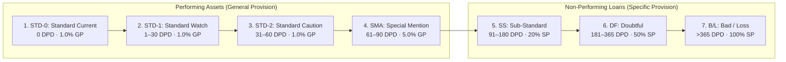
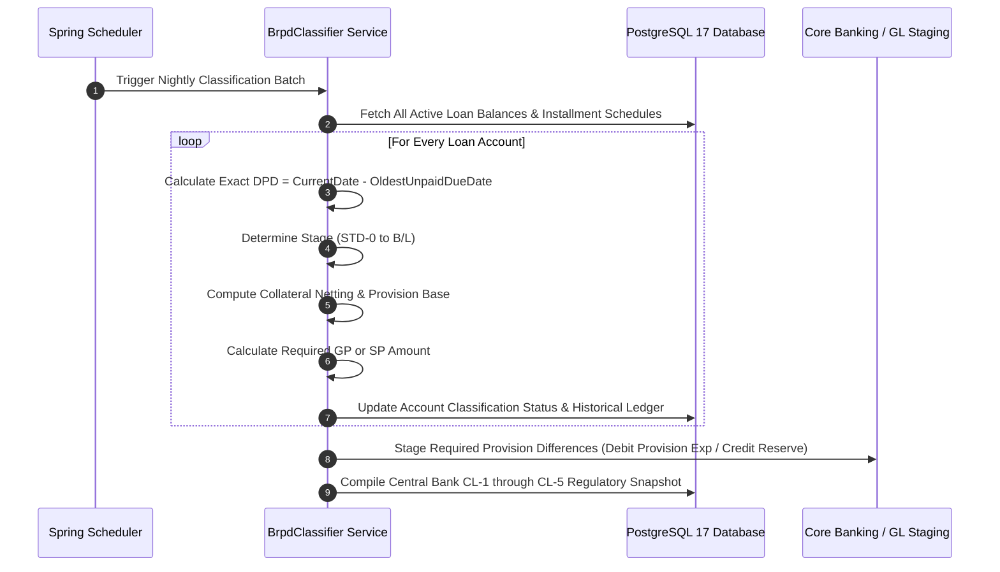

# Regulatory Whitepaper: Automated Compliance with BRPD Circular 15/2024
## The 7-Stage Loan Classification & Statutory Provisioning Engine in ULMS v2.0

**Document Identifier:** DOC-35-REG-01  
**Statutory Reference:** Bangladesh Bank BRPD Circular No. 15 dated November 27, 2024 (and related directives)  
**Author:** Head of Regulatory Compliance & Senior Credit Risk Architect  
**Publisher:** Unisoft Systems Limited (A Subsidiary of Smart Technologies BD Ltd)  
**Classification:** Authoritative Technical & Regulatory Whitepaper  
**Version:** 2.0.0  

---

## 1. Executive Summary & Regulatory Context

On November 27, 2024, the Banking Regulation and Policy Department (BRPD) of **Bangladesh Bank** issued **Circular No. 15/2024**, marking the most significant overhaul of credit asset classification and provisioning rules in Bangladesh in over a decade.

### Statutory Implementation Timeline:
* **Circular Issuance Date:** November 27, 2024
* **Statutory Effective Date:** **April 1, 2025** (Mandatory transition from historical 4-stage to 7-stage classification)
* **Comprehensive CL Reporting Date:** **September 30, 2025** (Quarterly CL-1 to CL-5 returns submitted to Bangladesh Bank under the full 7-stage taxonomy)
* **Mandatory IFRS-9 ECL Convergence:** **December 31, 2027**

Replacing the historical 4-stage framework, BRPD 15/2024 established a strict **7-stage granular classification regime** aimed at aligning Bangladesh’s banking sector with international Basel III norms and paving the way for mandatory **IFRS-9 Expected Credit Loss (ECL)** enforcement by December 31, 2027.

For commercial banks, manually tracking Days Past Due (DPD) across thousands of accounts using spreadsheets creates acute operational risks: misclassification fines, delayed reporting, and balance-sheet restatement orders.

**ULMS v2.0** solves this challenge through an embedded, automated **BRPD 15/2024 Compliance Engine** that deterministically calculates DPD, nets central bank eligible collateral, determines exact general and specific provisions, and exports standardized CL returns nightly.

---

## 2. Exhaustive 7-Stage Classification Taxonomy & Asset Categories

### 2.1 The Four Regulated Credit Asset Categories
BRPD Circular 15/2024 establishes distinct classification criteria across four primary loan categories:
1. **Continuous Loans (Cash Credit, Overdrafts):** Revolving credit facilities with sanctioned validity limits. DPD is calculated from limit expiry date or when drawings exceed limit continuously for 30+ days.
2. **Demand Loans (PAD, FBP, LIM, Payment Against Documents):** Short-term trade finance loans payable on demand. DPD is calculated from maturity or creation date if unretired.
3. **Fixed Term Loans (Retail EMI, SME Term, Industrial Term, Lease Finance):** Installment-based term credit. DPD is tracked against the oldest overdue installment.
4. **Short-Term Agricultural Credit & Micro-Credit:** Agricultural crop loans and micro-credit. Classified as SMA if overdue 30–60 days, SS if 61–180 days, DF if 181–365 days, and B/L if past due exceeding 12 months after maturity.

### 2.2 7-Stage Classification Matrix & Statutory Provision Rates

Under BRPD Circular 15/2024, credit facilities are classified based on objective Days Past Due (DPD) thresholds, qualitative judgment, and rescheduling history:

| Stage Code | Classification Name | Days Past Due (DPD) Range | Provision Category | Base Statutory Provision Rate | Commercial & Retail Loans | SME / Agri Credit Loans |
|---|---|---|---|---|---|---|
| **STD-0** | Standard (Current) | Exactly 0 Days | General Provision (GP) | 1.0% | 1.0% | 0.25% – 1.0% |
| **STD-1** | Standard (Watch) | 1 to 30 Days | General Provision (GP) | 1.0% | 1.0% | 0.25% – 1.0% |
| **STD-2** | Standard (Caution) | 31 to 60 Days | General Provision (GP) | 1.0% | 1.0% | 0.25% – 1.0% |
| **SMA** | Special Mention Account | 61 to 90 Days | General Provision (GP) | 5.0% | 5.0% | 5.0% |
| **SS** | Sub-Standard (NPL) | 91 to 180 Days | Specific Provision (SP)| 20.0% | 20.0% | 20.0% |
| **DF** | Doubtful (NPL) | 181 to 365 Days | Specific Provision (SP)| 50.0% | 50.0% | 50.0% |
| **B/L** | Bad / Loss (NPL) | Greater than 365 Days | Specific Provision (SP)| 100.0% | 100.0% | 100.0% |

### Key Regulatory Enforcements:
1. **Continuous Revolving Credit & Overdrafts:** DPD is measured from the date of limit expiration or when drawings exceed the sanctioned limit continuously for 30+ days.
2. **Fixed Term / Installment Credit:** DPD is measured from the due date of any unpaid monthly or quarterly installment.
3. **Cross-Default Contagion:** If an uncollateralized borrower is classified as Sub-Standard or worse on one facility, ULMS automatically tags all other facilities of the same borrower across the bank for downgrade review.

---

## 3. Mathematical Collateral Netting & Provisioning Algorithm

The calculation of specific provisions under central bank guidelines permits the deduction of **Eligible Security / Collateral** before applying the statutory provisioning percentage.

### 3.1 Central Bank Eligible Collateral Categories & Haircuts
Per Bangladesh Bank regulations, only strictly defined collateral can be deducted against outstanding exposure:
1. **Cash Collateral & FDR Liens:** 100% of face value (zero haircut).
2. **Government Treasury Bonds / Sanchayapatra:** 100% of surrender/face value.
3. **Immovable Landed Property / Registered Mortgages:** Maximum of 80% of forced sale value determined by an accredited surveyor within the last 3 years.
4. **Hypothecated Stock & Raw Materials:** Maximum of 50% of audited valuation, subject to strict inspection recency (<90 days).

### 3.2 Formal Mathematical Provisioning Formula

For any credit facility $i$ with Outstanding Exposure $E_i$ and Central Bank Eligible Collateral $C_i$:

#### Case A: Performing Loans (STD-0, STD-1, STD-2, SMA)
General provisions are computed directly on the gross outstanding exposure without collateral deduction:

$$\text{GP}_i = E_i \times R_{\text{GP}}$$

*Where $R_{\text{GP}}$ is the applicable general provision rate (1.0% for Standard; 5.0% for SMA).*

#### Case B: Non-Performing Loans (SS, DF, B/L)
Specific provisions are computed on the **Net Base for Provision** after subtracting eligible collateral:

$$\text{Base for Provision } B_i = \max\left(0,\, E_i - \text{Interest Suspense}_i - C_i^{\text{eligible}}\right)$$

$$\text{Specific Provision } \text{SP}_i = B_i \times R_{\text{SP}}$$

*Where $R_{\text{SP}}$ is the statutory specific provision rate (20% for SS, 50% for DF, 100% for B/L).*

### 3.3 Interest Suspense Accounting Treatment (BRPD Mandate)

Per Bangladesh Bank regulations, when any facility degrades to Sub-Standard (SS), Doubtful (DF), or Bad/Loss (B/L):
1. **Accrual Reversal:** All unrealized interest accrued during the current accounting period must be immediately reversed from the Profit & Loss statement:
   - **Debit:** Interest Income Account (P&L)
   - **Credit:** Interest Suspense Account (Balance Sheet Liability / Contra-Asset)
2. **Ongoing Accrual Treatment:** Any subsequent interest charged on the classified account cannot be recognized as bank earnings:
   - **Debit:** Loan Outstanding / Advance Account (Asset)
   - **Credit:** Interest Suspense Account (Balance Sheet)
3. **Cash Realization Rule:** Interest in suspense is recognized as income if and only if actual cash collection occurs:
   - **Debit:** Cash / Clearing Account
   - **Credit:** Loan Outstanding / Advance Account
   - **Simultaneous Reversal:** Debit Interest Suspense Account / Credit Interest Income Account (P&L)

ULMS v2.0 automates these journal vouchers via the core `BrpdClassifier` service, generating standardized ISO 20022 / CBS GL staging feeds nightly.

---

## 4. End-of-Day (EOD) Automated Classification Engine

ULMS v2.0 executes an automated classification batch every business day at **23:59:00**:

### Zero-Human-Error Guarantee:
* The batch operates autonomously without manual spreadsheet intervention.
* Any manual classification override by a senior credit committee requires mandatory two-factor authorization, justification text, and is logged in the permanent audit trail.

---

## 5. Rescheduling, Restructuring & Concession Tracking

Under BRPD guidelines, rescheduled loans cannot be immediately upgraded to Standard Current (STD-0). ULMS enforces central bank restructuring rules:
1. **Mandatory Down Payment Verification:** The system requires proof of down payment (typically 2.5% to 7.5% depending on whether it is a 1st, 2nd, or 3rd reschedule) before recalculating the amortization schedule.
2. **Six-Month Seasoning Period:** Rescheduled accounts remain in a probationary status for at least 6 months with flawless repayments before they can qualify for an automated upgrade.
3. **Reschedule Counter Tracking:** The system maintains an indelible counter of how many times a facility has been rescheduled across the borrower's lifetime.

---

## 6. Automated Regulatory Returns (CL-1 to CL-5)

ULMS v2.0 natively generates the complete suite of central bank regulatory returns required under BRPD guidelines:

| Return Code | Central Bank Form Title | Reporting Frequency | Generation Method |
|---|---|---|---|
| **CL-1** | Quarterly Statement of Outstanding Credit, Classification & Provisioning | Quarterly | Automated One-Click Export (CSV / Excel / PDF) |
| **CL-2** | Breakdown of Sectoral & Large Borrower Classifications | Quarterly | Aggregated by BB Sector Code & Single Borrower Limits |
| **CL-3** | Statement of Top 20 Defaulted Borrowers & Action Plans | Quarterly | Auto-sorted by gross defaulted balance |
| **CL-4** | Statement of Rescheduled & Restructured Loans | Quarterly | Filtered by active probationary reschedule tags |
| **CL-5** | Statement of Written-Off Loans & Recovery Progress | Quarterly | Historical ledger tracking recovery collections |

---

## 7. Audit Defense & Regulatory Certification

When Bangladesh Bank inspection teams conduct on-site examinations:
1. **Instant Audit Trails:** Compliance officers can produce a complete, unalterable timeline showing every repayment, missed due date, DPD milestone, and provision recalculation.
2. **Contractual Regulatory Guarantee:** Unisoft includes a formal warranty in its Master Software License Agreement guaranteeing that the ULMS classification engine complies 100% with BRPD Circular 15/2024, with guaranteed free regulatory patches for future central bank amendments.

---

*Unisoft Systems Limited — Regulatory Compliance & Financial Architecture.*
