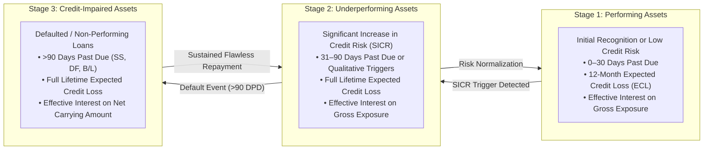

# Compliance Dossier: IFRS-9 Expected Credit Loss (ECL) Engine
## Mathematical Foundations, 3-Stage Impairment Modeling & Regulatory Convergence for Bangladesh Banks

**Document Identifier:** DOC-36-REG-02  
**Regulatory Mandate:** Bangladesh Bank Roadmap for IFRS-9 Financial Instruments Adoption (Mandatory December 31, 2027)  
**Author:** Principal Quantitative Risk Modeler & Chief Credit Risk Architect  
**Publisher:** Unisoft Systems Limited (A Subsidiary of Smart Technologies BD Ltd)  
**Classification:** Authoritative Technical & Regulatory Dossier  
**Version:** 2.0.0  

---

## 1. Executive Summary & The 2027 Regulatory Mandate

Historically, the Bangladesh banking sector operated under the **Incurred Loss Model** (governed by traditional BRPD classification rules), where provisions were recognized only after objective evidence of loss had already materialized (e.g., missed installments exceeding 90 days).

Recognizing the systemic fragility of backward-looking provisioning, **Bangladesh Bank** has issued a strategic directive requiring all scheduled commercial banks and financial institutions to fully implement **IFRS-9 (Financial Instruments)** by **December 31, 2027**.

### The Core Paradigm Shift:
IFRS-9 mandates a forward-looking **Expected Credit Loss (ECL)** framework:
* Provisions must be recognized on **Day 1** of loan origination based on 12-month forward loss expectations.
* Facilities experiencing a **Significant Increase in Credit Risk (SICR)** must immediately recognize full **Lifetime Expected Credit Losses**.

**ULMS v2.0** provides an embedded, automated **IFRS-9 Quantitative Engine** that operates seamlessly alongside Bangladesh Bank’s BRPD Circular 15/2024 rules, enabling banks to run dual parallel provisioning runs without hiring multi-million-dollar external consulting consortiums.

---

## 2. The 3-Stage Impairment Architecture



### Quantitative Stage Transition Rules:
1. **Stage 1 to Stage 2 (SICR Triggers):**
   * **Quantitative Trigger:** Delinquency exceeds 30 Days Past Due (DPD) or internal credit score drops by more than 20% from origination.
   * **Qualitative Trigger:** Borrower placed on watch-list, economic sector downgrade, or central bank CIB default alert on another facility.
2. **Stage 2 to Stage 3 (Default Triggers):**
   * Delinquency exceeds 90 Days Past Due, bankruptcy petition filed, or facility classified as Sub-Standard (SS), Doubtful (DF), or Bad/Loss (B/L) under BRPD 15/2024.
3. **Curing & Upgrades:**
   * Regaining Stage 1 status requires a mandatory probationary seasoning period of at least **6 consecutive regular monthly installments**.

---

## 3. Mathematical ECL Quantification Engine

For any credit exposure $i$ at forward time horizon $t$, the Expected Credit Loss is computed deterministically via the fundamental formula:

$$\text{ECL}_i = \sum_{t=1}^{T} \left( \text{PD}_{i,t} \times \text{LGD}_{i,t} \times \text{EAD}_{i,t} \times \text{DF}_t \right)$$

Where:
* **$\text{PD}_{i,t}$ (Probability of Default):** Point-in-Time (PiT) marginal probability that the borrower defaults in time interval $t$.
* **$\text{LGD}_{i,t}$ (Loss Given Default):** Percentage of exposure lost upon default after netting discounted collateral recoveries.
* **$\text{EAD}_{i,t}$ (Exposure at Default):** Gross exposure expected at the time of default, including accrued interest and undrawn commitments.
* **$\text{DF}_t$ (Discount Factor):** Time-value of money discount factor based on the facility’s Effective Interest Rate (EIR): $\text{DF}_t = \frac{1}{(1 + \text{EIR})^t}$.

---

## 4. Parameter Modeling & Computational Methodologies

### 4.1 Point-in-Time Probability of Default (PD) Modeling
* **Through-the-Cycle (TTC) to Point-in-Time (PiT) Transformation:**  
  ULMS applies a Vasicek single-factor credit model with Vasicek adjustment formula:
  
  $$\text{PD}_{\text{PiT}} = \Phi\left( \frac{\Phi^{-1}(\text{PD}_{\text{TTC}}) - \sqrt{\rho} \cdot Z}{\sqrt{1 - \rho}} \right)$$
  
  *Where $\Phi$ is the standard normal cumulative distribution function, $\rho$ is the asset correlation factor, and $Z$ is the macroeconomic systemic factor.*
* **Forward-Looking Macroeconomic Overlay:**  
  The engine integrates three forward scenarios (Baseline 50%, Bullish 25%, Bearish 25%) factoring Bangladesh GDP growth, inflation, and policy interest rates.

### 4.2 Loss Given Default (LGD) Modeling
* **Formula:** $\text{LGD} = 1 - \frac{\text{PV}(\text{Net Recoveries})}{\text{EAD}}$
* **Haircut Enforcement:** Evaluates forced-sale collateral realization curves with statutory haircuts: Cash (0%), Treasury Bonds (0%), Land/Buildings (20% haircut + 2-year recovery realization lag), Hypothecated Stock (50% haircut).

### 4.3 Exposure at Default (EAD) Modeling
* For amortizing installment loans: EAD equals the remaining principal plus accrued interest at period $t$.
* For revolving limits and overdrafts: EAD includes an automated Credit Conversion Factor (CCF) applied to undrawn sanctioned limits:
  $$\text{EAD} = \text{Drawn Balance} + (\text{Undrawn Limit} \times \text{CCF})$$
  *(Default CCF = 20% for retail lines, 50% for corporate limits per Basel III guidelines).*

---

## 5. Automated Accounting & CBS General Ledger Feeds

Upon completion of the nightly ECL calculation, ULMS determines the incremental impairment variance and stages automated balanced journal vouchers:

```
┌─────────────────────────────────────────────────────────────────────────────┐
│                    IFRS-9 IMPAIRMENT JOURNAL VOUCHER (CBS STAGING)          │
├────────────────────────────────────────┬──────────────────┬─────────────────┤
│ General Ledger Account                 │ Debit (BDT)      │ Credit (BDT)    │
├────────────────────────────────────────┼──────────────────┼─────────────────┤
│ **Impairment Charge on Loans (P&L)**   │ ৳  42,50,000     │        —        │
│ **Allowance for Expected Credit Loss** │        —         │ ৳  42,50,000    │
│ *(Balance Sheet Contra-Asset)*         │                  │                 │
├────────────────────────────────────────┼──────────────────┼─────────────────┤
│ **TOTAL BALANCED JOURNAL ENTRY**       │ **৳ 42,50,000**  │ **৳ 42,50,000** │
└────────────────────────────────────────┴──────────────────┴─────────────────┘
```

---

## 6. Audit Defense & External Auditor Certification

ULMS v2.0 provides dedicated workspaces for external audit firms (Big 4: PwC, EY, KPMG, Deloitte and local audit firms):
1. **Full Traceability:** Every ECL number can be drilled down to individual loan cash-flow schedules, assigned PD transition buckets, and collateral appraisal dates.
2. **Scenario Stress-Testing:** Risk officers can run dynamic "What-If" stress tests modeling economic shocks (e.g., currency depreciation, interest rate hikes) in seconds.
3. **Statutory Dual Reporting:** Generates side-by-side reconciliation tables comparing BRPD 15/2024 statutory provisions vs. IFRS-9 ECL allowances, ensuring seamless transition prior to December 31, 2027.

---

*Unisoft Systems Limited — Quantitative Risk Architecture & Regulatory Engineering.*
