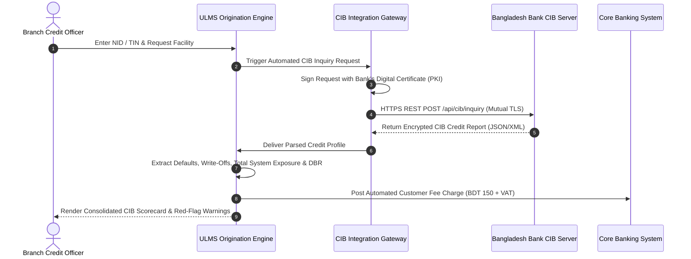

# Regulatory Dossier: CIB Online Real-Time Integration & Reporting
## Machine-to-Machine REST Gateway, Automated Ingestion & Central Bank Batch Return Generation

**Document Identifier:** DOC-37-REG-03  
**Regulatory Mandate:** Bangladesh Bank Credit Information Bureau (CIB) Guidelines & Circulars  
**Author:** Senior Banking Integration Architect & CIB Operations Lead  
**Publisher:** Unisoft Systems Limited (A Subsidiary of Smart Technologies BD Ltd)  
**Classification:** Authoritative Technical & Operational Whitepaper  
**Version:** 2.0.0  

---

## 1. Executive Summary & Operational Context

In Bangladesh banking, inquiring into the **Credit Information Bureau (CIB)** of Bangladesh Bank is a mandatory statutory precondition before the sanction, renewal, or rescheduling of any credit facility.

Historically, commercial banks operate manual CIB cells where branch officers email physical requisition forms to a centralized Head Office team. Designated operators manually log into the Bangladesh Bank web portal, download PDF reports, and email them back—a process consuming **24 to 72 hours** and exposing sensitive financial data to human handling.

**ULMS v2.0** completely eliminates this operational bottleneck through a certified, automated **CIB Online Machine-to-Machine REST Integration Gateway**:
* **Real-Time Automated Inquiries:** Direct API query triggered from the branch onboarding screen, returning structured credit histories in **under 3 seconds**.
* **Zero-Human-Error Parsing:** Converts central bank XML/JSON responses into relational risk metrics, credit scorecards, and cross-default tags.
* **Automated Monthly Reporting:** Compiles and exports central bank monthly Subject and Contract batch files natively.

---

## 2. End-to-End Real-Time Inquiry Architecture

---

## 3. Automated Parsing & Risk Extraction Capabilities

Upon receiving the central bank response, the ULMS CIB parser deterministically extracts and computes key credit metrics:

### 1. Cross-Institution Total Funded & Non-Funded Exposure:
* Aggregates active borrowing across all 62 commercial banks and 35 NBFIs in Bangladesh.
* Categorizes exposure into: Continuous Overdrafts, Term Loans, Credit Cards, Letters of Credit (LC), and Guarantees.

### 2. Default & Litigation History Detection (Hard-Stop Triggers):
* **Active Classified Facilities:** Detects any facility currently tagged as Sub-Standard (SS), Doubtful (DF), or Bad/Loss (B/L) anywhere in the financial system.
* **Historical Write-Offs:** Scans for historical bank write-offs in the borrower’s name or associated business concerns.
* **Artha Rin Adalat Litigation:** Flags active court cases or money loan recovery suits.

### 3. Automated Borrower Deduplication & Group Exposure:
* Matches borrower records using 10-digit Smart NID, 17-digit legacy NID, Tax Identification Number (e-TIN), and Company Registration (RJSC).
* Consolidates sister concerns under the **Single Borrower Exposure Limit (SBEL)** rules of Bangladesh Bank.

---

## 4. Automated Monthly CIB Batch Reporting Engine

Per central bank directives, scheduled banks must submit monthly electronic CIB returns capturing all active borrowers and contract statuses by the 10th of every calendar month.

ULMS v2.0 automates the generation, validation, and encryption of both mandatory central bank files:

| File Code | Central Bank Statement Title | Records Captured | Validation & Export Method |
|---|---|---|---|
| **SUBJECT.TXT** | Master Borrower Demographic & Identity File | NID, TIN, Trade License, Address, Group Linkages | Automated Schema Validator (Enforces the CIB validation rule set (see the CIB validation specification)) |
| **CONTRACT.TXT**| Monthly Credit Facility Performance File | Sanctioned Limit, Outstanding Balance, DPD, Installment Due, Classification Status | Automated Ledger Reconciliation vs. CBS General Ledger |

### Pre-Submission Error Screening Engine:
Before exporting files for central bank transmission, the built-in validator scans for common submission errors that trigger central bank rejections:
* Invalid or duplicate NID formats
* Negative outstanding balance anomalies
* Inconsistent classification codes vs. DPD ranges
* Unmatched contract account numbers

---

## 5. Security, Audit Trail & Statutory Privacy Protection

In compliance with the Bangladesh Bank ICT Security Guidelines V4.0 and central bank CIB regulations:
1. **Mutual TLS & PKI Encryption:** All communications with Bangladesh Bank utilize 256-bit AES encryption over mTLS with hardware security module (HSM) key storage.
2. **Mandatory Borrower Consent Verification:** The system requires an uploaded, signed borrower consent form before permitting an automated CIB inquiry to execute.
3. **Permanent Forensic Audit Log:** Logs the initiating officer ID, timestamp, branch code, customer IP, and purpose of every single CIB query, ready for central bank regulatory inspection.

---

*Unisoft Systems Limited — Banking Integration & Regulatory Infrastructure.*
