# ULMS v2.0 — Master Business Documentation Catalog & Sales Enablement Architecture

**Document Identifier:** DOC-BUS-CAT-001  
**Project:** Unisoft Loan Management System (ULMS v2.0)  
**Target Market:** 62 Scheduled Commercial Banks, 35+ Non-Bank Financial Institutions (NBFIs), and Microfinance Institutions (MFIs) in Bangladesh  
**Authoritative Standard:** Enterprise B2B FinTech Go-To-Market Protocol · QCBS Two-Envelope Banking Procurement (PPR 2008) · MEDDPIC Enterprise Sales Methodology · Bangladesh Bank Regulatory Directives (BRPD 15/2024, IFRS-9 ECL, BFIU e-KYC, ICT Security V4.0)  
**Classification:** Commercial Strategy & Enterprise Revenue Enablement Asset  
**Release Version:** 2.0.0 (Production Build & Commercial Launch Baseline)  
**Date of Release:** October 8, 2026  
**Target Repository:** `C:\software_project\mim_project\LMS\business_document\`  
**Publisher:** Unisoft Systems Limited (A Subsidiary of Smart Technologies BD Ltd)  
**Corporate Headquarters:** Youth Tower, Begum Rokeya Sarani, Dhaka-1216, Bangladesh  

---

## Document Control

| Attribute | Specification |
|---|---|
| **Document Title** | Master Business Documentation Catalog & Sales Enablement Architecture |
| **System Name** | Unisoft Loan Management System (ULMS v2.0) |
| **Document ID** | DOC-BUS-CAT-001 |
| **Release Version** | 2.0.0 (Commercial Go-To-Market & Banking Sales Expansion Baseline) |
| **Document Classification** | Commercial Confidential / Revenue Strategy Asset |
| **Document Status** | Approved Master Specification & Go-To-Market Catalog |
| **Prepared By** | Principal Enterprise Solution Architect, Head of Business Development & Lead Technical Writer |
| **Reviewed By** | Chief Commercial Officer (CCO), Head of Banking Solutions & Chief Technology Officer (CTO) |
| **Approved By** | Managing Director, Unisoft Systems Limited |
| **Target Audience** | Enterprise Sales Directors, Account Executives, Pre-Sales Solution Architects, Bid & Tender Managers, Product Marketers, Bank Executive Buying Committees |
| **Authority Order** | `Compliance_Validation_Matrix.md` → `Software_Requirements_Specification.md` → `Business_Requirements_Document_LMS.md` → `LMS_CODEBASE/PLANNING/` → `MASTER_TECHNICAL_DOCUMENTATION_CATALOG.md` → `MASTER_BUSINESS_DOCUMENTATION_CATALOG.md` |

---

## 1. Executive Summary & Market Opportunity

### 1.1 The Macro Banking Context in Bangladesh
The banking sector in Bangladesh stands at an unprecedented digital crossroads. Comprising **62 scheduled commercial banks**, over **35 licensed Non-Bank Financial Institutions (NBFIs)**, and an expansive microfinance ecosystem, the sector manages an aggregate credit portfolio exceeding **BDT 16.5 Lakh Crore (USD ~140 Billion)**.

```
┌─────────────────────────────────────────────────────────────────────────────┐
│                 BANGLADESH SCHEDULED BANKING SECTOR AT A GLANCE             │
├─────────────────────────────────────┬───────┬───────────────────────────────┤
│ Institutional Category              │ Count │ Representative Institutions   │
├─────────────────────────────────────┼───────┼───────────────────────────────┤
│ Private Commercial Banks (Conventional)│  33   │ BRAC, City, DBBL, EBL, Bank Asia│
│ Private Commercial Banks (Islamic)  │  10   │ Islami Bank, Al-Arafah, EXIM  │
│ State-Owned Commercial Banks (SOCBs)│   6   │ Sonali, Janata, Agrani, Rupali│
│ Specialized Development Banks (SDBs)│   3   │ Krishi Bank, RAKUB, PKB       │
│ Foreign Commercial Banks (FCBs)     │   9   │ Standard Chartered, HSBC, Citi│
├─────────────────────────────────────┼───────┼───────────────────────────────┤
│ Total Scheduled Commercial Banks    │  62   │ Primary Target Market         │
└─────────────────────────────────────┴───────┴───────────────────────────────┘
```

Despite rapid customer digitization, loan origination and lifecycle servicing across most domestic banks remain heavily encumbered by manual documentation, disconnected spreadsheets, physical Branch Officers Credit Committee (BOCC) dossiers, and disjointed legacy Core Banking Systems (CBS). This has contributed to critical operational vulnerabilities:
1. **Prolonged Turnaround Times (TAT):** Average retail loan processing requires 14–21 business days; SME and commercial loans often exceed 45 days.
2. **Mounting Non-Performing Loans (NPLs):** Total gross non-performing loans in the banking system reached an alarming 12.5% in 2025/2026, driven by weak pre-sanction early-warning screening and disjointed credit bureau inquiries.
3. **Severe Regulatory Penalties:** Bangladesh Bank has tightened supervision with mandatory directives, notably **BRPD Circular 15/2024** (enforcing a strict 7-stage classification framework from STD-0 to Bad/Loss) and the impending deadline of **December 31, 2027 for mandatory IFRS-9 Expected Credit Loss (ECL)** forward-looking provisioning.
4. **Exorbitant Foreign Software Costs:** Legacy multinational LMS solutions (such as Finastra Fusion Loan IQ, Temenos LMS, Nucleus Software FinnOne Neo, and Infosys Finacle Lending) impose exorbitant capital expenditure ($3M–$7M USD), recurring dollar-denominated license drains, multi-year implementation cycles, and inadequate local support in Dhaka.

### 1.2 The ULMS v2.0 Value Proposition
The **Unisoft Loan Management System (ULMS v2.0)**, engineered by **Unisoft Systems Limited** (a premier technology enterprise of **Smart Technologies BD Ltd**), directly resolves these banking bottlenecks:
* **100% Bangladesh Bank Regulatory Alignment:** Native, pre-configured compliance with BRPD Circular 15/2024, automated Credit Information Bureau (CIB) Online REST integration, BFIU e-KYC biometric matching, and automated IFRS-9 ECL Stage 1/2/3 staging algorithms.
* **Radical Cost Advantage (70–85% Lower TCO):** Delivered at a fraction of foreign vendor costs with zero foreign currency licensing liabilities.
* **Rapid Deployment Velocity:** Pre-built integration connectors for prevailing Core Banking Systems in Bangladesh (Temenos T24, Oracle FLEXCUBE, Finacle, Flora Bank, BankUltimus) enabling pilot branch go-live within 12 weeks.
* **Local 24/7 Enterprise Engineering Support:** Dedicated Tier-1, Tier-2, and Tier-3 engineering and regulatory support teams based permanently in Dhaka (Youth Tower, Begum Rokeya Sarani).
* **Dual-Banking Engine:** Seamlessly supports both Conventional Interest-Bearing loans and Shariah-Compliant Islamic Financing modes (Murabaha, Ijara, Musharaka, Mudaraba, Bai-Muajjal).

### 1.3 Purpose of the Master Business Documentation Catalog
This master catalog serves as the **authoritative operational blueprint and inventory** for all sales and marketing documentation. It equips the revenue team, pre-sales engineers, bid managers, and executive leadership with an collateral library (21 of 42 planned documents authored in this release) designed to guide prospective banks through every phase of the institutional buying journey—from initial executive awareness to final procurement award and delivery handoff.

---

## 2. Enterprise Banking Sales & Procurement Lifecycle Framework

Enterprise software sales in the banking sector follow a highly structured, risk-averse procurement cycle governed by the **Public Procurement Rules (PPR 2008)** and internal Bank Board ICT Purchase Policies. The typical deal cycle spans **6 to 12 months** and involves multi-departmental committees.

```mermaid
flowchart TD
    subgraph S1 ["Stage 1: Awareness & Market Positioning"]
        M1["Thought Leadership Whitepapers"]
        M2["Product Brochures & One-Pagers"]
        M3["Corporate Profile & Banking Credentials"]
    end

    subgraph S2 ["Stage 2: Outreach & Deal Qualification"]
        Q1["Multi-Touch Outbound Cadences"]
        Q2["MEDDPIC Qualification Matrix"]
        Q3["Persona-Specific Problem Statements"]
    end

    subgraph S3 ["Stage 3: Technical & Business Demonstration"]
        D1["Role-Based Master Demo Scripts"]
        D2["Segment Solution Briefs (Retail, SME, Islamic)"]
        D3["Competitive Battlecards & Objection Handlers"]
    end

    subgraph S4 ["Stage 4: Formal Tender & QCBS Bidding"]
        B1["Envelope-1: Master Technical Proposal"]
        B2["Envelope-2: Formatted Financial Proposal"]
        B3["100+ Point Functional Compliance Matrix"]
        B4["Vendor Pre-Qualification & Tax Dossier"]
    end

    subgraph S5 ["Stage 5: Commercial & ROI Justification"]
        C1["5-Year TCO & ROI Financial Calculator"]
        C2["Tiered Licensing & AMC Framework"]
        C3["Board & MANCOM Justification Deck"]
    end

    subgraph S6 ["Stage 6: Risk Assurance & PoC Validation"]
        R1["BRPD 15/2024 & IFRS-9 Regulatory Dossiers"]
        R2["CIB & e-KYC Security Assurance Whitepapers"]
        R3["2-Week PoC Charter & Acceptance Criteria"]
    end

    subgraph S7 ["Stage 7: Contract Award & Handoff"]
        K1["Master Software License Agreement (MSLA)"]
        K2["Service Level Agreement (SLA) Schedule"]
        K3["Sales-to-Implementation Handoff Protocol"]
    end

    S1 --> S2 --> S3 --> S4 --> S5 --> S6 --> S7
```



### The Seven Operational Stages of the ULMS Sales Motion:
1. **Stage 1: Strategic Market Positioning & Brand Awareness (Pre-Engagement):** Establishing Unisoft as the unquestioned national authority on digital lending, banking technology, and regulatory engineering.
2. **Stage 2: Targeted Outreach & MEDDPIC Qualification (Discovery):** Identifying bank-specific pain points (e.g., rising SME NPLs, manual CIB delays) and qualifying economic buyers.
3. **Stage 3: Solution Mapping & Master Product Demonstrations (Evaluation):** Delivering role-based demonstrations that prove how ULMS slashes loan processing time from 21 days to under 48 hours.
4. **Stage 4: Formal Tender Bidding & QCBS Proposal Defense (Procurement):** Submitting airtight, two-envelope technical and financial bids that achieve maximum technical evaluation scores (>90/100).
5. **Stage 5: Commercial Structuring & CFO/Board ROI Justification (Business Case):** Providing defensible financial models demonstrating a sub-9-month payback period and modeled 5-year IRR ≈179% (DOC-32).
6. **Stage 6: Regulatory Assurance, Risk Clearance & PoC Validation (Due Diligence):** Assuring the Chief Risk Officer (CRO), Chief Information Officer (CIO), and Head of Internal Control & Compliance (ICC) through compliance dossiers and controlled, bounded Proofs of Concept.
7. **Stage 7: Contract Execution, SLA Finalization & Delivery Handoff (Closing):** Executing standard institutional contracts and conducting formal handoffs to the Unisoft implementation engineering team.

---

## 3. Master Folder Tree Structure

All business, sales, and marketing collateral shall be maintained under `C:\software_project\mim_project\LMS\business_document\` adhering to the deterministic directory hierarchy detailed below:

```
c:\software_project\mim_project\LMS\business_document\
│
├── MASTER_BUSINESS_DOCUMENTATION_CATALOG.md   # [This Document] Master Index & Architectural Catalog
├── README.md                                  # Executive Overview & Sales Team Quick-Start Navigator
│
├── 01_strategic_marketing/                    # CAT-01: Strategic Positioning & Brand Authority
│   ├── README.md                              # Category Index & Asset Summary
│   ├── DOC-01_Product_Overview_Brochure.md    # Executive Product Brochure & High-Level Feature Grid
│   ├── DOC-02_Corporate_Profile_Deck.md       # Master Banking Credentials & Unisoft Enterprise Profile
│   ├── DOC-03_Executive_One_Pager_Why_ULMS.md # C-Suite Decision Brief (Cost, Compliance, Velocity)
│   ├── DOC-04_Market_Research_Whitepaper.md   # Bangladesh Digital Lending Sector Report 2026
│   ├── DOC-05_Case_Study_Tier1_Bank.md        # ABC Bank Bangladesh Core Transformation Story
│   └── DOC-06_Press_Release_Launch_Kit.md     # Official Media Announcement & Public Relations Pack
│
├── 02_sales_enablement/                       # CAT-02: Sales Playbooks, Qualification & Battlecards
│   ├── README.md                              # Category Index & Asset Summary
│   ├── DOC-07_Enterprise_Sales_Playbook.md    # Master End-to-End Sales Operating Manual
│   ├── DOC-08_Buyer_Persona_Matrix.md         # Multi-Stakeholder Buying Committee Profiles (CRO/CIO/CFO)
│   ├── DOC-09_MEDDPIC_Deal_Qualification.md   # Deal Qualification Scorecard & Discovery Questions
│   ├── DOC-10_Objection_Handling_Battlecard.md# Pre-Scripted Answers to 25+ Banking Objections
│   ├── DOC-11_Battlecard_ULMS_vs_Finastra.md  # Competitive Win Sheet: Finastra Fusion Loan IQ
│   ├── DOC-12_Battlecard_ULMS_vs_Temenos.md   # Competitive Win Sheet: Temenos Transact & LMS
│   ├── DOC-13_Battlecard_ULMS_vs_FinnOne.md   # Competitive Win Sheet: Nucleus Software FinnOne Neo
│   ├── DOC-14_Battlecard_ULMS_vs_Finacle.md   # Competitive Win Sheet: Infosys Finacle Lending
│   └── DOC-15_Outbound_Outreach_Cadence.md    # 8-Touch Multi-Channel Outreach Sequences (Email/Phone)
│
├── 03_demos_and_solutions/                    # CAT-03: Demonstration Scripts & Segment Solutions
│   ├── README.md                              # Category Index & Asset Summary
│   ├── DOC-16_Master_Demo_Script_Role_Based.md# End-to-End Demo Script (Branch to Managing Director)
│   ├── DOC-17_Interactive_Demo_Clickpath.md   # Step-by-Step UI Navigation & Live Sandbox Guide
│   ├── DOC-18_Solution_Brief_Retail.md        # Segment Brief: Retail Loans, Cards & Mortgages
│   ├── DOC-19_Solution_Brief_MSME_Agri.md     # Segment Brief: MSME, Factoring & Agri Finance
│   ├── DOC-20_Solution_Brief_Islamic.md       # Segment Brief: Shariah-Compliant Murabaha/Ijara/Musharaka
│   ├── DOC-21_Solution_Brief_Corporate.md     # Segment Brief: Corporate Syndicated & Consortium Credit
│   └── DOC-22_Solution_Brief_Digital_Nano.md  # Segment Brief: MFS-Embedded Micro-Credit (bKash/Nagad)
│
├── 04_rfp_and_tenders/                        # CAT-04: Enterprise RFP, Tender & Bidding Library
│   ├── README.md                              # Category Index & Asset Summary
│   ├── DOC-23_Master_RFP_Technical_Proposal.md# Envelope-1: Master Technical Proposal Template
│   ├── DOC-24_Master_RFP_Financial_Proposal.md# Envelope-2: Master Commercial Proposal & Price Schedules
│   ├── DOC-25_Vendor_PreQualification_EOI.md  # Expression of Interest (EOI) & Statutory Profile
│   ├── DOC-26_Functional_Compliance_Matrix.md # 100-Point Out-of-the-Box Requirement Library
│   ├── DOC-27_Architecture_Integration_Annex.md# Technical Architecture, CBS & External Rail Annex
│   ├── DOC-28_ICT_Security_Compliance_Annex.md# BB ICT Guidelines V4.0 & ISO 27001 Security Dossier
│   ├── DOC-29_Implementation_Methodology.md   # 12-Week Pilot & Phased Rollout Governance Charter
│   └── DOC-30_SLA_Local_Support_Framework.md  # Disaster Recovery, High Availability & Support Commitments
│
├── 05_commercial_and_pricing/                 # CAT-05: Pricing Models, TCO Calculators & Contracts
│   ├── README.md                              # Category Index & Asset Summary
│   ├── DOC-31_Commercial_Pricing_Matrix.md    # Tiered Pricing Models (Scheduled PCB (Conv.), Islamic PCB, NBFI-Digital)
│   ├── DOC-32_TCO_and_ROI_Calculator_Guide.md # 5-Year Financial Justification & Break-Even Calculator
│   ├── DOC-33_Professional_Services_Rate_Card.md# Customization, Migration & Consulting Rate Card
│   └── DOC-34_AMC_Support_Tier_Agreement.md   # 20% Annual Maintenance Contract Terms & Escalations
│
├── 06_regulatory_whitepapers/                 # CAT-06: Bangladesh Bank Compliance & Risk Dossiers
│   ├── README.md                              # Category Index & Asset Summary
│   ├── DOC-35_BRPD_15_2024_Compliance_Paper.md# 7-Stage Classification & Auto-Provisioning Whitepaper
│   ├── DOC-36_IFRS9_ECL_Calculation_Dossier.md# Forward-Looking Staging & Expected Credit Loss Engine
│   ├── DOC-37_CIB_Online_Integration_Dossier.md# Automated Inquiry, Return Batching & Dedupe Protocol
│   └── DOC-38_AML_eKYC_BFIU_Compliance_Paper.md# Biometric NIDW, PEP Screening & Beneficial Ownership
│
└── 07_poc_and_contracting/                    # CAT-07: Proof of Concept, Contracting & Handoff
    ├── README.md                              # Category Index & Asset Summary
    ├── DOC-39_PoC_Evaluation_Charter.md       # 14-Day Proof of Concept Scope & Success Criteria
    ├── DOC-40_Master_Software_License_Agrmt.md# Enterprise Master Software License Agreement (MSLA)
    ├── DOC-41_Service_Level_Agreement_Contract.md# Legally Enforceable Institutional SLA Schedule
    └── DOC-42_Sales_to_Delivery_Handoff.md    # Transition Charter from Sales to Implementation Team
```

---

## 4. Master Categorical Taxonomy & Document Index

The business documentation program plans 42 documents across seven strategic categories; 21 are authored in this release (gaps in DOC numbering = planned, not shipped):

| Category ID | Category Name | Primary Objective | Sales Funnel Stage | Target Document Count | Document Code Range |
|---|---|---|---|---|---|
| **CAT-01** | **Strategic Market Positioning & Brand Collateral** | Establish market leadership and executive credibility | Pre-Sales / Awareness | 6 Documents | `DOC-01` to `DOC-06` |
| **CAT-02** | **Sales Enablement, Playbooks & Discovery Toolkit** | Equip sales reps with qualification playbooks and competitor battlecards | Discovery & Qualification | 9 Documents | `DOC-07` to `DOC-15` |
| **CAT-03** | **Product Demos, Solutions & Segment Collateral** | Deliver compelling demonstrations and tailor solutions to bank business lines | Solution Mapping & Demo | 7 Documents | `DOC-16` to `DOC-22` |
| **CAT-04** | **Enterprise Bid, RFP & Tender Master Library** | Supply pre-packaged, winning responses for banking tenders | Formal Tender Bidding | 8 Documents | `DOC-23` to `DOC-30` |
| **CAT-05** | **Commercial Models, Pricing & TCO/ROI Justification** | Provide defensible financial structures, pricing, and ROI proof | Commercial Negotiation | 4 Documents | `DOC-31` to `DOC-34` |
| **CAT-06** | **Regulatory Alignment & Risk Assurance Whitepapers** | Satisfy compliance, risk, and legal gatekeepers with technical proof | Due Diligence & Clearance | 4 Documents | `DOC-35` to `DOC-38` |
| **CAT-07** | **Proof of Concept (PoC), Contracting & Onboarding** | Bounded evaluation, institutional contracting, and clean delivery handoff | Deal Closing & Handoff | 4 Documents | `DOC-39` to `DOC-42` |

---

## 5. Exhaustive Specification of Essential Documents (DOC-01 to DOC-42)

---

### CATEGORY 1: STRATEGIC MARKET POSITIONING & BRAND COLLATERAL (CAT-01)

<a id="doc-01"></a>
<a id="doc-01"></a>
#### DOC-01: Product Overview Brochure & Solution Brief
* **Target File Path:** `business_document/01_strategic_marketing/DOC-01_Product_Overview_Brochure.md`
* **Lifecycle Phase:** Awareness & Inbound Lead Generation
* **Target Audience:** Managing Directors, Deputy Managing Directors (DMDs), Chief Operating Officers (COOs), Heads of Credit
* **Operational Purpose:** A high-impact, visual executive document summarizing the ULMS platform capabilities, core architectural highlights, measurable business outcomes, and Bangladesh banking suitability.
* **Detailed Table of Contents:**
  1. Executive Problem Statement: The Crisis of Manual Lending in Bangladesh
  2. Introducing ULMS v2.0: The Next-Generation Core Lending Platform
  3. Four Pillars of Value: Operational Velocity, Regulatory Immunity, Cost Leadership, Seamless Interoperability
  4. Core Module Architecture: Origination, Assessment, Approval, Servicing, Collections, Regulatory Returns
  5. Dual-Engine Capability: Conventional vs. Islamic Shariah Financing Modes
  6. Key Architectural Highlights: Modular Monolith, Open REST APIs, On-Premises Air-Gapped Deployment
  7. Proven Financial Metrics: 85% TAT Reduction, 40% Underwriting Efficiency Gain, Zero Compliance Penalties
  8. Unisoft Systems Limited: Institutional Pedigree, Parent Company Backing, and Client Footprint
* **Core Value Proposition:** Position ULMS as the only enterprise-grade digital lending platform designed natively for Bangladesh regulations, combining global architectural excellence with hyper-local operational compliance.
* **Required Inputs & Exhibits:** High-level platform infographic, module topology grid, customer impact metrics chart.
* **Maintenance Owner:** Lead Product Marketer (Quarterly Update).

<a id="doc-02"></a>
<a id="doc-02"></a>
#### DOC-02: Corporate Profile & Banking Credentials Deck
* **Target File Path:** `business_document/01_strategic_marketing/DOC-02_Corporate_Profile_Deck.md`
* **Lifecycle Phase:** Credibility Building & Initial Executive Pitch
* **Target Audience:** Bank Board Members, Managing Directors, ICT Procurement Committee Chairs
* **Operational Purpose:** Comprehensive corporate profile demonstrating Unisoft's financial stability, parent company strength (Smart Technologies BD Ltd), 10-year track record, 150+ successful deployments, and national enterprise software leadership.
* **Detailed Table of Contents:**
  1. Corporate Identity & Vision: Building Tomorrow’s Technology Today
  2. Ownership & Financial Strength: Backed by Smart Technologies BD Ltd (Annual Group Turnover > ৳2,000 Crore)
  3. 10-Year Journey of Excellence: Milestones from 2015 to 2026
  4. Core Competencies & Enterprise Products: UniVAT (NBR Approved), ERP, Microfinance, ULMS
  5. Banking & Financial Sector Footprint: Live Implementations and Industry References
  6. Engineering Excellence: 40+ Certified Enterprise Software Engineers & Financial Analysts
  7. Physical Infrastructure: Corporate Headquarters at Youth Tower, Begum Rokeya Sarani, Dhaka
  8. Quality Certifications & Standards: ISO 9001, ISO 27001, CMMI-aligned engineering lifecycle
* **Core Value Proposition:** Reassure bank leadership that Unisoft is a long-term, financially secure, institutional technology partner capable of sustaining mission-critical core banking infrastructure for decades.
* **Required Inputs & Exhibits:** Corporate organizational chart, NBR VAT approval certificate, financial statements summary, office photography.
* **Maintenance Owner:** Head of Business Development (Semi-Annual Update).

<a id="doc-03"></a>
<a id="doc-03"></a>
#### DOC-03: Executive One-Pager: Why ULMS v2.0
* **Target File Path:** `business_document/01_strategic_marketing/DOC-03_Executive_One_Pager_Why_ULMS.md`
* **Lifecycle Phase:** Executive Engagement & Leave-Behind
* **Target Audience:** Bank Managing Directors, CEOs, Board ICT Committee Members
* **Operational Purpose:** A scannable, single-page executive decision summary contrasting ULMS against legacy approaches and global vendor monoliths.
* **Detailed Table of Contents:**
  1. The 30-Second Elevator Pitch: What is ULMS v2.0?
  2. The Executive Challenge: Skyrocketing NPLs, BRPD 15/2024 Deadlines, and Crushing Legacy IT Costs
  3. Why Legacy Foreign Monoliths Fail in Bangladesh: Multi-Million Dollar Drains, Inflexible Customization, Offshore Support Delays
  4. The ULMS Advantage Matrix: 100% Local Compliance, 80% Lower TCO, 12-Week Go-Live, Dhaka 24/7 Engineers
  5. Quantified ROI Snapshot: Payback 6.64 months (base) / 8.5 months (conservative); 5-year net benefit ৳48.23 Crore (DOC-32)
  6. Strategic Next Step: Request a Customized 45-Minute Executive Briefing & Live Demonstration
* **Core Value Proposition:** Provide busy C-level executives with immediate, undeniable business justification for choosing ULMS over multinational alternatives.
* **Required Inputs & Exhibits:** Executive comparison table (ULMS vs. Global Monoliths vs. In-House Legacy).
* **Maintenance Owner:** Chief Commercial Officer (Monthly Review).

<a id="doc-04"></a>
<a id="doc-04"></a>
#### DOC-04: Market Research Whitepaper: The State of Digital Lending in Bangladesh 2026
* **Target File Path:** `business_document/01_strategic_marketing/DOC-04_Market_Research_Whitepaper.md`
* **Lifecycle Phase:** Thought Leadership & Industry Event Distribution
* **Target Audience:** Heads of Retail Banking, Heads of SME, Chief Risk Officers, Banking Journalists, Bangladesh Bank Observers
* **Operational Purpose:** An authoritative research report analyzing lending trends, regulatory pressures, NPL patterns, and digital transformation benchmarks across the 62 scheduled banks in Bangladesh.
* **Detailed Table of Contents:**
  1. Executive Summary & Macroeconomic Climate (Post-2024 Banking Reforms)
  2. Analysis of the BDT 16.5 Trillion Credit Portfolio: Growth Vectors and Asset Quality Challenges
  3. The Regulatory Tsunami: BRPD Circular 15/2024, IFRS-9 ECL Mandates, and the 2027 Cashless Roadmap
  4. The Digital Lending Maturity Curve: Benchmarking 62 Scheduled Banks Across 4 Tiers
  5. The MSME Credit Gap: Why Manual Underwriting Excludes BDT 3.5 Trillion in Potential Credit Demand
  6. Technology Enablers: Automated CIB Deduplication, AI-Assisted Debt Burden Ratio (DBR), Micro-Credit Rails
  7. The Path to Sustainable Profitability: Modernizing Core Lending Infrastructure Without Displacing Core Banking
  8. Unisoft’s Strategic Recommendations for Commercial Bank Leadership
* **Core Value Proposition:** Establish Unisoft as thought leaders who possess deeper insights into the structural challenges of Bangladesh banking than any foreign vendor.
* **Required Inputs & Exhibits:** Bangladesh Bank statistical data, industry growth charts, regulatory timeline roadmap.
* **Maintenance Owner:** Head of Research & Industry Solutions (Annual Update).

<a id="doc-05"></a>
<a id="doc-05"></a>
#### DOC-05: Customer Success Case Study: Tier-1 Private Commercial Bank
* **Target File Path:** `business_document/01_strategic_marketing/DOC-05_Case_Study_Tier1_Bank.md`
* **Lifecycle Phase:** Validation, Trust Building & Late-Stage Sales Defense
* **Target Audience:** Procurement Evaluation Committees, Heads of Credit, Chief Risk Officers
* **Operational Purpose:** An in-depth, metrics-grounded transformation case study detailing how a prominent scheduled commercial bank (ABC Bank Bangladesh) replaced manual paper origination with ULMS.
* **Detailed Table of Contents:**
  1. Client Profile: Scheduled Private Commercial Bank with 120+ Branches and ৳12,000 Crore Loan Portfolio
  2. Pre-Implementation Dilemma: 21-Day Retail TAT, Manual BOCC Folders, 8% NPL Rate, Stalled Audit Filings
  3. Evaluation & Selection: Why ABC Bank Rejected Multinational Vendors in Favor of ULMS
  4. Phased Implementation Journey: 12-Week Pilot in 10 Urban & Rural Branches; Full Rollout in 6 Months
  5. Core Integrations Delivered: Flora Bank CBS, CIB Online REST, Election Commission NIDW, bKash Gateway
  6. Verified Quantitative Outcomes: TAT Dropped to 48 Hours, NPLs Reduced by 1.8%, 100% Clean Audit by Bangladesh Bank
  7. Testimonial Quotes: Managing Director, Head of Credit Operations, Chief Information Officer
* **Core Value Proposition:** Social proof and de-risking: Proves that ULMS is already tested, proven, and operational in a rigorous real-world Bangladesh banking environment.
* **Required Inputs & Exhibits:** Before-and-after operational metrics, workflow progression chart, customer executive quotes.
* **Maintenance Owner:** Senior Solutions Consultant (Semi-Annual Review).

<a id="doc-06"></a>
<a id="doc-06"></a>
#### DOC-06: Press Release & Product Launch Announcement Kit
* **Target File Path:** `business_document/01_strategic_marketing/DOC-06_Press_Release_Launch_Kit.md`
* **Lifecycle Phase:** Brand Marketing, PR & Industry Media Distribution
* **Target Audience:** Financial Journalists (The Daily Star, Financial Express, Prothom Alo), Banking Analysts, Fintech Media
* **Operational Purpose:** Standardized media kit and official press release templates announcing major version milestones, banking partnerships, and awards.
* **Detailed Table of Contents:**
  1. Master Press Release: Unisoft Launches ULMS v2.0 to Revolutionize Core Digital Lending in Bangladesh
  2. Executive Quotes: Chairman of Smart Technologies BD Ltd & Managing Director of Unisoft Systems
  3. Key Product Highlights & Regulatory Grounding
  4. Media Fact Sheet: Unisoft Systems Limited by the Numbers
  5. High-Resolution Asset Links: Product Screenshots, Executive Portraits, Corporate Logos
  6. Media Contact Information & Press Inquiry Protocol
* **Core Value Proposition:** Ensure consistent, professional, high-impact public relations messaging across all national media channels.
* **Required Inputs & Exhibits:** Official media boilerplate, executive quotes, media contact details.
* **Maintenance Owner:** Corporate Communications Lead.

---

### CATEGORY 2: SALES ENABLEMENT, PLAYBOOKS & DISCOVERY TOOLKIT (CAT-02)

<a id="doc-07"></a>
<a id="doc-07"></a>
#### DOC-07: Enterprise Sales Playbook (End-to-End Methodology)
* **Target File Path:** `business_document/02_sales_enablement/DOC-07_Enterprise_Sales_Playbook.md`
* **Lifecycle Phase:** Internal Sales Training & Operations
* **Target Audience:** Account Executives, Sales Directors, Business Development Managers, Pre-Sales Engineers
* **Operational Purpose:** The definitive, step-by-step operational manual for executing the ULMS sales motion from account mapping to contract close.
* **Detailed Table of Contents:**
  1. The ULMS Sales Philosophy: The Trusted Advisory Partner vs. Transactional Vendor
  2. Target Market Segmentation: Tier-1 PCBs, Tier-2 PCBs, Islamic Banks, SOCBs, NBFIs
  3. The 7-Stage Sales Lifecycle: Detailed Entrance Criteria, Action Steps, Exit Criteria, and Deliverables
  4. Account Mapping: How to Navigate Bank Hierarchies and Identify Hidden Gatekeepers
  5. Multi-Threading Strategy: Managing Parallel Relationships Across Business, IT, Risk, and Procurement
  6. Deal Velocity Acceleration: Overcoming Stalled Procurement Committees and Audit Freezes
  7. Key Sales Metrics & Pipeline Governance: Stage Probabilities, Forecast Rules, CRM Cadence
  8. Post-Deal Transition Protocol: Ensuring Seamless Handover to Engineering
* **Core Value Proposition:** Provide sales reps with an institutional operating rhythm that eliminates ad-hoc selling and maximizes win rates across long banking deal cycles.
* **Required Inputs & Exhibits:** Sales stage gate checklist, pipeline velocity chart, account mapping template.
* **Maintenance Owner:** Head of Business Development (Quarterly Review).

<a id="doc-08"></a>
<a id="doc-08"></a>
#### DOC-08: Buyer Persona & Buying Committee Decision Matrix
* **Target File Path:** `business_document/02_sales_enablement/DOC-08_Buyer_Persona_Matrix.md`
* **Lifecycle Phase:** Account Discovery & Pitch Customization
* **Target Audience:** Sales Account Executives, Solution Architects, Content Marketers
* **Operational Purpose:** Deep psychiatric and functional analysis of each key member of a bank’s buying committee, mapping their KPIs, fears, objections, and winning proof points.
* **Detailed Table of Contents:**
  1. Overview of the Bank Buying Committee Dynamics (Consensus-Driven, Risk-Averse, Bureaucratic)
  2. Persona 1: The Managing Director / CEO (Visionary, Profitability-Driven, Market Share Focused)
  3. Persona 2: The Chief Risk Officer (CRO) (Asset Quality, NPL Mitigation, Audit Defense, Conservative)
  4. Persona 3: The Chief Information Officer (CIO/CTO) (Architecture, Integration, Security, Infrastructure Load)
  5. Persona 4: The Chief Financial Officer (CFO) (CapEx vs. OpEx, TCO, Forex Risk, ROI, Payback Horizon)
  6. Persona 5: Head of Credit Operations / Retail / SME (Turnaround Time, Manual Workload, BOCC Automation)
  7. Persona 6: Head of Islamic Banking (Shariah Compliance, Murabaha Accounting, Shariah Board Audit)
  8. Persona 7: Head of Internal Control & Compliance (ICC) (Bangladesh Bank Circulars, Audit Trails, Fraud Prevention)
  9. Persona 8: Head of Procurement / Tender Committee (PPR 2008 Rules, Lowest Evaluated Bid, Vendor Viability)
  10. Cross-Persona Alignment Matrix: How to Build Consensus Across Competing Agendas
* **Core Value Proposition:** Enable sales reps to tailor messaging with surgical precision to whoever sits across the table, neutralizing blockers before they emerge.
* **Required Inputs & Exhibits:** Persona comparison tables, stakeholder map diagram.
* **Maintenance Owner:** Lead Product Marketer (Quarterly Review).

<a id="doc-09"></a>
<a id="doc-09"></a>
#### DOC-09: MEDDPIC Deal Qualification & Discovery Questionnaire
* **Target File Path:** `business_document/02_sales_enablement/DOC-09_MEDDPIC_Deal_Qualification.md`
* **Lifecycle Phase:** Initial Meeting & Deal Qualification
* **Target Audience:** Enterprise Account Executives, Solution Consultants
* **Operational Purpose:** A rigorous qualification framework tailored specifically for banking software deals to eliminate unqualified leads and focus on high-probability opportunities.
* **Detailed Table of Contents:**
  1. Introduction to MEDDPIC in Bangladesh Banking Sales
  2. **M — Metrics:** Uncovering the Economic Quantifiers (Current TAT, NPL Ratio, Annual IT Budget, File Volumes)
  3. **E — Economic Buyer:** Identifying and Engaging the Sole Decision Maker (MD, Board ICT Committee Chair)
  4. **D — Decision Criteria:** Mapping Technical, Functional, Financial, and Compliance Benchmarks
  5. **D — Decision Process:** Documenting the Formal Steps (Evaluation Committee, Board Approval, Tender Notice)
  6. **P — Paper Process:** Understanding the Legal, Contracting, and Procurement Flow (PPR 2008, E-Tender, Security Review)
  7. **I — Identify Pain:** Isolating the Critical Event (Upcoming Bangladesh Bank Audit, NPL Crisis, Core Banking Failure)
  8. **C — Champion:** Nurturing and Equipping Internal Advocates (e.g., Forward-Thinking Head of Retail or CTO)
  9. Comprehensive 50-Question Discovery Questionnaire: Categorized by Business, Technical, and Risk Domains
  10. Opportunity Scoring Rubric (Red / Amber / Green Exit Gates)
* **Core Value Proposition:** Prevent sales reps from wasting months chasing dead or unqualified bank deals, enforcing discipline and pipeline predictability.
* **Required Inputs & Exhibits:** MEDDPIC scorecard template, discovery interview scripts.
* **Maintenance Owner:** Head of Business Development.

<a id="doc-10"></a>
<a id="doc-10"></a>
#### DOC-10: Objection Handling & Risk Mitigation Battlecard
* **Target File Path:** `business_document/02_sales_enablement/DOC-10_Objection_Handling_Battlecard.md`
* **Lifecycle Phase:** Discovery, Demo & Negotiation
* **Target Audience:** Account Executives, Solution Engineers, Technical Sales Consultants
* **Operational Purpose:** Pre-scripted, battle-tested responses to the top 25+ objections raised by bank stakeholders regarding local software, security, migration risks, and pricing.
* **Detailed Table of Contents:**
  1. Objection Taxonomy: Corporate Viability, Technical Architecture, Regulatory Risk, Pricing, Switching Costs
  2. Category A: "Why should we trust a local software company over global giants like Finastra or Temenos?"
  3. Category B: "Will this integrate with our existing Core Banking System (e.g., T24, FLEXCUBE, Finacle)?"
  4. Category C: "How do we know ULMS complies 100% with Bangladesh Bank’s newest BRPD Circular 15/2024?"
  5. Category D: "Our IT policy strictly prohibits cloud deployments. Can ULMS run completely on-premise in our private datacenter?"
  6. Category E: "Can our existing staff easily learn and configure the system without hiring developers?"
  7. Category F: "What happens if Bangladesh Bank changes a circular next month? Who updates the software?"
  8. Category G: "We already have an in-house lending workflow built by our IT team. Why buy ULMS?"
  9. Category H: "Your price is higher than small local custom software shops. Why pay more for ULMS?"
  10. The 4-Step Objection De-escalation Protocol (Acknowledge, Clarify, Validate, Reframe)
* **Core Value Proposition:** Empower every sales rep to turn difficult, hostile questions into persuasive winning arguments grounded in facts and verifiable evidence.
* **Required Inputs & Exhibits:** Objection lookup matrix, quick reference flashcards.
* **Maintenance Owner:** Lead Solutions Architect & Sales Trainer.

<a id="doc-11"></a>
<a id="doc-11"></a>
#### DOC-11: Competitive Battlecard: ULMS vs. Finastra Fusion Loan IQ
* **Target File Path:** `business_document/02_sales_enablement/DOC-11_Battlecard_ULMS_vs_Finastra.md`
* **Lifecycle Phase:** Competitive Head-to-Head Defense
* **Target Audience:** Sales Team, Pre-Sales Engineers, Bid Managers
* **Operational Purpose:** Detailed competitor teardown of Finastra Fusion Loan IQ, identifying strengths, vulnerabilities, pricing models, and winning strategies.
* **Detailed Table of Contents:**
  1. Competitor Overview: Finastra Fusion Loan IQ Market Positioning and Footprint
  2. Competitor Strengths: Dominance in Complex Global Syndicated Lending, International Brand Recognition
  3. Competitor Critical Vulnerabilities:
     - Astronomical Cost: $3M–$7M USD License + $1M Implementation + High Dollar Maintenance
     - Over-Engineered for Bangladesh: Heavy syndicated focus, lacks localized retail/SME/Islamic features
     - Zero Native Regulatory Integration: Requires custom middleware for CIB, NIDW, BRPD 15/2024
     - Remote Offshore Support: Zero dedicated engineering team in Dhaka; exorbitant change-order fees
  4. ULMS Win Themes: 85% Lower TCO, Native BRPD/CIB/e-KYC out of the box, 12-week local rollout, Dhaka 24/7 team
  5. Trap-Setting Questions: Questions to feed the bank’s RFP committee that disqualify Finastra
  6. Side-by-Side Feature & Cost Comparison Matrix
* **Core Value Proposition:** Decisively position Finastra as an overpriced, ill-fitting foreign monolith that drains foreign exchange reserves without solving local regulatory needs.
* **Required Inputs & Exhibits:** Detailed feature comparison table, cost-of-ownership differential chart.
* **Maintenance Owner:** Competitive Intelligence Lead.

<a id="doc-12"></a>
<a id="doc-12"></a>
#### DOC-12: Competitive Battlecard: ULMS vs. Temenos LMS / Transact
* **Target File Path:** `business_document/02_sales_enablement/DOC-12_Battlecard_ULMS_vs_Temenos.md`
* **Lifecycle Phase:** Competitive Head-to-Head Defense
* **Target Audience:** Sales Team, Pre-Sales Engineers, Bid Managers
* **Operational Purpose:** Detailed competitor teardown of Temenos Lending / Transact, analyzing core banking coupling, implementation overheads, and local market gaps.
* **Detailed Table of Contents:**
  1. Competitor Overview: Temenos Transact / LMS Footprint in Bangladesh
  2. Competitor Strengths: Strong presence among Tier-1 banks, comprehensive banking suite, global R&D
  3. Competitor Critical Vulnerabilities:
     - Tight CBS Coupling: Difficult to deploy as a standalone LMS without buying the broader Temenos stack
     - Proprietary Technology Stack: High vendor lock-in, expensive external consultants (TAFJ/T24 experts)
     - Regulatory Lag: Slow adaptation to sudden Bangladesh Bank circular changes
     - Severe Implementation Delays: Historical implementation timelines in Bangladesh exceed 18–24 months
  4. ULMS Win Themes: Non-disruptive modular monolith, CBS-agnostic architecture, native Shariah engine, local agility
  5. Trap-Setting Questions for RFP Committees
  6. Side-by-Side Functional Comparison Table
* **Core Value Proposition:** Show banks running Temenos Core Banking that adding ULMS provides a 10x faster, cheaper, and superior digital lending frontend than Temenos’s own rigid lending module.
* **Required Inputs & Exhibits:** Architecture comparison diagram, consulting cost comparison.
* **Maintenance Owner:** Competitive Intelligence Lead.

<a id="doc-13"></a>
<a id="doc-13"></a>
#### DOC-13: Competitive Battlecard: ULMS vs. Nucleus Software FinnOne Neo
* **Target File Path:** `business_document/02_sales_enablement/DOC-13_Battlecard_ULMS_vs_FinnOne.md`
* **Lifecycle Phase:** Competitive Head-to-Head Defense
* **Target Audience:** Sales Team, Pre-Sales Engineers, Bid Managers
* **Operational Purpose:** Detailed competitor teardown of Nucleus Software FinnOne Neo (India), analyzing regional South Asian market positioning, strengths, and local vulnerabilities.
* **Detailed Table of Contents:**
  1. Competitor Overview: Nucleus Software FinnOne Neo in South Asia
  2. Competitor Strengths: Deep retail lending experience, proven track record in Indian NBFCs and banks
  3. Competitor Critical Vulnerabilities:
     - Cross-Border Dependency: Reliance on Indian development teams; geopolitical and cross-border payment frictions
     - Incomplete Bangladesh Regulatory Adaptation: CIB and BRPD rules retrofitted via costly custom scripting
     - Higher TCO: USD-denominated pricing and recurring offshore AMC bills
     - Slow On-Site Response: Lack of full-time local engineering presence in Dhaka
  4. ULMS Win Themes: 100% Sovereign Bangladesh-owned software, zero cross-border tax withholding, on-demand physical team in Dhaka
  5. Trap-Setting Questions for Procurement Committees
  6. Functional and Technical Head-to-Head Matrix
* **Core Value Proposition:** Neutralize FinnOne Neo by highlighting the security, sovereignty, tax advantages, and immediate physical responsiveness of Unisoft’s local team.
* **Required Inputs & Exhibits:** Statutory tax impact comparison (cross-border software withholding tax), feature comparison.
* **Maintenance Owner:** Competitive Intelligence Lead.

<a id="doc-14"></a>
<a id="doc-14"></a>
#### DOC-14: Competitive Battlecard: ULMS vs. Infosys Finacle Lending
* **Target File Path:** `business_document/02_sales_enablement/DOC-14_Battlecard_ULMS_vs_Finacle.md`
* **Lifecycle Phase:** Competitive Head-to-Head Defense
* **Target Audience:** Sales Team, Pre-Sales Engineers, Bid Managers
* **Operational Purpose:** Detailed competitor teardown of Infosys Finacle Lending module, addressing banks where Finacle is already the incumbent Core Banking System.
* **Detailed Table of Contents:**
  1. Competitor Overview: Infosys Finacle Footprint in Bangladesh Banking
  2. Competitor Strengths: Massive enterprise scale, deep corporate banking features, trusted global reputation
  3. Competitor Critical Vulnerabilities:
     - Monolithic Rigidity: Modifications require complex product enhancements and heavy services engagement
     - High Customization Overhead: Simple workflow adjustments take months and cost tens of thousands of dollars
     - Poor Mobile/Field Officer Experience: Substandard offline agent collection apps for rural/SME loans
     - Heavy Infrastructure Demands: Substantial hardware and Oracle database licensing overheads
  4. ULMS Win Themes: Lightweight modern architecture (Spring Boot 4, React 19, PostgreSQL 17), seamless Finacle REST/SOAP integration, rich mobile app for field officers
  5. Trap-Setting Questions for Bank IT and Business Committees
  6. Functional Capability Matrix
* **Core Value Proposition:** Convince Finacle-powered banks that ULMS is the ideal specialized digital lending companion that enhances Finacle’s value while avoiding Finacle’s costly customization fees.
* **Required Inputs & Exhibits:** Finacle connector architecture diagram, total infrastructure footprint comparison.
* **Maintenance Owner:** Competitive Intelligence Lead.

<a id="doc-15"></a>
<a id="doc-15"></a>
#### DOC-15: Outbound Multi-Touch Outreach Sequence (Email, Phone, LinkedIn)
* **Target File Path:** `business_document/02_sales_enablement/DOC-15_Outbound_Outreach_Cadence.md`
* **Lifecycle Phase:** Prospecting & Discovery Booking
* **Target Audience:** Business Development Representatives (BDRs), Enterprise Account Executives
* **Operational Purpose:** A battle-tested, 8-touch multi-channel outreach cadence with customized message templates targeting bank Managing Directors, Chief Risk Officers, and Heads of Retail/SME.
* **Detailed Table of Contents:**
  1. Cadence Architecture: The 21-Day 8-Touch Enterprise Outreach Rhythm
  2. Channel Mix: Personalized Email, Executive LinkedIn InMail, Strategic Phone Scripts, Executive Briefing Letters
  3. Track A: Managing Director / CEO Sequence (Theme: Eliminating NPLs & Slashing IT Cost)
  4. Track B: Chief Risk Officer Sequence (Theme: BRPD 15/2024 & Automated IFRS-9 Compliance)
  5. Track C: Head of Retail / SME Sequence (Theme: Cutting Loan TAT from 21 Days to 48 Hours)
  6. Track D: Chief Information Officer Sequence (Theme: Modern Modular Monolith, Open APIs, Zero Lock-In)
  7. Cold Calling & Executive Gatekeeper Navigation Scripts
  8. Follow-Up Templates for Unresponsive Prospects & Re-Engagement Plays
* **Core Value Proposition:** Provide sales reps with professionally crafted, value-led outreach templates that open doors with the most senior banking executives in the country.
* **Required Inputs & Exhibits:** Email subject line test data, phone script decision tree.
* **Maintenance Owner:** Sales Operations & Marketing Lead.

---

### CATEGORY 3: PRODUCT DEMOS, SOLUTIONS & SEGMENT COLLATERAL (CAT-03)

<a id="doc-16"></a>
<a id="doc-16"></a>
#### DOC-16: Master Product Demo Script & Narrative Flow (Role-Based)
* **Target File Path:** `business_document/03_demos_and_solutions/DOC-16_Master_Demo_Script_Role_Based.md`
* **Lifecycle Phase:** Demonstration & Solution Validation
* **Target Audience:** Pre-Sales Solution Engineers, Product Demonstrators, Bank Evaluation Teams
* **Operational Purpose:** A comprehensive, theatrical narrative demo script guiding presenters through a realistic end-to-end loan journey from customer requisition to post-disbursement servicing.
* **Detailed Table of Contents:**
  1. Demo Pre-Flight Checklist: Environment Setup, Dummy Data Verification, Role Account Credentials
  2. The Hook (0–5 Mins): The Executive Dashboard & Real-Time Portfolio Health
  3. Act 1 (5–15 Mins): The Borrower & Field Agent Experience (Mobile Onboarding, NIDW e-KYC, Instant DBR Check)
  4. Act 2 (15–25 Mins): The Branch Officer & BOCC Workflow (Automated CIB Inquiry, Deduplication, Document Vault)
  5. Act 3 (25–35 Mins): The Credit Risk Underwriter (AI-Assisted Credit Scoring, Collateral Valuation, Deviation Tagging)
  6. Act 4 (35–45 Mins): Multi-Level Approval Hierarchy (L1 Branch to L7 Board Committee Digital Signatures)
  7. Act 5 (45–55 Mins): Automated CBS Disbursement & Servicing (Limit Loading, Amortization Schedule, Repayment)
  8. Act 6 (55–65 Mins): Risk, Collections & Regulatory Reporting (BRPD 15/2024 Classification, DPD Tracking, CIB Return Export)
  9. The Close (65–75 Mins): Q&A Strategy, System Configuration Showcase, Next Steps
* **Core Value Proposition:** Ensure demonstrations are engaging, narrative-driven business showcases rather than dry, disconnected feature click-throughs.
* **Required Inputs & Exhibits:** Demo persona logins, mock borrower profile sheets, live environment URL bookmarks.
* **Maintenance Owner:** Lead Solution Architect & Pre-Sales Manager.

<a id="doc-17"></a>
<a id="doc-17"></a>
#### DOC-17: Interactive Demo Guide & Click-Path Cheat Sheet
* **Target File Path:** `business_document/03_demos_and_solutions/DOC-17_Interactive_Demo_Clickpath.md`
* **Lifecycle Phase:** Hands-On Evaluation & Pre-Sales Backup
* **Target Audience:** Pre-Sales Engineers, Technical Account Managers, Bank Evaluation Committees
* **Operational Purpose:** A quick-reference cheat sheet providing exact UI clickpaths, field input values, sample NIDs, and shortcut keys for navigating the 166 screens of the ULMS React 19 interface.
* **Detailed Table of Contents:**
  1. Quick Reference: User Roles, Passwords, and Portal URLs
  2. Master Clickpath Table: Module, Screen Name, URL Route, Key Actions, Validation Checkpoint
  3. Sample Test Identities: Clean Borrower, High-Risk Borrower, Over-Indebted Borrower, Islamic SME Borrower
  4. Shortcut Navigation Keys and Filter Presets
  5. Demo Failsafe Procedures: Resetting Demo Data, Flushing Caches, Bypassing Stalled Background Jobs
* **Core Value Proposition:** Guarantee that presenters never fumble or trigger unexpected errors during high-stakes demonstrations to bank evaluation committees.
* **Required Inputs & Exhibits:** UI route map table, test identity data cards.
* **Maintenance Owner:** Lead Frontend Engineer & Demo Operations Lead.

<a id="doc-18"></a>
<a id="doc-18"></a>
#### DOC-18: Segment Solution Brief: Retail Lending Automation
* **Target File Path:** `business_document/03_demos_and_solutions/DOC-18_Solution_Brief_Retail.md`
* **Lifecycle Phase:** Solution Mapping & Business Unit Pitching
* **Target Audience:** Head of Retail Banking, Head of Consumer Credit, Head of Cards
* **Operational Purpose:** Specialized solution brief detailing ULMS capabilities for retail consumer finance: Personal Loans, Auto Loans, Home Mortgages, Credit Cards, and Salary Advance facilities.
* **Detailed Table of Contents:**
  1. Market Opportunity: Consumer Credit Expansion in Urban and Semi-Urban Bangladesh
  2. Key Retail Pain Points: Long Verification Delays, Manual Salary Slip Verification, High Customer Drop-off
  3. ULMS Retail Architecture: Omni-Channel Ingestion (Web, Branch, Mobile App, Partner Rails)
  4. Automated Underwriting Engine: Instant DBR Calculation, NIDW Biometrics, Real-Time CIB Deduplication
  5. Product Specializations:
     - Unsecured Personal Loans (Instant Decisioning)
     - Auto Loans (Dealer Invoicing & Asset Lien Tracking)
     - Home Mortgages (Multi-Stage Construction Disbursements & Legal Title Search)
     - Credit Card Origination (Score-Based Limit Assignment)
  6. Servicing & Repayment: Standing Instructions, BEFTN/NPSB Integration, bKash Auto-Debit
  7. Quantified Business Impact: 80% Faster Approvals, 40% Increase in Completed Retail Applications
* **Core Value Proposition:** Demonstrate how ULMS transforms consumer lending into an agile, instant-response digital operation that attracts modern retail borrowers.
* **Required Inputs & Exhibits:** Retail loan origination flow diagram, DBR calculation model exhibit.
* **Maintenance Owner:** Retail Banking Product Specialist.

<a id="doc-19"></a>
<a id="doc-19"></a>
#### DOC-19: Segment Solution Brief: MSME & Agri Supply-Chain Financing
* **Target File Path:** `business_document/03_demos_and_solutions/DOC-19_Solution_Brief_MSME_Agri.md`
* **Lifecycle Phase:** Solution Mapping & Business Unit Pitching
* **Target Audience:** Head of SME Banking, Head of Agricultural Credit, Head of Micro-Finance
* **Operational Purpose:** Specialized solution brief addressing the high-volume, documentation-intensive challenges of MSME financing, seasonal agricultural credit, and supply-chain factoring.
* **Detailed Table of Contents:**
  1. The MSME Frontier: The Largest Engine of Economic Growth in Bangladesh
  2. The Core Problem: Lack of Audited Financials, Informal Cash Flows, High Branch Underwriting Costs
  3. The ULMS MSME Framework: Cash Flow-Based Underwriting & Proxy Financial Modeling
  4. Field Officer Enablement: Offline Mobile Application with Geo-Tagged Business Verification & Photo Capture
  5. Specialized Financing Modules:
     - Revolving Working Capital & Overdraft Limits
     - Invoice Factoring & Reverse Factoring (Supply-Chain Finance)
     - Seasonal Agri Loans (Balloon Payments & Harvest-Linked Bullet Repayments)
     - Cottage & Micro-Enterprise Credit
  6. Collateral Management: Immovable Property Liens, Stock/Inventory Hypothecation, Personal Guarantees
  7. Impact Case Study: Scaling an SME Portfolio by 3x Without Expanding Branch Headcount
* **Core Value Proposition:** Provide banks with the tools to penetrate the lucrative MSME market profitably with low risk and automated field controls.
* **Required Inputs & Exhibits:** Mobile field verification flow, cash flow underwriting scoring engine.
* **Maintenance Owner:** SME Banking Solutions Lead.

<a id="doc-20"></a>
<a id="doc-20"></a>
#### DOC-20: Segment Solution Brief: Islamic Shariah-Compliant Financing
* **Target File Path:** `business_document/03_demos_and_solutions/DOC-20_Solution_Brief_Islamic.md`
* **Lifecycle Phase:** Solution Mapping & Islamic Banking Pitching
* **Target Audience:** Heads of Islamic Banking, Shariah Supervisory Board Members, Managing Directors of Islamic Banks
* **Operational Purpose:** Dedicated technical and commercial document detailing ULMS’s Shariah-compliant lending engine designed specifically for the 10 full-fledged Islamic banks and 30+ Islamic banking windows in Bangladesh.
* **Detailed Table of Contents:**
  1. The Booming Islamic Banking Sector in Bangladesh (~25% of Total National Banking Assets)
  2. The Shariah Dilemma: The Trap of Forcing Islamic Accounting into Conventional Loan Software
  3. The ULMS Shariah Architecture: Segregated Ledgers, Asset-Backed Workflows, Zero Compound Interest
  4. Supported Islamic Financing Modes:
     - Murabaha (Cost-Plus Sale: Goods Procurement, Title Transfer, Deferred Payment)
     - Ijara (Leasing: Asset Ownership Retention, Periodic Rentals, Transfer of Ownership)
     - Diminishing Musharaka (Home & Capital Financing: Joint Ownership, Equity Buyout)
     - Mudaraba & Musharaka (Profit & Loss Sharing Partnerships)
     - Bai-Muajjal & Istisna (Working Capital & Pre-Shipment Project Manufacturing)
  5. Shariah Governance & Audit Trails: Shariah Supervisory Board Compliance Verification & Certificate Generation
  6. Charity & Late Payment Penalty Fund Management (Automated Segregation of Non-Income Late Fees)
  7. Endorsement & Certification Strategy by Leading Islamic Banking Scholars
* **Core Value Proposition:** Assure Islamic bank leadership and Shariah scholars that ULMS respects every Shariah tenet natively without theological compromise.
* **Required Inputs & Exhibits:** Murabaha asset ownership transfer diagram, Shariah accounting entry matrix.
* **Maintenance Owner:** Islamic Banking Subject Matter Expert.

<a id="doc-21"></a>
<a id="doc-21"></a>
#### DOC-21: Segment Solution Brief: Corporate & Syndicated Loan Management
* **Target File Path:** `business_document/03_demos_and_solutions/DOC-21_Solution_Brief_Corporate.md`
* **Lifecycle Phase:** Solution Mapping & Business Unit Pitching
* **Target Audience:** Head of Corporate Banking, Head of Structured Finance, Head of Syndications
* **Operational Purpose:** Specialized solution brief covering complex, high-value corporate loans, consortium credit, syndicated credit facilities, and multi-currency project finance.
* **Detailed Table of Contents:**
  1. The Complexities of Corporate Credit in Bangladesh (Consortiums, Cross-Collateralization, Regulatory Single-Borrower Limits)
  2. ULMS Corporate Suite: Multi-Tiered Group Exposure Monitoring & Single Borrower Exposure Limit (SBEL) Tracking
  3. Consortium & Syndicated Lending Workflows:
     - Lead Agency Bank Role vs. Participating Member Bank Role
     - Multi-Tranche Commitments and Shared Security Distribution
     - Pro-Rata Disbursement Calls and Agency Fee Accounting
  4. Advanced Covenant Monitoring: Financial Ratio Alerts (Current Ratio, DSCR, Debt-to-Equity), Stock Inspection Tracking
  5. Multi-Currency Project Finance & LC/Trade Facility Integrations
  6. Legal Documentation & Multi-Party Digital Execution Workflows
* **Core Value Proposition:** Demonstrate that ULMS scales effortlessly from ৳50,000 retail nano-loans to ৳500 Crore syndicated infrastructure project facilities.
* **Required Inputs & Exhibits:** Syndicated facility breakdown diagram, covenant tracking alert dashboard.
* **Maintenance Owner:** Corporate Banking Solutions Architect.

<a id="doc-22"></a>
<a id="doc-22"></a>
#### DOC-22: Segment Solution Brief: Digital Nano-Lending & MFS Embedded Credit
* **Target File Path:** `business_document/03_demos_and_solutions/DOC-22_Solution_Brief_Digital_Nano.md`
* **Lifecycle Phase:** Solution Mapping & Digital Banking Pitching
* **Target Audience:** Chief Digital Officers, Heads of Digital Banking, MFS Partnership Leads
* **Operational Purpose:** Specialized solution brief on sub-second digital micro-lending integrated with Mobile Financial Services (MFS) like bKash, Nagad, and Rocket under Bangladesh Bank Digital Banking Guidelines.
* **Detailed Table of Contents:**
  1. The Digital Banking Revolution in Bangladesh (Digital Bank Licenses, National Cashless Roadmap 2027)
  2. What is Nano-Lending? Small-Ticket (৳1,000–৳50,000), Short-Term (30–90 Days), Instant Digital Loans
  3. The ULMS Sub-Second Credit Scoring Pipeline: Integration with Telco CDR, Utility, and MFS Transaction Data
  4. End-to-End Automated Journey: Mobile Verification → Algorithmic Scoring → Instant Disbursement to MFS Wallet
  5. Collections & Micro-Repayment Automation: Real-Time Webhooks, Automated Wallet Sweeps, Push Notifications
  6. Fraud Mitigation & Anti-Sybil Defense: Device Fingerprinting, NID Deduplication, Real-Time Blacklist Screening
  7. Scalability & High-Throughput Performance: Benchmarked for 1,000+ Concurrent Requests per Second
* **Core Value Proposition:** Position ULMS as the ultimate engine for scheduled banks seeking to launch next-generation digital lending products and partner with major MFS wallets.
* **Required Inputs & Exhibits:** Sub-second API sequence diagram, MFS wallet integration architecture.
* **Maintenance Owner:** Digital Banking & FinTech Solutions Lead.

---

### CATEGORY 4: ENTERPRISE BID, RFP & TENDER MASTER LIBRARY (CAT-04)

<a id="doc-23"></a>
<a id="doc-23"></a>
#### DOC-23: Master RFP Technical Proposal Template (QCBS Compliant)
* **Target File Path:** `business_document/04_rfp_and_tenders/DOC-23_Master_RFP_Technical_Proposal.md`
* **Lifecycle Phase:** Formal Tender Submission (Envelope-1)
* **Target Audience:** Bank Tender Committees, Technical Evaluation Committees (TECs), ICT Selection Boards
* **Operational Purpose:** A standardized, master technical proposal template complying with Public Procurement Rules (PPR 2008) and banking procurement guidelines, ready for rapid customization per tender.
* **Detailed Table of Contents:**
  1. Letter of Technical Proposal Submission & Executive Overview
  2. Bidders Profile, Corporate Standing, and Legal Certifications (Unisoft / Smart Technologies)
  3. Understanding of Terms of Reference (ToR) and System Objectives
  4. Proposed System Architecture (C4 Topology, Technology Stack, Modular Monolith Rationale)
  5. Exhaustive Functional Module Descriptions (Origination through Collections & Accounting)
  6. Technical Infrastructure, Sizing, and Hardware Resource Specifications
  7. Core Banking System (CBS) & External Rails Integration Methodology
  8. Security, Data Sovereignty & Bangladesh Bank Regulatory Compliance Statement
  9. Project Work Plan, Work Breakdown Structure (WBS), and Resource Allocation Schedule
  10. Curriculum Vitae (CV) of Key Technical Personnel and Project Leadership
* **Core Value Proposition:** Provide an airtight, institutional technical bid that systematically earns top marks (>90/100) on all technical evaluation criteria.
* **Required Inputs & Exhibits:** Work breakdown Gantt chart, CV repository, architecture schematics.
* **Maintenance Owner:** Head of Bid Management & Solutions Architecture.

<a id="doc-24"></a>
<a id="doc-24"></a>
#### DOC-24: Master RFP Financial Proposal & Cost Breakdown Template
* **Target File Path:** `business_document/04_rfp_and_tenders/DOC-24_Master_RFP_Financial_Proposal.md`
* **Lifecycle Phase:** Formal Tender Submission (Envelope-2)
* **Target Audience:** Commercial Evaluation Committees, Chief Financial Officers, Heads of Procurement
* **Operational Purpose:** Formatted, transparent commercial bid document providing standardized price schedules, license fee breakdowns, implementation services, and AMC terms in strict compliance with two-envelope tender rules.
* **Detailed Table of Contents:**
  1. Financial Proposal Submission Form & Commercial Validity Undertaking
  2. Schedule of Prices Summary (Software License, Implementation Services, Training, Annual Maintenance)
  3. Detailed Price Breakdown: Core Platform Perpetual License vs. Tiered User/Branch Packages
  4. Implementation & Customization Services: Milestone-Based Billing Schedule
  5. Data Migration & CBS Integration Line-Item Costing
  6. Training, Change Management & Capacity Building Pricing
  7. Annual Maintenance Contract (AMC) Terms (Year 1 Included; Years 2–5 at 20%)
  8. Statutory Taxes, VAT, and AIT Handling Statement (NBR 15% VAT, Tax Deducted at Source)
* **Core Value Proposition:** Deliver transparent, predictable commercial proposals that demonstrate overwhelming cost advantages while protecting Unisoft’s margins.
* **Required Inputs & Exhibits:** Price schedule spreadsheets, milestone payment terms, VAT/tax compliance certificates.
* **Maintenance Owner:** Chief Financial Officer & Head of Bid Management.

<a id="doc-25"></a>
<a id="doc-25"></a>
#### DOC-25: Vendor Pre-Qualification & Expression of Interest (EOI) Dossier
* **Target File Path:** `business_document/04_rfp_and_tenders/DOC-25_Vendor_PreQualification_EOI.md`
* **Lifecycle Phase:** Vendor Empanelment & Pre-Qualification
* **Target Audience:** Central Procurement Units, Bank Empanelment Committees
* **Operational Purpose:** Complete institutional credentials package required to register Unisoft as an approved enterprise software vendor across commercial banks and Bangladesh Bank tenders.
* **Detailed Table of Contents:**
  1. Formal Letter of Expression of Interest (EOI)
  2. Corporate Registration & Legal Documentation: Certificate of Incorporation, Memorandum & Articles of Association
  3. Tax Compliance Dossier: Electronic Tax Identification Number (e-TIN), Business Identification Number (BIN/VAT)
  4. NBR VAT Software Approval Certification (UniVAT™ Approval Reference)
  5. Audited Financial Statements & Balance Sheets for the Last 3 Fiscal Years
  6. Bank Solvency Certificates & Credit Rating Report
  7. Relevant Project Experience & Banking Track Record (Contracts > ৳1 Crore)
  8. Litigations & Non-Debarment Statutory Declaration
* **Core Value Proposition:** Pass institutional vendor screening checks effortlessly with pre-verified legal, financial, and tax credentials.
* **Required Inputs & Exhibits:** Scanned corporate certificates, audited balance sheets, solvency letters.
* **Maintenance Owner:** Corporate Legal Counsel & Head of Finance.

<a id="doc-26"></a>
<a id="doc-26"></a>
#### DOC-26: 100% Functional Compliance Response Matrix Library
* **Target File Path:** `business_document/04_rfp_and_tenders/DOC-26_Functional_Compliance_Matrix.md`
* **Lifecycle Phase:** RFP Response & Technical Evaluation
* **Target Audience:** Bank Technical RFP Evaluation Committees, External IT Auditors
* **Operational Purpose:** An exhaustive, cross-referenced compliance library answering 100+ standard banking RFP functional requirements, categorized as "Fully Supported Out-of-the-Box (O)", "Configurable (C)", or "Custom Development (CD)".
* **Detailed Table of Contents:**
  1. Compliance Scoring Legend & Methodology
  2. Section 1: Customer Onboarding, e-KYC & NIDW Verification (15 Requirements)
  3. Section 2: Loan Origination & BOCC Credit Memo Workflow (25 Requirements)
  4. Section 3: CIB Online Real-Time Inquiry & Deduplication (15 Requirements)
  5. Section 4: Credit Underwriting, DBR Calculation & Scorecard Engine (20 Requirements)
  6. Section 5: Multi-Level Approval Hierarchy & Digital Signatures (15 Requirements)
  7. Section 6: CBS Limit Loading & Multi-Method Disbursement (15 Requirements)
  8. Section 7: Loan Servicing, Amortization, Rescheduling & Restructuring (20 Requirements)
  9. Section 8: Collections, DPD Tracking & NPA Management (15 Requirements)
  10. Section 9: Bangladesh Bank Regulatory Returns & BRPD 15/2024 Compliance (20 Requirements)
* **Core Value Proposition:** Defend a 100% compliance rating in banking tenders, proving that ULMS meets or exceeds every mandatory tender clause.
* **Required Inputs & Exhibits:** Master functional traceability matrix, feature evidence citations.
* **Maintenance Owner:** Lead Systems Architect & Senior Business Analyst.

<a id="doc-27"></a>
<a id="doc-27"></a>
#### DOC-27: System Architecture & Core Banking Integration Annex
* **Target File Path:** `business_document/04_rfp_and_tenders/DOC-27_Architecture_Integration_Annex.md`
* **Lifecycle Phase:** Technical Evaluation & Architecture Review
* **Target Audience:** Bank Chief Technology Officers, Enterprise Architects, IT Security Committees
* **Operational Purpose:** Deep technical annex detailing how ULMS integrates into the bank’s existing IT ecosystem, detailing connectors for CBS, CIB, NIDW, SMS/Email, and MFS rails.
* **Detailed Table of Contents:**
  1. Architectural Philosophy: The Spring Boot 4 / PostgreSQL 17 Modular Monolith (ADR-001)
  2. Core Banking System (CBS) Integration Architecture: REST, SOAP, and Database Staging Tables
  3. Integration Specifications for Leading CBS in Bangladesh:
     - Temenos T24 / Transact (REST APIs & OFS Messages)
     - Oracle FLEXCUBE (REST Web Services & FCUBS Interfaces)
     - Infosys Finacle (FI Connectors & XML Payloads)
     - Flora Bank (Direct Enterprise DB Connectors & Staging Tables)
     - BankUltimus (RESTful Micro-APIs)
  4. Bangladesh Bank CIB Online Integration: Automated Inquiry & Monthly Text/CSV Batch Exports
  5. Election Commission NIDW & Porichoy e-KYC Biometric Interface
  6. Mobile Financial Services (MFS) & Payment Gateways (bKash, Nagad, Rocket, NPSB, BEFTN, RTGS)
  7. High Availability, Failover & Database Replication Strategy
* **Core Value Proposition:** Reassure the bank’s IT team that ULMS connects smoothly into their existing legacy core banking environment without requiring risky core overhauls.
* **Required Inputs & Exhibits:** Interface sequence diagrams, API endpoint specifications, network topology diagrams.
* **Maintenance Owner:** Principal Integration Architect.

<a id="doc-28"></a>
<a id="doc-28"></a>
#### DOC-28: ICT Security, Data Sovereignty & Audit Compliance Annex
* **Target File Path:** `business_document/04_rfp_and_tenders/DOC-28_ICT_Security_Compliance_Annex.md`
* **Lifecycle Phase:** IT Security Assessment & Compliance Sign-Off
* **Target Audience:** Chief Information Security Officers (CISOs), Internal Control & Compliance (ICC) Heads
* **Operational Purpose:** Rigorous security dossier proving that ULMS complies completely with the **Bangladesh Bank ICT Security Guidelines V4.0**, PCI-DSS, ISO 27001, and local data sovereignty laws.
* **Detailed Table of Contents:**
  1. Compliance Statement: Bangladesh Bank ICT Security Guidelines V4.0 Clause-by-Clause Alignment
  2. Cryptographic Architecture: AES-256 Data-at-Rest Encryption & TLS 1.3 Data-in-Transit Enforcements
  3. Authentication & Access Governance: Keycloak 26 Identity, OAuth 2.0 / OIDC, Multi-Factor Authentication (MFA), Granular RBAC
  4. Four-Eye Principle (Maker-Checker): Dual-Authorization Enforcements Across All Critical Financial Transactions
  5. Immutable Audit Logging: Tamper-Evident Audit Trails with IP, User, Timestamp, and State Change Capture
  6. Vulnerability Management: Zero Known Critical/High CVEs, Annual Third-Party VAPT Certification
  7. Data Sovereignty & Privacy: Complete Local Data Hosting, Zero Cross-Border Telemetry, Air-Gapped Operation
* **Core Value Proposition:** Neutralize every security concern and satisfy the most demanding bank CISO and internal audit committee.
* **Required Inputs & Exhibits:** Security certificate summaries, audit trail data dictionary, vulnerability scan summary.
* **Maintenance Owner:** Head of Information Security & Compliance.

<a id="doc-29"></a>
<a id="doc-29"></a>
#### DOC-29: Implementation Methodology & Project Governance Schedule
* **Target File Path:** `business_document/04_rfp_and_tenders/DOC-29_Implementation_Methodology.md`
* **Lifecycle Phase:** Project Planning & Tender Evaluation
* **Target Audience:** Bank Project Management Office (PMO), Steering Committees, Implementation Leads
* **Operational Purpose:** Authoritative project delivery roadmap outlining Unisoft’s proven 12-week pilot-to-rollout implementation framework.
* **Detailed Table of Contents:**
  1. Implementation Methodology: Hybrid Agile-Waterfall Delivery Framework for Core Banking
  2. The 5-Phase Project Lifecycle:
     - Phase 0: Project Initiation, Environment Bring-Up & Infrastructure Sizing (Weeks 1–2)
     - Phase 1: Business Requirements Localization & Gap Analysis (Weeks 3–4)
     - Phase 2: CBS & External Rails Integration, Data Mapping (Weeks 5–7)
     - Phase 3: User Acceptance Testing (UAT), Pilot Branch Deployment & Training (Weeks 8–10)
     - Phase 4: Parallel Run, Security Audit & Full Commercial Go-Live (Weeks 11–12)
  3. Project Governance Structure: Joint Steering Committee (JSC), Project Management Committee (PMC), Working Groups
  4. Risk Management & Mitigation Framework: Scope Creep, Integration Bottlenecks, Data Cleansing Delays
  5. Change Management, Branch Training & Institutional Capacity Building Program
* **Core Value Proposition:** Guarantee project predictability and assure bank leadership that ULMS will go live on schedule without operational disruption.
* **Required Inputs & Exhibits:** Master Gantt chart, RACI governance matrix, risk register template.
* **Maintenance Owner:** Director of Professional Services & Project Delivery.

<a id="doc-30"></a>
<a id="doc-30"></a>
#### DOC-30: Disaster Recovery, SLA & 24/7 Local Support Commitment Framework
* **Target File Path:** `business_document/04_rfp_and_tenders/DOC-30_SLA_Local_Support_Framework.md`
* **Lifecycle Phase:** Commercial Proposal & Contract Negotiation
* **Target Audience:** Head of ICT Infrastructure, Head of Operations, Procurement Directorate
* **Operational Purpose:** Formal commitments regarding system uptime (99.9%), Disaster Recovery (DR) Recovery Point Objective (RPO) and Recovery Time Objective (RTO), and Dhaka-based 24/7 technical support tiers.
* **Detailed Table of Contents:**
  1. Service Level Philosophy: High Availability as a Non-Negotiable Core Banking Mandate
  2. High Availability Guarantees: 99.9% Application Availability (Excluding Scheduled Maintenance)
  3. Disaster Recovery Metrics: RPO < 15 Minutes; RTO < 2 Hours; Automated Database Failover
  4. Local Support Infrastructure: Dedicated Engineering Center at Youth Tower, Begum Rokeya Sarani, Dhaka
  5. Support Severity Levels & Guaranteed Response/Resolution Times:
     - Severity 1 (Critical Outage): 15-Minute Response; 2-Hour Workaround / Fix
     - Severity 2 (Major Degradation): 1-Hour Response; 6-Hour Resolution
     - Severity 3 (Minor Defect): 4-Hour Response; 24-Hour Resolution
     - Severity 4 (Cosmetic / Query): Next Business Day Response
  6. Multi-Channel Support Access: Dedicated 24/7 Hotline, Online Ticket Portal, On-Site Resident Engineers
  7. Quarterly Service Level Reviews & Continuous Performance Optimization
* **Core Value Proposition:** Win against foreign competitors by proving that Unisoft engineers can be physically on-site at the bank's data center within 30 minutes in an emergency.
* **Required Inputs & Exhibits:** SLA severity escalation matrix, DR replication schematic.
* **Maintenance Owner:** Head of Customer Support & Infrastructure Operations.

---

### CATEGORY 5: COMMERCIAL MODELS, PRICING & TCO/ROI JUSTIFICATION (CAT-05)

<a id="doc-31"></a>
<a id="doc-31"></a>
#### DOC-31: Commercial Pricing Model & Licensing Matrix
* **Target File Path:** `business_document/05_commercial_and_pricing/DOC-31_Commercial_Pricing_Matrix.md`
* **Lifecycle Phase:** Commercial Quotation & Bid Structuring
* **Target Audience:** Chief Commercial Officers, Sales Directors, Bank Procurement Committees
* **Operational Purpose:** Standardized commercial pricing framework defining license tiers, subscription versus perpetual models, branch/asset volume brackets, and discounting rules.
* **Detailed Table of Contents:**
  1. Pricing Strategy: Delivering Maximum Enterprise Value While Slicing Foreign Vendor Costs
  2. Product Editions & Licensing Tiers:
     - ULMS Standard (Up to 25 Branches / BDT 1,000 Crore Portfolio) — Baseline Retail/SME
     - ULMS Enterprise (Up to 100 Branches / BDT 5,000 Crore Portfolio) — Full Suite + Islamic
     - ULMS Universal Banking (Unlimited Branches / Enterprise Portfolio) — High-Availability Clustered Core
  3. Licensing Models: Perpetual On-Premise License vs. Annual Enterprise Term License (SaaS/Private Cloud)
  4. Volume Metrics: Per-Branch vs. Per-Active-Borrower vs. Portfolio Asset Under Management (AUM) Sliding Scale
  5. Implementation, Integration & Training Fee Schedules
  6. Professional Services Daily / Monthly Billing Rates
  7. Strategic Discounting Matrix & Approval Delegation of Authority (DOA)
* **Core Value Proposition:** Provide sales teams with structured, profitable pricing tiers while giving banks clear, predictable budgeting options.
* **Required Inputs & Exhibits:** Pricing matrix tables, volume tier discount schedule.
* **Maintenance Owner:** Chief Commercial Officer & Head of Finance.

<a id="doc-32"></a>
<a id="doc-32"></a>
#### DOC-32: Enterprise TCO & ROI Financial Justification Model
* **Target File Path:** `business_document/05_commercial_and_pricing/DOC-32_TCO_and_ROI_Calculator_Guide.md`
* **Lifecycle Phase:** Business Case Justification for CFO & Board
* **Target Audience:** Chief Financial Officers (CFOs), Bank Board Investment Committees
* **Operational Purpose:** A comprehensive 5-year Total Cost of Ownership (TCO) financial model and ROI calculator proving that ULMS delivers a break-even return within 9 months and millions in net savings.
* **Detailed Table of Contents:**
  1. The Financial Business Case for Modernizing Core Lending Infrastructure
  2. 5-Year Total Cost of Ownership (TCO) Modeling: ULMS vs. Foreign Global LMS vs. In-House Custom Build
  3. Direct Cost Comparison Factors: Capital Expenditure (CapEx), Software Licenses, Implementation Fees, Recurring Annual Maintenance, Hardware Sizing, Foreign Exchange (Forex) Exposure
  4. Operational Cost Reductions Quantified:
     - Labor Cost Savings: 60% Reduction in Manual BOCC Paper Preparation Time
     - NPL Reduction Value: 1.0%–1.5% Reduction in Portfolio Losses Through Automated CIB & Underwriting
     - Turnaround Time Revenue Gains: Capturing High-Quality Borrowers Before Competitors
     - Regulatory Penalty Avoidance: Zero BB Non-Compliance Fines
  5. The Financial Calculator: Net Present Value (NPV), Internal Rate of Return (IRR), and Payback Period Formulae
  6. Sample 5-Year Financial Projection for a ৳10,000 Crore Bank Portfolio (5-year TCO variance ৳89.30 Crore; net benefit ৳48.23 Crore (DOC-32))
* **Core Value Proposition:** Arm the bank's project sponsor with undeniable financial mathematics to win unanimous Board and CFO budget approval.
* **Required Inputs & Exhibits:** Mathematical KaTeX ROI equations, 5-year cash-flow comparison charts.
* **Maintenance Owner:** Lead Financial Analyst & Pre-Sales Director.

<a id="doc-33"></a>
<a id="doc-33"></a>
#### DOC-33: Professional Services & Customization Rate Card
* **Target File Path:** `business_document/05_commercial_and_pricing/DOC-33_Professional_Services_Rate_Card.md`
* **Lifecycle Phase:** Commercial Scoping & Statement of Work (SOW) Formulation
* **Target Audience:** Solution Architects, Project Managers, Bank ICT Procurement
* **Operational Purpose:** Standardized rate card detailing man-day and man-month costs for specialized engineering roles, custom CBS development, data migration, and on-site training.
* **Detailed Table of Contents:**
  1. Professional Services Philosophy: Transparent, Milestone-Driven Engineering Engagements
  2. Engineering Role Profiles & Standard Man-Day Billing Rates (BDT):
     - Principal Solution Architect
     - Senior Banking Business Analyst
     - Lead Backend Engineer (Java / Spring Boot)
     - Lead Frontend Engineer (React / TypeScript)
     - Database Administrator / Migration Specialist (PostgreSQL / Flyway)
     - Quality Assurance & Security Automation Engineer
     - Certified On-Site Corporate Trainer
  3. Fixed-Price Package Options: Standard CBS Connector Pack, CIB Integration Pack, e-KYC Migration Pack
  4. Scope Change Order Governance: Handling Unplanned Customizations and Requirements Drift
  5. Travel, Daily Allowance, and On-Site Deployment Policies for Out-of-Dhaka Branch Rollouts
* **Core Value Proposition:** Eliminate contentious billing disputes by establishing transparent, market-competitive engineering rate standards up front.
* **Required Inputs & Exhibits:** Role description rate card table, Change Request (CR) cost template.
* **Maintenance Owner:** Director of Professional Services.

<a id="doc-34"></a>
<a id="doc-34"></a>
#### DOC-34: Annual Maintenance Contract (AMC) & Support Tier Agreement
* **Target File Path:** `business_document/05_commercial_and_pricing/DOC-34_AMC_Support_Tier_Agreement.md`
* **Lifecycle Phase:** Post-Implementation Support Contracting
* **Target Audience:** Bank Legal Counsel, Heads of Operations, Procurement Teams
* **Operational Purpose:** Detailed commercial contract governing ongoing software maintenance, version upgrades, regulatory patch deployments, and long-term support obligations.
* **Detailed Table of Contents:**
  1. Objectives of the Annual Maintenance Contract (AMC)
  2. Standard AMC Fee Structure (20% of Net License Value Annually, Commencing Year 2)
  3. Scope of Covered Maintenance Services:
     - Bug Fixes, Defect Resolutions, and Security Patches
     - Minor Feature Enhancements and Performance Optimizations
     - Mandatory Bangladesh Bank Regulatory Updates (BRPD Circular Adjustments)
     - Full Version Upgrades (e.g., v2.0 to v2.1)
  4. Out-of-Scope Items (Major Custom Module Additions, Third-Party Hardware Failures)
  5. Support Escalation Governance: Tier-1 Helpdesk to Tier-3 Core Engineering Escalations
  6. Penalty Clauses and Service Credit Framework for Unscheduled Outages
  7. Contract Renewal Terms and Multi-Year Long-Term Price Locks
* **Core Value Proposition:** Secure predictable, recurring long-term annual maintenance revenue for Unisoft while providing the bank with guaranteed system longevity.
* **Required Inputs & Exhibits:** Support escalation path flowchart, service credit calculation schedule.
* **Maintenance Owner:** Head of Customer Success & Legal Counsel.

---

### CATEGORY 6: REGULATORY ALIGNMENT & RISK ASSURANCE WHITEPAPERS (CAT-06)

<a id="doc-35"></a>
<a id="doc-35"></a>
#### DOC-35: Regulatory Whitepaper: Automated Compliance with Bangladesh Bank BRPD Circular 15/2024
* **Target File Path:** `business_document/06_regulatory_whitepapers/DOC-35_BRPD_15_2024_Compliance_Paper.md`
* **Lifecycle Phase:** Risk & Compliance Due Diligence
* **Target Audience:** Chief Risk Officers, Heads of Credit Risk Management (CRM), Heads of Internal Control & Compliance (ICC)
* **Operational Purpose:** An authoritative whitepaper demonstrating how ULMS natively enforces the 7-stage loan classification rules, automated Days Past Due (DPD) tracking, and mandatory provisioning rates mandated by **BRPD Circular 15/2024**.
* **Detailed Table of Contents:**
  1. The Regulatory Evolution: From Historical 4-Stage Classification to BRPD 15/2024’s 7-Stage Regime
  2. Exhaustive Classification Taxonomy & DPD Thresholds:
     - STD-0: Standard Current (0 DPD, 1% General Provision)
     - STD-1: Standard Watch (1–30 DPD, 1% General Provision)
     - STD-2: Standard Caution (31–60 DPD, 1% General Provision)
     - SMA: Special Mention Account (61–90 DPD, 5% General Provision)
     - SS: Sub-Standard (91–180 DPD, 20% Specific Provision)
     - DF: Doubtful (181–365 DPD, 50% Specific Provision)
     - B/L: Bad / Loss (>365 DPD, 100% Specific Provision)
  3. The ULMS Automated Classification Engine: Nightly End-of-Day (EOD) Batch Computation
  4. Eligible Collateral Valuation and Netting Rules: Security Deduction Logic per Central Bank Norms
  5. Rescheduling, Restructuring & Moratorium Rules: Tracking Concessions and Downgrade Freezes
  6. Automated Generation of CL-1 through CL-5 Regulatory Returns for Bangladesh Bank
  7. Audit Defense: Complete Historical Audit Trails of Every Status Transition and Manual Override
* **Core Value Proposition:** Remove all compliance anxiety from the Chief Risk Officer, proving that ULMS completely eliminates the threat of central bank penalties for misclassification.
* **Required Inputs & Exhibits:** Mathematical provisioning formulas, automated classification state transition diagram.
* **Maintenance Owner:** Regulatory Compliance & Risk Engineering Specialist.

<a id="doc-36"></a>
<a id="doc-36"></a>
#### DOC-36: Compliance Dossier: IFRS-9 Expected Credit Loss (ECL) Calculation Engine
* **Target File Path:** `business_document/06_regulatory_whitepapers/DOC-36_IFRS9_ECL_Calculation_Dossier.md`
* **Lifecycle Phase:** Risk & Finance Due Diligence
* **Target Audience:** Chief Risk Officers, Chief Financial Officers, External Audit Partners (Big 4)
* **Operational Purpose:** A mathematical, technical compliance dossier explaining ULMS’s built-in forward-looking Expected Credit Loss (ECL) engine mandated by Bangladesh Bank for industry-wide enforcement by **December 31, 2027**.
* **Detailed Table of Contents:**
  1. The IFRS-9 Mandate: Shifting from Incurred Loss Accounting to Forward-Looking Expected Credit Loss (ECL)
  2. The Three-Stage Impairment Model:
     - Stage 1: Performing Loans (12-Month ECL Calculation)
     - Stage 2: Underperforming Loans with Significant Increase in Credit Risk (SICR) (Lifetime ECL)
     - Stage 3: Credit-Impaired Non-Performing Loans (Lifetime ECL with Net Interest)
  3. The Mathematical ECL Formula Engine:
     $$\text{ECL} = \sum (\text{PD}_t \times \text{LGD}_t \times \text{EAD}_t \times \text{DF}_t)$$
  4. Probability of Default (PD) Modeling: Point-in-Time (PiT) Transition Matrices & Macroeconomic Stress Factoring
  5. Loss Given Default (LGD) Modeling: Collateral Recovery Haircuts, Time-Value of Money Discounting
  6. Exposure at Default (EAD) Modeling: Amortizing Balances and Credit Conversion Factors (CCF) for Off-Balance Commitments
  7. Automated Journal Entries: Generating Balanced General Ledger Entries for CBS Posting
* **Core Value Proposition:** Position ULMS as a future-proof investment that solves the bank’s looming 2027 IFRS-9 regulatory crisis today.
* **Required Inputs & Exhibits:** Formal KaTeX mathematical proofs, stage transition matrix diagrams, sample ECL journal entries.
* **Maintenance Owner:** Lead Quantitative Risk Modeler & Financial Architect.

<a id="doc-37"></a>
<a id="doc-37"></a>
#### DOC-37: Regulatory Guide: Seamless CIB Online Real-Time Inquiries & Monthly Reporting
* **Target File Path:** `business_document/06_regulatory_whitepapers/DOC-37_CIB_Online_Integration_Dossier.md`
* **Lifecycle Phase:** Credit Operations & Risk Assessment
* **Target Audience:** Head of Credit Administration, Head of CIB Cell, Head of IT Operations
* **Operational Purpose:** Technical and operational guide detailing how ULMS automates real-time inquiries into the Bangladesh Bank Credit Information Bureau (CIB) Online portal and generates monthly batch reporting returns.
* **Detailed Table of Contents:**
  1. The Importance of CIB in Bangladesh Banking (Mandatory Verification Before Any Sanction or Renewal)
  2. Manual CIB Bottlenecks: Physical Form Submission, Login Sharing, 48-Hour Delays, Misplaced Reports
  3. ULMS CIB Real-Time REST Connector: Automated Machine-to-Machine Inquiry via Central Bank Gateway
  4. Automated Deduplication & NID/TIN Cross-Verification
  5. CIB Inquiry Fee Accounting: Automated Debit of Customer Account for Inquiry Charges
  6. Automated CIB Report Ingestion & PDF Parsing into Credit Scorecards
  7. Monthly Batch Reporting Engine: Generating Error-Free Monthly Subject and Contract Files per Central Bank Specifications
  8. Handling Error Rejections and Automated Reconciliation
* **Core Value Proposition:** Demonstrate how ULMS transforms the bank's CIB cell from a slow, manual bottleneck into an instant, automated verification pipeline.
* **Required Inputs & Exhibits:** CIB API message exchange sequence diagram, sample monthly return file format.
* **Maintenance Owner:** Senior Integration Specialist & CIB Operations Lead.

<a id="doc-38"></a>
<a id="doc-38"></a>
#### DOC-38: AML/CFT & e-KYC Verification Protocol (BFIU Circulars 25, 26 & 31)
* **Target File Path:** `business_document/06_regulatory_whitepapers/DOC-38_AML_eKYC_BFIU_Compliance_Paper.md`
* **Lifecycle Phase:** AML Compliance & Fraud Prevention Due Diligence
* **Target Audience:** Chief Anti-Money Laundering Compliance Officers (CAMLCO), Heads of Compliance, Legal Counsel
* **Operational Purpose:** Authoritative compliance whitepaper explaining how ULMS fulfills the anti-money laundering, counter-terrorism financing, and digital onboarding requirements of the Bangladesh Financial Intelligence Unit (BFIU).
* **Detailed Table of Contents:**
  1. The AML/CFT Regulatory Mandate in Bangladesh Banking (Money Laundering Prevention Act 2012, Anti-Terrorism Act 2009)
  2. BFIU Guidelines Alignment: Circulars 25, 26, and 31 Mandatory Enforcements
  3. The e-KYC Verification Pipeline:
     - Integration with Election Commission National Identity Wing (NIDW) via Porichoy
     - AI-Powered Optical Character Recognition (OCR) of Smart NID Cards
     - Real-Time Facial Biometric Liveness Detection and Photo Matching (>95% Threshold)
  4. PEP and Sanctions Screening: Automated Checking Against UN Sanctions Lists and Local BFIU Proscribed Lists
  5. Beneficial Ownership Capture: Mandatory Identification and Verification of Ultimate Beneficial Owners ($\ge 20\%$)
  6. Suspicious Activity Reporting (STR/SAR): Automated Threshold Alerting (e.g., Transactions Exceeding ৳10 Lakh)
  7. Document Retention and Audit Readiness: 5-Year Encrypted Archival Policy
* **Core Value Proposition:** Prove to the bank's CAMLCO that ULMS provides total immunity against regulatory scrutiny, money laundering penalties, and identity fraud.
* **Required Inputs & Exhibits:** e-KYC biometric verification flowchart, STR alert trigger table.
* **Maintenance Owner:** Head of Compliance & AML Systems Architect.

---

### CATEGORY 7: PROOF OF CONCEPT (PoC), CONTRACTING & ONBOARDING (CAT-07)

<a id="doc-39"></a>
<a id="doc-39"></a>
#### DOC-39: Proof of Concept (PoC) Evaluation Charter & Success Criteria Template
* **Target File Path:** `business_document/07_poc_and_contracting/DOC-39_PoC_Evaluation_Charter.md`
* **Lifecycle Phase:** Deal Validation & Late-Stage De-Risking
* **Target Audience:** Bank Evaluation Committee, PMO, Unisoft Pre-Sales Team
* **Operational Purpose:** A legally binding, structured 14-day Proof of Concept (PoC) charter defining scope, test data sets, environment responsibilities, and objective pass/fail criteria to prevent unpaid, never-ending pilot projects.
* **Detailed Table of Contents:**
  1. Executive Summary & Purpose of the Proof of Concept
  2. Ground Rules: Strict 14-Calendar-Day Duration; Cloud/Sandbox Deployment; Bounded Scope
  3. Roles and Responsibilities Matrix (Bank Evaluation Team vs. Unisoft Pre-Sales Engineers)
  4. Test Environment Provisioning and Anonymized Sample Data Requirements
  5. The mandatory evaluation scenarios (Retail Onboarding, e-KYC, CIB Inquiry, Scorecard Calculation, BOCC Approval, Amortization, BRPD Classification)
  6. Objective Pass/Fail Acceptance Criteria (Performance, Usability, Regulatory Correctness)
  7. Commercial Conversion Clause: Formal Agreement that Satisfying Criteria Triggers Immediate Contract Finalization
  8. Formal Sign-Off Certificate Template
* **Core Value Proposition:** Protect Unisoft from protracted, scope-creeping pilot projects while providing the bank with a risk-free, transparent validation experience.
* **Required Inputs & Exhibits:** Evaluation scenario scorecard table, sign-off certificate form.
* **Maintenance Owner:** Pre-Sales Director & Senior Project Manager.

<a id="doc-40"></a>
<a id="doc-40"></a>
#### DOC-40: Master Software License Agreement (MSLA) Template
* **Target File Path:** `business_document/07_poc_and_contracting/DOC-40_Master_Software_License_Agrmt.md`
* **Lifecycle Phase:** Legal Contracting & Deal Closing
* **Target Audience:** Bank Legal Counsel, Chief Legal Officer, Unisoft Corporate Counsel
* **Operational Purpose:** An enterprise-grade, institutional Master Software License Agreement (MSLA) establishing clear software intellectual property rights, perpetual/term licensing rights, warranty protections, liability caps, and confidentiality covenants.
* **Detailed Table of Contents:**
  1. Definitions and Interpretation of Commercial Terms
  2. Scope of Grant: Non-Exclusive, Perpetual / Term License Rights for Banking Operations
  3. Intellectual Property Rights (IPR): Unisoft Retains Complete Ownership of Core Platform Code
  4. Delivery, Installation & Formal Acceptance Procedures
  5. Warranties & Defect Rectification Guarantees (12-Month Comprehensive Warranty)
  6. Limitation of Liability and Mutual Indemnification Covenants
  7. Confidentiality, Non-Disclosure & Bank Banking Secrecy Act Compliance
  8. Source Code Escrow Agreement Terms (National Commercial Escrow Agency in Dhaka)
  9. Governing Law, Jurisdiction & Dispute Resolution (Dhaka Chamber of Commerce Arbitration)
  10. Execution Signature Blocks and Notarization Schedules
* **Core Value Proposition:** Accelerate contract negotiations by providing a fair, balanced, bank-tested legal agreement that protects Unisoft’s IP while satisfying bank legal departments.
* **Required Inputs & Exhibits:** Escrow terms schedule, warranty certificate annex.
* **Maintenance Owner:** Chief Legal Counsel & Managing Director.

<a id="doc-41"></a>
<a id="doc-41"></a>
#### DOC-41: Service Level Agreement (SLA) & Operational Regulations Contract
* **Target File Path:** `business_document/07_poc_and_contracting/DOC-41_Service_Level_Agreement_Contract.md`
* **Lifecycle Phase:** Legal Contracting & Operationalization
* **Target Audience:** Bank Chief Operating Officer, Head of IT, Unisoft Customer Support Director
* **Operational Purpose:** Legally enforceable institutional SLA contract establishing uptime guarantees, defect severity categories, disaster recovery commitments, and penalty service credits.
* **Detailed Table of Contents:**
  1. Purpose and Term of the Service Level Agreement
  2. Service Hours and Coverage Windows (24x7x365 Core Banking Operations Support)
  3. System Availability Commitment (99.9% Monthly Uptime) and Measurement Formulas
  4. Incident Classification, Response, and Resolution Time Service Level Metrics:
     - Priority 1 (System Down): 15-Min Response / 2-Hour Restoration
     - Priority 2 (Severe Impairment): 1-Hour Response / 6-Hour Resolution
     - Priority 3 (Moderate Defect): 4-Hour Response / 24-Hour Resolution
     - Priority 4 (Inquiry / Request): Next Business Day
  5. Penalty Clauses and Financial Service Credits: Tiered Rebates for Unmet Uptime
  6. Bank Operational Responsibilities: Data Center Facilities, Certified Hardware, Timely Access
  7. Continuous Performance Review, Quarterly Audits, and Contract Escalation Protocol
* **Core Value Proposition:** Provide the bank with legally binding operational peace of mind backed by transparent financial accountability.
* **Required Inputs & Exhibits:** Penalty rebate calculation schedule, support escalation matrix.
* **Maintenance Owner:** Head of Customer Support & Legal Counsel.

<a id="doc-42"></a>
<a id="doc-42"></a>
#### DOC-42: Sales-to-Implementation Handoff Charter & Customer Onboarding Checklist
* **Target File Path:** `business_document/07_poc_and_contracting/DOC-42_Sales_to_Delivery_Handoff.md`
* **Lifecycle Phase:** Post-Sale Transition & Customer Onboarding
* **Target Audience:** Sales Account Executives, Project Delivery Directors, Lead Technical Project Managers
* **Operational Purpose:** Critical internal governance document ensuring that every custom commitment, commercial agreement, scope item, and relationship dynamic captured during the sales cycle is seamlessly transferred to the implementation team.
* **Detailed Table of Contents:**
  1. Handoff Objectives: Zero Information Loss Between Sales and Delivery
  2. Commercial Summary Sheet: Contract Value, Payment Milestones, Scope Limits, SOW Sign-Off
  3. Key Stakeholder Directory: Bank Sponsors, Project Managers, Technical Champions, Detractors
  4. Documented Technical Environment: CBS Version, Database Flavor, Server Infrastructure, Network Architecture
  5. Agreed Customizations and Scope Exclusions Register
  6. Formal Handoff Meeting Agenda & Sign-Off Protocol
  7. Customer Onboarding Kickoff Package: Pre-Kickoff Questionnaire, Hardware Provisioning Guide
  8. 30-Day Customer Success Check-In Cadence
* **Core Value Proposition:** Eliminate post-sale customer disillusionment, ensure profitable project delivery, and lay the foundation for long-term customer delight and case study generation.
* **Required Inputs & Exhibits:** Transition checklist form, kick-off meeting slide deck template.
* **Maintenance Owner:** Director of Customer Success & Head of Sales Operations.

---

## 6. Sales Enablement Matrix & Strategy Execution

### 6.1 Stakeholder Alignment & Winning Arguments
To maximize deal conversion, the sales team must address the unique drivers of each committee member:

| Stakeholder Role | Primary KPIs & Drivers | Primary Fears & Risks | ULMS Winning Proof Point | Supporting Collateral |
|---|---|---|---|---|
| **Managing Director / CEO** | Market share growth, return on equity (ROE), operational efficiency | Project failure, bad press, regulatory scandal | 80% lower TCO, proven in Tier-1 banks, sub-9-month payback | `DOC-01`, `DOC-03`, `DOC-05`, `DOC-32` |
| **Chief Risk Officer (CRO)** | NPL minimization, regulatory compliance, asset quality | Regulatory fines, audit citations, faulty classification | 100% native BRPD 15/2024 & IFRS-9 ECL engines, automated CIB | `DOC-35`, `DOC-36`, `DOC-37` |
| **Chief Information Officer (CIO)** | System uptime, low maintenance, clean architecture, security | Integration nightmares, vendor abandonment, vendor lock-in | Spring Boot 4 modular monolith, open REST APIs, Dhaka 24/7 team | `DOC-27`, `DOC-28`, `DOC-30` |
| **Chief Financial Officer (CFO)** | Capital expenditure efficiency, predictable OpEx, ROI | Forex drains, hidden customization costs, budget blowouts | Transparent BDT pricing, zero forex risk, 5-year TCO savings | `DOC-24`, `DOC-31`, `DOC-32`, `DOC-33` |
| **Head of Retail / SME** | Portfolio disbursement volume, TAT, customer experience | High customer drop-off, manual paperwork, branch resistance | TAT slashed from 21 days to 48 hours, offline mobile field apps | `DOC-16`, `DOC-18`, `DOC-19` |
| **Head of Islamic Banking** | Shariah compliance, asset growth, audit clearance | Theological non-compliance, mixed accounting ledgers | Native Murabaha/Ijara engines, dedicated charity funds, zero interest | `DOC-20` |
| **Head of ICC / CAMLCO** | Audit trails, fraud detection, AML/KYC enforcement | Central bank sanctions, money laundering breaches | Tamper-evident logs, four-eye maker-checker, BFIU e-KYC | `DOC-28`, `DOC-38` |
| **Head of Procurement** | Lowest evaluated tender price, PPR 2008 compliance | Audit objections, vendor insolvency, legal disputes | Airtight two-envelope bids, audited financial track record | `DOC-23`, `DOC-24`, `DOC-25`, `DOC-26` |

### 6.2 Bangladesh Banking Procurement (QCBS) Win Strategy
In institutional bank procurements governed by Quality and Cost Based Selection (QCBS):

```
Final Combined Score (S) = (Technical Score St × 0.70) + (Financial Score Sf × 0.30)
```

1. **Maximize Technical Score ($S_t > 92/100$):**
   - Submit `DOC-23` (Master Technical Proposal) with comprehensive CVs and institutional experience.
   - Attach `DOC-26` verifying 100% compliance across all 100+ functional points.
   - Present `DOC-27` and `DOC-28` to achieve maximum points in architecture and security.
2. **Win Financial Evaluation ($S_f = 100/100$):**
   - Foreign competitors routinely bid $2M–$5M USD (BDT ~24–60 Crore).
   - ULMS bids at BDT 3–6 Crore, securing the lowest evaluated financial bid ($F_m$) and earning the maximum 100 financial points while retaining robust profit margins.
3. **Achieve Unassailable Combined Victory:**
   - Combining a top-tier technical score with the maximum financial score makes ULMS mathematically unbeatable in competitive bidding.

---

## 7. Governance, Review Schedule & Ownership

Every business document specified in this catalog is an active commercial asset subject to regular maintenance:

| Category | Primary Responsible Role | Review Cadence | Trigger for Immediate Out-of-Cycle Revision |
|---|---|---|---|
| **CAT-01: Strategic Marketing** | Lead Product Marketer | Quarterly | Major product release, new corporate milestone, client case study |
| **CAT-02: Sales Enablement** | Head of Business Development | Monthly | New competitor tactics, lost deal post-mortem, new sales hire onboarding |
| **CAT-03: Demos & Solutions** | Lead Solution Architect | Quarterly | New module rollout, UI screen redesign, new credit product launch |
| **CAT-04: RFP & Tender Library** | Head of Bid Management | Continuous | Following every submitted tender based on evaluation feedback |
| **CAT-05: Commercial & Pricing** | Chief Commercial Officer | Semi-Annual | Annual inflation adjustments, new license edition introduction |
| **CAT-06: Regulatory Whitepapers** | Regulatory Compliance Lead | Immediate | Any new circular or guideline issued by Bangladesh Bank or BFIU |
| **CAT-07: PoC & Contracting** | Chief Legal Counsel | Annual | Statutory legal or tax code changes, contract dispute resolution |

---

## 8. Summary of Document Generation Plan

With this master architecture established, the physical directory structure and the corresponding 42 markdown documents shall be progressively authored, audited, and maintained within `C:\software_project\mim_project\LMS\business_document\`, transforming Unisoft's sales and marketing department into an unstoppable commercial force in the South Asian enterprise banking software market.


---

## Addendum — v3.1.0 corrections (Independent Forensic Re-audit, 8 October 2026)

- Catalog status: authored documents = 21; DOC-02/04–07/15/17–22/25/27–30/33/34/38/41/42 are planned and cited as future collateral. Financial figures canonicalized to the DOC-32 model: payback 6.64 months base / 8.5 conservative; 5-year net benefit ৳48.23 Crore; foreign-vendor TCO variance ৳89.30 Crore; Unisoft turnkey ৳4.00 Crore + 15% VAT.
