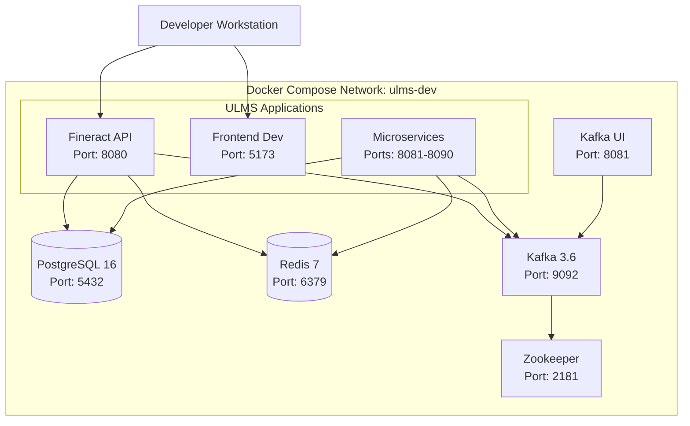

**Document Control**

| Field | Value |
|-------|-------|
| **Document Title** | Docker Compose Configuration |
| **Project Name** | Unisoft Loan Management System (ULMS) |
| **Document ID** | 2.1.2 |
| **Document Version** | 1.0 |
| **Date** | 2026-02-05 |
| **Prepared By** | DevOps Engineer, ULMS Project |
| **Reviewed By** | Technical Lead |
| **Classification** | Internal |
| **Status** | Approved |

**Revision History**

| Version | Date | Author | Description |
|---------|------|--------|-------------|
| 1.0 | 2026-02-05 | DevOps Engineer | Initial version |

---

# Docker Compose Configuration
## Infrastructure Services Setup for ULMS Development

---

## Table of Contents

1. [Purpose](#1-purpose)
2. [Architecture Overview](#2-architecture-overview)
3. [Prerequisites](#3-prerequisites)
4. [Docker Compose Configuration](#4-docker-compose-configuration)
5. [Service Configurations](#5-service-configurations)
6. [Environment Variables](#6-environment-variables)
7. [Volume Management](#7-volume-management)
8. [Network Configuration](#8-network-configuration)
9. [Operational Commands](#9-operational-commands)
10. [Troubleshooting](#10-troubleshooting)
11. [Related Documents](#11-related-documents)

---

## 1. Purpose

This document defines the Docker Compose configuration for ULMS v2.0 development environment. It orchestrates all required infrastructure services including PostgreSQL 16, Redis 7, Apache Kafka, and supporting tools. The configuration follows Bangladesh banking sector best practices for containerized development environments.

---

## 2. Architecture Overview



### Service Inventory

| Service | Image | Version | Internal Port | Exposed Port | Purpose |
|---------|-------|---------|---------------|--------------|---------|
| PostgreSQL | postgres | 16-alpine | 5432 | 5432 | Primary database |
| Redis | redis | 7-alpine | 6379 | 6379 | Cache & sessions |
| Zookeeper | confluentinc/cp-zookeeper | 7.5.0 | 2181 | 2181 | Kafka coordination |
| Kafka | confluentinc/cp-kafka | 7.5.0 | 9092 | 9092 | Message broker |
| Kafka UI | provectuslabs/kafka-ui | latest | 8080 | 8081 | Kafka management |
| PgAdmin | dpage/pgadmin4 | 8 | 80 | 5050 | DB management UI |

---

## 3. Prerequisites

### 3.1 Software Requirements

| Software | Minimum Version | Verification Command |
|----------|-----------------|---------------------|
| Docker Engine | 24.0.0 | `docker --version` |
| Docker Compose | 2.23.0 | `docker compose version` |
| Docker Desktop | 4.25.0 | Check application |

### 3.2 System Resources

| Resource | Minimum | Recommended |
|----------|---------|-------------|
| Available RAM | 12 GB | 16 GB |
| Available Disk | 30 GB | 50 GB |
| CPU Cores | 4 | 6 |

### 3.3 Network Requirements

The following ports MUST be available on the host machine:

| Port | Service | Protocol |
|------|---------|----------|
| 5432 | PostgreSQL | TCP |
| 6379 | Redis | TCP |
| 2181 | Zookeeper | TCP |
| 9092 | Kafka | TCP |
| 8080 | Fineract API | HTTP |
| 8081 | Kafka UI | HTTP |
| 5050 | PgAdmin | HTTP |
| 5173 | Frontend Dev | HTTP |

---

## 4. Docker Compose Configuration

### 4.1 Main Configuration File

**File:** `docker-compose.dev.yml`

```yaml
version: '3.8'

services:
  # ==========================================
  # PostgreSQL 16 - Primary Database
  # ==========================================
  postgres:
    image: postgres:16-alpine
    container_name: ulms-postgres
    hostname: postgres
    restart: unless-stopped
    environment:
      POSTGRES_USER: ${POSTGRES_USER:-fineract}
      POSTGRES_PASSWORD: ${POSTGRES_PASSWORD:-postgres}
      POSTGRES_DB: ${POSTGRES_DB:-fineract_default}
      PGDATA: /var/lib/postgresql/data/pgdata
      # Performance tuning for development
      POSTGRES_INITDB_ARGS: "--encoding=UTF-8 --locale=en_US.UTF-8"
    ports:
      - "5432:5432"
    volumes:
      - postgres_data:/var/lib/postgresql/data
      - ./docker/postgres/init:/docker-entrypoint-initdb.d:ro
      - ./docker/postgres/config/postgresql.conf:/etc/postgresql/postgresql.conf:ro
    command: postgres -c config_file=/etc/postgresql/postgresql.conf
    healthcheck:
      test: ["CMD-SHELL", "pg_isready -U ${POSTGRES_USER:-fineract} -d ${POSTGRES_DB:-fineract_default}"]
      interval: 10s
      timeout: 5s
      retries: 5
      start_period: 10s
    networks:
      - ulms-network
    logging:
      driver: "json-file"
      options:
        max-size: "100m"
        max-file: "3"

  # ==========================================
  # Redis 7 - Cache & Session Store
  # ==========================================
  redis:
    image: redis:7-alpine
    container_name: ulms-redis
    hostname: redis
    restart: unless-stopped
    command: redis-server --appendonly yes --maxmemory 512mb --maxmemory-policy allkeys-lru
    ports:
      - "6379:6379"
    volumes:
      - redis_data:/data
      - ./docker/redis/redis.conf:/usr/local/etc/redis/redis.conf:ro
    healthcheck:
      test: ["CMD", "redis-cli", "ping"]
      interval: 10s
      timeout: 5s
      retries: 5
    networks:
      - ulms-network
    logging:
      driver: "json-file"
      options:
        max-size: "50m"
        max-file: "3"

  # ==========================================
  # Zookeeper - Kafka Coordination
  # ==========================================
  zookeeper:
    image: confluentinc/cp-zookeeper:7.5.0
    container_name: ulms-zookeeper
    hostname: zookeeper
    restart: unless-stopped
    environment:
      ZOOKEEPER_CLIENT_PORT: 2181
      ZOOKEEPER_TICK_TIME: 2000
      ZOOKEEPER_SYNC_LIMIT: 2
    ports:
      - "2181:2181"
    volumes:
      - zookeeper_data:/var/lib/zookeeper/data
      - zookeeper_logs:/var/lib/zookeeper/log
    networks:
      - ulms-network
    logging:
      driver: "json-file"
      options:
        max-size: "50m"
        max-file: "3"

  # ==========================================
  # Kafka 3.6 - Message Broker
  # ==========================================
  kafka:
    image: confluentinc/cp-kafka:7.5.0
    container_name: ulms-kafka
    hostname: kafka
    restart: unless-stopped
    depends_on:
      - zookeeper
    environment:
      KAFKA_BROKER_ID: 1
      KAFKA_ZOOKEEPER_CONNECT: zookeeper:2181
      KAFKA_ADVERTISED_LISTENERS: PLAINTEXT://kafka:29092,PLAINTEXT_HOST://localhost:9092
      KAFKA_LISTENER_SECURITY_PROTOCOL_MAP: PLAINTEXT:PLAINTEXT,PLAINTEXT_HOST:PLAINTEXT
      KAFKA_INTER_BROKER_LISTENER_NAME: PLAINTEXT
      KAFKA_OFFSETS_TOPIC_REPLICATION_FACTOR: 1
      KAFKA_AUTO_CREATE_TOPICS_ENABLE: "true"
      KAFKA_MIN_INSYNC_REPLICAS: 1
      KAFKA_DEFAULT_REPLICATION_FACTOR: 1
      KAFKA_NUM_PARTITIONS: 3
    ports:
      - "9092:9092"
      - "29092:29092"
    volumes:
      - kafka_data:/var/lib/kafka/data
    healthcheck:
      test: ["CMD", "kafka-broker-api-versions", "--bootstrap-server", "localhost:9092"]
      interval: 30s
      timeout: 10s
      retries: 3
      start_period: 30s
    networks:
      - ulms-network
    logging:
      driver: "json-file"
      options:
        max-size: "100m"
        max-file: "3"

  # ==========================================
  # Kafka UI - Management Interface
  # ==========================================
  kafka-ui:
    image: provectuslabs/kafka-ui:latest
    container_name: ulms-kafka-ui
    hostname: kafka-ui
    restart: unless-stopped
    depends_on:
      - kafka
    environment:
      KAFKA_CLUSTERS_0_NAME: ulms-local
      KAFKA_CLUSTERS_0_BOOTSTRAPSERVERS: kafka:29092
      KAFKA_CLUSTERS_0_ZOOKEEPER: zookeeper:2181
      SERVER_PORT: 8080
    ports:
      - "8081:8080"
    networks:
      - ulms-network
    logging:
      driver: "json-file"
      options:
        max-size: "50m"
        max-file: "3"

  # ==========================================
  # PgAdmin - Database Management
  # ==========================================
  pgadmin:
    image: dpage/pgadmin4:8
    container_name: ulms-pgadmin
    hostname: pgadmin
    restart: unless-stopped
    environment:
      PGADMIN_DEFAULT_EMAIL: ${PGADMIN_EMAIL:-admin@ulms.local}
      PGADMIN_DEFAULT_PASSWORD: ${PGADMIN_PASSWORD:-admin}
      PGADMIN_CONFIG_SERVER_MODE: "False"
    ports:
      - "5050:80"
    volumes:
      - pgadmin_data:/var/lib/pgadmin
    depends_on:
      - postgres
    networks:
      - ulms-network
    logging:
      driver: "json-file"
      options:
        max-size: "50m"
        max-file: "3"

# ==========================================
# Named Volumes
# ==========================================
volumes:
  postgres_data:
    driver: local
  redis_data:
    driver: local
  zookeeper_data:
    driver: local
  zookeeper_logs:
    driver: local
  kafka_data:
    driver: local
  pgadmin_data:
    driver: local

# ==========================================
# Networks
# ==========================================
networks:
  ulms-network:
    driver: bridge
    ipam:
      config:
        - subnet: 172.20.0.0/16
```

### 4.2 Environment File Template

**File:** `.env.example`

```bash
# ==========================================
# ULMS Development Environment Configuration
# ==========================================

# ------------------------------------------
# PostgreSQL Configuration
# ------------------------------------------
POSTGRES_USER=fineract
POSTGRES_PASSWORD=postgres
POSTGRES_DB=fineract_default
POSTGRES_PORT=5432
POSTGRES_HOST=localhost

# ------------------------------------------
# Fineract Database Configuration
# ------------------------------------------
FINERACT_DATABASE_HOST=postgres
FINERACT_DATABASE_PORT=5432
FINERACT_DATABASE_NAME=fineract_default
FINERACT_DATABASE_USERNAME=fineract
FINERACT_DATABASE_PASSWORD=postgres

# ------------------------------------------
# Redis Configuration
# ------------------------------------------
REDIS_HOST=redis
REDIS_PORT=6379
REDIS_PASSWORD=
REDIS_SSL_ENABLED=false

# ------------------------------------------
# Kafka Configuration
# ------------------------------------------
KAFKA_BOOTSTRAP_SERVERS=kafka:29092
KAFKA_CONSUMER_GROUP_ID=ulms-dev-group

# ------------------------------------------
# PgAdmin Configuration
# ------------------------------------------
PGADMIN_EMAIL=admin@ulms.local
PGADMIN_PASSWORD=admin

# ------------------------------------------
# ULMS Application Configuration
# ------------------------------------------
ULMS_API_URL=http://localhost:8080/fineract-provider/api/v1
ULMS_FRONTEND_URL=http://localhost:5173
ULMS_TENANT_IDENTIFIER=default

# ------------------------------------------
# External API Configuration (Development)
# ------------------------------------------
CIB_API_URL=https://sandbox.cib.bb.org.bd/api
CIB_API_KEY=dev_key_placeholder
CIB_API_SECRET=dev_secret_placeholder

NID_API_URL=https://sandbox.nidw.gov.bd/api
NID_API_KEY=dev_key_placeholder
```

---

## 5. Service Configurations

### 5.1 PostgreSQL Configuration

**File:** `docker/postgres/config/postgresql.conf`

```conf
# PostgreSQL 16 Configuration for ULMS Development

# Connection Settings
listen_addresses = '*'
max_connections = 200
superuser_reserved_connections = 3

# Memory Settings (adjust based on available RAM)
shared_buffers = 512MB
effective_cache_size = 1536MB
work_mem = 8MB
maintenance_work_mem = 128MB

# Write Ahead Logging
wal_level = replica
wal_buffers = 16MB
max_wal_size = 2GB
min_wal_size = 512MB
checkpoint_completion_target = 0.9

# Query Planner
default_statistics_target = 100
random_page_cost = 1.1
effective_io_concurrency = 200

# Logging
logging_collector = on
log_destination = 'stderr'
log_directory = 'log'
log_filename = 'postgresql-%Y-%m-%d_%H%M%S.log'
log_rotation_age = 1d
log_rotation_size = 100MB
log_min_messages = warning

# Locale and Format
datestyle = 'iso, dmy'
timezone = 'Asia/Dhaka'
lc_messages = 'en_US.UTF-8'
lc_monetary = 'en_US.UTF-8'
lc_numeric = 'en_US.UTF-8'
lc_time = 'en_US.UTF-8'

# Bangladesh Banking Requirements
standard_conforming_strings = on
escape_string_warning = on
```

### 5.2 Redis Configuration

**File:** `docker/redis/redis.conf`

```conf
# Redis 7 Configuration for ULMS Development

# Network
bind 0.0.0.0
port 6379
tcp-backlog 511
timeout 0
tcp-keepalive 300

# General
daemonize no
supervised no
pidfile /var/run/redis/redis-server.pid
loglevel notice
logfile ""

# Persistence
save 900 1
save 300 10
save 60 10000
stop-writes-on-bgsave-error yes
rdbcompression yes
rdbchecksum yes
dbfilename dump.rdb
dir /data

# AOF
appendonly yes
appendfilename "appendonly.aof"
appendfsync everysec
no-appendfsync-on-rewrite no
auto-aof-rewrite-percentage 100
auto-aof-rewrite-min-size 64mb

# Memory
maxmemory 512mb
maxmemory-policy allkeys-lru

# Security (development only - no password)
protected-mode no

# Limits
maxclients 10000
```

### 5.3 Database Initialization Scripts

**File:** `docker/postgres/init/01-create-databases.sql`

```sql
-- ULMS Database Initialization Script
-- Creates databases for multi-tenant architecture

-- Create additional databases for different tenants/environments
CREATE DATABASE fineract_tenant_1 WITH OWNER fineract ENCODING 'UTF8';
CREATE DATABASE fineract_test WITH OWNER fineract ENCODING 'UTF8';

-- Create extensions required by Fineract
\c fineract_default
CREATE EXTENSION IF NOT EXISTS "uuid-ossp";
CREATE EXTENSION IF NOT EXISTS "pgcrypto";

\c fineract_tenant_1
CREATE EXTENSION IF NOT EXISTS "uuid-ossp";
CREATE EXTENSION IF NOT EXISTS "pgcrypto";

\c fineract_test
CREATE EXTENSION IF NOT EXISTS "uuid-ossp";
CREATE EXTENSION IF NOT EXISTS "pgcrypto";

-- Grant permissions
GRANT ALL PRIVILEGES ON DATABASE fineract_default TO fineract;
GRANT ALL PRIVILEGES ON DATABASE fineract_tenant_1 TO fineract;
GRANT ALL PRIVILEGES ON DATABASE fineract_test TO fineract;
```

---

## 6. Environment Variables

### 6.1 Required Variables

| Variable | Default | Description | Required |
|----------|---------|-------------|----------|
| POSTGRES_USER | fineract | PostgreSQL username | Yes |
| POSTGRES_PASSWORD | postgres | PostgreSQL password | Yes |
| POSTGRES_DB | fineract_default | Default database name | Yes |
| REDIS_HOST | redis | Redis hostname | Yes |
| KAFKA_BOOTSTRAP_SERVERS | kafka:29092 | Kafka broker addresses | Yes |
| PGADMIN_EMAIL | admin@ulms.local | PgAdmin login email | No |
| PGADMIN_PASSWORD | admin | PgAdmin login password | No |

### 6.2 Variable Substitution

Docker Compose supports variable substitution with defaults:

```yaml
${VARIABLE:-default}    # Use default if VARIABLE is unset or empty
${VARIABLE-default}     # Use default only if VARIABLE is unset
${VARIABLE:?error}      # Raise error if VARIABLE is unset or empty
```

---

## 7. Volume Management

### 7.1 Volume Structure

```
Docker Volumes:
├── postgres_data      # PostgreSQL data files (~2GB)
├── redis_data         # Redis persistence files (~100MB)
├── zookeeper_data     # Zookeeper data (~100MB)
├── zookeeper_logs     # Zookeeper logs (~500MB)
├── kafka_data         # Kafka log segments (~5GB)
└── pgadmin_data       # PgAdmin settings (~50MB)
```

### 7.2 Backup and Restore

```bash
# Backup PostgreSQL data
docker exec ulms-postgres pg_dump -U fineract -d fineract_default > backup.sql

# Restore PostgreSQL data
docker exec -i ulms-postgres psql -U fineract -d fineract_default < backup.sql

# Backup Redis data
docker exec ulms-redis redis-cli BGSAVE
docker cp ulms-redis:/data/dump.rdb ./redis-backup.rdb

# Volume backup (all services)
docker run --rm -v ulms_postgres_data:/source -v $(pwd):/backup alpine tar czf /backup/postgres-backup.tar.gz -C /source .
```

---

## 8. Network Configuration

### 8.1 Network Topology

The `ulms-network` bridge network provides:
- Container-to-container communication via service names
- DNS resolution for service discovery
- Isolation from external networks

### 8.2 Service Discovery

Services can communicate using container names as hostnames:

```java
// Fineract connecting to PostgreSQL
spring.datasource.url=jdbc:postgresql://postgres:5432/fineract_default

// Microservice connecting to Redis
spring.redis.host=redis
spring.redis.port=6379

// Application connecting to Kafka
spring.kafka.bootstrap-servers=kafka:29092
```

---

## 9. Operational Commands

### 9.1 Lifecycle Management

```bash
# Start all services
docker-compose -f docker-compose.dev.yml up -d

# Start specific services
docker-compose -f docker-compose.dev.yml up -d postgres redis

# Stop all services
docker-compose -f docker-compose.dev.yml down

# Stop and remove volumes (CAREFUL: deletes data)
docker-compose -f docker-compose.dev.yml down -v

# Restart a specific service
docker-compose -f docker-compose.dev.yml restart kafka

# View logs
docker-compose -f docker-compose.dev.yml logs -f

# View logs for specific service
docker-compose -f docker-compose.dev.yml logs -f postgres
```

### 9.2 Health Checks

```bash
# Check all service health
docker-compose -f docker-compose.dev.yml ps

# Check PostgreSQL
docker exec ulms-postgres pg_isready -U fineract

# Check Redis
docker exec ulms-redis redis-cli ping

# Check Kafka
docker exec ulms-kafka kafka-broker-api-versions --bootstrap-server localhost:9092
```

### 9.3 Scaling Services

```bash
# Scale Kafka brokers (if multi-broker setup)
docker-compose -f docker-compose.dev.yml up -d --scale kafka=3
```

---

## 10. Troubleshooting

### 10.1 Container Won't Start

```bash
# Check container logs
docker logs ulms-postgres

# Check for port conflicts
sudo lsof -i :5432

# Verify environment variables
docker exec ulms-postgres env
```

### 10.2 Database Connection Issues

```bash
# Test connection from host
psql -h localhost -p 5432 -U fineract -d fineract_default

# Test connection from container
docker exec -it ulms-postgres psql -U fineract -d fineract_default

# Check PostgreSQL configuration
docker exec ulms-postgres cat /etc/postgresql/postgresql.conf | grep listen_addresses
```

### 10.3 Kafka Connection Issues

```bash
# List Kafka topics
docker exec ulms-kafka kafka-topics --bootstrap-server localhost:9092 --list

# Create test topic
docker exec ulms-kafka kafka-topics --bootstrap-server localhost:9092 --create --topic test-topic --partitions 1 --replication-factor 1

# Produce test message
docker exec -it ulms-kafka kafka-console-producer --bootstrap-server localhost:9092 --topic test-topic

# Consume test message
docker exec -it ulms-kafka kafka-console-consumer --bootstrap-server localhost:9092 --topic test-topic --from-beginning
```

### 10.4 Performance Issues

```bash
# Monitor container resources
docker stats

# Check disk usage
docker system df -v

# Clean up unused resources
docker system prune -a --volumes
```

---

## 11. Related Documents

| Document ID | Document Name | Description |
|-------------|---------------|-------------|
| 2.1.1 | [Local Development Setup Guide]([DEV]_Local_Development_Setup_Guide_v1.0.md) | 5-minute quickstart |
| 2.1.3 | [Fineract Local Installation Guide]([DEV]_Fineract_Local_Installation_Guide_v1.0.md) | Fineract setup |
| 2.2.1 | [PostgreSQL Installation]([DB]_PostgreSQL_16_Installation_Configuration_v1.0.md) | Database installation |
| 2.2.5 | [Redis Setup]([DB]_Redis_7_Setup_Configuration_v1.0.md) | Cache configuration |

---

*© 2026 Unisoft Systems Limited. All Rights Reserved.*
*Internal Use Only - ULMS Development Team*
