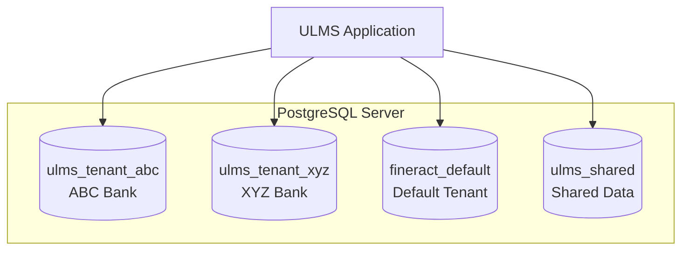

**Document Control**

| Field | Value |
|-------|-------|
| **Document Title** | Database Initialization Scripts |
| **Project Name** | Unisoft Loan Management System (ULMS) |
| **Document ID** | 2.2.2 |
| **Document Version** | 1.0 |
| **Date** | 2026-02-05 |
| **Prepared By** | Database Administrator, ULMS Project |
| **Reviewed By** | Backend Lead |
| **Classification** | Internal |
| **Status** | Approved |

**Revision History**

| Version | Date | Author | Description |
|---------|------|--------|-------------|
| 1.0 | 2026-02-05 | Database Administrator | Initial version |

---

# Database Initialization Scripts
## Multi-Tenant Schema Setup for ULMS v2.0

---

## Table of Contents

1. [Purpose](#1-purpose)
2. [Multi-Tenant Architecture](#2-multi-tenant-architecture)
3. [Database Creation Scripts](#3-database-creation-scripts)
4. [Schema Initialization](#4-schema-initialization)
5. [User and Permission Setup](#5-user-and-permission-setup)
6. [Extension Installation](#6-extension-installation)
7. [Tenant Configuration](#7-tenant-configuration)
8. [Post-Initialization Verification](#8-post-initialization-verification)
9. [Related Documents](#9-related-documents)

---

## 1. Purpose

This document provides SQL scripts for initializing the ULMS v2.0 database environment, including multi-tenant schema setup for Bangladesh banking sector compliance. These scripts create the foundation for Apache Fineract integration and ULMS-specific extensions.

---

## 2. Multi-Tenant Architecture

### 2.1 Architecture Overview



### 2.2 Tenant Isolation Strategy

| Strategy | Implementation | Use Case |
|----------|---------------|----------|
| Database per Tenant | Separate databases | Production banks |
| Schema per Tenant | Separate schemas | Development/Testing |
| Shared Database | Tenant discriminator | Demo/Sandbox |

ULMS v2.0 uses **Database per Tenant** for production and **Schema per Tenant** for development.

---

## 3. Database Creation Scripts

### 3.1 Master Database Creation Script

**File:** `scripts/database/01-create-databases.sql`

```sql
-- ==========================================
-- ULMS Database Creation Script
-- Run as: postgres superuser
-- Purpose: Create all databases for ULMS v2.0
-- ==========================================

-- Connect to default postgres database
\c postgres

-- ==========================================
-- 1. SHARED DATABASE
-- Cross-tenant reference data and configurations
-- ==========================================
CREATE DATABASE ulms_shared
    WITH 
    OWNER = ulms_admin
    ENCODING = 'UTF8'
    LC_COLLATE = 'en_US.UTF-8'
    LC_CTYPE = 'en_US.UTF-8'
    TABLESPACE = pg_default
    CONNECTION LIMIT = -1;

COMMENT ON DATABASE ulms_shared IS 'ULMS shared data and configuration database';

-- ==========================================
-- 2. DEFAULT FINERACT DATABASE
-- Default tenant for development/testing
-- ==========================================
CREATE DATABASE fineract_default
    WITH 
    OWNER = ulms_admin
    ENCODING = 'UTF8'
    LC_COLLATE = 'en_US.UTF-8'
    LC_CTYPE = 'en_US.UTF-8'
    TABLESPACE = pg_default
    CONNECTION LIMIT = -1;

COMMENT ON DATABASE fineract_default IS 'Default Fineract tenant database';

-- ==========================================
-- 3. DEVELOPMENT DATABASE
-- Development environment
-- ==========================================
CREATE DATABASE ulms_development
    WITH 
    OWNER = ulms_admin
    ENCODING = 'UTF8'
    LC_COLLATE = 'en_US.UTF-8'
    LC_CTYPE = 'en_US.UTF-8'
    TABLESPACE = pg_default
    CONNECTION LIMIT = -1;

COMMENT ON DATABASE ulms_development IS 'ULMS development database';

-- ==========================================
-- 4. TEST DATABASE
-- Automated testing environment
-- ==========================================
CREATE DATABASE ulms_test
    WITH 
    OWNER = ulms_admin
    ENCODING = 'UTF8'
    LC_COLLATE = 'en_US.UTF-8'
    LC_CTYPE = 'en_US.UTF-8'
    TABLESPACE = pg_default
    CONNECTION LIMIT = -1;

COMMENT ON DATABASE ulms_test IS 'ULMS test database for automated testing';

-- ==========================================
-- 5. STAGING DATABASE
-- Pre-production validation
-- ==========================================
CREATE DATABASE ulms_staging
    WITH 
    OWNER = ulms_admin
    ENCODING = 'UTF8'
    LC_COLLATE = 'en_US.UTF-8'
    LC_CTYPE = 'en_US.UTF-8'
    TABLESPACE = pg_default
    CONNECTION LIMIT = -1;

COMMENT ON DATABASE ulms_staging IS 'ULMS staging database for pre-production testing';

-- ==========================================
-- 6. SAMPLE TENANT DATABASES
-- For multi-tenant testing
-- ==========================================
CREATE DATABASE ulms_tenant_abc
    WITH 
    OWNER = ulms_admin
    ENCODING = 'UTF8'
    LC_COLLATE = 'en_US.UTF-8'
    LC_CTYPE = 'en_US.UTF-8'
    TABLESPACE = pg_default
    CONNECTION LIMIT = -1;

COMMENT ON DATABASE ulms_tenant_abc IS 'ABC Bank tenant database';

CREATE DATABASE ulms_tenant_xyz
    WITH 
    OWNER = ulms_admin
    ENCODING = 'UTF8'
    LC_COLLATE = 'en_US.UTF-8'
    LC_CTYPE = 'en_US.UTF-8'
    TABLESPACE = pg_default
    CONNECTION LIMIT = -1;

COMMENT ON DATABASE ulms_tenant_xyz IS 'XYZ Bank tenant database';

-- Verify database creation
SELECT datname, datowner::regrole, datconnlimit
FROM pg_database
WHERE datname LIKE 'ulms_%' OR datname LIKE 'fineract_%'
ORDER BY datname;
```

### 3.2 Execute Database Creation

```bash
# Run as postgres user
sudo -u postgres psql -f scripts/database/01-create-databases.sql
```

---

## 4. Schema Initialization

### 4.1 Shared Database Schema

**File:** `scripts/database/02-setup-shared-schema.sql`

```sql
-- ==========================================
-- ULMS Shared Database Schema
-- Run as: ulms_admin on ulms_shared database
-- Purpose: Create shared schemas and tables
-- ==========================================

\c ulms_shared

-- ==========================================
-- 1. SCHEMAS
-- ==========================================
CREATE SCHEMA IF NOT EXISTS reference_data;
CREATE SCHEMA IF NOT EXISTS system_config;
CREATE SCHEMA IF NOT EXISTS audit_log;

COMMENT ON SCHEMA reference_data IS 'Reference data shared across tenants';
COMMENT ON SCHEMA system_config IS 'System-wide configuration';
COMMENT ON SCHEMA audit_log IS 'Centralized audit logging';

-- ==========================================
-- 2. REFERENCE DATA TABLES
-- ==========================================

-- Bangladesh Divisions and Districts
CREATE TABLE reference_data.divisions (
    id SERIAL PRIMARY KEY,
    code VARCHAR(10) UNIQUE NOT NULL,
    name VARCHAR(100) NOT NULL,
    name_bn VARCHAR(100),
    created_at TIMESTAMP WITH TIME ZONE DEFAULT CURRENT_TIMESTAMP,
    updated_at TIMESTAMP WITH TIME ZONE DEFAULT CURRENT_TIMESTAMP
);

COMMENT ON TABLE reference_data.divisions IS 'Bangladesh administrative divisions';

CREATE TABLE reference_data.districts (
    id SERIAL PRIMARY KEY,
    division_id INTEGER NOT NULL REFERENCES reference_data.divisions(id),
    code VARCHAR(10) UNIQUE NOT NULL,
    name VARCHAR(100) NOT NULL,
    name_bn VARCHAR(100),
    created_at TIMESTAMP WITH TIME ZONE DEFAULT CURRENT_TIMESTAMP,
    updated_at TIMESTAMP WITH TIME ZONE DEFAULT CURRENT_TIMESTAMP
);

COMMENT ON TABLE reference_data.districts IS 'Bangladesh districts';

-- Insert Bangladesh divisions
INSERT INTO reference_data.divisions (code, name, name_bn) VALUES
('10', 'Barisal', 'বরিশাল'),
('20', 'Chittagong', 'চট্টগ্রাম'),
('30', 'Dhaka', 'ঢাকা'),
('40', 'Khulna', 'খুলনা'),
('50', 'Rajshahi', 'রাজশাহী'),
('55', 'Rangpur', 'রংপুর'),
('60', 'Sylhet', 'সিলেট'),
('65', 'Mymensingh', 'ময়মনসিংহ');

-- Insert sample districts (complete list in separate data file)
INSERT INTO reference_data.districts (division_id, code, name, name_bn) VALUES
(3, '26', 'Dhaka', 'ঢাকা'),
(3, '29', 'Faridpur', 'ফরিদপুর'),
(3, '33', 'Gazipur', 'গাজীপুর'),
(3, '35', 'Gopalganj', 'গোপালগঞ্জ'),
(3, '39', 'Jamalpur', 'জামালপুর'),
(3, '48', 'Kishoreganj', 'কিশোরগঞ্জ'),
(3, '54', 'Madaripur', 'মাদারীপুর'),
(3, '56', 'Manikganj', 'মানিকগঞ্জ'),
(3, '59', 'Munshiganj', 'মুন্সিগঞ্জ'),
(3, '67', 'Narayanganj', 'নারায়ণগঞ্জ'),
(3, '68', 'Narsingdi', 'নরসিংদী'),
(3, '72', 'Netrokona', 'নেত্রকোনা'),
(3, '81', 'Rajbari', 'রাজবাড়ী'),
(3, '82', 'Shariatpur', 'শরীয়তপুর'),
(3, '86', 'Sherpur', 'শেরপুর'),
(3, '93', 'Tangail', 'টাঙ্গাইল');

-- Currency reference
CREATE TABLE reference_data.currencies (
    id SERIAL PRIMARY KEY,
    code CHAR(3) UNIQUE NOT NULL,
    name VARCHAR(100) NOT NULL,
    symbol VARCHAR(10),
    decimal_places INTEGER DEFAULT 2,
    is_active BOOLEAN DEFAULT true,
    created_at TIMESTAMP WITH TIME ZONE DEFAULT CURRENT_TIMESTAMP
);

INSERT INTO reference_data.currencies (code, name, symbol, decimal_places) VALUES
('BDT', 'Bangladeshi Taka', '৳', 2),
('USD', 'US Dollar', '$', 2),
('EUR', 'Euro', '€', 2),
('GBP', 'British Pound', '£', 2);

-- ==========================================
-- 3. SYSTEM CONFIGURATION TABLES
-- ==========================================

CREATE TABLE system_config.tenant_registry (
    id SERIAL PRIMARY KEY,
    tenant_identifier VARCHAR(50) UNIQUE NOT NULL,
    tenant_name VARCHAR(200) NOT NULL,
    database_name VARCHAR(100) NOT NULL,
    database_host VARCHAR(100) NOT NULL DEFAULT 'localhost',
    database_port INTEGER NOT NULL DEFAULT 5432,
    timezone VARCHAR(50) DEFAULT 'Asia/Dhaka',
    currency_code CHAR(3) DEFAULT 'BDT',
    decimal_places INTEGER DEFAULT 2,
    is_active BOOLEAN DEFAULT true,
    created_at TIMESTAMP WITH TIME ZONE DEFAULT CURRENT_TIMESTAMP,
    updated_at TIMESTAMP WITH TIME ZONE DEFAULT CURRENT_TIMESTAMP
);

COMMENT ON TABLE system_config.tenant_registry IS 'Registry of all ULMS tenants';

-- Register default tenants
INSERT INTO system_config.tenant_registry 
    (tenant_identifier, tenant_name, database_name, timezone, currency_code)
VALUES
    ('default', 'Default Tenant', 'fineract_default', 'Asia/Dhaka', 'BDT'),
    ('abcbank', 'ABC Bank Limited', 'ulms_tenant_abc', 'Asia/Dhaka', 'BDT'),
    ('xyzbank', 'XYZ Bank Limited', 'ulms_tenant_xyz', 'Asia/Dhaka', 'BDT');

-- ==========================================
-- 4. AUDIT LOG TABLES
-- ==========================================

CREATE TABLE audit_log.system_events (
    id BIGSERIAL PRIMARY KEY,
    event_type VARCHAR(50) NOT NULL,
    tenant_identifier VARCHAR(50),
    user_id BIGINT,
    user_name VARCHAR(100),
    ip_address INET,
    user_agent TEXT,
    action VARCHAR(100) NOT NULL,
    entity_type VARCHAR(100),
    entity_id VARCHAR(100),
    old_values JSONB,
    new_values JSONB,
    created_at TIMESTAMP WITH TIME ZONE DEFAULT CURRENT_TIMESTAMP
);

COMMENT ON TABLE audit_log.system_events IS 'System-wide audit events';

-- Create indexes for audit log
CREATE INDEX idx_audit_events_tenant ON audit_log.system_events(tenant_identifier);
CREATE INDEX idx_audit_events_user ON audit_log.system_events(user_id);
CREATE INDEX idx_audit_events_created ON audit_log.system_events(created_at);
CREATE INDEX idx_audit_events_entity ON audit_log.system_events(entity_type, entity_id);

-- ==========================================
-- 5. PARTITIONING FOR AUDIT LOG
-- ==========================================

-- Create partition function for monthly partitions
CREATE OR REPLACE FUNCTION audit_log.create_monthly_partition()
RETURNS void AS $$
DECLARE
    partition_date DATE;
    partition_name TEXT;
    start_date DATE;
    end_date DATE;
BEGIN
    partition_date := DATE_TRUNC('month', CURRENT_DATE + INTERVAL '1 month');
    partition_name := 'system_events_' || TO_CHAR(partition_date, 'YYYY_MM');
    start_date := partition_date;
    end_date := partition_date + INTERVAL '1 month';
    
    EXECUTE format(
        'CREATE TABLE IF NOT EXISTS audit_log.%I PARTITION OF audit_log.system_events
         FOR VALUES FROM (%L) TO (%L)',
        partition_name, start_date, end_date
    );
END;
$$ LANGUAGE plpgsql;

-- Create initial partitions
SELECT audit_log.create_monthly_partition();
```

### 4.2 Execute Schema Setup

```bash
# Run as ulms_admin
psql -U ulms_admin -d ulms_shared -f scripts/database/02-setup-shared-schema.sql
```

---

## 5. User and Permission Setup

### 5.1 Database Users Creation

**File:** `scripts/database/03-create-users.sql`

```sql
-- ==========================================
-- ULMS Database User Creation
-- Run as: postgres superuser
-- Purpose: Create application users with appropriate privileges
-- ==========================================

-- ==========================================
-- 1. APPLICATION USERS
-- ==========================================

-- Admin user - Full access
CREATE USER ulms_admin WITH 
    PASSWORD 'changeme_strong_password'
    SUPERUSER 
    CREATEDB 
    CREATEROLE
    LOGIN;

COMMENT ON ROLE ulms_admin IS 'ULMS database administrator';

-- Application user - Standard operations
CREATE USER ulms_app WITH 
    PASSWORD 'changeme_app_password'
    LOGIN
    NOSUPERUSER 
    NOCREATEDB 
    NOCREATEROLE;

COMMENT ON ROLE ulms_app IS 'ULMS application database user';

-- Read-only user for reporting
CREATE USER ulms_readonly WITH 
    PASSWORD 'changeme_readonly_password'
    LOGIN
    NOSUPERUSER 
    NOCREATEDB 
    NOCREATEROLE;

COMMENT ON ROLE ulms_readonly IS 'ULMS read-only user for reporting';

-- Migration user for Flyway/Liquibase
CREATE USER ulms_migrator WITH 
    PASSWORD 'changeme_migrator_password'
    LOGIN
    NOSUPERUSER 
    NOCREATEDB 
    NOCREATEROLE;

COMMENT ON ROLE ulms_migrator IS 'ULMS migration user for schema changes';

-- Backup user
CREATE USER ulms_backup WITH 
    PASSWORD 'changeme_backup_password'
    LOGIN
    REPLICATION
    NOSUPERUSER 
    NOCREATEDB 
    NOCREATEROLE;

COMMENT ON ROLE ulms_backup IS 'ULMS backup user with replication privileges';

-- ==========================================
-- 2. GRANT PRIVILEGES ON DATABASES
-- ==========================================

-- ulms_app privileges
GRANT CONNECT ON DATABASE ulms_development TO ulms_app;
GRANT CONNECT ON DATABASE ulms_test TO ulms_app;
GRANT CONNECT ON DATABASE ulms_staging TO ulms_app;
GRANT CONNECT ON DATABASE fineract_default TO ulms_app;
GRANT CONNECT ON DATABASE ulms_tenant_abc TO ulms_app;
GRANT CONNECT ON DATABASE ulms_tenant_xyz TO ulms_app;

-- ulms_readonly privileges
GRANT CONNECT ON DATABASE ulms_development TO ulms_readonly;
GRANT CONNECT ON DATABASE ulms_staging TO ulms_readonly;
GRANT CONNECT ON DATABASE ulms_tenant_abc TO ulms_readonly;
GRANT CONNECT ON DATABASE ulms_tenant_xyz TO ulms_readonly;

-- ulms_migrator privileges
GRANT CONNECT ON DATABASE ulms_development TO ulms_migrator;
GRANT CONNECT ON DATABASE ulms_test TO ulms_migrator;
GRANT CONNECT ON DATABASE ulms_staging TO ulms_migrator;

-- ulms_backup privileges
GRANT CONNECT ON DATABASE ulms_development TO ulms_backup;
GRANT CONNECT ON DATABASE ulms_test TO ulms_backup;
GRANT CONNECT ON DATABASE ulms_staging TO ulms_backup;
GRANT CONNECT ON DATABASE ulms_tenant_abc TO ulms_backup;
GRANT CONNECT ON DATABASE ulms_tenant_xyz TO ulms_backup;

-- ==========================================
-- 3. SCHEMA-LEVEL PERMISSIONS (on each database)
-- ==========================================

-- Note: These must be run on each database individually
-- Example for ulms_development:

\c ulms_development

-- Grant schema creation to migrator
GRANT CREATE ON SCHEMA public TO ulms_migrator;

-- Grant usage to app user
GRANT USAGE ON SCHEMA public TO ulms_app;
GRANT CREATE ON SCHEMA public TO ulms_app;

-- Grant read-only access to readonly user
GRANT USAGE ON SCHEMA public TO ulms_readonly;

-- ==========================================
-- 4. DEFAULT PRIVILEGES
-- ==========================================

ALTER DEFAULT PRIVILEGES IN SCHEMA public
    GRANT SELECT, INSERT, UPDATE, DELETE ON TABLES TO ulms_app;

ALTER DEFAULT PRIVILEGES IN SCHEMA public
    GRANT USAGE, SELECT ON SEQUENCES TO ulms_app;

ALTER DEFAULT PRIVILEGES IN SCHEMA public
    GRANT EXECUTE ON FUNCTIONS TO ulms_app;

ALTER DEFAULT PRIVILEGES IN SCHEMA public
    GRANT SELECT ON TABLES TO ulms_readonly;
```

### 5.2 Execute User Creation

```bash
# Run as postgres superuser
sudo -u postgres psql -f scripts/database/03-create-users.sql
```

---

## 6. Extension Installation

### 6.1 Required Extensions

**File:** `scripts/database/04-install-extensions.sql`

```sql
-- ==========================================
-- PostgreSQL Extensions Installation
-- Run on each tenant database
-- ==========================================

-- ==========================================
-- 1. CORE EXTENSIONS (Install on all databases)
-- ==========================================

-- UUID generation
CREATE EXTENSION IF NOT EXISTS "uuid-ossp";
COMMENT ON EXTENSION "uuid-ossp" IS 'UUID generation functions';

-- Cryptographic functions
CREATE EXTENSION IF NOT EXISTS "pgcrypto";
COMMENT ON EXTENSION "pgcrypto" IS 'Cryptographic functions for data encryption';

-- Full-text search
CREATE EXTENSION IF NOT EXISTS "pg_trgm";
COMMENT ON EXTENSION "pg_trgm" IS 'Trigram matching for text search';

-- Fuzzy string matching
CREATE EXTENSION IF NOT EXISTS "fuzzystrmatch";
COMMENT ON EXTENSION "fuzzystrmatch" IS 'Fuzzy string matching functions';

-- ==========================================
-- 2. MONITORING EXTENSIONS
-- ==========================================

-- Query statistics
CREATE EXTENSION IF NOT EXISTS "pg_stat_statements";
COMMENT ON EXTENSION "pg_stat_statements" IS 'Track execution statistics of SQL statements';

-- Audit logging
CREATE EXTENSION IF NOT EXISTS "pgaudit";
COMMENT ON EXTENSION "pgaudit" IS 'Detailed session and object audit logging';

-- ==========================================
-- 3. ADVANCED EXTENSIONS
-- ==========================================

-- JSON manipulation
CREATE EXTENSION IF NOT EXISTS "jsonb_plpython3u";

-- Table partitioning helper (if available)
-- CREATE EXTENSION IF NOT EXISTS "pg_partman";

-- ==========================================
-- 4. VERIFY EXTENSIONS
-- ==========================================

SELECT 
    extname AS extension_name,
    extversion AS version,
    extnamespace::regnamespace AS schema
FROM pg_extension
ORDER BY extname;
```

### 6.2 Install Extensions on All Databases

```bash
#!/bin/bash
# Install extensions on all databases

DATABASES=("ulms_development" "ulms_test" "ulms_staging" "fineract_default" "ulms_tenant_abc" "ulms_tenant_xyz")

for DB in "${DATABASES[@]}"; do
    echo "Installing extensions on $DB..."
    psql -U ulms_admin -d "$DB" -f scripts/database/04-install-extensions.sql
done
```

---

## 7. Tenant Configuration

### 7.1 Fineract Tenant Setup

**File:** `scripts/database/05-setup-fineract-tenants.sql`

```sql
-- ==========================================
-- Fineract Multi-Tenant Configuration
-- Run on: ulms_shared database
-- ==========================================

\c ulms_shared

-- ==========================================
-- 1. TENANT CONNECTION DETAILS
-- ==========================================

CREATE TABLE system_config.tenant_connections (
    id SERIAL PRIMARY KEY,
    tenant_id INTEGER NOT NULL REFERENCES system_config.tenant_registry(id),
    schema_name VARCHAR(100) DEFAULT 'public',
    schema_server VARCHAR(100) NOT NULL DEFAULT 'localhost',
    schema_server_port VARCHAR(10) NOT NULL DEFAULT '5432',
    schema_connection_parameters VARCHAR(200) DEFAULT '',
    schema_username VARCHAR(100) NOT NULL,
    schema_password TEXT NOT NULL,
    is_reporting_enabled BOOLEAN DEFAULT false,
    is_master BOOLEAN DEFAULT false,
    is_active BOOLEAN DEFAULT true,
    created_at TIMESTAMP WITH TIME ZONE DEFAULT CURRENT_TIMESTAMP,
    updated_at TIMESTAMP WITH TIME ZONE DEFAULT CURRENT_TIMESTAMP
);

COMMENT ON TABLE system_config.tenant_connections IS 'Database connection details for each tenant';

-- Insert connection details for default tenant
INSERT INTO system_config.tenant_connections 
    (tenant_id, schema_name, schema_server, schema_server_port, schema_username, schema_password, is_master)
SELECT 
    id, 'public', 'localhost', '5432', 'ulms_app', 'changeme_app_password', true
FROM system_config.tenant_registry 
WHERE tenant_identifier = 'default';

-- Insert connection details for ABC Bank
INSERT INTO system_config.tenant_connections 
    (tenant_id, schema_name, schema_server, schema_server_port, schema_username, schema_password, is_master)
SELECT 
    id, 'public', 'localhost', '5432', 'ulms_app', 'changeme_app_password', true
FROM system_config.tenant_registry 
WHERE tenant_identifier = 'abcbank';

-- Insert connection details for XYZ Bank
INSERT INTO system_config.tenant_connections 
    (tenant_id, schema_name, schema_server, schema_server_port, schema_username, schema_password, is_master)
SELECT 
    id, 'public', 'localhost', '5432', 'ulms_app', 'changeme_app_password', true
FROM system_config.tenant_registry 
WHERE tenant_identifier = 'xyzbank';

-- ==========================================
-- 2. TIMEZONE CONFIGURATION
-- ==========================================

CREATE TABLE system_config.timezone_config (
    id SERIAL PRIMARY KEY,
    tenant_id INTEGER NOT NULL REFERENCES system_config.tenant_registry(id),
    timezone_name VARCHAR(50) DEFAULT 'Asia/Dhaka',
    date_format VARCHAR(20) DEFAULT 'dd/MM/yyyy',
    datetime_format VARCHAR(30) DEFAULT 'dd/MM/yyyy HH:mm:ss',
    is_active BOOLEAN DEFAULT true,
    created_at TIMESTAMP WITH TIME ZONE DEFAULT CURRENT_TIMESTAMP
);

-- Set timezone for all tenants
INSERT INTO system_config.timezone_config (tenant_id, timezone_name)
SELECT id, 'Asia/Dhaka' FROM system_config.tenant_registry;

-- ==========================================
-- 3. CURRENCY CONFIGURATION
-- ==========================================

CREATE TABLE system_config.currency_config (
    id SERIAL PRIMARY KEY,
    tenant_id INTEGER NOT NULL REFERENCES system_config.tenant_registry(id),
    currency_code CHAR(3) DEFAULT 'BDT',
    decimal_places INTEGER DEFAULT 2,
    display_symbol VARCHAR(10) DEFAULT '৳',
    is_active BOOLEAN DEFAULT true,
    created_at TIMESTAMP WITH TIME ZONE DEFAULT CURRENT_TIMESTAMP
);

-- Set BDT as default for all Bangladesh tenants
INSERT INTO system_config.currency_config (tenant_id, currency_code, decimal_places, display_symbol)
SELECT id, 'BDT', 2, '৳' FROM system_config.tenant_registry;
```

---

## 8. Post-Initialization Verification

### 8.1 Verification Script

**File:** `scripts/database/99-verify-setup.sql`

```sql
-- ==========================================
-- ULMS Database Initialization Verification
-- ==========================================

-- 1. Verify databases exist
SELECT datname, pg_encoding_to_char(encoding) as encoding
FROM pg_database
WHERE datname LIKE 'ulms_%' OR datname LIKE 'fineract_%'
ORDER BY datname;

-- 2. Verify users exist
SELECT rolname, rolsuper, rolcreaterole, rolcreatedb, rolcanlogin
FROM pg_roles
WHERE rolname LIKE 'ulms_%'
ORDER BY rolname;

-- 3. Verify extensions (run on each database)
\c ulms_shared
SELECT extname, extversion FROM pg_extension ORDER BY extname;

-- 4. Verify shared schema tables
\c ulms_shared
SELECT schemaname, tablename 
FROM pg_tables 
WHERE schemaname IN ('reference_data', 'system_config', 'audit_log')
ORDER BY schemaname, tablename;

-- 5. Verify tenant registry
SELECT * FROM system_config.tenant_registry;

-- 6. Test connectivity as app user
-- (Run separately: psql -U ulms_app -d ulms_development -c "SELECT 1;")
```

### 8.2 Run Verification

```bash
# Verify setup
psql -U ulms_admin -d ulms_shared -f scripts/database/99-verify-setup.sql

# Test app user connection
psql -U ulms_app -d ulms_development -c "SELECT 'Connection successful' as status;"
```

---

## 9. Related Documents

| Document ID | Document Name | Description |
|-------------|---------------|-------------|
| 2.2.1 | [PostgreSQL Installation]([DB]_PostgreSQL_16_Installation_Configuration_v1.0.md) | PostgreSQL setup |
| 2.2.3 | [Fineract Database Setup]([DB]_Fineract_Database_Setup_v1.0.md) | Core schema configuration |
| 2.2.4 | [Database Seeding Scripts]([DB]_Database_Seeding_Scripts_v1.0.md) | Test data scripts |
| 2.4.3 | [Fineract Schema Extensions](../2.4_Fineract_Customization_Setup/[FIN]_Fineract_Database_Schema_Extensions_v1.0.md) | Custom schema extensions |

---

*© 2026 Unisoft Systems Limited. All Rights Reserved.*
*Internal Use Only - ULMS Development Team*
