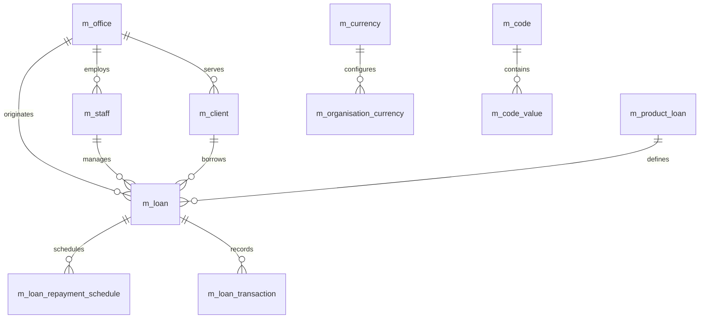

**Document Control**

| Field | Value |
|-------|-------|
| **Document Title** | Fineract Database Setup |
| **Project Name** | Unisoft Loan Management System (ULMS) |
| **Document ID** | 2.2.3 |
| **Document Version** | 1.0 |
| **Date** | 2026-02-05 |
| **Prepared By** | Backend Lead, ULMS Project |
| **Reviewed By** | Database Administrator |
| **Classification** | Internal |
| **Status** | Approved |

**Revision History**

| Version | Date | Author | Description |
|---------|------|--------|-------------|
| 1.0 | 2026-02-05 | Backend Lead | Initial version |

---

# Fineract Database Setup
## Core Schema Configuration for Apache Fineract 1.10

---

## Table of Contents

1. [Purpose](#1-purpose)
2. [Fineract Schema Overview](#2-fineract-schema-overview)
3. [Prerequisites](#3-prerequisites)
4. [Core Schema Configuration](#4-core-schema-configuration)
5. [Migration Management](#5-migration-management)
6. [Tenant-Specific Configuration](#6-tenant-specific-configuration)
7. [Bangladesh Banking Customizations](#7-bangladesh-banking-customizations)
8. [Verification Steps](#8-verification-steps)
9. [Troubleshooting](#9-troubleshooting)
10. [Related Documents](#10-related-documents)

---

## 1. Purpose

This document provides detailed instructions for configuring the Apache Fineract 1.10 database schema, including core tables, relationships, and Bangladesh banking sector customizations for ULMS v2.0.

---

## 2. Fineract Schema Overview

### 2.1 Core Schema Structure



### 2.2 Key Tables

| Table | Purpose | Record Volume |
|-------|---------|---------------|
| m_office | Branch/office hierarchy | Low (10-1000) |
| m_staff | Bank employees | Medium (100-5000) |
| m_client | Loan customers | High (10K-10M) |
| m_loan | Loan accounts | High (10K-10M) |
| m_product_loan | Loan product definitions | Low (10-50) |
| m_loan_repayment_schedule | Repayment schedules | Very High (100K-100M) |
| m_loan_transaction | All loan transactions | Very High (1M-1B) |

---

## 3. Prerequisites

### 3.1 Database Requirements

| Requirement | Specification |
|-------------|---------------|
| PostgreSQL Version | 16+ |
| Character Encoding | UTF-8 |
| Timezone | Asia/Dhaka |
| Collation | en_US.UTF-8 |

### 3.2 Required Privileges

- CREATE DATABASE
- CREATE SCHEMA
- CREATE TABLE
- CREATE INDEX
- CREATE SEQUENCE
- CREATE FUNCTION
- CREATE TRIGGER

---

## 4. Core Schema Configuration

### 4.1 Fineract Database Initialization

**File:** `scripts/fineract/01-initialize-fineract-schema.sql`

```sql
-- ==========================================
-- Fineract Core Schema Initialization
-- Run as: ulms_admin on fineract_default database
-- ==========================================

\c fineract_default

-- ==========================================
-- 1. SCHEMA SETUP
-- ==========================================

-- Create custom schema for ULMS extensions
CREATE SCHEMA IF NOT EXISTS ulms_custom;
COMMENT ON SCHEMA ulms_custom IS 'ULMS-specific extensions to Fineract';

-- Set search path
ALTER DATABASE fineract_default SET search_path TO public, ulms_custom;

-- ==========================================
-- 2. BANGLADESH-SPECIFIC REFERENCE DATA
-- ==========================================

-- Loan Purpose Categories (BRPD compliant)
CREATE TABLE ulms_custom.m_loan_purpose (
    id SERIAL PRIMARY KEY,
    code VARCHAR(50) UNIQUE NOT NULL,
    name VARCHAR(200) NOT NULL,
    name_bn VARCHAR(200),
    category VARCHAR(100),
    description TEXT,
    is_active BOOLEAN DEFAULT true,
    created_at TIMESTAMP DEFAULT CURRENT_TIMESTAMP
);

COMMENT ON TABLE ulms_custom.m_loan_purpose IS 'Loan purpose categories as per Bangladesh Bank guidelines';

INSERT INTO ulms_custom.m_loan_purpose (code, name, name_bn, category) VALUES
('AGRICULTURE', 'Agriculture & Allied Activities', 'কৃষি ও সংশ্লিষ্ট কার্যক্রম', 'Agriculture'),
('INDUSTRY', 'Industry', 'শিল্প', 'Manufacturing'),
('TRADE', 'Trade & Commerce', 'বাণিজ্য', 'Commerce'),
('HOUSING', 'Housing', 'বাসস্থান', 'Consumer'),
('TRANSPORT', 'Transport', 'পরিবহন', 'Services'),
('EDUCATION', 'Education', 'শিক্ষা', 'Consumer'),
('MEDICAL', 'Medical', 'চিকিৎসা', 'Consumer'),
('MARRIAGE', 'Marriage', 'বিবাহ', 'Consumer'),
('BUSINESS', 'General Business', 'সাধারণ ব্যবসা', 'Commercial'),
('OTHERS', 'Others', 'অন্যান্য', 'Miscellaneous');

-- Economic Sector Classification
CREATE TABLE ulms_custom.m_economic_sector (
    id SERIAL PRIMARY KEY,
    code VARCHAR(20) UNIQUE NOT NULL,
    name VARCHAR(200) NOT NULL,
    name_bn VARCHAR(200),
    parent_code VARCHAR(20),
    level INTEGER DEFAULT 1,
    is_active BOOLEAN DEFAULT true
);

COMMENT ON TABLE ulms_custom.m_economic_sector IS 'Economic sector classification per Bangladesh Bank';

INSERT INTO ulms_custom.m_economic_sector (code, name, name_bn, level) VALUES
('A', 'Agriculture, Forestry & Fishing', 'কৃষি, বন ও মৎস্য', 1),
('B', 'Mining & Quarrying', 'খনন ও খনিজ', 1),
('C', 'Manufacturing', 'শিল্প উৎপাদন', 1),
('D', 'Electricity, Gas & Water', 'বিদ্যুৎ, গ্যাস ও পানি', 1),
('E', 'Construction', 'নির্মাণ', 1),
('F', 'Wholesale & Retail Trade', 'পাইকারি ও খুচরা বাণিজ্য', 1),
('G', 'Transport & Communication', 'পরিবহন ও যোগাযোগ', 1),
('H', 'Real Estate & Business Services', 'অবকাঠামো ও ব্যবসা সেবা', 1),
('I', 'Community & Personal Services', 'সামাজিক ও ব্যক্তিগত সেবা', 1);

-- ==========================================
-- 3. CIB INTEGRATION TABLES
-- ==========================================

-- CIB Inquiry Log
CREATE TABLE ulms_custom.cib_inquiry_log (
    id BIGSERIAL PRIMARY KEY,
    inquiry_id VARCHAR(50) UNIQUE NOT NULL,
    inquiry_date TIMESTAMP NOT NULL DEFAULT CURRENT_TIMESTAMP,
    inquiry_type VARCHAR(20) NOT NULL CHECK (inquiry_type IN ('INDIVIDUAL', 'COMPANY', 'PROP')),
    nid_number VARCHAR(20),
    etin VARCHAR(20),
    passport_number VARCHAR(20),
    company_registration VARCHAR(50),
    subject_name VARCHAR(200),
    subject_address TEXT,
    loan_application_id BIGINT REFERENCES m_loan(id),
    cib_report_id VARCHAR(100),
    cib_score INTEGER,
    credit_facilities_count INTEGER DEFAULT 0,
    total_outstanding_amount NUMERIC(19,6) DEFAULT 0,
    total_overdue_amount NUMERIC(19,6) DEFAULT 0,
    worst_classification VARCHAR(10),
    report_data JSONB,
    status VARCHAR(20) DEFAULT 'PENDING',
    error_message TEXT,
    created_by BIGINT,
    created_at TIMESTAMP DEFAULT CURRENT_TIMESTAMP,
    updated_at TIMESTAMP DEFAULT CURRENT_TIMESTAMP
);

COMMENT ON TABLE ulms_custom.cib_inquiry_log IS 'Log of all CIB inquiries made';

CREATE INDEX idx_cib_inquiry_nid ON ulms_custom.cib_inquiry_log(nid_number);
CREATE INDEX idx_cib_inquiry_date ON ulms_custom.cib_inquiry_log(inquiry_date);
CREATE INDEX idx_cib_inquiry_loan ON ulms_custom.cib_inquiry_log(loan_application_id);

-- CIB Report Details
CREATE TABLE ulms_custom.cib_credit_facility (
    id BIGSERIAL PRIMARY KEY,
    inquiry_id BIGINT NOT NULL REFERENCES ulms_custom.cib_inquiry_log(id),
    facility_type VARCHAR(50),
    lender_name VARCHAR(200),
    sanctioned_amount NUMERIC(19,6),
    outstanding_amount NUMERIC(19,6),
    overdue_amount NUMERIC(19,6),
    classification VARCHAR(10),
    instalment_amount NUMERIC(19,6),
    instalment_frequency VARCHAR(20),
    remaining_instalments INTEGER,
    start_date DATE,
    end_date DATE,
    is_self_reported BOOLEAN DEFAULT false,
    created_at TIMESTAMP DEFAULT CURRENT_TIMESTAMP
);

COMMENT ON TABLE ulms_custom.cib_credit_facility IS 'Individual credit facilities from CIB report';

-- ==========================================
-- 4. NID/e-KYC INTEGRATION
-- ==========================================

-- NID Verification Log
CREATE TABLE ulms_custom.nid_verification_log (
    id BIGSERIAL PRIMARY KEY,
    verification_id VARCHAR(50) UNIQUE NOT NULL,
    nid_number VARCHAR(20) NOT NULL,
    date_of_birth DATE,
    full_name_en VARCHAR(200),
    full_name_bn VARCHAR(200),
    father_name VARCHAR(200),
    mother_name VARCHAR(200),
    present_address TEXT,
    permanent_address TEXT,
    photo_base64 TEXT,
    client_id BIGINT REFERENCES m_client(id),
    match_score INTEGER,
    is_verified BOOLEAN DEFAULT false,
    verification_status VARCHAR(20) DEFAULT 'PENDING',
    error_code VARCHAR(20),
    error_message TEXT,
    raw_response JSONB,
    created_by BIGINT,
    created_at TIMESTAMP DEFAULT CURRENT_TIMESTAMP,
    updated_at TIMESTAMP DEFAULT CURRENT_TIMESTAMP
);

COMMENT ON TABLE ulms_custom.nid_verification_log IS 'Log of NID/e-KYC verifications';

CREATE INDEX idx_nid_verification_nid ON ulms_custom.nid_verification_log(nid_number);
CREATE INDEX idx_nid_verification_client ON ulms_custom.nid_verification_log(client_id);

-- ==========================================
-- 5. BANGLADESH BANK COMPLIANCE TABLES
-- ==========================================

-- Loan Classification History (BRPD 15/2024)
CREATE TABLE ulms_custom.loan_classification_history (
    id BIGSERIAL PRIMARY KEY,
    loan_id BIGINT NOT NULL REFERENCES m_loan(id),
    classification_date DATE NOT NULL,
    classification_stage VARCHAR(10) NOT NULL CHECK (
        classification_stage IN ('STD-0', 'STD-1', 'STD-2', 'SMA', 'SS', 'DF', 'BL')
    ),
    classification_name VARCHAR(50),
    days_past_due INTEGER DEFAULT 0,
    outstanding_principal NUMERIC(19,6),
    outstanding_interest NUMERIC(19,6),
    provisioning_rate NUMERIC(5,2),
    provisioning_amount NUMERIC(19,6),
    ecl_amount NUMERIC(19,6),
    reason_for_change TEXT,
    classified_by BIGINT,
    created_at TIMESTAMP DEFAULT CURRENT_TIMESTAMP
);

COMMENT ON TABLE ulms_custom.loan_classification_history IS 'Loan classification history per BRPD 15/2024';

CREATE INDEX idx_classification_loan ON ulms_custom.loan_classification_history(loan_id);
CREATE INDEX idx_classification_date ON ulms_custom.loan_classification_history(classification_date);

-- Large Loan Reporting (Bangladesh Bank requirement)
CREATE TABLE ulms_custom.large_loan_reporting (
    id BIGSERIAL PRIMARY KEY,
    reporting_date DATE NOT NULL,
    loan_id BIGINT NOT NULL REFERENCES m_loan(id),
    borrower_name VARCHAR(200),
    borrower_type VARCHAR(20) CHECK (borrower_type IN ('INDIVIDUAL', 'COMPANY', 'SME')),
    sector_code VARCHAR(20) REFERENCES ulms_custom.m_economic_sector(code),
    sanctioned_amount NUMERIC(19,6),
    outstanding_amount NUMERIC(19,6),
    classification VARCHAR(10),
    security_amount NUMERIC(19,6),
    security_type VARCHAR(50),
    interest_rate NUMERIC(5,2),
    is_funded BOOLEAN DEFAULT true,
    is_syndicated BOOLEAN DEFAULT false,
    syndicate_members TEXT,
    created_at TIMESTAMP DEFAULT CURRENT_TIMESTAMP
);

COMMENT ON TABLE ulms_custom.large_loan_reporting IS 'Large loan reports for Bangladesh Bank';

CREATE INDEX idx_large_loan_reporting ON ulms_custom.large_loan_reporting(reporting_date);
```

### 4.2 Bangladesh Loan Classification Configuration

**File:** `scripts/fineract/02-configure-bangladesh-classification.sql`

```sql
-- ==========================================
-- Bangladesh Loan Classification Setup (BRPD 15/2024)
-- ==========================================

\c fineract_default

-- ==========================================
-- 1. CLASSIFICATION CODES
-- ==========================================

-- Create code table for loan classification if not exists
INSERT INTO m_code (code_name, is_system_defined) 
VALUES ('LoanClassificationStage', true)
ON CONFLICT DO NOTHING;

-- Insert classification stages per BRPD 15/2024
DO $$
DECLARE
    v_code_id INTEGER;
BEGIN
    SELECT id INTO v_code_id FROM m_code WHERE code_name = 'LoanClassificationStage';
    
    -- STD-0: Standard (Current) - 0 DPD
    INSERT INTO m_code_value (code_id, code_value, code_description, order_position, is_active)
    VALUES (v_code_id, 'STD-0', 'Standard - Current (0 DPD)', 1, true)
    ON CONFLICT DO NOTHING;
    
    -- STD-1: Standard (Watch) - 1-30 DPD
    INSERT INTO m_code_value (code_id, code_value, code_description, order_position, is_active)
    VALUES (v_code_id, 'STD-1', 'Standard - Watch (1-30 DPD)', 2, true)
    ON CONFLICT DO NOTHING;
    
    -- STD-2: Standard (Caution) - 31-60 DPD
    INSERT INTO m_code_value (code_id, code_value, code_description, order_position, is_active)
    VALUES (v_code_id, 'STD-2', 'Standard - Caution (31-60 DPD)', 3, true)
    ON CONFLICT DO NOTHING;
    
    -- SMA: Special Mention Account - 61-90 DPD
    INSERT INTO m_code_value (code_id, code_value, code_description, order_position, is_active)
    VALUES (v_code_id, 'SMA', 'Special Mention Account (61-90 DPD)', 4, true)
    ON CONFLICT DO NOTHING;
    
    -- SS: Substandard - 91-180 DPD
    INSERT INTO m_code_value (code_id, code_value, code_description, order_position, is_active)
    VALUES (v_code_id, 'SS', 'Substandard (91-180 DPD)', 5, true)
    ON CONFLICT DO NOTHING;
    
    -- DF: Doubtful - 181-365 DPD
    INSERT INTO m_code_value (code_id, code_value, code_description, order_position, is_active)
    VALUES (v_code_id, 'DF', 'Doubtful (181-365 DPD)', 6, true)
    ON CONFLICT DO NOTHING;
    
    -- BL: Bad/Loss - >365 DPD
    INSERT INTO m_code_value (code_id, code_value, code_description, order_position, is_active)
    VALUES (v_code_id, 'BL', 'Bad/Loss (>365 DPD)', 7, true)
    ON CONFLICT DO NOTHING;
END $$;

-- ==========================================
-- 2. PROVISIONING RATES CONFIGURATION
-- ==========================================

CREATE TABLE ulms_custom.provisioning_configuration (
    id SERIAL PRIMARY KEY,
    classification_stage VARCHAR(10) NOT NULL,
    classification_name VARCHAR(50) NOT NULL,
    dpd_from INTEGER NOT NULL,
    dpd_to INTEGER,
    provisioning_rate NUMERIC(5,2) NOT NULL,
    is_funded BOOLEAN DEFAULT true,
    is_unfunded BOOLEAN DEFAULT true,
    effective_from DATE NOT NULL,
    effective_to DATE,
    is_active BOOLEAN DEFAULT true,
    created_at TIMESTAMP DEFAULT CURRENT_TIMESTAMP
);

COMMENT ON TABLE ulms_custom.provisioning_configuration IS 'Provisioning rates per BRPD 15/2024';

-- Insert BRPD 15/2024 provisioning rates
INSERT INTO ulms_custom.provisioning_configuration 
    (classification_stage, classification_name, dpd_from, dpd_to, provisioning_rate, effective_from)
VALUES
    ('STD-0', 'Standard - Current', 0, 0, 1.00, '2024-01-01'),
    ('STD-1', 'Standard - Watch', 1, 30, 1.00, '2024-01-01'),
    ('STD-2', 'Standard - Caution', 31, 60, 1.00, '2024-01-01'),
    ('SMA', 'Special Mention Account', 61, 90, 5.00, '2024-01-01'),
    ('SS', 'Substandard', 91, 180, 20.00, '2024-01-01'),
    ('DF', 'Doubtful', 181, 365, 50.00, '2024-01-01'),
    ('BL', 'Bad/Loss', 366, NULL, 100.00, '2024-01-01');

-- ==========================================
-- 3. CLASSIFICATION AUTOMATION FUNCTION
-- ==========================================

CREATE OR REPLACE FUNCTION ulms_custom.calculate_loan_classification(
    p_loan_id BIGINT,
    p_as_of_date DATE DEFAULT CURRENT_DATE
) RETURNS TABLE (
    classification_stage VARCHAR(10),
    classification_name VARCHAR(50),
    days_past_due INTEGER,
    provisioning_rate NUMERIC(5,2),
    provisioning_amount NUMERIC(19,6)
) AS $$
DECLARE
    v_dpd INTEGER;
    v_outstanding NUMERIC(19,6);
    v_stage VARCHAR(10);
    v_rate NUMERIC(5,2);
BEGIN
    -- Calculate DPD from loan arrears
    SELECT 
        COALESCE(MAX(mla.principal_overdue_derived), 0)::INTEGER,
        ml.principal_outstanding_derived
    INTO v_dpd, v_outstanding
    FROM m_loan ml
    LEFT JOIN m_loan_arrears_aging mla ON ml.id = mla.loan_id
    WHERE ml.id = p_loan_id
    GROUP BY ml.id, ml.principal_outstanding_derived;
    
    -- Determine classification stage
    SELECT 
        pc.classification_stage,
        pc.classification_name,
        pc.provisioning_rate
    INTO v_stage, classification_name, v_rate
    FROM ulms_custom.provisioning_configuration pc
    WHERE v_dpd BETWEEN pc.dpd_from AND COALESCE(pc.dpd_to, 99999)
      AND pc.is_active = true
      AND pc.effective_from <= p_as_of_date
      AND (pc.effective_to IS NULL OR pc.effective_to >= p_as_of_date)
    ORDER BY pc.dpd_from DESC
    LIMIT 1;
    
    -- Return results
    classification_stage := v_stage;
    days_past_due := v_dpd;
    provisioning_rate := v_rate;
    provisioning_amount := ROUND(v_outstanding * v_rate / 100, 2);
    
    RETURN NEXT;
END;
$$ LANGUAGE plpgsql;

COMMENT ON FUNCTION ulms_custom.calculate_loan_classification IS 'Calculate loan classification per BRPD 15/2024';
```

---

## 5. Migration Management

### 5.1 Flyway Migration Configuration

**File:** `fineract/src/main/resources/application-flyway.yml`

```yaml
spring:
  flyway:
    enabled: true
    locations: 
      - classpath:db/migration/fineract
      - classpath:db/migration/ulms
    baseline-on-migrate: true
    baseline-version: 0
    validate-on-migrate: true
    out-of-order: false
    clean-disabled: true
```

### 5.2 Migration Script Naming Convention

```
db/migration/
├── fineract/
│   ├── V1__Initial_schema.sql
│   ├── V2__Add_permissions.sql
│   └── ...
└── ulms/
    ├── V100__ULMS_initial.sql
    ├── V101__ULMS_bangladesh_tables.sql
    ├── V102__ULMS_cib_integration.sql
    └── V103__ULMS_classification_config.sql
```

---

## 6. Tenant-Specific Configuration

### 6.1 Per-Tenant Customization

```sql
-- Run on each tenant database

-- Set Bangladesh timezone
ALTER DATABASE fineract_default SET timezone TO 'Asia/Dhaka';

-- Configure currency
UPDATE m_currency SET 
    display_symbol = '৳',
    name = 'Bangladeshi Taka'
WHERE code = 'BDT';

-- Set default currency
INSERT INTO m_organisation_currency (
    code, 
    decimal_places, 
    name, 
    display_symbol,
    international_currency_name,
    international_currency_code
) VALUES (
    'BDT', 
    2, 
    'Bangladeshi Taka', 
    '৳',
    'Taka',
    'BDT'
) ON CONFLICT (code) DO UPDATE SET
    decimal_places = EXCLUDED.decimal_places,
    display_symbol = EXCLUDED.display_symbol;
```

---

## 7. Bangladesh Banking Customizations

### 7.1 SME Loan Product Configuration

```sql
-- Configure SME loan product for Bangladesh
INSERT INTO m_product_loan (
    short_name,
    description,
    fund_id,
    currency_code,
    currency_digits,
    currency_multiplesof,
    principal_amount,
    min_principal_amount,
    max_principal_amount,
    nominal_interest_rate_per_period,
    min_nominal_interest_rate_per_period,
    max_nominal_interest_rate_per_period,
    interest_period_frequency_enum,
    annual_nominal_interest_rate,
    interest_method_enum,
    interest_calculated_in_period_enum,
    allow_partial_period_interest_calcualtion,
    repay_every,
    number_of_repayments,
    min_number_of_repayments,
    max_number_of_repayments,
    grace_on_principal_periods,
    grace_on_interest_periods,
    grace_on_interest_charged,
    grace_on_arrears_ageing,
    amortization_method_enum,
    accounting_rule,
    include_in_borrower_cycle,
    use_borrower_cycle,
    start_date,
    close_date,
    external_id,
    is_active
) VALUES (
    'SME-MEDIUM',
    'SME Medium Enterprise Loan - Bangladesh',
    1,
    'BDT',
    2,
    1,
    500000.00,
    100000.00,
    5000000.00,
    12.00,
    10.00,
    15.00,
    2, -- MONTHS
    12.00,
    0, -- DECLINING_BALANCE
    1, -- SAME_AS_REPAYMENT_PERIOD
    false,
    1,
    36,
    12,
    60,
    0,
    3,
    false,
    90,
    1, -- EQUAL_INSTALLMENTS
    1, -- ACCRUAL_PERIODIC
    true,
    false,
    '2024-01-01',
    NULL,
    'SME-BD-001',
    true
);
```

---

## 8. Verification Steps

### 8.1 Schema Verification

```sql
-- Verify custom tables exist
SELECT schemaname, tablename 
FROM pg_tables 
WHERE schemaname = 'ulms_custom'
ORDER BY tablename;

-- Verify extensions
SELECT extname FROM pg_extension ORDER BY extname;

-- Verify classification configuration
SELECT * FROM ulms_custom.provisioning_configuration ORDER BY dpd_from;

-- Test classification function
SELECT * FROM ulms_custom.calculate_loan_classification(1);
```

### 8.2 Fineract Core Tables

```sql
-- Verify core Fineract tables
SELECT COUNT(*) as office_count FROM m_office;
SELECT COUNT(*) as staff_count FROM m_staff;
SELECT COUNT(*) as client_count FROM m_client;
SELECT COUNT(*) as loan_count FROM m_loan;
SELECT COUNT(*) as product_count FROM m_product_loan;
```

---

## 9. Troubleshooting

### 9.1 Migration Failures

```bash
# Check Flyway history
psql -U ulms_admin -d fineract_default -c "SELECT * FROM flyway_schema_history ORDER BY installed_rank;"

# Repair migrations
./gradlew :fineract-provider:flewRepair

# Manual repair (use with caution)
DELETE FROM flyway_schema_history WHERE success = false;
```

### 9.2 Permission Issues

```sql
-- Verify user permissions
\dp

-- Grant missing permissions
GRANT ALL PRIVILEGES ON ALL TABLES IN SCHEMA ulms_custom TO ulms_app;
GRANT ALL PRIVILEGES ON ALL SEQUENCES IN SCHEMA ulms_custom TO ulms_app;
```

---

## 10. Related Documents

| Document ID | Document Name | Description |
|-------------|---------------|-------------|
| 2.2.2 | [Database Initialization Scripts]([DB]_Database_Initialization_Scripts_v1.0.md) | Multi-tenant setup |
| 2.4.2 | [Fineract Loan Product Configuration](../2.4_Fineract_Customization_Setup/[FIN]_Fineract_Loan_Product_Configuration_v1.0.md) | Product configuration |
| 2.4.3 | [Fineract Schema Extensions](../2.4_Fineract_Customization_Setup/[FIN]_Fineract_Database_Schema_Extensions_v1.0.md) | Custom extensions |

---

*© 2026 Unisoft Systems Limited. All Rights Reserved.*
*Internal Use Only - ULMS Development Team*
