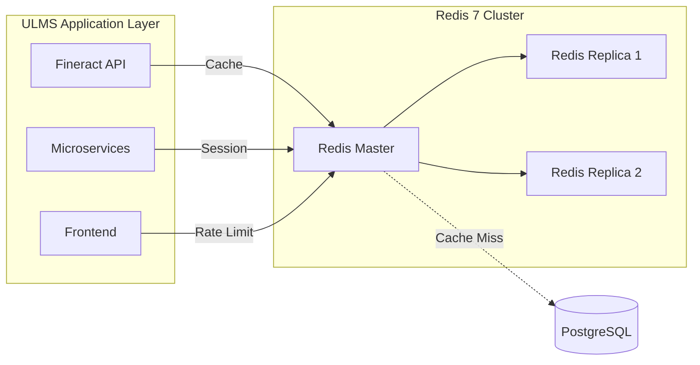

**Document Control**

| Field | Value |
|-------|-------|
| **Document Title** | Redis 7 Setup and Configuration |
| **Project Name** | Unisoft Loan Management System (ULMS) |
| **Document ID** | 2.2.5 |
| **Document Version** | 1.0 |
| **Date** | 2026-02-05 |
| **Prepared By** | Backend Lead, ULMS Project |
| **Reviewed By** | DevOps Engineer |
| **Classification** | Internal |
| **Status** | Approved |

**Revision History**

| Version | Date | Author | Description |
|---------|------|--------|-------------|
| 1.0 | 2026-02-05 | Backend Lead | Initial version |

---

# Redis 7 Setup and Configuration
## Cache and Session Management for ULMS v2.0

---

## Table of Contents

1. [Purpose](#1-purpose)
2. [Architecture Overview](#2-architecture-overview)
3. [Installation](#3-installation)
4. [Configuration](#4-configuration)
5. [Persistence Setup](#5-persistence-setup)
6. [Security Configuration](#6-security-configuration)
7. [Memory Management](#7-memory-management)
8. [Application Integration](#8-application-integration)
9. [Monitoring](#9-monitoring)
10. [Backup and Recovery](#10-backup-and-recovery)
11. [Troubleshooting](#11-troubleshooting)
12. [Related Documents](#12-related-documents)

---

## 1. Purpose

This document provides comprehensive setup and configuration instructions for Redis 7, serving as the caching layer and session store for ULMS v2.0. Redis is used for application caching, session management, rate limiting, and real-time data processing in compliance with Bangladesh banking performance requirements.

---

## 2. Architecture Overview

### 2.1 Redis Usage in ULMS



### 2.2 Cache Usage Patterns

| Cache Type | Key Pattern | TTL | Size Estimate |
|------------|-------------|-----|---------------|
| User Sessions | `session:{token}` | 1 hour | 10 KB per session |
| API Response | `api:{hash}` | 5 minutes | 1-100 KB |
| Loan Products | `products:{tenant}` | 1 hour | 50 KB |
| Client Data | `client:{id}` | 15 minutes | 5 KB |
| Report Cache | `report:{params}` | 30 minutes | 1-10 MB |
| Rate Limit | `ratelimit:{ip}` | 1 minute | 100 B |

---

## 3. Installation

### 3.1 Docker Installation (Recommended for Dev)

```bash
# Pull Redis 7 image
docker pull redis:7-alpine

# Run Redis container
docker run -d \
  --name ulms-redis \
  --restart unless-stopped \
  -p 6379:6379 \
  -v redis_data:/data \
  redis:7-alpine \
  redis-server --appendonly yes --maxmemory 512mb --maxmemory-policy allkeys-lru

# Verify installation
docker exec ulms-redis redis-cli ping
# Output: PONG
```

### 3.2 Linux Installation

```bash
# Ubuntu/Debian
sudo apt update
sudo apt install -y redis-server

# Check version
redis-server --version
# Output: Redis server v=7.x.x

# Start service
sudo systemctl start redis-server
sudo systemctl enable redis-server
```

### 3.3 macOS Installation

```bash
# Using Homebrew
brew install redis

# Start service
brew services start redis

# Verify
redis-cli ping
```

---

## 4. Configuration

### 4.1 Redis Configuration File

**File:** `/etc/redis/redis.conf` (Linux) or `docker/redis/redis.conf`

```conf
# ==========================================
# ULMS Redis 7 Configuration
# ==========================================

# ------------------------------------------
# Network Configuration
# ------------------------------------------
bind 0.0.0.0
port 6379
tcp-backlog 511
timeout 0
tcp-keepalive 300

# ------------------------------------------
# General Configuration
# ------------------------------------------
daemonize no
supervised systemd
pidfile /var/run/redis/redis-server.pid
loglevel notice
logfile /var/log/redis/redis-server.log

# ------------------------------------------
# Persistence Configuration
# ------------------------------------------
# RDB Snapshotting
save 900 1      # Save after 900 sec if 1 key changed
save 300 10     # Save after 300 sec if 10 keys changed
save 60 10000   # Save after 60 sec if 10000 keys changed

stop-writes-on-bgsave-error yes
rdbcompression yes
rdbchecksum yes
dbfilename dump.rdb
dir /var/lib/redis

# AOF Configuration
appendonly yes
appendfilename "appendonly.aof"
appendfsync everysec
no-appendfsync-on-rewrite no
auto-aof-rewrite-percentage 100
auto-aof-rewrite-min-size 64mb

# ------------------------------------------
# Memory Management
# ------------------------------------------
maxmemory 1gb
maxmemory-policy allkeys-lru

# ------------------------------------------
# Security (Production)
# ------------------------------------------
# requirepass your_strong_password_here
# rename-command FLUSHDB ""
# rename-command FLUSHALL ""

# ------------------------------------------
# Client Configuration
# ------------------------------------------
maxclients 10000

# ------------------------------------------
# Slow Log
# ------------------------------------------
slowlog-log-slower-than 10000
slowlog-max-len 128
```

### 4.2 Docker Compose Configuration

```yaml
# docker-compose.redis.yml
version: '3.8'

services:
  redis:
    image: redis:7-alpine
    container_name: ulms-redis
    hostname: redis
    restart: unless-stopped
    command: redis-server /usr/local/etc/redis/redis.conf
    ports:
      - "6379:6379"
    volumes:
      - redis_data:/data
      - ./docker/redis/redis.conf:/usr/local/etc/redis/redis.conf:ro
    sysctls:
      - net.core.somaxconn=65535
    ulimits:
      nofile:
        soft: 65535
        hard: 65535
    networks:
      - ulms-network
    healthcheck:
      test: ["CMD", "redis-cli", "ping"]
      interval: 10s
      timeout: 5s
      retries: 5

volumes:
  redis_data:
    driver: local

networks:
  ulms-network:
    driver: bridge
```

---

## 5. Persistence Setup

### 5.1 RDB vs AOF

| Feature | RDB | AOF |
|---------|-----|-----|
| Persistence | Point-in-time snapshots | Append-only log |
| Recovery Speed | Fast | Slower |
| File Size | Compact | Larger |
| Durability | Less durable | More durable |
| Use Case | Backups, disaster recovery | Real-time persistence |

### 5.2 ULMS Persistence Strategy

```conf
# Enable both RDB and AOF for maximum durability
save 900 1
save 300 10
save 60 10000
appendonly yes
appendfsync everysec

# Backup schedule
# RDB: Daily backups of dump.rdb
# AOF: Real-time, rotated hourly
```

---

## 6. Security Configuration

### 6.1 Authentication

```bash
# Set password (Production)
redis-cli CONFIG SET requirepass "your_strong_password"

# Connect with password
redis-cli -a "your_strong_password" ping

# Or use AUTH command
redis-cli
AUTH your_strong_password
```

### 6.2 Network Security

```conf
# Bind to specific interface
bind 127.0.0.1 10.0.0.1

# Disable dangerous commands (Production)
rename-command FLUSHDB ""
rename-command FLUSHALL ""
rename-command CONFIG "CONFIG_9f82b3"
rename-command DEBUG ""
```

### 6.3 TLS/SSL Configuration

```conf
# Enable TLS (Production)
port 0
tls-port 6379
tls-cert-file /etc/ssl/certs/redis.crt
tls-key-file /etc/ssl/private/redis.key
tls-ca-cert-file /etc/ssl/certs/ca.crt
tls-protocols "TLSv1.2 TLSv1.3"
```

---

## 7. Memory Management

### 7.1 Memory Policies

| Policy | Description | Use Case |
|--------|-------------|----------|
| allkeys-lru | Evict least recently used keys | General caching |
| allkeys-lfu | Evict least frequently used keys | Popular items |
| volatile-lru | Evict LRU keys with TTL | Session cache |
| noeviction | Return error on memory limit | Critical data |

### 7.2 ULMS Memory Configuration

```conf
# Cache sizing guidelines
# - 1000 concurrent users × 10 KB session = 10 MB
# - API cache: 100 MB
# - Product cache: 50 MB
# - Other caches: 100 MB
# Total: ~300 MB + overhead = 512 MB recommended

maxmemory 512mb
maxmemory-policy allkeys-lru
maxmemory-samples 5
```

---

## 8. Application Integration

### 8.1 Spring Boot Configuration

**File:** `application-redis.yml`

```yaml
spring:
  cache:
    type: redis
  redis:
    host: ${REDIS_HOST:localhost}
    port: ${REDIS_PORT:6379}
    password: ${REDIS_PASSWORD:}
    ssl:
      enabled: ${REDIS_SSL_ENABLED:false}
    timeout: 2000ms
    lettuce:
      pool:
        max-active: 8
        max-idle: 8
        min-idle: 0
        max-wait: 1000ms
      shutdown-timeout: 200ms
    cache:
      time-to-live: 300000  # 5 minutes default TTL
      cache-names: 
        - loanProducts
        - clientData
        - userSessions
        - apiResponses
        - reportCache

# Custom cache configurations
app:
  cache:
    ttl:
      loanProducts: 3600000      # 1 hour
      clientData: 900000         # 15 minutes
      userSessions: 3600000      # 1 hour
      apiResponses: 300000       # 5 minutes
      reportCache: 1800000       # 30 minutes
```

### 8.2 Cache Configuration Class

```java
package com.unisoft.ulms.config;

import org.springframework.cache.annotation.EnableCaching;
import org.springframework.context.annotation.Bean;
import org.springframework.context.annotation.Configuration;
import org.springframework.data.redis.cache.RedisCacheConfiguration;
import org.springframework.data.redis.cache.RedisCacheManager;
import org.springframework.data.redis.connection.RedisConnectionFactory;
import org.springframework.data.redis.serializer.GenericJackson2JsonRedisSerializer;
import org.springframework.data.redis.serializer.RedisSerializationContext;
import org.springframework.data.redis.serializer.StringRedisSerializer;

import java.time.Duration;
import java.util.HashMap;
import java.util.Map;

@Configuration
@EnableCaching
public class RedisCacheConfig {

    @Bean
    public RedisCacheManager cacheManager(RedisConnectionFactory connectionFactory) {
        // Default configuration
        RedisCacheConfiguration defaultConfig = RedisCacheConfiguration.defaultCacheConfig()
            .entryTtl(Duration.ofMinutes(5))
            .serializeKeysWith(RedisSerializationContext.SerializationPair
                .fromSerializer(new StringRedisSerializer()))
            .serializeValuesWith(RedisSerializationContext.SerializationPair
                .fromSerializer(new GenericJackson2JsonRedisSerializer()));

        // Custom TTL configurations
        Map<String, RedisCacheConfiguration> cacheConfigs = new HashMap<>();
        cacheConfigs.put("loanProducts", defaultConfig.entryTtl(Duration.ofHours(1)));
        cacheConfigs.put("clientData", defaultConfig.entryTtl(Duration.ofMinutes(15)));
        cacheConfigs.put("userSessions", defaultConfig.entryTtl(Duration.ofHours(1)));
        cacheConfigs.put("apiResponses", defaultConfig.entryTtl(Duration.ofMinutes(5)));
        cacheConfigs.put("reportCache", defaultConfig.entryTtl(Duration.ofMinutes(30)));

        return RedisCacheManager.builder(connectionFactory)
            .cacheDefaults(defaultConfig)
            .withInitialCacheConfigurations(cacheConfigs)
            .transactionAware()
            .build();
    }
}
```

### 8.3 Session Management

```java
package com.unisoft.ulms.config;

import org.springframework.context.annotation.Bean;
import org.springframework.context.annotation.Configuration;
import org.springframework.session.data.redis.config.annotation.web.http.EnableRedisHttpSession;
import org.springframework.session.web.context.AbstractHttpSessionApplicationInitializer;

@Configuration
@EnableRedisHttpSession(
    maxInactiveIntervalInSeconds = 3600,  // 1 hour session timeout
    redisNamespace = "ulms:session"
)
public class SessionConfig extends AbstractHttpSessionApplicationInitializer {
    
    @Bean
    public HttpSessionEventPublisher httpSessionEventPublisher() {
        return new HttpSessionEventPublisher();
    }
}
```

### 8.4 Rate Limiting Implementation

```java
package com.unisoft.ulms.security;

import org.springframework.data.redis.core.StringRedisTemplate;
import org.springframework.stereotype.Component;

import java.time.Duration;
import java.util.concurrent.TimeUnit;

@Component
public class RateLimitService {
    
    private final StringRedisTemplate redisTemplate;
    
    public RateLimitService(StringRedisTemplate redisTemplate) {
        this.redisTemplate = redisTemplate;
    }
    
    public boolean isAllowed(String key, int maxRequests, Duration window) {
        String redisKey = "ratelimit:" + key;
        Long current = redisTemplate.opsForValue().increment(redisKey);
        
        if (current == 1) {
            redisTemplate.expire(redisKey, window.getSeconds(), TimeUnit.SECONDS);
        }
        
        return current <= maxRequests;
    }
    
    // CIB API rate limit: 100 requests per minute
    public boolean isCibRequestAllowed(String apiKey) {
        return isAllowed("cib:" + apiKey, 100, Duration.ofMinutes(1));
    }
    
    // NID API rate limit: 60 requests per minute
    public boolean isNidRequestAllowed(String apiKey) {
        return isAllowed("nid:" + apiKey, 60, Duration.ofMinutes(1));
    }
    
    // General API rate limit: 1000 requests per hour per IP
    public boolean isApiRequestAllowed(String ipAddress) {
        return isAllowed("api:" + ipAddress, 1000, Duration.ofHours(1));
    }
}
```

---

## 9. Monitoring

### 9.1 Redis CLI Monitoring

```bash
# Monitor all commands
redis-cli monitor

# Get server info
redis-cli info

# Get specific section
redis-cli info memory
redis-cli info stats
redis-cli info replication

# Slow log
redis-cli slowlog get 10

# Connected clients
redis-cli client list

# Memory usage
redis-cli memory usage mykey
```

### 9.2 Key Metrics to Monitor

```bash
#!/bin/bash
# Redis health check script

echo "=== Redis Health Check ==="

# Memory usage
used_memory=$(redis-cli info memory | grep used_memory: | cut -d: -f2)
maxmemory=$(redis-cli info memory | grep maxmemory: | cut -d: -f2)
echo "Memory: $used_memory / $maxmemory"

# Connected clients
connected_clients=$(redis-cli info clients | grep connected_clients | cut -d: -f2)
echo "Connected Clients: $connected_clients"

# Hit/Miss ratio
keyspace_hits=$(redis-cli info stats | grep keyspace_hits | cut -d: -f2)
keyspace_misses=$(redis-cli info stats | grep keyspace_misses | cut -d: -f2)
if [ "$keyspace_hits" -gt 0 ]; then
    hit_rate=$(echo "scale=2; $keyspace_hits / ($keyspace_hits + $keyspace_misses) * 100" | bc)
    echo "Cache Hit Rate: $hit_rate%"
fi

# Evicted keys
evicted_keys=$(redis-cli info stats | grep evicted_keys | cut -d: -f2)
echo "Evicted Keys: $evicted_keys"

# Uptime
uptime=$(redis-cli info server | grep uptime_in_seconds | cut -d: -f2)
echo "Uptime: $uptime seconds"
```

### 9.3 Prometheus Exporter

```yaml
# Add to docker-compose.monitoring.yml
services:
  redis-exporter:
    image: oliver006/redis_exporter:latest
    container_name: redis-exporter
    environment:
      - REDIS_ADDR=redis:6379
    ports:
      - "9121:9121"
    networks:
      - monitoring
```

---

## 10. Backup and Recovery

### 10.1 RDB Backup

```bash
#!/bin/bash
# Redis RDB backup script

BACKUP_DIR="/backup/redis"
DATE=$(date +%Y%m%d_%H%M%S)
mkdir -p "$BACKUP_DIR"

# Trigger BGSAVE
redis-cli BGSAVE

# Wait for save to complete
sleep 5

# Copy RDB file
cp /var/lib/redis/dump.rdb "$BACKUP_DIR/dump_$DATE.rdb"

# Compress backup
gzip "$BACKUP_DIR/dump_$DATE.rdb"

# Keep last 7 days of backups
find "$BACKUP_DIR" -name "dump_*.rdb.gz" -mtime +7 -delete

echo "Backup completed: $BACKUP_DIR/dump_$DATE.rdb.gz"
```

### 10.2 AOF Backup

```bash
#!/bin/bash
# Redis AOF backup script

BACKUP_DIR="/backup/redis/aof"
DATE=$(date +%Y%m%d_%H%M%S)
mkdir -p "$BACKUP_DIR"

# Rewrite AOF to minimize file size
redis-cli BGREWRITEAOF

# Wait for rewrite to complete
sleep 10

# Copy AOF file
cp /var/lib/redis/appendonly.aof "$BACKUP_DIR/appendonly_$DATE.aof"

# Compress backup
gzip "$BACKUP_DIR/appendonly_$DATE.aof"

# Keep last 3 days of AOF backups
find "$BACKUP_DIR" -name "appendonly_*.aof.gz" -mtime +3 -delete

echo "AOF Backup completed: $BACKUP_DIR/appendonly_$DATE.aof.gz"
```

### 10.3 Recovery Procedures

```bash
# Stop Redis
sudo systemctl stop redis-server

# Restore RDB backup
sudo cp /backup/redis/dump_20240205_120000.rdb /var/lib/redis/dump.rdb
sudo chown redis:redis /var/lib/redis/dump.rdb

# Start Redis
sudo systemctl start redis-server

# Verify
redis-cli ping
```

---

## 11. Troubleshooting

### 11.1 Connection Issues

```bash
# Test connection
redis-cli ping

# Check if Redis is running
sudo systemctl status redis-server

# Check logs
sudo tail -f /var/log/redis/redis-server.log

# Check port binding
sudo netstat -tlnp | grep 6379
```

### 11.2 Memory Issues

```bash
# Check memory usage
redis-cli info memory

# Find largest keys
redis-cli --bigkeys

# Analyze memory per key pattern
redis-cli eval "
local keys = redis.call('keys', ARGV[1])
local result = {}
for _, key in ipairs(keys) do
    local size = redis.call('memory', 'usage', key)
    table.insert(result, {key, size})
end
return result
" 0 "session:*"

# Clear all cache (CAUTION)
redis-cli FLUSHDB
```

### 11.3 Performance Issues

```bash
# Check slow queries
redis-cli slowlog get 20

# Check command stats
redis-cli info commandstats

# Monitor in real-time
redis-cli --stat

# Latency test
redis-cli --latency
```

---

## 12. Related Documents

| Document ID | Document Name | Description |
|-------------|---------------|-------------|
| 2.1.2 | [Docker Compose Configuration](../2.1_Local_Development_Environment/[DEV]_Docker_Compose_Configuration_v1.0.md) | Infrastructure setup |
| 2.2.1 | [PostgreSQL Installation]([DB]_PostgreSQL_16_Installation_Configuration_v1.0.md) | Database installation |
| 2.7.1 | [Monitoring Setup](../07_Operations/[OPS]_Monitoring_Setup_v1.0.md) | Monitoring configuration |

---

*© 2026 Unisoft Systems Limited. All Rights Reserved.*
*Internal Use Only - ULMS Development Team*
