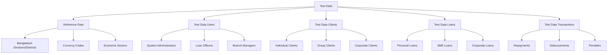
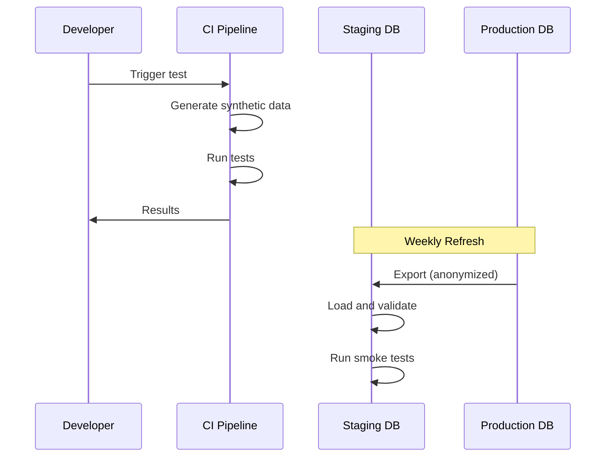

**Document Control**

| Field | Value |
|-------|-------|
| **Document Title** | Test Data Management Strategy |
| **Project Name** | Unisoft Loan Management System (ULMS) |
| **Document ID** | 2.3.3 |
| **Document Version** | 1.0 |
| **Date** | 2026-02-05 |
| **Prepared By** | QA Lead, ULMS Project |
| **Reviewed By** | Technical Lead |
| **Classification** | Internal |
| **Status** | Approved |

**Revision History**

| Version | Date | Author | Description |
|---------|------|--------|-------------|
| 1.0 | 2026-02-05 | QA Lead | Initial version |

---

# Test Data Management Strategy
## Comprehensive Test Data Approach for ULMS v2.0

---

## Table of Contents

1. [Purpose](#1-purpose)
2. [Test Data Principles](#2-test-data-principles)
3. [Test Data Categories](#3-test-data-categories)
4. [Data Generation Strategy](#4-data-generation-strategy)
5. [Data Masking and Anonymization](#5-data-masking-and-anonymization)
6. [Test Data Environments](#6-test-data-environments)
7. [Data Provisioning](#7-data-provisioning)
8. [Data Maintenance](#8-data-maintenance)
9. [Compliance and Security](#9-compliance-and-security)
10. [Related Documents](#10-related-documents)

---

## 1. Purpose

This document defines the test data management strategy for ULMS v2.0, ensuring consistent, secure, and compliant test data across all testing environments while meeting Bangladesh Bank data protection requirements.

---

## 2. Test Data Principles

### 2.1 Guiding Principles

| Principle | Description |
|-----------|-------------|
| Data Privacy | No real customer data in non-production environments |
| Referential Integrity | Test data maintains database relationships |
| Reproducibility | Same test data produces consistent results |
| Scalability | Data volumes appropriate for test type |
| Compliance | Adherence to Bangladesh Bank data protection guidelines |

### 2.2 Data Classification

| Classification | Description | Handling |
|---------------|-------------|----------|
| Synthetic | Algorithmically generated data | Preferred for all tests |
| Anonymized | Real data with PII removed | Staging environment only |
| Production-like | Representative of production patterns | Performance testing |
| Static | Fixed reference data | Shared across environments |

---

## 3. Test Data Categories

### 3.1 Category Definitions



### 3.2 Data Volume by Environment

| Environment | Clients | Loans | Transactions | Refresh Cycle |
|-------------|---------|-------|--------------|---------------|
| Local Dev | 10-50 | 20-100 | 100-500 | On demand |
| CI/Test | 100-500 | 200-1000 | 5000-10000 | Per test run |
| Staging | 10000+ | 50000+ | 1M+ | Weekly |
| Performance | 100000+ | 500000+ | 10M+ | Monthly |

---

## 4. Data Generation Strategy

### 4.1 Synthetic Data Generation

**File:** `ulms-test-data-generator/src/main/java/com/unisoft/ulms/testdata/generator/ClientDataGenerator.java`

```java
package com.unisoft.ulms.testdata.generator;

import com.github.javafaker.Faker;
import com.unisoft.ulms.domain.Client;
import org.springframework.stereotype.Component;

import java.time.LocalDate;
import java.time.ZoneId;
import java.util.List;
import java.util.Locale;
import java.util.stream.Collectors;
import java.util.stream.IntStream;

@Component
public class ClientDataGenerator {
    
    private final Faker faker = new Faker(new Locale("en-BD"));
    private final List<String> bangladeshFirstNames = List.of(
        "Mohammad", "Abdul", "Abdullah", "Rahim", "Karim", 
        "Nasir", "Faisal", "Imran", "Rafiq", "Salim",
        "Fatima", "Ayesha", "Khadija", "Nasrin", "Rehana"
    );
    
    private final List<String> bangladeshLastNames = List.of(
        "Islam", "Hossain", "Rahman", "Ahmed", "Khan",
        "Ali", "Hasan", "Haque", "Akter", "Begum"
    );
    
    public Client generateIndividualClient() {
        String firstName = bangladeshFirstNames.get(
            faker.random().nextInt(bangladeshFirstNames.size())
        );
        String lastName = bangladeshLastNames.get(
            faker.random().nextInt(bangladeshLastNames.size())
        );
        
        return Client.builder()
            .firstName(firstName)
            .lastName(lastName)
            .displayName(firstName + " " + lastName)
            .mobileNo(generateBangladeshMobile())
            .email(faker.internet().emailAddress())
            .dateOfBirth(generateBirthDate())
            .gender(faker.random().nextBoolean() ? "MALE" : "FEMALE")
            .nidNumber(generateNID())
            .address(generateAddress())
            .occupation(generateOccupation())
            .monthlyIncome(generateIncome())
            .build();
    }
    
    private String generateBangladeshMobile() {
        String[] prefixes = {"017", "018", "019", "016", "015"};
        String prefix = prefixes[faker.random().nextInt(prefixes.length)];
        return prefix + faker.number().digits(8);
    }
    
    private String generateNID() {
        // New 17-digit NID format
        return faker.number().digits(17);
    }
    
    private LocalDate generateBirthDate() {
        return faker.date()
            .birthday(18, 70)
            .toInstant()
            .atZone(ZoneId.systemDefault())
            .toLocalDate();
    }
    
    private Address generateAddress() {
        return Address.builder()
            .street(faker.address().streetAddress())
            .city(faker.options().option("Dhaka", "Chittagong", "Sylhet", "Khulna", "Rajshahi"))
            .postalCode(faker.number().digits(4))
            .division(faker.options().option("Dhaka", "Chittagong", "Sylhet", "Khulna"))
            .build();
    }
    
    private String generateOccupation() {
        return faker.options().option(
            "SERVICE_PRIVATE", "SERVICE_GOVT", "BUSINESS", 
            "FARMER", "LABOUR", "TEACHER", "DOCTOR"
        );
    }
    
    private BigDecimal generateIncome() {
        // Income range: BDT 10,000 - BDT 500,000
        return BigDecimal.valueOf(
            faker.number().numberBetween(10000, 500000)
        );
    }
    
    public List<Client> generateClients(int count) {
        return IntStream.range(0, count)
            .mapToObj(i -> generateIndividualClient())
            .collect(Collectors.toList());
    }
}
```

### 4.2 Loan Data Generation

```java
package com.unisoft.ulms.testdata.generator;

import com.unisoft.ulms.domain.Client;
import com.unisoft.ulms.domain.Loan;
import com.unisoft.ulms.domain.LoanProduct;
import org.springframework.stereotype.Component;

import java.math.BigDecimal;
import java.math.RoundingMode;
import java.time.LocalDate;
import java.util.List;
import java.util.stream.Collectors;
import java.util.stream.IntStream;

@Component
public class LoanDataGenerator {
    
    private final List<LoanProduct> loanProducts;
    
    public LoanDataGenerator(List<LoanProduct> loanProducts) {
        this.loanProducts = loanProducts;
    }
    
    public Loan generateLoan(Client client) {
        LoanProduct product = loanProducts.get(
            (int) (Math.random() * loanProducts.size())
        );
        
        BigDecimal principal = calculatePrincipal(client, product);
        int termMonths = calculateTermMonths(product);
        
        return Loan.builder()
            .client(client)
            .loanProduct(product)
            .principalAmount(principal)
            .approvedPrincipal(principal)
            .annualInterestRate(product.getNominalInterestRate())
            .numberOfRepayments(termMonths)
            .repaymentEvery(1)
            .repaymentFrequency(RepaymentFrequency.MONTHS)
            .submittedOnDate(LocalDate.now().minusDays((int)(Math.random() * 30)))
            .expectedDisbursementDate(LocalDate.now())
            .loanStatus(determineStatus())
            .build();
    }
    
    private BigDecimal calculatePrincipal(Client client, LoanProduct product) {
        // Loan amount based on client's income
        BigDecimal maxByIncome = client.getMonthlyIncome()
            .multiply(BigDecimal.valueOf(12)) // 12 months income
            .multiply(BigDecimal.valueOf(0.5)); // 50% of annual income
        
        BigDecimal maxByProduct = product.getMaxPrincipalAmount();
        BigDecimal minByProduct = product.getMinPrincipalAmount();
        
        BigDecimal principal = maxByIncome.min(maxByProduct);
        principal = principal.max(minByProduct);
        
        // Round to nearest 1000
        return principal.divide(BigDecimal.valueOf(1000), 0, RoundingMode.FLOOR)
            .multiply(BigDecimal.valueOf(1000));
    }
    
    private int calculateTermMonths(LoanProduct product) {
        int minTerm = product.getMinNumberOfRepayments();
        int maxTerm = product.getMaxNumberOfRepayments();
        return minTerm + (int)(Math.random() * (maxTerm - minTerm + 1));
    }
    
    private LoanStatus determineStatus() {
        double random = Math.random();
        if (random < 0.6) return LoanStatus.ACTIVE;
        if (random < 0.75) return LoanStatus.CLOSED_OBLIGATIONS_MET;
        if (random < 0.85) return LoanStatus.PENDING_APPROVAL;
        if (random < 0.90) return LoanStatus.ARREARS;
        return LoanStatus.WRITTEN_OFF;
    }
    
    public List<Loan> generateLoans(List<Client> clients, int loansPerClient) {
        return clients.stream()
            .flatMap(client -> 
                IntStream.range(0, (int)(Math.random() * loansPerClient) + 1)
                    .mapToObj(i -> generateLoan(client))
            )
            .collect(Collectors.toList());
    }
}
```

### 4.3 Test Data Factory

```java
package com.unisoft.ulms.testdata;

import com.unisoft.ulms.testdata.generator.ClientDataGenerator;
import com.unisoft.ulms.testdata.generator.LoanDataGenerator;
import org.springframework.stereotype.Component;
import org.springframework.transaction.annotation.Transactional;

@Component
@Transactional
public class TestDataFactory {
    
    private final ClientDataGenerator clientGenerator;
    private final LoanDataGenerator loanGenerator;
    private final ClientRepository clientRepository;
    private final LoanRepository loanRepository;
    
    public TestDataSet createTestDataSet(TestDataConfiguration config) {
        // Generate clients
        List<Client> clients = clientGenerator.generateClients(config.getClientCount());
        clients = clientRepository.saveAll(clients);
        
        // Generate loans
        List<Loan> loans = loanGenerator.generateLoans(clients, config.getMaxLoansPerClient());
        loans = loanRepository.saveAll(loans);
        
        // Generate repayment schedules
        loans.forEach(this::generateRepaymentSchedule);
        
        // Generate transactions based on loan age
        loans.forEach(this::generateTransactions);
        
        return TestDataSet.builder()
            .clients(clients)
            .loans(loans)
            .build();
    }
}
```

---

## 5. Data Masking and Anonymization

### 5.1 Anonymization Rules

| Field Type | Anonymization Method | Example |
|------------|---------------------|---------|
| Names | Random replacement | "John Doe" → "Client12345" |
| NID Numbers | Hash with salt | Preserves uniqueness |
| Mobile Numbers | Preserve prefix, random suffix | "017xxxx" format |
| Addresses | Randomize within same district | Maintain geography |
| Photos | Replace with placeholder | Standard avatar |
| Account Numbers | Generate new sequence | ULMS- prefixed |

### 5.2 Anonymization Script

```sql
-- ==========================================
-- Production Data Anonymization Script
-- Run before copying to staging
-- ==========================================

-- Anonymize client names
UPDATE m_client SET
    firstname = 'Client' || id::TEXT,
    lastname = 'Test' || id::TEXT,
    display_name = 'Client Test ' || id::TEXT,
    email = 'client' || id::TEXT || '@test.ulms.bd';

-- Anonymize NID numbers (keep format)
UPDATE m_client_identifier SET
    document_key = LPAD(
        MD5(id::TEXT || 'salt')::BIGINT::TEXT, 
        17, 
        '0'
    )
WHERE document_type_id = 1; -- NID type

-- Anonymize mobile numbers (preserve operator prefix)
UPDATE m_client SET
    mobile_no = SUBSTRING(mobile_no FROM 1 FOR 3) || 
                LPAD(FLOOR(RANDOM() * 99999999)::TEXT, 8, '0');

-- Anonymize addresses
UPDATE m_client_address SET
    address_line_1 = 'House ' || FLOOR(RANDOM() * 100 + 1)::TEXT,
    address_line_2 = 'Road ' || FLOOR(RANDOM() * 50 + 1)::TEXT,
    address_line_3 = NULL,
    landmark = NULL;

-- Remove sensitive notes
UPDATE m_note SET 
    note = CASE 
        WHEN note LIKE '%password%' OR note LIKE '%PIN%' THEN '[REDACTED]'
        ELSE LEFT(note, 50) || '...'
    END;

-- Clear audit trail of sensitive operations
DELETE FROM m_audit_log 
WHERE action_name IN ('PASSWORD_RESET', 'PIN_CHANGE');
```

---

## 6. Test Data Environments

### 6.1 Environment Data Matrix

| Environment | Data Source | Refresh Frequency | Retention |
|-------------|-------------|-------------------|-----------|
| Local Dev | Synthetic | On demand | Ephemeral |
| Unit Test | In-memory H2 | Per test | Immediate |
| Integration Test | TestContainers | Per test class | Test duration |
| CI Test | Synthetic seed | Per pipeline | Build duration |
| Staging | Anonymized prod | Weekly | 2 weeks |
| Performance | Production-like | Monthly | 1 month |

### 6.2 Data Refresh Process



---

## 7. Data Provisioning

### 7.1 Data Provisioning API

```java
@RestController
@RequestMapping("/api/test-data")
@Profile("test")
public class TestDataController {
    
    @PostMapping("/generate")
    public ResponseEntity<TestDataSet> generateTestData(
            @RequestBody TestDataConfiguration config) {
        
        TestDataSet dataSet = testDataFactory.createTestDataSet(config);
        return ResponseEntity.ok(dataSet);
    }
    
    @PostMapping("/scenario/{scenarioName}")
    public ResponseEntity<Void> loadScenario(
            @PathVariable String scenarioName) {
        
        testScenarioLoader.load(scenarioName);
        return ResponseEntity.ok().build();
    }
    
    @DeleteMapping("/cleanup")
    public ResponseEntity<Void> cleanup() {
        testDataCleanupService.cleanupAll();
        return ResponseEntity.ok().build();
    }
}
```

### 7.2 Predefined Test Scenarios

| Scenario | Description | Data Volume |
|----------|-------------|-------------|
| CLEAN_BANK | New bank, no defaulters | 100 clients, 200 loans |
| MIXED_PORTFOLIO | Mix of all classifications | 1000 clients, 2000 loans |
| HIGH_DEFAULT | 20% default rate | 500 clients, 1000 loans |
| STRESS_TEST | Maximum load | 100K clients, 500K loans |
| COMPLIANCE_TEST | BRPD 15/2024 scenarios | All classification stages |

---

## 8. Data Maintenance

### 8.1 Data Quality Checks

```sql
-- Check for orphaned records
SELECT 'Orphaned Loans' as check_type, COUNT(*) as count
FROM m_loan l
LEFT JOIN m_client c ON l.client_id = c.id
WHERE c.id IS NULL;

-- Check for invalid dates
SELECT 'Future Dates' as check_type, COUNT(*) as count
FROM m_loan
WHERE submittedon_date > CURRENT_DATE;

-- Check for negative amounts
SELECT 'Negative Balances' as check_type, COUNT(*) as count
FROM m_loan
WHERE principal_outstanding_derived < 0;
```

### 8.2 Data Cleanup Schedule

| Cleanup Task | Frequency | Retention |
|--------------|-----------|-----------|
| Old test runs | Daily | 7 days |
| Failed test data | Daily | 3 days |
| Audit logs | Weekly | 30 days |
| Temporary files | Daily | 1 day |

---

## 9. Compliance and Security

### 9.1 Bangladesh Bank Compliance

- No real customer data in development/test environments
- All PII anonymized before staging deployment
- Access logs maintained for audit purposes
- Data retention aligned with regulatory requirements

### 9.2 Data Access Controls

| Role | Local Dev | CI Test | Staging | Performance |
|------|-----------|---------|---------|-------------|
| Developer | Full | Read | Read | None |
| QA Engineer | Full | Full | Full | Read |
| DevOps | None | Admin | Admin | Admin |
| Security | Audit | Audit | Audit | Audit |

---

## 10. Related Documents

| Document ID | Document Name | Description |
|-------------|---------------|-------------|
| 2.2.4 | [Database Seeding Scripts](../2.2_Database_Setup/[DB]_Database_Seeding_Scripts_v1.0.md) | Test data SQL scripts |
| 2.3.1 | [Test Environment Setup]([TEST]_Test_Environment_Setup_Guide_v1.0.md) | Testing infrastructure |
| 2.8.1 | [Security Configuration](../08_Compliance/[SEC]_Security_Configuration_Guide_v1.0.md) | Security standards |

---

*© 2026 Unisoft Systems Limited. All Rights Reserved.*
*Internal Use Only - ULMS Development Team*
