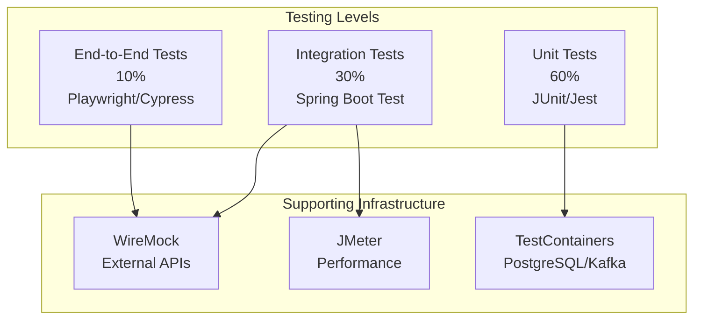

**Document Control**

| Field | Value |
|-------|-------|
| **Document Title** | Test Environment Setup Guide |
| **Project Name** | Unisoft Loan Management System (ULMS) |
| **Document ID** | 2.3.1 |
| **Document Version** | 1.0 |
| **Date** | 2026-02-05 |
| **Prepared By** | QA Lead, ULMS Project |
| **Reviewed By** | Technical Lead |
| **Classification** | Internal |
| **Status** | Approved |

**Revision History**

| Version | Date | Author | Description |
|---------|------|--------|-------------|
| 1.0 | 2026-02-05 | QA Lead | Initial version |

---

# Test Environment Setup Guide
## Comprehensive Testing Infrastructure for ULMS v2.0

---

## Table of Contents

1. [Purpose](#1-purpose)
2. [Test Environment Architecture](#2-test-environment-architecture)
3. [Prerequisites](#3-prerequisites)
4. [Test Environment Configuration](#4-test-environment-configuration)
5. [Testing Tools Setup](#5-testing-tools-setup)
6. [Test Data Management](#6-test-data-management)
7. [CI/CD Integration](#7-cicd-integration)
8. [Test Execution](#8-test-execution)
9. [Troubleshooting](#9-troubleshooting)
10. [Related Documents](#10-related-documents)

---

## 1. Purpose

This document provides comprehensive instructions for setting up the testing infrastructure for ULMS v2.0, including unit testing, integration testing, end-to-end testing, and performance testing environments tailored for Bangladesh banking sector compliance.

---

## 2. Test Environment Architecture

### 2.1 Testing Pyramid



### 2.2 Test Environment Components

| Component | Technology | Purpose |
|-----------|------------|---------|
| Unit Testing | JUnit 5, Mockito | Backend unit tests |
| Frontend Testing | Jest, React Testing Library | Component tests |
| API Testing | REST Assured, Postman | API contract tests |
| E2E Testing | Playwright | Browser automation |
| Integration Testing | TestContainers | Database/Service tests |
| Mocking | WireMock | External API mocking |
| Performance | JMeter, k6 | Load testing |
| Coverage | JaCoCo, Istanbul | Code coverage |

---

## 3. Prerequisites

### 3.1 Software Requirements

| Software | Version | Purpose |
|----------|---------|---------|
| Java JDK | Eclipse Temurin 21 | Backend tests |
| Node.js | 20 LTS | Frontend tests |
| Docker | 24.x | Test containers |
| Docker Compose | 2.23+ | Integration tests |
| Maven | 3.9+ | Java build |
| Gradle | 8.5+ | Alternative build |

### 3.2 Hardware Requirements

| Resource | Unit Tests | Integration Tests | E2E Tests |
|----------|------------|-------------------|-----------|
| RAM | 4 GB | 8 GB | 8 GB |
| CPU Cores | 2 | 4 | 4 |
| Disk Space | 10 GB | 20 GB | 20 GB |

---

## 4. Test Environment Configuration

### 4.1 Backend Test Configuration

**File:** `fineract/src/test/resources/application-test.yml`

```yaml
# ==========================================
# ULMS Test Configuration
# ==========================================

spring:
  profiles:
    active: test
  
  datasource:
    url: jdbc:tc:postgresql:16://localhost/ulms_test
    username: test
    password: test
    driver-class-name: org.testcontainers.jdbc.ContainerDatabaseDriver
  
  jpa:
    hibernate:
      ddl-auto: create-drop
    show-sql: false
    properties:
      hibernate:
        dialect: org.hibernate.dialect.PostgreSQLDialect
        format_sql: true
  
  flyway:
    enabled: false
  
  cache:
    type: simple
  
  main:
    allow-bean-definition-overriding: true

# Test-specific logging
logging:
  level:
    org.apache.fineract: WARN
    org.springframework.test: INFO
  
  pattern:
    console: "%d{HH:mm:ss.SSS} [%thread] %-5level %logger{36} - %msg%n"

# External API URLs (point to WireMock)
ulms:
  cib:
    url: http://localhost:8089/cib
    api-key: test-key
  nid:
    url: http://localhost:8089/nid
    api-key: test-key
  bkash:
    url: http://localhost:8089/bkash
    app-key: test-key
```

### 4.2 Frontend Test Configuration

**File:** `ulms-frontend/vitest.config.ts`

```typescript
import { defineConfig } from 'vitest/config';
import react from '@vitejs/plugin-react-swc';
import path from 'path';

export default defineConfig({
  plugins: [react()],
  test: {
    globals: true,
    environment: 'jsdom',
    setupFiles: './tests/setup.ts',
    css: true,
    coverage: {
      provider: 'v8',
      reporter: ['text', 'json', 'html', 'lcov'],
      exclude: [
        'node_modules/',
        'tests/',
        '**/*.d.ts',
        '**/*.config.*',
        'src/main.tsx',
      ],
      thresholds: {
        lines: 80,
        functions: 80,
        branches: 75,
        statements: 80,
      },
    },
    include: ['src/**/*.{test,spec}.{ts,tsx}'],
    exclude: ['node_modules', 'dist', '.idea', '.git', '.cache'],
  },
  resolve: {
    alias: {
      '@': path.resolve(__dirname, './src'),
    },
  },
});
```

### 4.3 E2E Test Configuration

**File:** `ulms-frontend/playwright.config.ts`

```typescript
import { defineConfig, devices } from '@playwright/test';

export default defineConfig({
  testDir: './e2e',
  fullyParallel: true,
  forbidOnly: !!process.env.CI,
  retries: process.env.CI ? 2 : 0,
  workers: process.env.CI ? 1 : undefined,
  reporter: [
    ['html', { outputFolder: 'playwright-report' }],
    ['junit', { outputFile: 'playwright-report/results.xml' }],
  ],
  use: {
    baseURL: 'http://localhost:5173',
    trace: 'on-first-retry',
    screenshot: 'only-on-failure',
    video: 'retain-on-failure',
  },
  projects: [
    {
      name: 'chromium',
      use: { ...devices['Desktop Chrome'] },
    },
    {
      name: 'firefox',
      use: { ...devices['Desktop Firefox'] },
    },
    {
      name: 'webkit',
      use: { ...devices['Desktop Safari'] },
    },
  ],
  webServer: {
    command: 'npm run dev',
    url: 'http://localhost:5173',
    reuseExistingServer: !process.env.CI,
    timeout: 120000,
  },
});
```

---

## 5. Testing Tools Setup

### 5.1 JUnit 5 and Mockito

**File:** `fineract/build.gradle` (test dependencies)

```groovy
dependencies {
    // JUnit 5
    testImplementation 'org.junit.jupiter:junit-jupiter:5.10.1'
    testRuntimeOnly 'org.junit.platform:junit-platform-launcher'
    
    // Mockito
    testImplementation 'org.mockito:mockito-core:5.8.0'
    testImplementation 'org.mockito:mockito-junit-jupiter:5.8.0'
    
    // AssertJ
    testImplementation 'org.assertj:assertj-core:3.24.2'
    
    // TestContainers
    testImplementation 'org.testcontainers:junit-jupiter:1.19.3'
    testImplementation 'org.testcontainers:postgresql:1.19.3'
    testImplementation 'org.testcontainers:kafka:1.19.3'
    
    // REST Assured
    testImplementation 'io.rest-assured:rest-assured:5.4.0'
    testImplementation 'io.rest-assured:json-path:5.4.0'
    
    // Spring Boot Test
    testImplementation 'org.springframework.boot:spring-boot-starter-test'
}

test {
    useJUnitPlatform()
    testLogging {
        events 'passed', 'skipped', 'failed'
        showExceptions true
        showCauses true
        showStackTraces true
    }
    finalizedBy jacocoTestReport
}

jacoco {
    toolVersion = '0.8.11'
}

jacocoTestReport {
    dependsOn test
    reports {
        xml.required = true
        html.required = true
    }
}
```

### 5.2 TestContainers Setup

```java
package com.unisoft.ulms.config;

import org.springframework.boot.test.context.TestConfiguration;
import org.springframework.boot.testcontainers.service.connection.ServiceConnection;
import org.springframework.context.annotation.Bean;
import org.testcontainers.containers.KafkaContainer;
import org.testcontainers.containers.PostgreSQLContainer;
import org.testcontainers.utility.DockerImageName;

@TestConfiguration
public class TestContainerConfig {
    
    @Bean
    @ServiceConnection
    public PostgreSQLContainer<?> postgresContainer() {
        return new PostgreSQLContainer<>(DockerImageName.parse("postgres:16-alpine"))
            .withDatabaseName("ulms_test")
            .withUsername("test")
            .withPassword("test")
            .withInitScript("schema.sql");
    }
    
    @Bean
    @ServiceConnection
    public KafkaContainer kafkaContainer() {
        return new KafkaContainer(DockerImageName.parse("confluentinc/cp-kafka:7.5.0"));
    }
}
```

### 5.3 WireMock Setup

**File:** `docker-compose.wiremock.yml`

```yaml
version: '3.8'

services:
  wiremock:
    image: wiremock/wiremock:3.3.1
    container_name: ulms-wiremock
    ports:
      - "8089:8080"
    volumes:
      - ./wiremock/mappings:/home/wiremock/mappings:ro
      - ./wiremock/__files:/home/wiremock/__files:ro
    command: --verbose --global-response-templating
    networks:
      - ulms-network

networks:
  ulms-network:
    driver: bridge
```

### 5.4 WireMock Mappings

**File:** `wiremock/mappings/cib-success.json`

```json
{
  "request": {
    "method": "POST",
    "url": "/cib/api/inquiry",
    "headers": {
      "Content-Type": {
        "equalTo": "application/json"
      }
    }
  },
  "response": {
    "status": 200,
    "headers": {
      "Content-Type": "application/json"
    },
    "jsonBody": {
      "inquiryId": "{{randomValue type='UUID'}}",
      "status": "SUCCESS",
      "subjectName": "Test Subject",
      "cibScore": {{randomInt lower=300 upper=850}},
      "creditFacilities": [
        {
          "lenderName": "Test Bank",
          "facilityType": "TERM_LOAN",
          "sanctionedAmount": 500000,
          "outstandingAmount": 250000,
          "classification": "STD"
        }
      ]
    }
  }
}
```

**File:** `wiremock/mappings/nid-success.json`

```json
{
  "request": {
    "method": "POST",
    "url": "/nid/api/verify",
    "headers": {
      "Content-Type": {
        "equalTo": "application/json"
      }
    }
  },
  "response": {
    "status": 200,
    "headers": {
      "Content-Type": "application/json"
    },
    "jsonBody": {
      "verificationId": "{{randomValue type='UUID'}}",
      "status": "VERIFIED",
      "nidNumber": "{{jsonPath request.body '$.nidNumber'}}",
      "fullNameEn": "Test Person",
      "fullNameBn": "টেস্ট ব্যক্তি",
      "dateOfBirth": "1990-01-01",
      "matchScore": 95
    }
  }
}
```

---

## 6. Test Data Management

### 6.1 Test Data Factory Pattern

```java
package com.unisoft.ulms.test;

import com.unisoft.ulms.domain.Client;
import com.unisoft.ulms.domain.Loan;
import com.unisoft.ulms.domain.LoanProduct;
import java.math.BigDecimal;
import java.time.LocalDate;

public class TestDataFactory {
    
    public static Client createClient() {
        return Client.builder()
            .firstName("Abdul")
            .lastName("Rahman")
            .displayName("Abdul Rahman")
            .mobileNo("01711111111")
            .dateOfBirth(LocalDate.of(1985, 5, 15))
            .gender("MALE")
            .build();
    }
    
    public static LoanProduct createLoanProduct() {
        return LoanProduct.builder()
            .name("Personal Loan - Small")
            .shortName("PL-SMALL")
            .currencyCode("BDT")
            .principalAmount(BigDecimal.valueOf(100000))
            .nominalInterestRate(BigDecimal.valueOf(12.0))
            .numberOfRepayments(12)
            .repaymentEvery(1)
            .repaymentFrequency(RepaymentFrequency.MONTHS)
            .build();
    }
    
    public static Loan createLoan(Client client, LoanProduct product) {
        return Loan.builder()
            .client(client)
            .loanProduct(product)
            .principalAmount(BigDecimal.valueOf(50000))
            .annualInterestRate(BigDecimal.valueOf(12.0))
            .submittedOnDate(LocalDate.now())
            .expectedDisbursementDate(LocalDate.now().plusDays(7))
            .build();
    }
}
```

### 6.2 Database Seeding for Tests

```java
package com.unisoft.ulms.test;

import org.springframework.boot.test.autoconfigure.jdbc.AutoConfigureTestDatabase;
import org.springframework.boot.test.autoconfigure.orm.jpa.DataJpaTest;
import org.springframework.test.context.ActiveProfiles;
import org.springframework.test.context.jdbc.Sql;

@DataJpaTest
@ActiveProfiles("test")
@AutoConfigureTestDatabase(replace = AutoConfigureTestDatabase.Replace.NONE)
@Sql(scripts = {
    "/test-data/cleanup.sql",
    "/test-data/reference-data.sql",
    "/test-data/test-users.sql"
}, executionPhase = Sql.ExecutionPhase.BEFORE_TEST_METHOD)
public abstract class AbstractRepositoryTest {
    // Base class for repository tests
}
```

---

## 7. CI/CD Integration

### 7.1 GitLab CI Configuration

**File:** `.gitlab-ci.yml`

```yaml
stages:
  - build
  - test
  - report
  - deploy

variables:
  GRADLE_OPTS: "-Dorg.gradle.daemon=false"
  DOCKER_DRIVER: overlay2

# Backend Tests
backend:test:
  stage: test
  image: eclipse-temurin:21-jdk
  services:
    - docker:24-dind
  before_script:
    - apt-get update && apt-get install -y docker-compose
  script:
    - cd fineract
    - ./gradlew test jacocoTestReport --info
  artifacts:
    reports:
      junit: fineract/build/test-results/test/*.xml
      coverage_report:
        coverage_format: jacoco
        path: fineract/build/reports/jacoco/test/jacocoTestReport.xml
    paths:
      - fineract/build/reports/tests/test
      - fineract/build/reports/jacoco
  coverage: '/Total.*?([0-9]{1,3})%/'

# Frontend Tests
frontend:test:
  stage: test
  image: node:20-alpine
  script:
    - cd ulms-frontend
    - npm ci
    - npm run test:coverage
  artifacts:
    reports:
      junit: ulms-frontend/junit.xml
      coverage_report:
        coverage_format: cobertura
        path: ulms-frontend/coverage/cobertura-coverage.xml
    paths:
      - ulms-frontend/coverage
  coverage: '/All files[^|]*\|[^|]*\s+([\d\.]+)/'

# E2E Tests
e2e:test:
  stage: test
  image: mcr.microsoft.com/playwright:v1.41.0-jammy
  services:
    - docker:24-dind
  script:
    - cd ulms-frontend
    - npm ci
    - npx playwright install-deps
    - npm run test:e2e
  artifacts:
    reports:
      junit: ulms-frontend/playwright-report/results.xml
    paths:
      - ulms-frontend/playwright-report
    when: always

# Integration Tests
integration:test:
  stage: test
  image: eclipse-temurin:21-jdk
  services:
    - docker:24-dind
  script:
    - cd fineract
    - ./gradlew integrationTest
  artifacts:
    reports:
      junit: fineract/build/test-results/integrationTest/*.xml
    when: always
```

### 7.2 Test Execution Scripts

**File:** `scripts/run-tests.sh`

```bash
#!/bin/bash
# ULMS Test Execution Script

set -e

echo "================================"
echo "ULMS Test Suite Execution"
echo "================================"

# Colors for output
RED='\033[0;31m'
GREEN='\033[0;32m'
NC='\033[0m' # No Color

# Backend Unit Tests
echo ""
echo "Running Backend Unit Tests..."
cd fineract
if ./gradlew test --parallel; then
    echo -e "${GREEN}✓ Backend Unit Tests Passed${NC}"
else
    echo -e "${RED}✗ Backend Unit Tests Failed${NC}"
    exit 1
fi

# Backend Integration Tests
echo ""
echo "Running Backend Integration Tests..."
if ./gradlew integrationTest; then
    echo -e "${GREEN}✓ Backend Integration Tests Passed${NC}"
else
    echo -e "${RED}✗ Backend Integration Tests Failed${NC}"
    exit 1
fi
cd ..

# Frontend Unit Tests
echo ""
echo "Running Frontend Unit Tests..."
cd ulms-frontend
if npm run test:coverage; then
    echo -e "${GREEN}✓ Frontend Unit Tests Passed${NC}"
else
    echo -e "${RED}✗ Frontend Unit Tests Failed${NC}"
    exit 1
fi
cd ..

# E2E Tests
echo ""
echo "Running E2E Tests..."
cd ulms-frontend
if npm run test:e2e; then
    echo -e "${GREEN}✓ E2E Tests Passed${NC}"
else
    echo -e "${RED}✗ E2E Tests Failed${NC}"
    exit 1
fi
cd ..

echo ""
echo "================================"
echo -e "${GREEN}All Tests Passed!${NC}"
echo "================================"
```

---

## 8. Test Execution

### 8.1 Running Specific Test Categories

```bash
# Backend Tests
./gradlew test                    # All unit tests
./gradlew test --tests "*LoanService*"  # Specific class
./gradlew test --tests "*LoanServiceTest.shouldCreateLoan*"  # Specific method
./gradlew integrationTest         # Integration tests
./gradlew test jacocoTestReport   # With coverage

# Frontend Tests
npm test                          # All tests
npm test -- --testNamePattern="Button"  # Filter by name
npm test -- --coverage          # With coverage
npm test -- --watch             # Watch mode

# E2E Tests
npx playwright test               # All E2E tests
npx playwright test --headed      # With browser visible
npx playwright test --project=chromium  # Specific browser
npx playwright test --debug       # Debug mode
```

### 8.2 Test Reports

| Report Type | Location | Tool |
|-------------|----------|------|
| Unit Tests | `build/reports/tests/test` | Gradle |
| Coverage | `build/reports/jacoco/test/html` | JaCoCo |
| E2E | `playwright-report` | Playwright |
| API | `build/reports/tests/integrationTest` | Gradle |

---

## 9. Troubleshooting

### 9.1 Common Issues

#### Issue: TestContainers fail to start

```bash
# Check Docker is running
docker ps

# Clean up old containers
docker system prune -f

# Increase Docker resources (Desktop)
# Settings > Resources > Memory: 8GB+
```

#### Issue: WireMock not responding

```bash
# Restart WireMock
docker-compose -f docker-compose.wiremock.yml restart

# Verify mappings
http://localhost:8089/__admin/mappings
```

#### Issue: Playwright browsers not installed

```bash
# Install browsers
npx playwright install

# Install dependencies (Linux)
npx playwright install-deps
```

### 9.2 Debug Configuration

```bash
# Gradle debug
./gradlew test --debug-jvm

# Node debug
node --inspect-brk node_modules/.bin/jest

# Playwright debug
npx playwright test --debug
```

---

## 10. Related Documents

| Document ID | Document Name | Description |
|-------------|---------------|-------------|
| 2.3.2 | [WireMock Configuration]([TEST]_WireMock_Configuration_v1.0.md) | External API mocking |
| 2.3.3 | [Test Data Management Strategy]([TEST]_Test_Data_Management_Strategy_v1.0.md) | Test data approach |
| 2.2.4 | [Database Seeding Scripts](../2.2_Database_Setup/[DB]_Database_Seeding_Scripts_v1.0.md) | Test data scripts |

---

*© 2026 Unisoft Systems Limited. All Rights Reserved.*
*Internal Use Only - ULMS Development Team*
