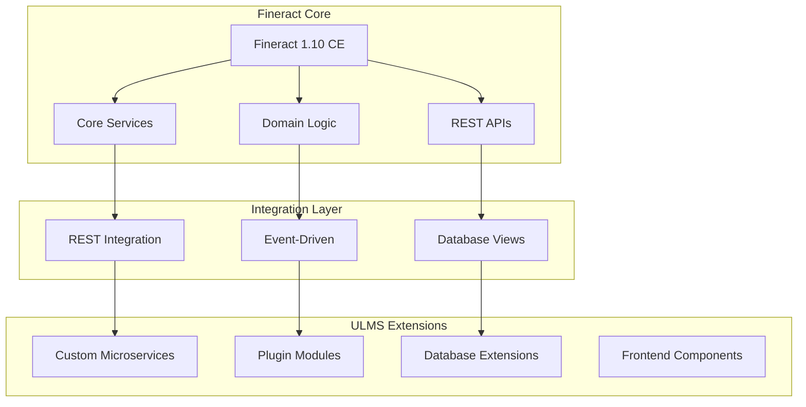

**Document Control**

| Field | Value |
|-------|-------|
| **Document Title** | Fineract Core Extension Strategy |
| **Project Name** | Unisoft Loan Management System (ULMS) |
| **Document ID** | 2.4.1 |
| **Document Version** | 1.0 |
| **Date** | 2026-02-05 |
| **Prepared By** | Backend Lead, ULMS Project |
| **Reviewed By** | Technical Lead |
| **Classification** | Confidential |
| **Status** | Approved |

**Revision History**

| Version | Date | Author | Description |
|---------|------|--------|-------------|
| 1.0 | 2026-02-05 | Backend Lead | Initial version |

---

# Fineract Core Extension Strategy
## Architectural Approach for Extending Apache Fineract 1.10

---

## Table of Contents

1. [Purpose](#1-purpose)
2. [Extension Principles](#2-extension-principles)
3. [Extension Strategies](#3-extension-strategies)
4. [Module Architecture](#4-module-architecture)
5. [Implementation Patterns](#5-implementation-patterns)
6. [Integration Points](#6-integration-points)
7. [Version Management](#7-version-management)
8. [Testing Extensions](#8-testing-extensions)
9. [Related Documents](#9-related-documents)

---

## 1. Purpose

This document defines the architectural strategy for extending Apache Fineract 1.10 Community Edition to meet Bangladesh banking sector requirements for ULMS v2.0, ensuring maintainable, upgradeable, and compliant customizations.

---

## 2. Extension Principles

### 2.1 Core Principles

| Principle | Description | Rationale |
|-----------|-------------|-----------|
| Non-Invasive | Minimize changes to Fineract core | Eases upgrades |
| Composition over Inheritance | Use composition patterns | Better encapsulation |
| Plugin Architecture | Use Fineract hooks and SPIs | Standard extension points |
| API-First | Extend via REST APIs | Platform independence |
| Test Coverage | All extensions tested | Quality assurance |

### 2.2 Customization Boundaries



---

## 3. Extension Strategies

### 3.1 Strategy Comparison

| Strategy | Use Case | Complexity | Upgrade Impact |
|----------|----------|------------|----------------|
| Microservices | External integrations | Medium | Low |
| Plugins | Core behavior changes | High | Medium |
| Database Extensions | Custom data models | Low | Low |
| API Gateway | Request/response transformation | Low | Low |
| Event Hooks | Async processing | Low | Low |

### 3.2 Recommended Strategy Matrix

| Requirement | Primary Strategy | Secondary Strategy |
|-------------|-----------------|-------------------|
| CIB Integration | Microservice | Event Hooks |
| NID Verification | Microservice | API Gateway |
| Loan Classification | Plugin + Database | Event Hooks |
| Report Generation | Microservice | Database Views |
| Payment Gateway | Microservice | Event Hooks |
| Workflow Engine | Microservice | Plugin |

---

## 4. Module Architecture

### 4.1 ULMS Extension Modules

```
ulms-extensions/
├── ulms-cib-service/            # CIB integration microservice
├── ulms-nid-service/            # NID verification microservice
├── ulms-workflow-service/       # Camunda workflow service
├── ulms-notification-service/   # SMS/Email notifications
├── ulms-reporting-service/      # Advanced reporting
├── ulms-payment-service/        # Payment gateway integration
├── ulms-fineract-plugin/        # Fineract plugin module
└── ulms-database-extensions/    # Custom schema migrations
```

### 4.2 Fineract Plugin Module Structure

```
ulms-fineract-plugin/
├── src/
│   ├── main/
│   │   ├── java/
│   │   │   └── com/unisoft/ulms/fineract/
│   │   │       ├── plugin/
│   │   │       │   ├── ULMSPlugin.java
│   │   │       │   └── ULMSPluginConfiguration.java
│   │   │       ├── hooks/
│   │   │       │   ├── LoanLifecycleListener.java
│   │   │       │   ├── RepaymentEventHandler.java
│   │   │       │   └── ClassificationUpdateHandler.java
│   │   │       ├── commands/
│   │   │       │   ├── UpdateClassificationCommand.java
│   │   │       │   └── GenerateCibReportCommand.java
│   │   │       ├── services/
│   │   │       │   ├── BangladeshClassificationService.java
│   │   │       │   └── CibIntegrationService.java
│   │   │       └── validators/
│   │   │           ├── NidValidator.java
│   │   │           └── LoanAmountValidator.java
│   │   └── resources/
│   │       └── META-INF/
│   │           └── services/
│   │               └── org.apache.fineract.infrastructure.hooks.spi.HookListener
│   └── test/
│       └── java/
├── build.gradle
└── README.md
```

---

## 5. Implementation Patterns

### 5.1 Event-Driven Extension Pattern

```java
package com.unisoft.ulms.fineract.hooks;

import org.apache.fineract.infrastructure.hooks.api.HookApiConstants;
import org.apache.fineract.infrastructure.hooks.event.HookEvent;
import org.apache.fineract.infrastructure.hooks.spi.HookListener;
import org.springframework.stereotype.Component;

@Component
public class LoanLifecycleEventListener implements HookListener {
    
    private final CibIntegrationService cibService;
    private final ClassificationUpdateService classificationService;
    private final NotificationService notificationService;
    
    @Override
    public void onApplicationEvent(HookEvent event) {
        String entityName = event.getEntityName();
        String actionName = event.getActionName();
        
        switch (entityName) {
            case HookApiConstants.ENTITY_NAME_LOANS:
                handleLoanEvent(actionName, event);
                break;
            case HookApiConstants.ENTITY_NAME_REPAYMENT:
                handleRepaymentEvent(actionName, event);
                break;
            case HookApiConstants.ENTITY_NAME_CLIENT:
                handleClientEvent(actionName, event);
                break;
        }
    }
    
    private void handleLoanEvent(String action, HookEvent event) {
        Long loanId = extractLoanId(event);
        
        switch (action) {
            case "DISBURSE":
                // Trigger CIB report update
                cibService.updateCreditFacility(loanId);
                // Send disbursement notification
                notificationService.sendLoanDisbursedNotification(loanId);
                break;
                
            case "APPROVE":
                // Verify CIB before approval
                cibService.verifyEligibility(loanId);
                break;
                
            case "WRITE_OFF":
                // Update classification to Bad/Loss
                classificationService.updateToWriteOff(loanId);
                break;
        }
    }
    
    private void handleRepaymentEvent(String action, HookEvent event) {
        Long loanId = extractLoanId(event);
        
        if ("REPAYMENT".equals(action)) {
            // Check if loan exits default status
            classificationService.recalculateClassification(loanId);
        }
    }
}
```

### 5.2 Command Pattern for Custom Operations

```java
package com.unisoft.ulms.fineract.commands;

import org.apache.fineract.commands.annotation.CommandType;
import org.apache.fineract.commands.domain.CommandWrapper;
import org.apache.fineract.commands.handler.NewCommandSourceHandler;
import org.springframework.stereotype.Component;
import org.springframework.transaction.annotation.Transactional;

@Component
@CommandType(entity = "BANGLADESH_CLASSIFICATION", action = "UPDATE")
public class UpdateBangladeshClassificationCommandHandler implements NewCommandSourceHandler {
    
    private final LoanClassificationService classificationService;
    private final LoanRepository loanRepository;
    
    @Override
    @Transactional
    public CommandProcessingResult processCommand(CommandWrapper wrapper) {
        Long loanId = wrapper.getLoanId();
        JsonCommand jsonCommand = wrapper.getJsonCommand();
        
        // Validate loan exists
        Loan loan = loanRepository.findById(loanId)
            .orElseThrow(() -> new LoanNotFoundException(loanId));
        
        // Calculate new classification per BRPD 15/2024
        ClassificationResult result = classificationService.calculateClassification(loan);
        
        // Update classification
        classificationService.updateClassification(loan, result);
        
        // Create audit entry
        createClassificationAuditEntry(loan, result);
        
        return CommandProcessingResult.builder()
            .withLoanId(loanId)
            .withEntityId(loanId)
            .build();
    }
}
```

### 5.3 Custom Validator Pattern

```java
package com.unisoft.ulms.fineract.validators;

import org.apache.fineract.portfolio.loanaccount.domain.Loan;
import org.springframework.stereotype.Component;

@Component
public class BangladeshLoanValidator {
    
    private static final BigDecimal MAX_UNSECURED_AMOUNT = new BigDecimal("2000000"); // 20 Lakhs
    private static final BigDecimal MAX_SME_LOAN_AMOUNT = new BigDecimal("10000000"); // 1 Crore
    
    public void validateLoanApplication(Loan loan) {
        validateLoanPurpose(loan);
        validateLoanAmount(loan);
        validateSecurityCoverage(loan);
        validateBorrowerEligibility(loan);
    }
    
    private void validateLoanPurpose(Loan loan) {
        String purpose = loan.getLoanPurpose();
        
        // Check if purpose is from approved list
        if (!isApprovedPurpose(purpose)) {
            throw new LoanPurposeNotAllowedException(purpose);
        }
        
        // Restrictions on certain purposes
        if ("GAMBLING".equals(purpose) || "SPECULATION".equals(purpose)) {
            throw new LoanPurposeRestrictedException(purpose);
        }
    }
    
    private void validateLoanAmount(Loan loan) {
        BigDecimal amount = loan.getPrincipalAmount();
        LoanProduct product = loan.loanProduct();
        
        // Product-specific limits
        if ("SME".equals(product.getLoanProductCategory()) && 
            amount.compareTo(MAX_SME_LOAN_AMOUNT) > 0) {
            throw new LoanAmountExceedsLimitException(amount, MAX_SME_LOAN_AMOUNT);
        }
        
        // Unsecured loan limits
        if (!hasAdequateSecurity(loan) && amount.compareTo(MAX_UNSECURED_AMOUNT) > 0) {
            throw new UnsecuredLoanLimitExceededException(amount, MAX_UNSECURED_AMOUNT);
        }
    }
    
    private void validateSecurityCoverage(Loan loan) {
        BigDecimal loanAmount = loan.getPrincipalAmount();
        BigDecimal securityValue = calculateSecurityValue(loan);
        
        // Minimum 120% coverage for secured loans
        if (hasSecurity(loan)) {
            BigDecimal coverageRatio = securityValue
                .divide(loanAmount, 2, RoundingMode.HALF_UP)
                .multiply(BigDecimal.valueOf(100));
            
            if (coverageRatio.compareTo(new BigDecimal("120")) < 0) {
                throw new InsufficientSecurityCoverageException(coverageRatio);
            }
        }
    }
    
    private void validateBorrowerEligibility(Loan loan) {
        Client client = loan.getClient();
        
        // Age check (18-65 for loan maturity)
        int ageAtMaturity = calculateAgeAtMaturity(client, loan);
        if (ageAtMaturity > 65) {
            throw new BorrowerAgeExceedsLimitException(ageAtMaturity);
        }
        
        // Income verification for loans > 5 lakhs
        if (loan.getPrincipalAmount().compareTo(new BigDecimal("500000")) > 0) {
            if (!hasVerifiedIncome(client)) {
                throw new IncomeVerificationRequiredException();
            }
        }
    }
}
```

### 5.4 Database Extension Pattern

```java
package com.unisoft.ulms.fineract.domain;

import javax.persistence.*;
import org.apache.fineract.portfolio.loanaccount.domain.Loan;

@Entity
@Table(name = "ulms_loan_extension")
public class ULMSLoanExtension {
    
    @Id
    @Column(name = "loan_id")
    private Long loanId;
    
    @OneToOne
    @MapsId
    @JoinColumn(name = "loan_id")
    private Loan loan;
    
    @Column(name = "purpose_code", length = 50)
    private String purposeCode;
    
    @Column(name = "sector_code", length = 20)
    private String sectorCode;
    
    @Column(name = "sub_sector_code", length = 20)
    private String subSectorCode;
    
    @Column(name = "cib_inquiry_id", length = 50)
    private String cibInquiryId;
    
    @Column(name = "cib_score")
    private Integer cibScore;
    
    @Column(name = "classification_stage", length = 10)
    @Enumerated(EnumType.STRING)
    private ClassificationStage classificationStage;
    
    @Column(name = "classification_date")
    private LocalDate classificationDate;
    
    @Column(name = "ecl_amount", precision = 19, scale = 6)
    private BigDecimal eclAmount;
    
    @Column(name = "provision_amount", precision = 19, scale = 6)
    private BigDecimal provisionAmount;
    
    @Column(name = "is_nid_verified")
    private Boolean isNidVerified;
    
    @Column(name = "nid_verification_id", length = 50)
    private String nidVerificationId;
    
    // Getters and setters
}
```

---

## 6. Integration Points

### 6.1 Fineract Integration Points

| Integration Point | Mechanism | Use Case |
|-------------------|-----------|----------|
| Hooks API | Webhooks | Event notification |
| Commands API | REST | Custom operations |
| SPI Interfaces | Java | Core behavior extension |
| Database Views | SQL | Custom reporting |
| Caches | Redis | Performance optimization |

### 6.2 Extension Registration

```java
package com.unisoft.ulms.fineract.config;

import org.apache.fineract.infrastructure.hooks.spi.HookListener;
import org.springframework.context.annotation.Bean;
import org.springframework.context.annotation.Configuration;

@Configuration
public class ULMSExtensionConfiguration {
    
    @Bean
    public HookListener loanLifecycleEventListener(
            CibIntegrationService cibService,
            ClassificationUpdateService classificationService) {
        return new LoanLifecycleEventListener(cibService, classificationService);
    }
    
    @Bean
    public BangladeshLoanValidator bangladeshLoanValidator() {
        return new BangladeshLoanValidator();
    }
    
    @Bean
    public BangladeshClassificationService classificationService() {
        return new BangladeshClassificationService();
    }
}
```

---

## 7. Version Management

### 7.1 Extension Versioning Strategy

```
Extension Version Format: {ULMS_VERSION}-{FINERACT_VERSION}-{EXTENSION_VERSION}

Example: 2.0.0-1.10.0-1

- 2.0.0: ULMS version
- 1.10.0: Fineract base version
- 1: Extension revision
```

### 7.2 Upgrade Compatibility Matrix

| Fineract Version | ULMS Extension Compatibility |
|------------------|------------------------------|
| 1.10.0 | 2.0.0-1.10.0-x |
| 1.10.1 | 2.0.0-1.10.0-x, 2.0.0-1.10.1-x |
| 1.11.0 | Requires ULMS extension update |

---

## 8. Testing Extensions

### 8.1 Extension Testing Strategy

```java
@SpringBootTest
@TestPropertySource(properties = {
    "fineract.hooks.enabled=true",
    "ulms.extensions.enabled=true"
})
public class LoanClassificationExtensionTest {
    
    @Autowired
    private BangladeshClassificationService classificationService;
    
    @Test
    void shouldClassifyAsSTD0_WhenNoArrears() {
        // Given
        Loan loan = createLoanWithArrears(0);
        
        // When
        ClassificationResult result = classificationService.calculateClassification(loan);
        
        // Then
        assertThat(result.getStage()).isEqualTo(ClassificationStage.STD_0);
        assertThat(result.getProvisioningRate()).isEqualTo(new BigDecimal("1.00"));
    }
    
    @Test
    void shouldClassifyAsSS_When91To180DaysOverdue() {
        // Given
        Loan loan = createLoanWithArrears(120);
        
        // When
        ClassificationResult result = classificationService.calculateClassification(loan);
        
        // Then
        assertThat(result.getStage()).isEqualTo(ClassificationStage.SS);
        assertThat(result.getProvisioningRate()).isEqualTo(new BigDecimal("20.00"));
    }
    
    @Test
    void shouldClassifyAsBL_WhenOver365DaysOverdue() {
        // Given
        Loan loan = createLoanWithArrears(400);
        
        // When
        ClassificationResult result = classificationService.calculateClassification(loan);
        
        // Then
        assertThat(result.getStage()).isEqualTo(ClassificationStage.BL);
        assertThat(result.getProvisioningRate()).isEqualTo(new BigDecimal("100.00"));
    }
}
```

---

## 9. Related Documents

| Document ID | Document Name | Description |
|-------------|---------------|-------------|
| 2.1.3 | [Fineract Local Installation](../2.1_Local_Development_Environment/[DEV]_Fineract_Local_Installation_Guide_v1.0.md) | Fineract setup |
| 2.4.2 | [Fineract Loan Product Configuration]([FIN]_Fineract_Loan_Product_Configuration_v1.0.md) | Product setup |
| 2.4.3 | [Fineract Schema Extensions]([FIN]_Fineract_Database_Schema_Extensions_v1.0.md) | Database extensions |
| 3.1.1 | [Microservices Architecture](../03_Backend/[BE]_Microservices_Architecture_v1.0.md) | Extension architecture |

---

*© 2026 Unisoft Systems Limited. All Rights Reserved.*
*Confidential - ULMS Development Team*
