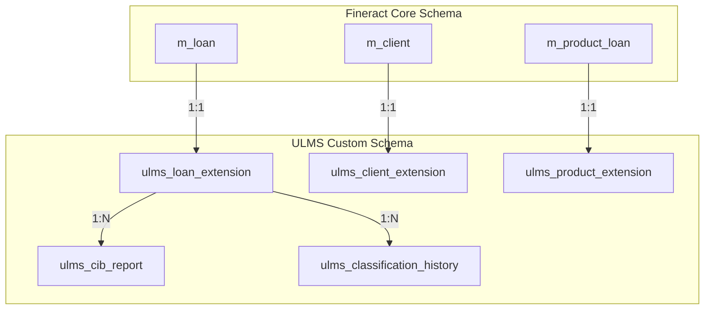

**Document Control**

| Field | Value |
|-------|-------|
| **Document Title** | Fineract Database Schema Extensions |
| **Project Name** | Unisoft Loan Management System (ULMS) |
| **Document ID** | 2.4.3 |
| **Document Version** | 1.0 |
| **Date** | 2026-02-05 |
| **Prepared By** | Database Administrator, ULMS Project |
| **Reviewed By** | Backend Lead |
| **Classification** | Internal |
| **Status** | Approved |

**Revision History**

| Version | Date | Author | Description |
|---------|------|--------|-------------|
| 1.0 | 2026-02-05 | Database Administrator | Initial version |

---

# Fineract Database Schema Extensions
## Custom Schema for Bangladesh Banking Requirements

---

## Table of Contents

1. [Purpose](#1-purpose)
2. [Extension Strategy](#2-extension-strategy)
3. [Schema Organization](#3-schema-organization)
4. [Core Extension Tables](#4-core-extension-tables)
5. [CIB Integration Tables](#5-cib-integration-tables)
6. [Classification Tables](#6-classification-tables)
7. [Islamic Banking Tables](#7-islamic-banking-tables)
8. [Migration Scripts](#8-migration-scripts)
9. [Indexes and Constraints](#9-indexes-and-constraints)
10. [Related Documents](#10-related-documents)

---

## 1. Purpose

This document defines the database schema extensions for ULMS v2.0 built on Apache Fineract 1.10, supporting Bangladesh banking requirements including BRPD 15/2024 loan classification, CIB integration, and Islamic banking compliance.

---

## 2. Extension Strategy

### 2.1 Extension Principles

| Principle | Implementation |
|-----------|---------------|
| Non-invasive | Extensions in separate schema (`ulms_custom`) |
| Foreign Key Links | Reference Fineract tables via FK |
| Audit Trail | All changes logged |
| Backward Compatible | Original schema unchanged |

### 2.2 Schema Architecture



---

## 3. Schema Organization

### 3.1 Schema Structure

```sql
-- Create ULMS custom schema
CREATE SCHEMA IF NOT EXISTS ulms_custom;
COMMENT ON SCHEMA ulms_custom IS 'ULMS-specific extensions to Fineract core';

-- Grant permissions
GRANT USAGE ON SCHEMA ulms_custom TO ulms_app;
GRANT CREATE ON SCHEMA ulms_custom TO ulms_migrator;
```

### 3.2 Table Categories

| Category | Tables | Purpose |
|----------|--------|---------|
| Entity Extensions | `ulms_*_extension` | Extend core entities |
| Compliance | `ulms_classification_*` | BRPD 15/2024 compliance |
| Integration | `ulms_cib_*`, `ulms_nid_*` | External system integration |
| Islamic | `ulms_islamic_*` | Islamic banking support |
| Audit | `ulms_audit_*` | Extended audit logging |
| Reporting | `ulms_report_*` | Reporting views |

---

## 4. Core Extension Tables

### 4.1 Loan Extension Table

```sql
-- ==========================================
-- ULMS Loan Extension Table
-- Extends m_loan with Bangladesh-specific fields
-- ==========================================

CREATE TABLE ulms_custom.ulms_loan_extension (
    -- Primary key (same as m_loan.id)
    loan_id BIGINT PRIMARY KEY,
    
    -- Foreign key to Fineract loan
    CONSTRAINT fk_loan_extension_loan 
        FOREIGN KEY (loan_id) 
        REFERENCES m_loan(id) 
        ON DELETE CASCADE,
    
    -- Bangladesh Banking Classification
    classification_stage VARCHAR(10) 
        CHECK (classification_stage IN ('STD-0', 'STD-1', 'STD-2', 'SMA', 'SS', 'DF', 'BL')),
    classification_date DATE,
    classification_reason TEXT,
    days_past_due INTEGER DEFAULT 0,
    
    -- Expected Credit Loss (IFRS-9)
    ecl_amount NUMERIC(19,6) DEFAULT 0,
    ecl_calculation_date DATE,
    ecl_model_version VARCHAR(20),
    
    -- Provisioning
    provision_amount NUMERIC(19,6) DEFAULT 0,
    provision_rate NUMERIC(5,2) DEFAULT 0,
    
    -- Loan Purpose and Sector
    purpose_code VARCHAR(50),
    sector_code VARCHAR(20),
    sub_sector_code VARCHAR(20),
    economic_purpose_code VARCHAR(20),
    
    -- CIB Integration
    cib_inquiry_id VARCHAR(50),
    cib_report_id VARCHAR(100),
    cib_score INTEGER,
    cib_inquiry_date TIMESTAMP,
    cib_match_score INTEGER,
    
    -- NID Verification
    is_nid_verified BOOLEAN DEFAULT false,
    nid_verification_id VARCHAR(50),
    nid_verification_date TIMESTAMP,
    nid_match_score INTEGER,
    
    -- Large Loan Flag
    is_large_loan BOOLEAN DEFAULT false,
    large_loan_reporting_date DATE,
    
    -- Syndication
    is_syndicated BOOLEAN DEFAULT false,
    syndication_parent_loan_id BIGINT,
    participation_percentage NUMERIC(5,2),
    
    -- Audit columns
    created_by BIGINT,
    created_at TIMESTAMP DEFAULT CURRENT_TIMESTAMP,
    updated_by BIGINT,
    updated_at TIMESTAMP DEFAULT CURRENT_TIMESTAMP,
    version INTEGER DEFAULT 1
);

COMMENT ON TABLE ulms_custom.ulms_loan_extension IS 'ULMS-specific loan extensions for Bangladesh banking';

-- Create indexes
CREATE INDEX idx_ulms_loan_ext_classification 
    ON ulms_custom.ulms_loan_extension(classification_stage);

CREATE INDEX idx_ulms_loan_ext_dpd 
    ON ulms_custom.ulms_loan_extension(days_past_due);

CREATE INDEX idx_ulms_loan_ext_cib 
    ON ulms_custom.ulms_loan_extension(cib_inquiry_date);

CREATE INDEX idx_ulms_loan_ext_sector 
    ON ulms_custom.ulms_loan_extension(sector_code);

-- Trigger for updated_at
CREATE OR REPLACE FUNCTION ulms_custom.update_timestamp()
RETURNS TRIGGER AS $$
BEGIN
    NEW.updated_at = CURRENT_TIMESTAMP;
    NEW.version = OLD.version + 1;
    RETURN NEW;
END;
$$ LANGUAGE plpgsql;

CREATE TRIGGER trg_ulms_loan_extension_update
    BEFORE UPDATE ON ulms_custom.ulms_loan_extension
    FOR EACH ROW
    EXECUTE FUNCTION ulms_custom.update_timestamp();
```

### 4.2 Client Extension Table

```sql
-- ==========================================
-- ULMS Client Extension Table
-- Extends m_client with Bangladesh-specific fields
-- ==========================================

CREATE TABLE ulms_custom.ulms_client_extension (
    client_id BIGINT PRIMARY KEY,
    
    CONSTRAINT fk_client_extension_client 
        FOREIGN KEY (client_id) 
        REFERENCES m_client(id) 
        ON DELETE CASCADE,
    
    -- Extended Identity Information
    nid_number VARCHAR(20),
    etin_number VARCHAR(20),
    passport_number VARCHAR(20),
    birth_registration_number VARCHAR(20),
    
    -- NID Verification Details
    nid_full_name_en VARCHAR(200),
    nid_full_name_bn VARCHAR(200),
    nid_father_name VARCHAR(200),
    nid_mother_name VARCHAR(200),
    nid_present_address TEXT,
    nid_permanent_address TEXT,
    nid_photo_reference VARCHAR(100),
    
    -- Employment Details
    employment_type VARCHAR(50),
    employer_name VARCHAR(200),
    employer_address TEXT,
    monthly_income NUMERIC(19,6),
    income_verified BOOLEAN DEFAULT false,
    
    -- Banking Relationship
    is_existing_customer BOOLEAN DEFAULT false,
    relationship_start_date DATE,
    customer_segment VARCHAR(20),
    
    -- KYC Risk Rating
    kyc_risk_score INTEGER,
    kyc_risk_category VARCHAR(20),
    kyc_last_review_date DATE,
    kyc_next_review_date DATE,
    
    -- Related Party Information
    introducer_id BIGINT,
    introducer_relationship VARCHAR(50),
    
    -- Audit columns
    created_by BIGINT,
    created_at TIMESTAMP DEFAULT CURRENT_TIMESTAMP,
    updated_by BIGINT,
    updated_at TIMESTAMP DEFAULT CURRENT_TIMESTAMP
);

COMMENT ON TABLE ulms_custom.ulms_client_extension IS 'ULMS-specific client extensions';

CREATE INDEX idx_ulms_client_ext_nid 
    ON ulms_custom.ulms_client_extension(nid_number);

CREATE INDEX idx_ulms_client_ext_kyc 
    ON ulms_custom.ulms_client_extension(kyc_risk_category);
```

### 4.3 Product Extension Table

```sql
-- ==========================================
-- ULMS Product Extension Table
-- Extends m_product_loan with Bangladesh-specific configuration
-- ==========================================

CREATE TABLE ulms_custom.ulms_product_extension (
    product_id BIGINT PRIMARY KEY,
    
    CONSTRAINT fk_product_extension_product 
        FOREIGN KEY (product_id) 
        REFERENCES m_product_loan(id) 
        ON DELETE CASCADE,
    
    -- Product Category
    product_category VARCHAR(50),
    product_subcategory VARCHAR(50),
    bangladesh_bank_product_code VARCHAR(20),
    
    -- Eligibility Criteria
    min_age INTEGER,
    max_age INTEGER,
    min_income NUMERIC(19,6),
    employment_types_allowed TEXT[],  -- Array of allowed employment types
    
    -- Security Requirements
    requires_security BOOLEAN DEFAULT true,
    min_security_coverage_ratio NUMERIC(5,2) DEFAULT 120.00,
    allowed_security_types TEXT[],
    
    -- Integration Requirements
    requires_cib_check BOOLEAN DEFAULT true,
    requires_nid_verification BOOLEAN DEFAULT true,
    requires_income_verification BOOLEAN DEFAULT false,
    
    -- Islamic Banking
    is_islamic_product BOOLEAN DEFAULT false,
    islamic_mode VARCHAR(20),  -- MURABAHA, IJARAH, MUSHARAKA, etc.
    sharia_board_approved BOOLEAN DEFAULT false,
    sharia_certificate_reference VARCHAR(100),
    
    -- Limits
    max_unsecured_amount NUMERIC(19,6),
    max_loan_to_value_ratio NUMERIC(5,2),
    
    -- Audit columns
    created_by BIGINT,
    created_at TIMESTAMP DEFAULT CURRENT_TIMESTAMP,
    updated_by BIGINT,
    updated_at TIMESTAMP DEFAULT CURRENT_TIMESTAMP
);

COMMENT ON TABLE ulms_custom.ulms_product_extension IS 'ULMS-specific loan product extensions';
```

---

## 5. CIB Integration Tables

### 5.1 CIB Inquiry Log

```sql
-- ==========================================
-- CIB Inquiry Log
-- Tracks all CIB inquiries with full audit trail
-- ==========================================

CREATE TABLE ulms_custom.ulms_cib_inquiry (
    id BIGSERIAL PRIMARY KEY,
    
    -- Inquiry Details
    inquiry_id VARCHAR(50) UNIQUE NOT NULL,
    inquiry_type VARCHAR(20) NOT NULL 
        CHECK (inquiry_type IN ('INDIVIDUAL', 'COMPANY', 'PROP')),
    inquiry_date TIMESTAMP NOT NULL DEFAULT CURRENT_TIMESTAMP,
    status VARCHAR(20) DEFAULT 'PENDING',
    
    -- Subject Identification
    nid_number VARCHAR(20),
    etin_number VARCHAR(20),
    passport_number VARCHAR(20),
    company_registration VARCHAR(50),
    subject_name VARCHAR(200),
    subject_father_name VARCHAR(200),
    subject_mother_name VARCHAR(200),
    subject_date_of_birth DATE,
    subject_address TEXT,
    
    -- Loan Association
    loan_id BIGINT REFERENCES m_loan(id),
    client_id BIGINT REFERENCES m_client(id),
    
    -- CIB Response
    cib_report_id VARCHAR(100),
    cib_score INTEGER,
    cib_score_grade VARCHAR(10),
    credit_facilities_count INTEGER DEFAULT 0,
    total_sanctioned_amount NUMERIC(19,6) DEFAULT 0,
    total_outstanding_amount NUMERIC(19,6) DEFAULT 0,
    total_overdue_amount NUMERIC(19,6) DEFAULT 0,
    total_emi_amount NUMERIC(19,6) DEFAULT 0,
    worst_classification VARCHAR(10),
    is_defaulter BOOLEAN DEFAULT false,
    
    -- Raw Response Storage
    raw_request JSONB,
    raw_response JSONB,
    
    -- Error Handling
    error_code VARCHAR(20),
    error_message TEXT,
    retry_count INTEGER DEFAULT 0,
    
    -- Audit
    requested_by BIGINT,
    created_at TIMESTAMP DEFAULT CURRENT_TIMESTAMP,
    updated_at TIMESTAMP DEFAULT CURRENT_TIMESTAMP
);

COMMENT ON TABLE ulms_custom.ulms_cib_inquiry IS 'Log of all CIB inquiries';

CREATE INDEX idx_cib_inquiry_nid ON ulms_custom.ulms_cib_inquiry(nid_number);
CREATE INDEX idx_cib_inquiry_loan ON ulms_custom.ulms_cib_inquiry(loan_id);
CREATE INDEX idx_cib_inquiry_date ON ulms_custom.ulms_cib_inquiry(inquiry_date);
CREATE INDEX idx_cib_inquiry_status ON ulms_custom.ulms_cib_inquiry(status);
```

### 5.2 CIB Credit Facility Details

```sql
-- ==========================================
-- CIB Credit Facility Details
-- Individual credit facilities from CIB report
-- ==========================================

CREATE TABLE ulms_custom.ulms_cib_credit_facility (
    id BIGSERIAL PRIMARY KEY,
    inquiry_id BIGINT NOT NULL REFERENCES ulms_custom.ulms_cib_inquiry(id),
    
    -- Facility Details
    facility_id VARCHAR(50),
    facility_type VARCHAR(50),
    facility_nature VARCHAR(50),
    
    -- Lender Information
    lender_code VARCHAR(20),
    lender_name VARCHAR(200),
    lender_branch VARCHAR(100),
    
    -- Amounts
    sanctioned_amount NUMERIC(19,6),
    disbursement_amount NUMERIC(19,6),
    outstanding_amount NUMERIC(19,6),
    overdue_amount NUMERIC(19,6),
    write_off_amount NUMERIC(19,6),
    
    -- Dates
    sanction_date DATE,
    expiry_date DATE,
    last_payment_date DATE,
    
    -- Classification
    classification VARCHAR(10),
    days_overdue INTEGER DEFAULT 0,
    
    -- Installment Details
    installment_amount NUMERIC(19,6),
    installment_frequency VARCHAR(20),
    remaining_installments INTEGER,
    total_installments INTEGER,
    
    -- Security
    security_amount NUMERIC(19,6),
    security_type VARCHAR(50),
    
    -- Meta
    is_self_reported BOOLEAN DEFAULT false,
    is_own_bank BOOLEAN DEFAULT false,
    
    created_at TIMESTAMP DEFAULT CURRENT_TIMESTAMP
);

COMMENT ON TABLE ulms_custom.ulms_cib_credit_facility IS 'Credit facility details from CIB';

CREATE INDEX idx_cib_facility_inquiry ON ulms_custom.ulms_cib_credit_facility(inquiry_id);
CREATE INDEX idx_cib_facility_lender ON ulms_custom.ulms_cib_credit_facility(lender_code);
```

---

## 6. Classification Tables

### 6.1 Classification History

```sql
-- ==========================================
-- Loan Classification History
-- Complete audit trail of loan classification changes
-- ==========================================

CREATE TABLE ulms_custom.ulms_classification_history (
    id BIGSERIAL PRIMARY KEY,
    loan_id BIGINT NOT NULL REFERENCES m_loan(id),
    
    -- Classification Details
    classification_date DATE NOT NULL,
    classification_stage VARCHAR(10) NOT NULL 
        CHECK (classification_stage IN ('STD-0', 'STD-1', 'STD-2', 'SMA', 'SS', 'DF', 'BL')),
    classification_name VARCHAR(50),
    days_past_due INTEGER DEFAULT 0,
    dpd_range VARCHAR(20),
    
    -- Financial Impact
    outstanding_principal NUMERIC(19,6),
    outstanding_interest NUMERIC(19,6),
    total_outstanding NUMERIC(19,6),
    overdue_principal NUMERIC(19,6),
    overdue_interest NUMERIC(19,6),
    
    -- Provisioning
    provisioning_rate NUMERIC(5,2),
    provision_amount NUMERIC(19,6),
    specific_provision NUMERIC(19,6),
    general_provision NUMERIC(19,6),
    
    -- ECL (IFRS-9)
    ecl_amount NUMERIC(19,6),
    ecl_12month NUMERIC(19,6),
    ecl_lifetime NUMERIC(19,6),
    stage_1_2_3 INTEGER,
    
    -- Reason and Authority
    reason_for_change TEXT,
    classification_basis VARCHAR(50),  -- AUTO, MANUAL, SYSTEM
    classified_by BIGINT,
    classification_authority VARCHAR(50),
    
    -- Supporting Documents
    supporting_document_reference VARCHAR(100),
    board_resolution_number VARCHAR(50),
    
    -- Audit
    created_at TIMESTAMP DEFAULT CURRENT_TIMESTAMP
);

COMMENT ON TABLE ulms_custom.ulms_classification_history IS 'Audit history of loan classification changes per BRPD 15/2024';

CREATE INDEX idx_classification_history_loan 
    ON ulms_custom.ulms_classification_history(loan_id);

CREATE INDEX idx_classification_history_date 
    ON ulms_custom.ulms_classification_history(classification_date);

CREATE INDEX idx_classification_history_stage 
    ON ulms_custom.ulms_classification_history(classification_stage);

-- Partition by year for performance
CREATE TABLE ulms_classification_history_2024 PARTITION OF ulms_custom.ulms_classification_history
    FOR VALUES FROM ('2024-01-01') TO ('2025-01-01');
```

### 6.2 Classification Configuration

```sql
-- ==========================================
-- Classification Configuration
-- BRPD 15/2024 classification rules
-- ==========================================

CREATE TABLE ulms_custom.ulms_classification_config (
    id SERIAL PRIMARY KEY,
    
    -- Classification Definition
    classification_stage VARCHAR(10) NOT NULL UNIQUE,
    classification_name VARCHAR(50) NOT NULL,
    classification_name_bn VARCHAR(100),
    
    -- DPD Range
    dpd_from INTEGER NOT NULL,
    dpd_to INTEGER,  -- NULL means no upper limit
    
    -- Provisioning
    provisioning_rate NUMERIC(5,2) NOT NULL,
    provision_type VARCHAR(20),  -- SPECIFIC, GENERAL
    
    -- ECL Stage (IFRS-9)
    ecl_stage INTEGER,  -- 1, 2, or 3
    
    -- Applicability
    is_funded BOOLEAN DEFAULT true,
    is_unfunded BOOLEAN DEFAULT true,
    
    -- Effective Period
    effective_from DATE NOT NULL,
    effective_to DATE,
    
    -- Status
    is_active BOOLEAN DEFAULT true,
    created_at TIMESTAMP DEFAULT CURRENT_TIMESTAMP
);

-- Insert BRPD 15/2024 configuration
INSERT INTO ulms_custom.ulms_classification_config 
    (classification_stage, classification_name, classification_name_bn, dpd_from, dpd_to, provisioning_rate, ecl_stage, effective_from)
VALUES
    ('STD-0', 'Standard - Current', 'স্ট্যান্ডার্ড - চলমান', 0, 0, 1.00, 1, '2024-01-01'),
    ('STD-1', 'Standard - Watch', 'স্ট্যান্ডার্ড - পর্যবেক্ষণ', 1, 30, 1.00, 1, '2024-01-01'),
    ('STD-2', 'Standard - Caution', 'স্ট্যান্ডার্ড - সতর্কতা', 31, 60, 1.00, 2, '2024-01-01'),
    ('SMA', 'Special Mention Account', 'বিশেষ উল্লেখযোগ্য হিসাব', 61, 90, 5.00, 2, '2024-01-01'),
    ('SS', 'Substandard', 'অপ্রত্যাশিত', 91, 180, 20.00, 3, '2024-01-01'),
    ('DF', 'Doubtful', 'সন্দেহজনক', 181, 365, 50.00, 3, '2024-01-01'),
    ('BL', 'Bad/Loss', 'খারাপ/ক্ষতি', 366, NULL, 100.00, 3, '2024-01-01');
```

---

## 7. Islamic Banking Tables

### 7.1 Islamic Product Details

```sql
-- ==========================================
-- Islamic Product Details
-- Sharia-compliant product configuration
-- ==========================================

CREATE TABLE ulms_custom.ulms_islamic_product_details (
    product_id BIGINT PRIMARY KEY REFERENCES m_product_loan(id),
    
    -- Islamic Mode
    islamic_mode VARCHAR(20) NOT NULL 
        CHECK (islamic_mode IN ('MURABAHA', 'IJARAH', 'MUSHARAKA', 'MUDARABAH', 'WAKALAH', 'SALAM', 'ISTISNA')),
    
    -- Profit Rate Configuration
    profit_rate_type VARCHAR(20) CHECK (profit_rate_type IN ('FIXED', 'VARIABLE', 'TIERED')),
    benchmark_rate VARCHAR(50),  -- e.g., "Avg Cost of Fund"
    spread NUMERIC(5,2),
    
    -- Sharia Compliance
    sharia_compliance_certified BOOLEAN DEFAULT false,
    certification_body VARCHAR(200),
    certificate_number VARCHAR(50),
    certificate_date DATE,
    certificate_expiry DATE,
    
    -- Sharia Board
    sharia_advisor_name VARCHAR(200),
    sharia_board_approval_date DATE,
    
    -- Product Structure
    asset_type VARCHAR(50),
    ownership_transfer_date VARCHAR(50),
    
    -- Accounting Treatment
    accounting_treatment VARCHAR(50),
    ifrs_compliance_notes TEXT,
    
    created_at TIMESTAMP DEFAULT CURRENT_TIMESTAMP,
    updated_at TIMESTAMP DEFAULT CURRENT_TIMESTAMP
);

COMMENT ON TABLE ulms_custom.ulms_islamic_product_details IS 'Islamic banking product details';
```

### 7.2 Islamic Transaction Log

```sql
-- ==========================================
-- Islamic Transaction Log
-- Track profit distribution and asset ownership
-- ==========================================

CREATE TABLE ulms_custom.ulms_islamic_transaction_log (
    id BIGSERIAL PRIMARY KEY,
    loan_id BIGINT REFERENCES m_loan(id),
    
    transaction_type VARCHAR(50) NOT NULL,
    transaction_date DATE NOT NULL,
    
    -- Amounts
    principal_amount NUMERIC(19,6),
    profit_amount NUMERIC(19,6),
    total_amount NUMERIC(19,6),
    
    -- Ownership (for Ijarah, etc.)
    ownership_percentage NUMERIC(5,2),
    bank_share NUMERIC(19,6),
    customer_share NUMERIC(19,6),
    
    -- Reference
    transaction_reference VARCHAR(100),
    description TEXT,
    
    created_at TIMESTAMP DEFAULT CURRENT_TIMESTAMP
);
```

---

## 8. Migration Scripts

### 8.1 Flyway Migration Script

**File:** `db/migration/ulms/V100__ULMS_initial_extensions.sql`

```sql
-- ==========================================
-- ULMS Database Schema Extensions
-- Migration: V100__ULMS_initial_extensions
-- ==========================================

-- Create schema
CREATE SCHEMA IF NOT EXISTS ulms_custom;

-- Create extension tables
\i 'tables/ulms_loan_extension.sql'
\i 'tables/ulms_client_extension.sql'
\i 'tables/ulms_product_extension.sql'
\i 'tables/ulms_cib_inquiry.sql'
\i 'tables/ulms_cib_credit_facility.sql'
\i 'tables/ulms_classification_history.sql'
\i 'tables/ulms_classification_config.sql'
\i 'tables/ulms_islamic_product_details.sql'
\i 'tables/ulms_islamic_transaction_log.sql'

-- Create helper functions
\i 'functions/classification_functions.sql'

-- Insert initial data
\i 'data/initial_classification_config.sql'
```

### 8.2 Classification Calculation Function

```sql
-- ==========================================
-- Auto-classification function
-- ==========================================

CREATE OR REPLACE FUNCTION ulms_custom.calculate_classification(
    p_loan_id BIGINT,
    p_as_of_date DATE DEFAULT CURRENT_DATE
) RETURNS TABLE (
    stage VARCHAR(10),
    dpd INTEGER,
    provision_rate NUMERIC,
    ecl_stage INTEGER
) AS $$
DECLARE
    v_dpd INTEGER;
    v_stage VARCHAR(10);
    v_rate NUMERIC;
    v_ecl_stage INTEGER;
BEGIN
    -- Get days past due
    SELECT COALESCE(MAX(days_in_arrears), 0)
    INTO v_dpd
    FROM m_loan_arrears_aging
    WHERE loan_id = p_loan_id;
    
    -- Get classification based on DPD
    SELECT 
        classification_stage,
        provisioning_rate,
        ecl_stage
    INTO v_stage, v_rate, v_ecl_stage
    FROM ulms_custom.ulms_classification_config
    WHERE v_dpd BETWEEN dpd_from AND COALESCE(dpd_to, 99999)
      AND is_active = true
    ORDER BY dpd_from DESC
    LIMIT 1;
    
    RETURN QUERY SELECT v_stage, v_dpd, v_rate, v_ecl_stage;
END;
$$ LANGUAGE plpgsql;
```

---

## 9. Indexes and Constraints

### 9.1 Index Summary

| Table | Index Name | Columns | Purpose |
|-------|------------|---------|---------|
| ulms_loan_extension | idx_loan_ext_class | classification_stage | Classification queries |
| ulms_loan_extension | idx_loan_ext_dpd | days_past_due | DPD monitoring |
| ulms_loan_extension | idx_loan_ext_cib | cib_inquiry_date | CIB audit |
| ulms_cib_inquiry | idx_cib_inquiry_nid | nid_number | NID lookup |
| ulms_cib_inquiry | idx_cib_inquiry_loan | loan_id | Loan association |
| ulms_classification_history | idx_class_hist_loan | loan_id | History lookup |
| ulms_classification_history | idx_class_hist_date | classification_date | Date range queries |

### 9.2 Constraint Summary

| Table | Constraint | Type | Description |
|-------|------------|------|-------------|
| ulms_loan_extension | fk_loan_extension_loan | FK | Links to m_loan |
| ulms_loan_extension | chk_classification_stage | CHECK | Valid stages only |
| ulms_classification_config | uq_classification_stage | UNIQUE | One config per stage |
| ulms_cib_inquiry | uq_cib_inquiry_id | UNIQUE | Unique inquiry ID |

---

## 10. Related Documents

| Document ID | Document Name | Description |
|-------------|---------------|-------------|
| 2.2.3 | [Fineract Database Setup](../2.2_Database_Setup/[DB]_Fineract_Database_Setup_v1.0.md) | Core schema setup |
| 2.4.1 | [Fineract Core Extension Strategy]([FIN]_Fineract_Core_Extension_Strategy_v1.0.md) | Extension approach |
| 2.4.2 | [Fineract Loan Product Configuration]([FIN]_Fineract_Loan_Product_Configuration_v1.0.md) | Product configuration |

---

*© 2026 Unisoft Systems Limited. All Rights Reserved.*
*Internal Use Only - ULMS Development Team*
