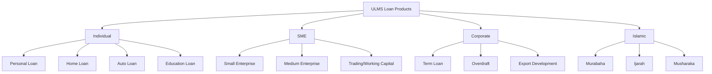

**Document Control**

| Field | Value |
|-------|-------|
| **Document Title** | Fineract Loan Product Configuration |
| **Project Name** | Unisoft Loan Management System (ULMS) |
| **Document ID** | 2.4.2 |
| **Document Version** | 1.0 |
| **Date** | 2026-02-05 |
| **Prepared By** | Business Analyst, ULMS Project |
| **Reviewed By** | Backend Lead |
| **Classification** | Internal |
| **Status** | Approved |

**Revision History**

| Version | Date | Author | Description |
|---------|------|--------|-------------|
| 1.0 | 2026-02-05 | Business Analyst | Initial version |

---

# Fineract Loan Product Configuration
## 15+ Loan Products for Bangladesh Banking Sector

---

## Table of Contents

1. [Purpose](#1-purpose)
2. [Loan Product Overview](#2-loan-product-overview)
3. [Product Configuration Framework](#3-product-configuration-framework)
4. [Individual Loan Products](#4-individual-loan-products)
5. [SME Loan Products](#5-sme-loan-products)
6. [Corporate Loan Products](#6-corporate-loan-products)
7. [Islamic Loan Products](#7-islamic-loan-products)
8. [Configuration Scripts](#8-configuration-scripts)
9. [Related Documents](#9-related-documents)

---

## 1. Purpose

This document provides comprehensive configuration for 15+ loan products in Apache Fineract 1.10, tailored for Bangladesh banking sector requirements including BRPD guidelines and Islamic banking compliance.

---

## 2. Loan Product Overview

### 2.1 Product Categories



### 2.2 Product Matrix

| Product Code | Name | Category | Min Amount (BDT) | Max Amount (BDT) | Tenure |
|--------------|------|----------|------------------|------------------|--------|
| PL-SMALL | Personal Loan - Small | Individual | 10,000 | 200,000 | 12-36 mo |
| PL-MEDIUM | Personal Loan - Medium | Individual | 200,000 | 1,000,000 | 12-60 mo |
| HL-RESIDENTIAL | Home Loan - Residential | Individual | 500,000 | 20,000,000 | 5-25 yr |
| AL-NEW | Auto Loan - New | Individual | 200,000 | 5,000,000 | 1-7 yr |
| AL-USED | Auto Loan - Used | Individual | 100,000 | 2,000,000 | 1-5 yr |
| EL-DOMESTIC | Education - Domestic | Individual | 50,000 | 1,000,000 | 1-5 yr |
| SME-SMALL | SME Small | SME | 200,000 | 5,000,000 | 1-5 yr |
| SME-MEDIUM | SME Medium | SME | 5,000,000 | 50,000,000 | 1-7 yr |
| SME-WC | SME Working Capital | SME | 500,000 | 20,000,000 | 1 yr revolving |
| CORP-TL | Corporate Term Loan | Corporate | 50,000,000 | 500,000,000 | 3-10 yr |
| CORP-OD | Corporate Overdraft | Corporate | 10,000,000 | 100,000,000 | Annual renewal |
| CORP-EDF | Export Development | Corporate | 10,000,000 | 200,000,000 | 1-5 yr |
| ISL-MUR | Murabaha | Islamic | 50,000 | 50,000,000 | 1-7 yr |
| ISL-IJ | Ijarah | Islamic | 200,000 | 20,000,000 | 1-7 yr |
| ISL-MS | Musharaka | Islamic | 1,000,000 | 100,000,000 | 3-10 yr |

---

## 3. Product Configuration Framework

### 3.1 Common Configuration Parameters

```java
public class LoanProductConfiguration {
    
    // Basic Information
    private String productCode;
    private String shortName;
    private String fullName;
    private String description;
    private ProductCategory category;
    private ProductType type; // CONVENTIONAL or ISLAMIC
    
    // Amount Settings
    private BigDecimal minPrincipalAmount;
    private BigDecimal maxPrincipalAmount;
    private BigDecimal defaultPrincipalAmount;
    private BigDecimal multipleOf;
    
    // Interest/Profit Settings
    private BigDecimal minInterestRate;
    private BigDecimal maxInterestRate;
    private BigDecimal defaultInterestRate;
    private InterestMethod interestMethod; // FLAT or DECLINING_BALANCE
    
    // Term Settings
    private Integer minNumberOfRepayments;
    private Integer maxNumberOfRepayments;
    private Integer defaultNumberOfRepayments;
    private RepaymentFrequency repaymentFrequency;
    
    // Fees and Charges
    private List<LoanProductCharge> charges;
    
    // Accounting
    private AccountingRule accountingRule;
    
    // Bangladesh Specific
    private List<String> allowedPurposes;
    private List<String> allowedSectors;
    private Boolean requiresCibCheck;
    private Boolean requiresNidVerification;
    private BigDecimal maxUnsecuredAmount;
    private BigDecimal minSecurityCoverageRatio;
}
```

---

## 4. Individual Loan Products

### 4.1 Personal Loan - Small (PL-SMALL)

```sql
-- Personal Loan - Small Configuration
INSERT INTO m_product_loan (
    short_name,
    description,
    fund_id,
    currency_code,
    currency_digits,
    principal_amount,
    min_principal_amount,
    max_principal_amount,
    nominal_interest_rate_per_period,
    min_nominal_interest_rate_per_period,
    max_nominal_interest_rate_per_period,
    interest_period_frequency_enum,
    annual_nominal_interest_rate,
    interest_method_enum,
    interest_calculated_in_period_enum,
    allow_partial_period_interest_calcualtion,
    repay_every,
    number_of_repayments,
    min_number_of_repayments,
    max_number_of_repayments,
    grace_on_principal_periods,
    grace_on_interest_periods,
    grace_on_interest_charged,
    grace_on_arrears_ageing,
    amortization_method_enum,
    accounting_rule,
    include_in_borrower_cycle,
    use_borrower_cycle,
    start_date,
    close_date,
    external_id,
    is_active,
    min_days_between_disbursal_and_first_repayment
) VALUES (
    'PL-SMALL',                                    -- short_name
    'Personal Loan - Small (BDT 10,000 to 200,000)', -- description
    1,                                             -- fund_id
    'BDT',                                         -- currency_code
    2,                                             -- currency_digits
    50000.00,                                      -- principal_amount (default)
    10000.00,                                      -- min_principal_amount
    200000.00,                                     -- max_principal_amount
    14.00,                                         -- nominal_interest_rate_per_period (default 14%)
    10.00,                                         -- min_nominal_interest_rate_per_period
    18.00,                                         -- max_nominal_interest_rate_per_period
    2,                                             -- interest_period_frequency_enum (MONTHS)
    14.00,                                         -- annual_nominal_interest_rate
    0,                                             -- interest_method_enum (DECLINING_BALANCE)
    1,                                             -- interest_calculated_in_period_enum (SAME_AS_REPAYMENT_PERIOD)
    false,                                         -- allow_partial_period_interest_calcualtion
    1,                                             -- repay_every
    12,                                            -- number_of_repayments (default)
    6,                                             -- min_number_of_repayments
    36,                                            -- max_number_of_repayments
    0,                                             -- grace_on_principal_periods
    0,                                             -- grace_on_interest_periods
    false,                                         -- grace_on_interest_charged
    30,                                            -- grace_on_arrears_ageing (30 days before classification)
    1,                                             -- amortization_method_enum (EQUAL_INSTALLMENTS)
    1,                                             -- accounting_rule (ACCRUAL_PERIODIC)
    true,                                          -- include_in_borrower_cycle
    true,                                          -- use_borrower_cycle
    '2024-01-01',                                  -- start_date
    NULL,                                          -- close_date
    'PL-SMALL-001',                                -- external_id
    true,                                          -- is_active
    30                                             -- min_days_between_disbursal_and_first_repayment
);

-- Add charges
INSERT INTO m_product_loan_charge (product_id, charge_id)
SELECT 
    (SELECT id FROM m_product_loan WHERE short_name = 'PL-SMALL'),
    id 
FROM m_charge 
WHERE charge_applies_to_enum = 1 
  AND charge_time_enum = 1  -- Disbursement
  AND charge_calculation_enum = 1  -- Flat
  AND amount <= 1000;  -- Processing fee max 1000 BDT
```

### 4.2 Home Loan - Residential (HL-RESIDENTIAL)

```sql
-- Home Loan - Residential Configuration
INSERT INTO m_product_loan (
    short_name,
    description,
    fund_id,
    currency_code,
    currency_digits,
    principal_amount,
    min_principal_amount,
    max_principal_amount,
    nominal_interest_rate_per_period,
    min_nominal_interest_rate_per_period,
    max_nominal_interest_rate_per_period,
    interest_period_frequency_enum,
    annual_nominal_interest_rate,
    interest_method_enum,
    interest_calculated_in_period_enum,
    allow_partial_period_interest_calcualtion,
    repay_every,
    number_of_repayments,
    min_number_of_repayments,
    max_number_of_repayments,
    grace_on_principal_periods,
    grace_on_interest_periods,
    grace_on_interest_charged,
    grace_on_arrears_ageing,
    amortization_method_enum,
    accounting_rule,
    include_in_borrower_cycle,
    use_borrower_cycle,
    start_date,
    close_date,
    external_id,
    is_active
) VALUES (
    'HL-RESIDENTIAL',
    'Home Loan - Residential Purchase/Construction (BDT 500,000 to 20,000,000)',
    1,
    'BDT',
    2,
    2000000.00,
    500000.00,
    20000000.00,
    9.50,
    8.00,
    12.00,
    2,  -- MONTHS
    9.50,
    0,  -- DECLINING_BALANCE
    1,  -- SAME_AS_REPAYMENT_PERIOD
    false,
    1,
    240,  -- 20 years default
    60,   -- 5 years min
    300,  -- 25 years max
    6,    -- 6 months grace on principal
    0,
    false,
    90,   -- 90 days before classification
    1,    -- EQUAL_INSTALLMENTS
    1,    -- ACCRUAL_PERIODIC
    true,
    false,  -- Don't include in borrower cycle
    '2024-01-01',
    NULL,
    'HL-RES-001',
    true
);

-- Add home loan specific charges
-- Processing fee: 1% of loan amount
-- Valuation fee: Fixed
-- Legal fee: Fixed
```

---

## 5. SME Loan Products

### 5.1 SME Medium (SME-MEDIUM)

```sql
-- SME Medium Enterprise Loan
INSERT INTO m_product_loan (
    short_name,
    description,
    fund_id,
    currency_code,
    currency_digits,
    principal_amount,
    min_principal_amount,
    max_principal_amount,
    nominal_interest_rate_per_period,
    min_nominal_interest_rate_per_period,
    max_nominal_interest_rate_per_period,
    interest_period_frequency_enum,
    annual_nominal_interest_rate,
    interest_method_enum,
    interest_calculated_in_period_enum,
    allow_partial_period_interest_calcualtion,
    repay_every,
    number_of_repayments,
    min_number_of_repayments,
    max_number_of_repayments,
    grace_on_principal_periods,
    grace_on_interest_periods,
    grace_on_interest_charged,
    grace_on_arrears_ageing,
    amortization_method_enum,
    accounting_rule,
    include_in_borrower_cycle,
    use_borrower_cycle,
    start_date,
    close_date,
    external_id,
    is_active
) VALUES (
    'SME-MEDIUM',
    'SME Medium Enterprise Loan (BDT 5,000,000 to 50,000,000)',
    1,
    'BDT',
    2,
    10000000.00,
    5000000.00,
    50000000.00,
    10.50,
    9.00,
    14.00,
    2,  -- MONTHS
    10.50,
    0,  -- DECLINING_BALANCE
    1,  -- SAME_AS_REPAYMENT_PERIOD
    false,
    3,  -- Quarterly repayments
    12,  -- 3 years default
    4,   -- 1 year min
    28,  -- 7 years max
    3,   -- 3 months grace on principal
    0,
    false,
    60,  -- 60 days before classification
    1,   -- EQUAL_INSTALLMENTS
    1,   -- ACCRUAL_PERIODIC
    true,
    true,
    '2024-01-01',
    NULL,
    'SME-MED-001',
    true
);
```

---

## 6. Corporate Loan Products

### 6.1 Corporate Term Loan (CORP-TL)

```sql
-- Corporate Term Loan
INSERT INTO m_product_loan (
    short_name,
    description,
    fund_id,
    currency_code,
    currency_digits,
    principal_amount,
    min_principal_amount,
    max_principal_amount,
    nominal_interest_rate_per_period,
    min_nominal_interest_rate_per_period,
    max_nominal_interest_rate_per_period,
    interest_period_frequency_enum,
    annual_nominal_interest_rate,
    interest_method_enum,
    interest_calculated_in_period_enum,
    allow_partial_period_interest_calcualtion,
    repay_every,
    number_of_repayments,
    min_number_of_repayments,
    max_number_of_repayments,
    grace_on_principal_periods,
    grace_on_interest_periods,
    grace_on_interest_charged,
    grace_on_arrears_ageing,
    amortization_method_enum,
    accounting_rule,
    include_in_borrower_cycle,
    use_borrower_cycle,
    start_date,
    close_date,
    external_id,
    is_active
) VALUES (
    'CORP-TL',
    'Corporate Term Loan (BDT 50,000,000 to 500,000,000)',
    1,
    'BDT',
    2,
    100000000.00,
    50000000.00,
    500000000.00,
    9.00,
    7.00,
    12.00,
    3,  -- QUARTERLY
    9.00,
    0,  -- DECLINING_BALANCE
    1,  -- SAME_AS_REPAYMENT_PERIOD
    false,
    3,  -- Quarterly
    16,  -- 4 years default
    12,  -- 3 years min
    40,  -- 10 years max
    6,   -- 6 months grace on principal
    0,
    false,
    90,  -- 90 days before classification
    1,   -- EQUAL_INSTALLMENTS
    1,   -- ACCRUAL_PERIODIC
    false,  -- Don't include in borrower cycle
    false,
    '2024-01-01',
    NULL,
    'CORP-TL-001',
    true
);
```

---

## 7. Islamic Loan Products

### 7.1 Murabaha (ISL-MUR)

```sql
-- Murabaha (Cost-Plus Financing)
-- Note: Islamic products use FLAT interest method for fixed profit

INSERT INTO m_product_loan (
    short_name,
    description,
    fund_id,
    currency_code,
    currency_digits,
    principal_amount,
    min_principal_amount,
    max_principal_amount,
    nominal_interest_rate_per_period,
    min_nominal_interest_rate_per_period,
    max_nominal_interest_rate_per_period,
    interest_period_frequency_enum,
    annual_nominal_interest_rate,
    interest_method_enum,
    interest_calculated_in_period_enum,
    allow_partial_period_interest_calcualtion,
    repay_every,
    number_of_repayments,
    min_number_of_repayments,
    max_number_of_repayments,
    grace_on_principal_periods,
    grace_on_interest_periods,
    grace_on_interest_charged,
    grace_on_arrears_ageing,
    amortization_method_enum,
    accounting_rule,
    include_in_borrower_cycle,
    use_borrower_cycle,
    start_date,
    close_date,
    external_id,
    is_active
) VALUES (
    'ISL-MUR',
    'Murabaha - Cost Plus Financing (Islamic)',
    2,  -- Islamic fund
    'BDT',
    2,
    500000.00,
    50000.00,
    50000000.00,
    12.00,
    10.00,
    16.00,
    2,  -- MONTHS
    12.00,
    1,  -- FLAT - Fixed profit rate for Murabaha
    1,  -- SAME_AS_REPAYMENT_PERIOD
    false,
    1,
    12,
    6,
    84,  -- 7 years max
    0,
    0,
    false,
    30,
    1,   -- EQUAL_INSTALLMENTS
    1,   -- ACCRUAL_PERIODIC
    true,
    true,
    '2024-01-01',
    NULL,
    'ISL-MUR-001',
    true
);

-- Add Islamic product extension
INSERT INTO ulms_islamic_product_details (
    product_id,
    islamic_mode,
    profit_rate_type,
    sharia_compliance_certified,
    certification_body
)
SELECT 
    id,
    'MURABAHA',
    'FIXED',
    true,
    'Islamic Finance Advisory'
FROM m_product_loan 
WHERE short_name = 'ISL-MUR';
```

---

## 8. Configuration Scripts

### 8.1 Complete Product Setup Script

**File:** `scripts/fineract/setup-loan-products.sql`

```sql
-- ==========================================
-- ULMS Loan Products Setup Script
-- Run on: fineract_default database
-- ==========================================

\c fineract_default

-- Disable triggers for bulk insert
ALTER TABLE m_product_loan DISABLE TRIGGER ALL;

-- Clear existing products (optional, use with caution)
-- DELETE FROM m_product_loan WHERE external_id LIKE 'ULMS-%';

-- Insert all loan products
-- [Individual Products]
\i 'products/pl-small.sql'
\i 'products/pl-medium.sql'
\i 'products/hl-residential.sql'
\i 'products/al-new.sql'
\i 'products/al-used.sql'
\i 'products/el-domestic.sql'

-- [SME Products]
\i 'products/sme-small.sql'
\i 'products/sme-medium.sql'
\i 'products/sme-wc.sql'

-- [Corporate Products]
\i 'products/corp-tl.sql'
\i 'products/corp-od.sql'
\i 'products/corp-edf.sql'

-- [Islamic Products]
\i 'products/isl-mur.sql'
\i 'products/isl-ij.sql'
\i 'products/isl-ms.sql'

-- Re-enable triggers
ALTER TABLE m_product_loan ENABLE TRIGGER ALL;

-- Verify products
SELECT 
    short_name,
    description,
    currency_code,
    min_principal_amount,
    max_principal_amount,
    annual_nominal_interest_rate,
    is_active
FROM m_product_loan
ORDER BY short_name;
```

### 8.2 Product Verification Queries

```sql
-- Verify all products created
SELECT 
    COUNT(*) as total_products,
    COUNT(CASE WHEN short_name LIKE 'PL-%' THEN 1 END) as personal_loans,
    COUNT(CASE WHEN short_name LIKE 'HL-%' THEN 1 END) as home_loans,
    COUNT(CASE WHEN short_name LIKE 'AL-%' THEN 1 END) as auto_loans,
    COUNT(CASE WHEN short_name LIKE 'EL-%' THEN 1 END) as education_loans,
    COUNT(CASE WHEN short_name LIKE 'SME-%' THEN 1 END) as sme_loans,
    COUNT(CASE WHEN short_name LIKE 'CORP-%' THEN 1 END) as corporate_loans,
    COUNT(CASE WHEN short_name LIKE 'ISL-%' THEN 1 END) as islamic_loans
FROM m_product_loan
WHERE is_active = true;

-- Check product interest rate ranges
SELECT 
    short_name,
    min_nominal_interest_rate_per_period as min_rate,
    max_nominal_interest_rate_per_period as max_rate,
    annual_nominal_interest_rate as default_rate
FROM m_product_loan
ORDER BY short_name;
```

---

## 9. Related Documents

| Document ID | Document Name | Description |
|-------------|---------------|-------------|
| 2.4.1 | [Fineract Core Extension Strategy]([FIN]_Fineract_Core_Extension_Strategy_v1.0.md) | Extension approach |
| 2.4.3 | [Fineract Schema Extensions]([FIN]_Fineract_Database_Schema_Extensions_v1.0.md) | Database extensions |
| 3.2.3 | [Loan Product Service](../03_Backend/[BE]_Loan_Product_Service_v1.0.md) | Product API |
| 2.2.3 | [Fineract Database Setup](../2.2_Database_Setup/[DB]_Fineract_Database_Setup_v1.0.md) | Database setup |

---

*© 2026 Unisoft Systems Limited. All Rights Reserved.*
*Internal Use Only - ULMS Development Team*
