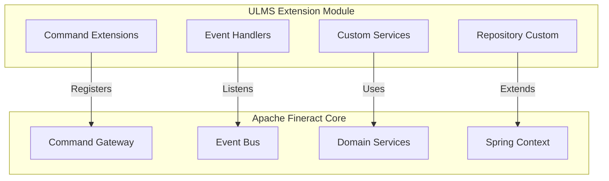

**Document Control**

| Field | Value |
|-------|-------|
| **Document Title** | Apache Fineract Extension Development Guide |
| **Project Name** | Unisoft Loan Management System (ULMS) v2.0 |
| **Document Version** | 1.0 |
| **Date** | 2026-02-05 |
| **Prepared By** | Technical Lead |
| **Reviewed By** | Solution Architect |
| **Classification** | Internal |
| **Status** | Draft |

**Revision History**

| Version | Date | Author | Description |
|---------|------|--------|-------------|
| 1.0 | 2026-02-05 | Technical Lead | Initial version |

---

# Apache Fineract Extension Development Guide

## Table of Contents

1. [Introduction](#1-introduction)
2. [Fineract Architecture Overview](#2-fineract-architecture-overview)
3. [Extension Development Patterns](#3-extension-development-patterns)
4. [Service Hook Implementation](#4-service-hook-implementation)
5. [Command Handler Extensions](#5-command-handler-extensions)
6. [Event Listener Extensions](#6-event-listener-extensions)
7. [Repository Extensions](#7-repository-extensions)
8. [Configuration Management](#8-configuration-management)
9. [Testing Extensions](#9-testing-extensions)
10. [Deployment Considerations](#10-deployment-considerations)

---

## 1. Introduction

### 1.1 Purpose

This document provides comprehensive guidance for extending Apache Fineract 1.10 Community Edition to support Bangladesh banking requirements for the ULMS project. Extensions must be developed without modifying Fineract's core codebase to ensure upgrade compatibility.

### 1.2 Scope

- Custom service implementations
- Event-driven extensions
- Repository customizations
- Domain model extensions
- Configuration management
- Testing strategies

### 1.3 Extension Philosophy

```
┌─────────────────────────────────────────────────────────────┐
│                    ULMS Extension Layer                      │
│  ┌──────────────┐ ┌──────────────┐ ┌──────────────┐        │
│  │   Services   │ │    Events    │ │  Repository  │        │
│  └──────────────┘ └──────────────┘ └──────────────┘        │
├─────────────────────────────────────────────────────────────┤
│                    Apache Fineract Core                      │
│  ┌──────────────┐ ┌──────────────┐ ┌──────────────┐        │
│  │    Domain    │ │  Commands    │ │  Persistence │        │
│  └──────────────┘ └──────────────┘ └──────────────┘        │
└─────────────────────────────────────────────────────────────┘
```

---

## 2. Fineract Architecture Overview

### 2.1 Core Components

| Component | Purpose | Extension Point |
|-----------|---------|-----------------|
| Commands | Write operations | CommandHandler |
| Queries | Read operations | ReadPlatformService |
| Domain | Business logic | DomainService |
| Events | Async processing | EventListener |
| Scheduler | Background jobs | ScheduledJob |
| Security | Authentication | TenantAwareService |

### 2.2 Extension Architecture



---

## 3. Extension Development Patterns

### 3.1 Extension Module Structure

```
ulms-fineract-extensions/
├── src/main/java/com/unisoft/ulms/fineract/
│   ├── config/
│   │   └── UlmsFineractConfiguration.java
│   ├── service/
│   │   ├── UlmsLoanService.java
│   │   └── UlmsAccountingService.java
│   ├── handler/
│   │   ├── CustomCommandHandler.java
│   │   └── PostApprovalHandler.java
│   ├── listener/
│   │   ├── LoanApprovedListener.java
│   │   └── RepaymentPostedListener.java
│   ├── repository/
│   │   └── CustomLoanRepository.java
│   └── domain/
│       └── UlmsLoanExtension.java
├── src/main/resources/
│   ├── ulms-extension.properties
│   └── META-INF/spring.factories
└── pom.xml
```

### 3.2 Base Configuration Class

```java
package com.unisoft.ulms.fineract.config;

import org.springframework.context.annotation.ComponentScan;
import org.springframework.context.annotation.Configuration;
import org.springframework.context.annotation.PropertySource;

/**
 * ULMS Fineract Extension Configuration
 * Auto-detected by Spring Boot component scanning
 */
@Configuration
@ComponentScan(basePackages = "com.unisoft.ulms.fineract")
@PropertySource("classpath:ulms-extension.properties")
public class UlmsFineractConfiguration {
    
    @Bean
    public UlmsExtensionProperties ulmsExtensionProperties() {
        return new UlmsExtensionProperties();
    }
}
```

### 3.3 Extension Properties

```yaml
# ulms-extension.properties
ulms.fineract.extension.enabled=true
ulms.fineract.extension.version=2.0.0

# BRPD Compliance Settings
ulms.brpd.classification.enabled=true
ulms.brpd.classification.cron=0 0 1 * * ?
ulms.brpd.provisioning.automatic=true

# CIB Integration
ulms.cib.enabled=true
ulms.cib.api.url=https://cib.bb.org.bd/api/v1
ulms.cib.retry.max-attempts=3

# Custom Fields
ulms.custom-fields.loan-sector.enabled=true
ulms.custom-fields.loan-purpose.required=true
```

---

## 4. Service Hook Implementation

### 4.1 Custom Loan Service

```java
package com.unisoft.ulms.fineract.service;

import lombok.RequiredArgsConstructor;
import lombok.extern.slf4j.Slf4j;
import org.apache.fineract.portfolio.loanaccount.domain.Loan;
import org.apache.fineract.portfolio.loanaccount.domain.LoanRepository;
import org.springframework.stereotype.Service;
import org.springframework.transaction.annotation.Transactional;

import java.math.BigDecimal;
import java.time.LocalDate;

/**
 * ULMS Custom Loan Service
 * Extends Fineract loan operations with Bangladesh-specific requirements
 */
@Service
@RequiredArgsConstructor
@Slf4j
public class UlmsLoanService {
    
    private final LoanRepository loanRepository;
    private final BrpdClassificationService classificationService;
    private final CibReportingService cibReportingService;
    
    /**
     * Post-disbursement processing for Bangladesh compliance
     * - Updates CIB status
     * - Sets up BRPD classification monitoring
     * - Creates audit trail
     */
    @Transactional
    public void postDisbursementProcessing(Long loanId, LocalDate disbursementDate) {
        log.info("Processing post-disbursement for loan: {}", loanId);
        
        Loan loan = loanRepository.findById(loanId)
            .orElseThrow(() -> new LoanNotFoundException(loanId));
        
        // Update CIB status to active
        cibReportingService.reportDisbursement(loan, disbursementDate);
        
        // Initialize BRPD classification tracking
        classificationService.initializeClassification(loan, disbursementDate);
        
        log.info("Post-disbursement processing completed for loan: {}", loanId);
    }
    
    /**
     * Calculate effective interest rate with Bangladesh Bank regulations
     */
    public BigDecimal calculateEffectiveInterestRate(Loan loan) {
        BigDecimal nominalRate = loan.getNominalInterestRatePerPeriod();
        Integer repaymentPeriods = loan.getRepaymentPeriods();
        
        // Apply Bangladesh Bank formula for effective rate calculation
        return EffectiveRateCalculator.calculate(
            nominalRate, 
            repaymentPeriods,
            InterestCompoundingMethod.DAILY
        );
    }
}
```

### 4.2 Service Hook Registration

```java
package com.unisoft.ulms.fineract.config;

import org.apache.fineract.infrastructure.hooks.event.HookEvent;
import org.springframework.context.event.EventListener;
import org.springframework.stereotype.Component;

/**
 * Fineract Hook Event Handler
 * Intercepts Fineract events and delegates to ULMS services
 */
@Component
@RequiredArgsConstructor
public class FineractHookEventHandler {
    
    private final UlmsLoanService ulmsLoanService;
    private final UlmsAccountingService accountingService;
    
    @EventListener
    public void handleLoanApprovedEvent(HookEvent event) {
        if ("LOAN_APPROVAL".equals(event.getHookType())) {
            Long loanId = extractLoanId(event.getPayload());
            ulmsLoanService.initializeApprovalWorkflow(loanId);
        }
    }
    
    @EventListener
    public void handleDisbursementEvent(HookEvent event) {
        if ("DISBURSEMENT".equals(event.getHookType())) {
            Long loanId = extractLoanId(event.getPayload());
            LocalDate disbursementDate = extractDate(event.getPayload());
            ulmsLoanService.postDisbursementProcessing(loanId, disbursementDate);
        }
    }
}
```

---

## 5. Command Handler Extensions

### 5.1 Custom Command Handler

```java
package com.unisoft.ulms.fineract.handler;

import lombok.RequiredArgsConstructor;
import org.apache.fineract.commands.annotation.CommandType;
import org.apache.fineract.commands.handler.NewCommandSourceHandler;
import org.apache.fineract.commands.domain.CommandWrapper;
import org.apache.fineract.commands.service.CommandWrapperBuilder;
import org.springframework.stereotype.Component;

/**
 * ULMS Custom Command Handler
 * Handles Bangladesh-specific loan operations
 */
@Component
@CommandType(entity = "ULMS_LOAN", action = "BRPD_CLASSIFY")
@RequiredArgsConstructor
public class BrpdClassificationCommandHandler implements NewCommandSourceHandler {
    
    private final BrpdClassificationService classificationService;
    private final LoanWritePlatformService loanWriteService;
    
    @Override
    public CommandProcessingResult processCommand(CommandWrapper wrapper) {
        Long loanId = wrapper.getLoanId();
        JsonCommand command = wrapper.getJsonCommand();
        
        // Extract BRPD classification parameters
        BrpdClassificationType classification = extractClassification(command);
        LocalDate effectiveDate = command.localDateValueOfParameterNamed("effectiveDate");
        String reason = command.stringValueOfParameterNamed("reason");
        
        // Apply classification
        ClassificationResult result = classificationService.applyClassification(
            loanId, classification, effectiveDate, reason
        );
        
        return CommandProcessingResult.fromDetails(
            result.getEntityId(),
            result.getOfficeId(),
            result.getCommandId(),
            result.getChanges()
        );
    }
}
```

### 5.2 Command Wrapper Builder Extension

```java
package com.unisoft.ulms.fineract.handler;

import org.apache.fineract.commands.service.CommandWrapperBuilder;

/**
 * Extended Command Wrapper Builder for ULMS operations
 */
public class UlmsCommandWrapperBuilder extends CommandWrapperBuilder {
    
    public CommandWrapper applyBrpdClassification(Long loanId, String json) {
        this.actionName = "BRPD_CLASSIFY";
        this.entityName = "ULMS_LOAN";
        this.loanId = loanId;
        this.json = json;
        return this.build();
    }
    
    public CommandWrapper submitToCib(Long loanId, String json) {
        this.actionName = "CIB_SUBMIT";
        this.entityName = "ULMS_LOAN";
        this.loanId = loanId;
        this.json = json;
        return this.build();
    }
    
    public CommandWrapper updateLoanSector(Long loanId, String json) {
        this.actionName = "UPDATE_SECTOR";
        this.entityName = "ULMS_LOAN";
        this.loanId = loanId;
        this.json = json;
        return this.build();
    }
}
```

---

## 6. Event Listener Extensions

### 6.1 Loan Lifecycle Event Listener

```java
package com.unisoft.ulms.fineract.listener;

import lombok.RequiredArgsConstructor;
import lombok.extern.slf4j.Slf4j;
import org.apache.fineract.infrastructure.event.business.domain.loan.LoanApprovedBusinessEvent;
import org.apache.fineract.infrastructure.event.business.domain.loan.LoanDisbursedBusinessEvent;
import org.apache.fineract.infrastructure.event.business.domain.loan.transaction.LoanRepaymentBusinessEvent;
import org.springframework.context.event.EventListener;
import org.springframework.scheduling.annotation.Async;
import org.springframework.stereotype.Component;

/**
 * ULMS Loan Event Listener
 * Handles loan lifecycle events for Bangladesh compliance
 */
@Component
@RequiredArgsConstructor
@Slf4j
public class UlmsLoanEventListener {
    
    private final CibReportingService cibReportingService;
    private final WorkflowTriggerService workflowTrigger;
    private final NotificationService notificationService;
    
    /**
     * Handle loan approval event
     * Triggers 7-level approval workflow
     */
    @Async
    @EventListener
    public void handleLoanApproved(LoanApprovedBusinessEvent event) {
        log.info("Loan approved event received: {}", event.getLoan().getId());
        
        workflowTrigger.initiateApprovalWorkflow(
            event.getLoan().getId(),
            ApprovalType.LOAN_APPROVAL
        );
        
        notificationService.notifyApprovers(
            event.getLoan(),
            NotificationType.APPROVAL_REQUIRED
        );
    }
    
    /**
     * Handle loan disbursement event
     * Updates CIB and initializes monitoring
     */
    @Async
    @EventListener
    public void handleLoanDisbursed(LoanDisbursedBusinessEvent event) {
        log.info("Loan disbursed event received: {}", event.getLoan().getId());
        
        cibReportingService.reportDisbursement(
            event.getLoan(),
            event.getLoan().getDisbursementDate()
        );
    }
    
    /**
     * Handle repayment posting
     * Updates CIB status and classification
     */
    @Async
    @EventListener
    public void handleRepaymentPosted(LoanRepaymentBusinessEvent event) {
        log.info("Repayment posted event received: {}", event.getLoanTransaction().getLoan().getId());
        
        // Trigger classification recalculation
        classificationService.recalculate(event.getLoanTransaction().getLoan().getId());
    }
}
```

### 6.2 Custom Event Publisher

```java
package com.unisoft.ulms.fineract.event;

import lombok.RequiredArgsConstructor;
import org.springframework.context.ApplicationEventPublisher;
import org.springframework.stereotype.Component;

/**
 * ULMS Custom Event Publisher
 * Publishes domain events for ULMS extensions
 */
@Component
@RequiredArgsConstructor
public class UlmsEventPublisher {
    
    private final ApplicationEventPublisher publisher;
    
    public void publishClassificationChanged(ClassificationChangedEvent event) {
        publisher.publishEvent(event);
    }
    
    public void publishCibReportSubmitted(CibReportSubmittedEvent event) {
        publisher.publishEvent(event);
    }
    
    public void publishProvisioningCalculated(ProvisioningCalculatedEvent event) {
        publisher.publishEvent(event);
    }
}
```

---

## 7. Repository Extensions

### 7.1 Custom Repository Interface

```java
package com.unisoft.ulms.fineract.repository;

import org.apache.fineract.portfolio.loanaccount.domain.Loan;
import org.springframework.data.jpa.repository.Query;
import org.springframework.data.repository.query.Param;
import org.springframework.stereotype.Repository;

import java.time.LocalDate;
import java.util.List;

/**
 * ULMS Custom Loan Repository
 * Bangladesh-specific query methods
 */
@Repository
public interface CustomLoanRepository {
    
    /**
     * Find loans requiring BRPD classification update
     */
    @Query("SELECT l FROM Loan l WHERE l.loanStatus = :status " +
           "AND l.disbursementDate <= :asOfDate " +
           "AND l.lastClassificationDate < :asOfDate")
    List<Loan> findLoansRequiringClassification(
        @Param("status") LoanStatus status,
        @Param("asOfDate") LocalDate asOfDate
    );
    
    /**
     * Find loans by economic sector (Bangladesh Bank classification)
     */
    @Query("SELECT l FROM Loan l JOIN l.loanCustomization lc " +
           "WHERE lc.economicSector = :sector AND l.office.id = :officeId")
    List<Loan> findByEconomicSector(
        @Param("sector") String sector,
        @Param("officeId") Long officeId
    );
    
    /**
     * Calculate NPL (Non-Performing Loan) ratio for a branch
     */
    @Query(value = "SELECT " +
           "SUM(CASE WHEN lc.classification IN ('SS', 'DF', 'BL') THEN l.principal_amount ELSE 0 END) / " +
           "SUM(l.principal_amount) * 100 " +
           "FROM m_loan l JOIN ulms_loan_classification lc ON l.id = lc.loan_id " +
           "WHERE l.office_id = :officeId", nativeQuery = true)
    BigDecimal calculateNplRatio(@Param("officeId") Long officeId);
}
```

### 7.2 Repository Implementation

```java
package com.unisoft.ulms.fineract.repository;

import lombok.RequiredArgsConstructor;
import org.springframework.jdbc.core.JdbcTemplate;
import org.springframework.stereotype.Repository;

import java.math.BigDecimal;
import java.sql.ResultSet;
import java.sql.SQLException;
import java.util.List;

/**
 * Custom Loan Repository Implementation
 */
@Repository
@RequiredArgsConstructor
public class CustomLoanRepositoryImpl implements CustomLoanRepository {
    
    private final JdbcTemplate jdbcTemplate;
    
    @Override
    public List<LoanClassificationSummary> findClassificationSummary(Long officeId, LocalDate asOfDate) {
        String sql = """
            SELECT 
                lc.classification_code,
                COUNT(*) as loan_count,
                SUM(l.principal_outstanding_derived) as total_outstanding,
                SUM(l.principal_outstanding_derived * p.provisioning_rate / 100) as provision_required
            FROM m_loan l
            JOIN ulms_loan_classification lc ON l.id = lc.loan_id
            JOIN ulms_provisioning_rates p ON lc.classification_code = p.classification_code
            WHERE l.office_id = ?
            AND lc.effective_date <= ?
            AND (lc.end_date IS NULL OR lc.end_date > ?)
            GROUP BY lc.classification_code
            """;
        
        return jdbcTemplate.query(sql, this::mapClassificationSummary, 
            officeId, asOfDate, asOfDate);
    }
    
    private LoanClassificationSummary mapClassificationSummary(ResultSet rs, int rowNum) 
            throws SQLException {
        return LoanClassificationSummary.builder()
            .classificationCode(rs.getString("classification_code"))
            .loanCount(rs.getLong("loan_count"))
            .totalOutstanding(rs.getBigDecimal("total_outstanding"))
            .provisionRequired(rs.getBigDecimal("provision_required"))
            .build();
    }
}
```

---

## 8. Configuration Management

### 8.1 Externalized Configuration

```java
package com.unisoft.ulms.fineract.config;

import lombok.Data;
import org.springframework.boot.context.properties.ConfigurationProperties;
import org.springframework.context.annotation.Configuration;

/**
 * ULMS Extension Configuration Properties
 */
@Data
@Configuration
@ConfigurationProperties(prefix = "ulms.fineract")
public class UlmsExtensionProperties {
    
    private boolean enabled = true;
    private String version = "2.0.0";
    
    private BrpdProperties brpd = new BrpdProperties();
    private CibProperties cib = new CibProperties();
    private CustomFieldProperties customFields = new CustomFieldProperties();
    
    @Data
    public static class BrpdProperties {
        private boolean classificationEnabled = true;
        private String classificationCron = "0 0 1 * * ?";
        private boolean automaticProvisioning = true;
    }
    
    @Data
    public static class CibProperties {
        private boolean enabled = true;
        private String apiUrl;
        private int retryMaxAttempts = 3;
        private long retryDelayMs = 5000;
    }
}
```

### 8.2 Feature Flags

```java
package com.unisoft.ulms.fineract.config;

import lombok.RequiredArgsConstructor;
import org.springframework.stereotype.Component;

/**
 * Feature Flag Service for ULMS Extensions
 */
@Component
@RequiredArgsConstructor
public class UlmsFeatureFlags {
    
    private final UlmsExtensionProperties properties;
    
    public boolean isBrpdClassificationEnabled() {
        return properties.getBrpd().isClassificationEnabled();
    }
    
    public boolean isCibIntegrationEnabled() {
        return properties.getCib().isEnabled();
    }
    
    public boolean isAutomaticProvisioningEnabled() {
        return properties.getBrpd().isAutomaticProvisioning();
    }
}
```

---

## 9. Testing Extensions

### 9.1 Unit Test Example

```java
package com.unisoft.ulms.fineract.service;

import org.junit.jupiter.api.Test;
import org.junit.jupiter.api.extension.ExtendWith;
import org.mockito.InjectMocks;
import org.mockito.Mock;
import org.mockito.junit.jupiter.MockitoExtension;

import java.math.BigDecimal;
import java.time.LocalDate;

import static org.mockito.Mockito.*;

@ExtendWith(MockitoExtension.class)
class UlmsLoanServiceTest {
    
    @Mock
    private LoanRepository loanRepository;
    
    @Mock
    private CibReportingService cibReportingService;
    
    @InjectMocks
    private UlmsLoanService ulmsLoanService;
    
    @Test
    void postDisbursementProcessing_ShouldUpdateCibAndClassification() {
        // Given
        Long loanId = 12345L;
        LocalDate disbursementDate = LocalDate.now();
        Loan loan = createTestLoan(loanId);
        
        when(loanRepository.findById(loanId)).thenReturn(Optional.of(loan));
        
        // When
        ulmsLoanService.postDisbursementProcessing(loanId, disbursementDate);
        
        // Then
        verify(cibReportingService).reportDisbursement(loan, disbursementDate);
        verify(classificationService).initializeClassification(loan, disbursementDate);
    }
}
```

### 9.2 Integration Test Configuration

```java
package com.unisoft.ulms.fineract;

import org.springframework.boot.test.context.TestConfiguration;
import org.springframework.context.annotation.Bean;
import org.springframework.context.annotation.Primary;

@TestConfiguration
public class UlmsExtensionTestConfiguration {
    
    @Bean
    @Primary
    public CibApiClient mockCibApiClient() {
        return new MockCibApiClient();
    }
}
```

---

## 10. Deployment Considerations

### 10.1 Extension Packaging

```xml
<!-- pom.xml for ULMS Fineract Extension -->
<project>
    <groupId>com.unisoft.ulms</groupId>
    <artifactId>ulms-fineract-extensions</artifactId>
    <version>2.0.0</version>
    
    <dependencies>
        <dependency>
            <groupId>org.apache.fineract</groupId>
            <artifactId>fineract-core</artifactId>
            <version>1.10.0</version>
            <scope>provided</scope>
        </dependency>
        
        <dependency>
            <groupId>org.springframework.boot</groupId>
            <artifactId>spring-boot-starter</artifactId>
        </dependency>
    </dependencies>
    
    <build>
        <plugins>
            <plugin>
                <groupId>org.springframework.boot</groupId>
                <artifactId>spring-boot-maven-plugin</artifactId>
                <configuration>
                    <classifier>extension</classifier>
                </configuration>
            </plugin>
        </plugins>
    </build>
</project>
```

### 10.2 Deployment Structure

```
fineract-deploy/
├── fineract-server.jar          # Core Fineract
├── extensions/
│   └── ulms-fineract-extensions-2.0.0.jar
├── config/
│   ├── application.properties
│   └── ulms-extension.properties
└── lib/                         # Shared dependencies
```

---

## Related Documents

| Document | Description |
|----------|-------------|
| [FIN]_Fineract_Scheduler_Customization_v1.0.md | Scheduler and batch job customization |
| [FIN]_Fineract_Accounting_Integration_v1.0.md | Bangladesh COA integration guide |
| [BRPD]_BRPD_Service_Technical_Specification_v1.0.md | BRPD compliance service spec |
| [CIB]_CIB_Service_Technical_Specification_v1.0.md | CIB integration specification |

---

*© 2026 Unisoft Systems Limited. All Rights Reserved.*
