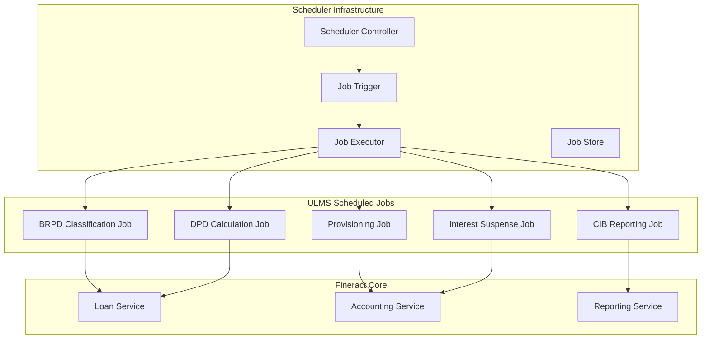

**Document Control**

| Field | Value |
|-------|-------|
| **Document Title** | Apache Fineract Scheduler Customization Guide |
| **Project Name** | Unisoft Loan Management System (ULMS) v2.0 |
| **Document Version** | 1.0 |
| **Date** | 2026-02-05 |
| **Prepared By** | Technical Lead |
| **Reviewed By** | Solution Architect |
| **Classification** | Internal |
| **Status** | Draft |

**Revision History**

| Version | Date | Author | Description |
|---------|------|--------|-------------|
| 1.0 | 2026-02-05 | Technical Lead | Initial version |

---

# Apache Fineract Scheduler Customization Guide

## Table of Contents

1. [Introduction](#1-introduction)
2. [Fineract Scheduler Architecture](#2-fineract-scheduler-architecture)
3. [BRPD Classification Scheduler](#3-brpd-classification-scheduler)
4. [DPD Calculation Jobs](#4-dpd-calculation-jobs)
5. [CIB Reporting Jobs](#5-cib-reporting-jobs)
6. [Provisioning Calculation Jobs](#6-provisioning-calculation-jobs)
7. [Interest Suspense Jobs](#7-interest-suspense-jobs)
8. [Loan Monitoring Jobs](#8-loan-monitoring-jobs)
9. [Job Configuration and Management](#9-job-configuration-and-management)
10. [Error Handling and Recovery](#10-error-handling-and-recovery)

---

## 1. Introduction

### 1.1 Purpose

This document details the customization of Apache Fineract's scheduler infrastructure to support Bangladesh Bank regulatory requirements, including automated BRPD 15/2024 loan classification, DPD calculations, and regulatory reporting.

### 1.2 Scheduler Overview

| Job Category | Frequency | Purpose |
|--------------|-----------|---------|
| BRPD Classification | Daily | Update loan classifications based on DPD |
| DPD Calculation | Daily | Calculate days past due for all loans |
| CIB Reporting | Monthly | Submit data to Credit Information Bureau |
| Provisioning | Daily | Calculate provision requirements |
| Interest Suspense | Daily | Handle interest accrual for classified loans |
| Compliance Check | Daily | Validate regulatory compliance |

---

## 2. Fineract Scheduler Architecture

### 2.1 Scheduler Components



### 2.2 Job Configuration Model

```java
package com.unisoft.ulms.fineract.scheduler;

import lombok.Data;
import java.time.LocalTime;
import java.util.Map;

/**
 * ULMS Scheduled Job Configuration
 */
@Data
public class UlmsJobConfiguration {
    
    private String jobName;
    private String jobGroup;
    private String cronExpression;
    private LocalTime preferredStartTime;
    private int retryAttempts;
    private long retryIntervalMs;
    private Map<String, Object> jobParameters;
    private boolean enabled;
    private String alertEmail;
}
```

---

## 3. BRPD Classification Scheduler

### 3.1 BRPD Classification Job

```java
package com.unisoft.ulms.fineract.scheduler.job;

import lombok.RequiredArgsConstructor;
import lombok.extern.slf4j.Slf4j;
import org.apache.fineract.infrastructure.jobs.api.RunReportsApiResource;
import org.apache.fineract.infrastructure.jobs.domain.ScheduledJobDetail;
import org.apache.fineract.infrastructure.jobs.service.JobRegisterService;
import org.springframework.batch.core.Job;
import org.springframework.batch.core.JobParameters;
import org.springframework.batch.core.JobParametersBuilder;
import org.springframework.batch.core.launch.JobLauncher;
import org.springframework.scheduling.annotation.Scheduled;
import org.springframework.stereotype.Component;

import java.time.LocalDate;
import java.time.format.DateTimeFormatter;

/**
 * BRPD Classification Scheduled Job
 * Implements Bangladesh Bank BRPD Circular 15/2024 loan classification
 */
@Component
@RequiredArgsConstructor
@Slf4j
public class BrpdClassificationScheduledJob {
    
    private final JobLauncher jobLauncher;
    private final Job brpdClassificationJob;
    private final BrpdClassificationService classificationService;
    private final NotificationService notificationService;
    
    /**
     * Daily BRPD classification job
     * Runs at 1:00 AM Bangladesh time
     */
    @Scheduled(cron = "${ulms.brpd.classification.cron:0 0 1 * * ?}", zone = "Asia/Dhaka")
    public void executeClassification() {
        log.info("Starting BRPD classification job at {}", LocalDate.now());
        
        try {
            JobParameters params = new JobParametersBuilder()
                .addString("businessDate", LocalDate.now().format(DateTimeFormatter.ISO_DATE))
                .addLong("timestamp", System.currentTimeMillis())
                .toJobParameters();
            
            var execution = jobLauncher.run(brpdClassificationJob, params);
            
            log.info("BRPD classification job completed with status: {}", 
                execution.getStatus());
            
            // Send summary notification
            sendClassificationSummary(execution);
            
        } catch (Exception e) {
            log.error("BRPD classification job failed", e);
            notificationService.sendAlert("BRPD Classification Failed", e.getMessage());
            throw new JobExecutionException("Classification job failed", e);
        }
    }
}
```

### 3.2 Classification Batch Job Configuration

```java
package com.unisoft.ulms.fineract.scheduler.config;

import lombok.RequiredArgsConstructor;
import org.springframework.batch.core.Job;
import org.springframework.batch.core.Step;
import org.springframework.batch.core.job.builder.JobBuilder;
import org.springframework.batch.core.repository.JobRepository;
import org.springframework.batch.core.step.builder.StepBuilder;
import org.springframework.batch.item.ItemProcessor;
import org.springframework.batch.item.ItemReader;
import org.springframework.batch.item.ItemWriter;
import org.springframework.context.annotation.Bean;
import org.springframework.context.annotation.Configuration;
import org.springframework.transaction.PlatformTransactionManager;

/**
 * BRPD Classification Batch Job Configuration
 */
@Configuration
@RequiredArgsConstructor
public class BrpdClassificationJobConfig {
    
    private final JobRepository jobRepository;
    private final PlatformTransactionManager transactionManager;
    
    @Bean
    public Job brpdClassificationJob() {
        return new JobBuilder("brpdClassificationJob", jobRepository)
            .start(classificationStep())
            .next(provisioningUpdateStep())
            .next(interestSuspenseStep())
            .build();
    }
    
    @Bean
    public Step classificationStep() {
        return new StepBuilder("classificationStep", jobRepository)
            .<Loan, ClassificationResult>chunk(100, transactionManager)
            .reader(loanClassificationReader())
            .processor(classificationProcessor())
            .writer(classificationWriter())
            .faultTolerant()
            .skipLimit(10)
            .skip(ClassificationException.class)
            .retryLimit(3)
            .retry(DataAccessException.class)
            .build();
    }
    
    @Bean
    public ItemReader<Loan> loanClassificationReader() {
        JdbcCursorItemReader<Loan> reader = new JdbcCursorItemReader<>();
        reader.setSql("""
            SELECT l.* FROM m_loan l
            WHERE l.loan_status_id = 300
            AND l.disbursedon_date IS NOT NULL
            AND NOT EXISTS (
                SELECT 1 FROM ulms_loan_classification lc
                WHERE lc.loan_id = l.id
                AND lc.effective_date = CURRENT_DATE
            )
            ORDER BY l.id
            """);
        reader.setRowMapper(new LoanRowMapper());
        return reader;
    }
    
    @Bean
    public ItemProcessor<Loan, ClassificationResult> classificationProcessor() {
        return loan -> {
            // Calculate DPD
            int dpd = calculateDPD(loan);
            
            // Determine classification based on DPD
            BrpdClassification classification = BrpdClassification.fromDPD(dpd);
            
            return ClassificationResult.builder()
                .loanId(loan.getId())
                .dpd(dpd)
                .classification(classification)
                .effectiveDate(LocalDate.now())
                .provisionRate(classification.getProvisionRate())
                .build();
        };
    }
    
    @Bean
    public ItemWriter<ClassificationResult> classificationWriter() {
        return results -> {
            for (ClassificationResult result : results) {
                classificationService.saveClassification(result);
            }
        };
    }
}
```

---

## 4. DPD Calculation Jobs

### 4.1 DPD Calculation Service

```java
package com.unisoft.ulms.fineract.scheduler.service;

import lombok.RequiredArgsConstructor;
import lombok.extern.slf4j.Slf4j;
import org.springframework.stereotype.Service;
import org.springframework.transaction.annotation.Transactional;

import java.time.LocalDate;
import java.time.temporal.ChronoUnit;

/**
 * Days Past Due (DPD) Calculation Service
 * Implements Bangladesh Bank DPD calculation rules
 */
@Service
@RequiredArgsConstructor
@Slf4j
public class DpdCalculationService {
    
    private final LoanRepository loanRepository;
    private final DpdHistoryRepository dpdHistoryRepository;
    
    /**
     * Calculate DPD for a loan following BRPD 15/2024
     * 
     * Rules:
     * - DPD starts from the first missed installment
     * - Counts calendar days (not business days)
     * - Resets to 0 when all arrears are cleared
     * - Grace period is NOT included in DPD count
     */
    @Transactional
    public int calculateDPD(Long loanId, LocalDate asOfDate) {
        Loan loan = loanRepository.findById(loanId)
            .orElseThrow(() -> new LoanNotFoundException(loanId));
        
        // Get the oldest unpaid installment
        LoanRepaymentSchedule oldestUnpaid = loan.getRepaymentSchedule()
            .stream()
            .filter(Installment::isNotFullyPaid)
            .min(Comparator.comparing(Installment::getDueDate))
            .orElse(null);
        
        if (oldestUnpaid == null) {
            // Loan is fully current
            saveDpdHistory(loanId, 0, asOfDate);
            return 0;
        }
        
        // Calculate DPD
        LocalDate defaultStartDate = oldestUnpaid.getDueDate().plusDays(1);
        int dpd = (int) ChronoUnit.DAYS.between(defaultStartDate, asOfDate);
        
        // Ensure DPD is not negative
        dpd = Math.max(0, dpd);
        
        saveDpdHistory(loanId, dpd, asOfDate);
        
        return dpd;
    }
    
    private void saveDpdHistory(Long loanId, int dpd, LocalDate asOfDate) {
        DpdHistory history = DpdHistory.builder()
            .loanId(loanId)
            .dpd(dpd)
            .calculationDate(asOfDate)
            .build();
        
        dpdHistoryRepository.save(history);
    }
}
```

### 4.2 DPD Batch Job

```java
package com.unisoft.ulms.fineract.scheduler.job;

import lombok.RequiredArgsConstructor;
import lombok.extern.slf4j.Slf4j;
import org.springframework.batch.core.Job;
import org.springframework.batch.core.JobParameters;
import org.springframework.batch.core.JobParametersBuilder;
import org.springframework.batch.core.launch.JobLauncher;
import org.springframework.scheduling.annotation.Scheduled;
import org.springframework.stereotype.Component;

/**
 * DPD Calculation Scheduled Job
 * Runs daily to update DPD for all active loans
 */
@Component
@RequiredArgsConstructor
@Slf4j
public class DpdCalculationScheduledJob {
    
    private final JobLauncher jobLauncher;
    private final Job dpdCalculationJob;
    private final DpdCalculationService dpdService;
    
    /**
     * Daily DPD calculation at 12:30 AM (before classification)
     */
    @Scheduled(cron = "0 30 0 * * ?", zone = "Asia/Dhaka")
    public void executeDpdCalculation() {
        log.info("Starting DPD calculation job");
        
        try {
            JobParameters params = new JobParametersBuilder()
                .addString("calculationDate", LocalDate.now().toString())
                .addLong("runId", System.currentTimeMillis())
                .toJobParameters();
            
            var execution = jobLauncher.run(dpdCalculationJob, params);
            log.info("DPD calculation completed: {}", execution.getStatus());
            
        } catch (Exception e) {
            log.error("DPD calculation job failed", e);
            throw new JobExecutionException("DPD calculation failed", e);
        }
    }
}
```

---

## 5. CIB Reporting Jobs

### 5.1 CIB Monthly Reporting Job

```java
package com.unisoft.ulms.fineract.scheduler.job;

import lombok.RequiredArgsConstructor;
import lombok.extern.slf4j.Slf4j;
import org.springframework.scheduling.annotation.Scheduled;
import org.springframework.stereotype.Component;

import java.time.LocalDate;
import java.time.YearMonth;

/**
 * CIB Monthly Reporting Scheduled Job
 * Submits loan data to Bangladesh Bank Credit Information Bureau
 */
@Component
@RequiredArgsConstructor
@Slf4j
public class CibReportingScheduledJob {
    
    private final CibReportingService cibService;
    private final CibBatchService batchService;
    private final NotificationService notificationService;
    
    /**
     * Monthly CIB reporting job
     * Runs on the 5th of every month at 2:00 AM
     */
    @Scheduled(cron = "0 0 2 5 * ?", zone = "Asia/Dhaka")
    public void executeMonthlyReporting() {
        YearMonth reportingMonth = YearMonth.now().minusMonths(1);
        log.info("Starting CIB monthly reporting for {}", reportingMonth);
        
        try {
            // Generate CIB reports
            CibReport report = cibService.generateMonthlyReport(reportingMonth);
            
            // Validate report data
            validateReport(report);
            
            // Submit to CIB
            CibSubmissionResult result = batchService.submitReport(report);
            
            if (result.isSuccess()) {
                log.info("CIB report submitted successfully: {}", result.getSubmissionId());
                notificationService.sendCibSuccessNotification(reportingMonth, result);
            } else {
                log.error("CIB report submission failed: {}", result.getErrorMessage());
                notificationService.sendCibFailureNotification(reportingMonth, result);
            }
            
        } catch (Exception e) {
            log.error("CIB monthly reporting failed", e);
            notificationService.sendAlert("CIB Reporting Failed", e.getMessage());
        }
    }
    
    private void validateReport(CibReport report) {
        if (report.getTotalLoans() == 0) {
            throw new ValidationException("CIB report contains no loans");
        }
        
        if (report.getTotalOutstanding().compareTo(BigDecimal.ZERO) <= 0) {
            throw new ValidationException("CIB report has invalid outstanding amount");
        }
    }
}
```

### 5.2 CIB Real-time Update Job

```java
package com.unisoft.ulms.fineract.scheduler.job;

import lombok.RequiredArgsConstructor;
import org.springframework.scheduling.annotation.Scheduled;
import org.springframework.stereotype.Component;

/**
 * CIB Real-time Update Job
 * Processes pending CIB updates every 15 minutes
 */
@Component
@RequiredArgsConstructor
public class CibRealtimeUpdateJob {
    
    private final CibRealtimeService realtimeService;
    
    @Scheduled(fixedDelay = 900000) // 15 minutes
    public void processPendingUpdates() {
        List<CibUpdateRequest> pendingUpdates = realtimeService.getPendingUpdates();
        
        for (CibUpdateRequest update : pendingUpdates) {
            try {
                realtimeService.processUpdate(update);
            } catch (Exception e) {
                log.error("Failed to process CIB update: {}", update.getId(), e);
                realtimeService.markFailed(update, e.getMessage());
            }
        }
    }
}
```

---

## 6. Provisioning Calculation Jobs

### 6.1 Provisioning Batch Job

```java
package com.unisoft.ulms.fineract.scheduler.job;

import lombok.RequiredArgsConstructor;
import lombok.extern.slf4j.Slf4j;
import org.springframework.batch.core.Job;
import org.springframework.batch.core.Step;
import org.springframework.batch.core.job.builder.JobBuilder;
import org.springframework.batch.core.repository.JobRepository;
import org.springframework.batch.core.step.builder.StepBuilder;
import org.springframework.context.annotation.Bean;
import org.springframework.context.annotation.Configuration;
import org.springframework.transaction.PlatformTransactionManager;

import java.math.BigDecimal;

/**
 * Provisioning Calculation Job Configuration
 * Calculates loan loss provisions per BRPD 15/2024
 */
@Configuration
@RequiredArgsConstructor
@Slf4j
public class ProvisioningJobConfig {
    
    private final JobRepository jobRepository;
    private final PlatformTransactionManager transactionManager;
    
    @Bean
    public Job provisioningCalculationJob() {
        return new JobBuilder("provisioningCalculationJob", jobRepository)
            .start(calculateProvisionsStep())
            .next(updateGeneralLedgerStep())
            .next(generateProvisionReportStep())
            .build();
    }
    
    @Bean
    public Step calculateProvisionsStep() {
        return new StepBuilder("calculateProvisionsStep", jobRepository)
            .<Loan, ProvisionCalculation>chunk(50, transactionManager)
            .reader(activeLoansReader())
            .processor(provisionProcessor())
            .writer(provisionWriter())
            .build();
    }
    
    @Bean
    public ItemProcessor<Loan, ProvisionCalculation> provisionProcessor() {
        return loan -> {
            // Get current classification
            BrpdClassification classification = classificationService
                .getCurrentClassification(loan.getId());
            
            // Calculate provision amount
            BigDecimal outstanding = loan.getSummary().getTotalOutstanding();
            BigDecimal provisionRate = BigDecimal.valueOf(classification.getProvisionRate());
            BigDecimal provisionAmount = outstanding
                .multiply(provisionRate)
                .divide(BigDecimal.valueOf(100), 2, RoundingMode.HALF_UP);
            
            return ProvisionCalculation.builder()
                .loanId(loan.getId())
                .classification(classification)
                .outstandingAmount(outstanding)
                .provisionRate(provisionRate)
                .provisionAmount(provisionAmount)
                .calculationDate(LocalDate.now())
                .build();
        };
    }
}
```

### 6.2 Provisioning Rates Configuration

```yaml
# BRPD 15/2024 Provisioning Rates
ulms:
  brpd:
    provisioning:
      rates:
        STD-0: 1.0    # Standard (Current)
        STD-1: 1.0    # Standard (Watch)
        STD-2: 1.0    # Standard (Caution)
        SMA: 5.0      # Special Mention Account
        SS: 20.0      # Substandard
        DF: 50.0      # Doubtful
        BL: 100.0     # Bad/Loss
      general-provision: 1.0
      specific-provision:
        enabled: true
        automatic-posting: false  # Requires manual approval
```

---

## 7. Interest Suspense Jobs

### 7.1 Interest Suspense Processing

```java
package com.unisoft.ulms.fineract.scheduler.job;

import lombok.RequiredArgsConstructor;
import lombok.extern.slf4j.Slf4j;
import org.springframework.scheduling.annotation.Scheduled;
import org.springframework.stereotype.Component;

import java.time.LocalDate;

/**
 * Interest Suspense Scheduled Job
 * Manages interest accrual for classified loans per Bangladesh Bank guidelines
 */
@Component
@RequiredArgsConstructor
@Slf4j
public class InterestSuspenseScheduledJob {
    
    private final InterestSuspenseService suspenseService;
    private final LoanRepository loanRepository;
    
    /**
     * Daily interest suspense processing
     * Runs at 3:00 AM after classification and provisioning
     */
    @Scheduled(cron = "0 0 3 * * ?", zone = "Asia/Dhaka")
    public void processInterestSuspense() {
        log.info("Starting interest suspense processing");
        
        LocalDate today = LocalDate.now();
        
        // Get all classified loans (SMA and worse)
        List<Loan> classifiedLoans = loanRepository
            .findByClassificationIn(Arrays.asList(SMA, SS, DF, BL));
        
        for (Loan loan : classifiedLoans) {
            try {
                processLoanInterestSuspense(loan, today);
            } catch (Exception e) {
                log.error("Failed to process interest suspense for loan: {}", loan.getId(), e);
            }
        }
        
        log.info("Interest suspense processing completed for {} loans", classifiedLoans.size());
    }
    
    private void processLoanInterestSuspense(Loan loan, LocalDate date) {
        BrpdClassification classification = classificationService
            .getCurrentClassification(loan.getId());
        
        // Calculate accrued interest
        BigDecimal accruedInterest = calculateAccruedInterest(loan, date);
        
        switch (classification) {
            case SMA:
                // Continue accruing, but flag for monitoring
                suspenseService.flagForMonitoring(loan, accruedInterest);
                break;
            case SS:
            case DF:
            case BL:
                // Suspend interest accrual to Interest Suspense Account
                suspenseService.suspendInterest(loan, accruedInterest, date);
                break;
            default:
                // Standard loans - normal accrual
                break;
        }
    }
}
```

---

## 8. Loan Monitoring Jobs

### 8.1 Watchlist Monitoring

```java
package com.unisoft.ulms.fineract.scheduler.job;

import lombok.RequiredArgsConstructor;
import org.springframework.scheduling.annotation.Scheduled;
import org.springframework.stereotype.Component;

/**
 * Watchlist Monitoring Job
 * Identifies loans requiring special attention
 */
@Component
@RequiredArgsConstructor
public class WatchlistMonitoringJob {
    
    private final WatchlistService watchlistService;
    private final NotificationService notificationService;
    
    /**
     * Daily watchlist monitoring
     */
    @Scheduled(cron = "0 30 6 * * MON-FRI", zone = "Asia/Dhaka")
    public void monitorWatchlist() {
        // Check for loans approaching SMA
        List<Loan> approachingSma = watchlistService.findLoansApproachingSma(15);
        
        // Check for large exposures becoming classified
        List<Loan> largeClassified = watchlistService.findLargeClassifiedLoans(
            new BigDecimal("10000000") // 1 Crore BDT
        );
        
        // Check for rapid deterioration
        List<Loan> rapidDeterioration = watchlistService.findRapidDeterioration();
        
        // Send consolidated alert
        WatchlistAlert alert = WatchlistAlert.builder()
            .approachingSmaCount(approachingSma.size())
            .largeClassifiedCount(largeClassified.size())
            .rapidDeteriorationCount(rapidDeterioration.size())
            .generatedAt(LocalDateTime.now())
            .build();
        
        notificationService.sendWatchlistAlert(alert);
    }
}
```

---

## 9. Job Configuration and Management

### 9.1 Scheduler Configuration

```java
package com.unisoft.ulms.fineract.scheduler.config;

import org.springframework.context.annotation.Configuration;
import org.springframework.scheduling.annotation.EnableScheduling;
import org.springframework.scheduling.annotation.SchedulingConfigurer;
import org.springframework.scheduling.concurrent.ThreadPoolTaskScheduler;
import org.springframework.scheduling.config.ScheduledTaskRegistrar;

/**
 * ULMS Scheduler Configuration
 */
@Configuration
@EnableScheduling
public class UlmsSchedulerConfiguration implements SchedulingConfigurer {
    
    @Override
    public void configureTasks(ScheduledTaskRegistrar taskRegistrar) {
        ThreadPoolTaskScheduler scheduler = new ThreadPoolTaskScheduler();
        scheduler.setPoolSize(10);
        scheduler.setThreadNamePrefix("ulms-scheduler-");
        scheduler.setAwaitTerminationSeconds(60);
        scheduler.setWaitForTasksToCompleteOnShutdown(true);
        scheduler.initialize();
        
        taskRegistrar.setTaskScheduler(scheduler);
    }
}
```

### 9.2 Job Management API

```java
package com.unisoft.ulms.fineract.scheduler.api;

import lombok.RequiredArgsConstructor;
import org.springframework.http.ResponseEntity;
import org.springframework.web.bind.annotation.*;

import java.util.List;

/**
 * Job Management REST API
 */
@RestController
@RequestMapping("/api/v1/scheduler")
@RequiredArgsConstructor
public class JobManagementApi {
    
    private final JobManagementService jobService;
    
    @GetMapping("/jobs")
    public ResponseEntity<List<JobStatus>> getAllJobs() {
        return ResponseEntity.ok(jobService.getAllJobStatuses());
    }
    
    @PostMapping("/jobs/{jobName}/trigger")
    public ResponseEntity<Void> triggerJob(@PathVariable String jobName) {
        jobService.triggerJob(jobName);
        return ResponseEntity.accepted().build();
    }
    
    @PostMapping("/jobs/{jobName}/pause")
    public ResponseEntity<Void> pauseJob(@PathVariable String jobName) {
        jobService.pauseJob(jobName);
        return ResponseEntity.ok().build();
    }
    
    @PostMapping("/jobs/{jobName}/resume")
    public ResponseEntity<Void> resumeJob(@PathVariable String jobName) {
        jobService.resumeJob(jobName);
        return ResponseEntity.ok().build();
    }
}
```

---

## 10. Error Handling and Recovery

### 10.1 Job Error Handler

```java
package com.unisoft.ulms.fineract.scheduler.error;

import lombok.RequiredArgsConstructor;
import lombok.extern.slf4j.Slf4j;
import org.springframework.batch.repeat.RepeatContext;
import org.springframework.batch.repeat.exception.ExceptionHandler;
import org.springframework.stereotype.Component;

/**
 * ULMS Scheduled Job Error Handler
 */
@Component
@RequiredArgsConstructor
@Slf4j
public class UlmsJobErrorHandler implements ExceptionHandler {
    
    private final JobFailureRepository failureRepository;
    private final NotificationService notificationService;
    
    @Override
    public void handleException(RepeatContext context, Throwable throwable) {
        String jobName = context.getAttribute("jobName").toString();
        
        log.error("Error in job {}: {}", jobName, throwable.getMessage(), throwable);
        
        // Record failure
        JobFailure failure = JobFailure.builder()
            .jobName(jobName)
            .errorMessage(throwable.getMessage())
            .stackTrace(ExceptionUtils.getStackTrace(throwable))
            .occurredAt(LocalDateTime.now())
            .status(FailureStatus.UNRESOLVED)
            .build();
        
        failureRepository.save(failure);
        
        // Send alert for critical jobs
        if (isCriticalJob(jobName)) {
            notificationService.sendCriticalJobFailureAlert(jobName, throwable);
        }
    }
    
    private boolean isCriticalJob(String jobName) {
        return Arrays.asList(
            "brpdClassificationJob",
            "cibMonthlyReportingJob",
            "provisioningCalculationJob"
        ).contains(jobName);
    }
}
```

### 10.2 Job Recovery Service

```java
package com.unisoft.ulms.fineract.scheduler.service;

import lombok.RequiredArgsConstructor;
import org.springframework.stereotype.Service;

/**
 * Job Recovery Service
 * Handles recovery of failed scheduled jobs
 */
@Service
@RequiredArgsConstructor
public class JobRecoveryService {
    
    private final JobFailureRepository failureRepository;
    private final JobManagementService jobService;
    
    /**
     * Retry a failed job
     */
    public void retryFailedJob(Long failureId) {
        JobFailure failure = failureRepository.findById(failureId)
            .orElseThrow(() -> new NotFoundException("Failure record not found"));
        
        log.info("Retrying failed job: {}", failure.getJobName());
        
        try {
            jobService.triggerJob(failure.getJobName());
            failure.setStatus(FailureStatus.RETRYING);
            failureRepository.save(failure);
        } catch (Exception e) {
            log.error("Retry failed for job: {}", failure.getJobName(), e);
            throw new JobRetryException("Retry failed", e);
        }
    }
}
```

---

## Related Documents

| Document | Description |
|----------|-------------|
| [FIN]_Fineract_Extension_Development_Guide_v1.0.md | Extension development patterns |
| [FIN]_Fineract_Accounting_Integration_v1.0.md | Bangladesh COA integration |
| [BRPD]_Daily_Classification_Batch_Job_v1.0.md | BRPD batch job details |
| [CIB]_CIB_Batch_Processing_Design_v1.0.md | CIB batch processing design |

---

*© 2026 Unisoft Systems Limited. All Rights Reserved.*
