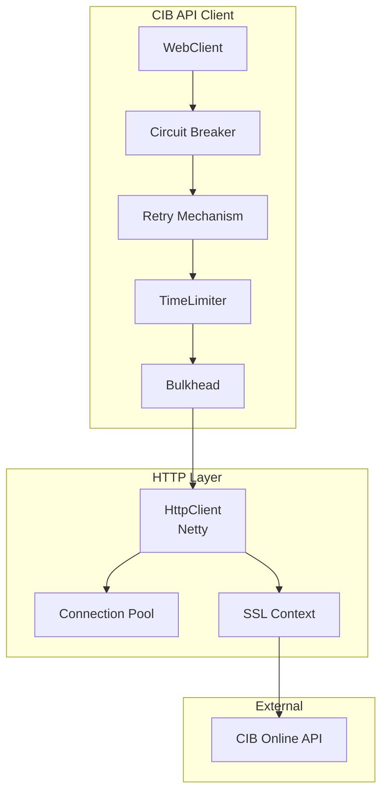

**Document Control**

| Field | Value |
|-------|-------|
| **Document Title** | CIB API Client Design - WebClient, Retry, Circuit Breaker |
| **Project Name** | Unisoft Loan Management System (ULMS) v2.0 |
| **Document Version** | 1.0 |
| **Date** | 2026-02-05 |
| **Prepared By** | Technical Lead |
| **Reviewed By** | Solution Architect |
| **Classification** | Internal |
| **Status** | Draft |

**Revision History**

| Version | Date | Author | Description |
|---------|------|--------|-------------|
| 1.0 | 2026-02-05 | Technical Lead | Initial version |

---

# CIB API Client Design - WebClient, Retry, Circuit Breaker

## Table of Contents

1. [Introduction](#1-introduction)
2. [WebClient Architecture](#2-webclient-architecture)
3. [Resilience4j Integration](#3-resilience4j-integration)
4. [Retry Configuration](#4-retry-configuration)
5. [Circuit Breaker Implementation](#5-circuit-breaker-implementation)
6. [Error Handling](#6-error-handling)
7. [Authentication Flow](#7-authentication-flow)
8. [Monitoring](#8-monitoring)
9. [Performance Tuning](#9-performance-tuning)
10. [Testing](#10-testing)

---

## 1. Introduction

### 1.1 Purpose

This document details the design and implementation of the CIB API client using Spring WebFlux WebClient with comprehensive resilience patterns including retry mechanisms and circuit breakers.

### 1.2 Design Principles

- **Reactive**: Non-blocking I/O for high throughput
- **Resilient**: Automatic retry with exponential backoff
- **Fault-tolerant**: Circuit breaker prevents cascade failures
- **Observable**: Comprehensive metrics and health checks
- **Secure**: OAuth 2.0 with token caching

---

## 2. WebClient Architecture

### 2.1 Client Architecture Diagram



### 2.2 WebClient Configuration

```java
package com.unisoft.ulms.cib.client.config;

import io.netty.channel.ChannelOption;
import io.netty.handler.logging.LogLevel;
import io.netty.handler.ssl.SslContext;
import io.netty.handler.ssl.SslContextBuilder;
import io.netty.handler.timeout.ReadTimeoutHandler;
import io.netty.handler.timeout.WriteTimeoutHandler;
import lombok.RequiredArgsConstructor;
import org.springframework.context.annotation.Bean;
import org.springframework.context.annotation.Configuration;
import org.springframework.http.client.reactive.ReactorClientHttpConnector;
import org.springframework.web.reactive.function.client.ExchangeFilterFunction;
import org.springframework.web.reactive.function.client.WebClient;
import reactor.core.publisher.Mono;
import reactor.netty.http.client.HttpClient;
import reactor.netty.resources.ConnectionProvider;
import reactor.netty.transport.logging.AdvancedByteBufFormat;

import javax.net.ssl.TrustManagerFactory;
import java.io.File;
import java.io.FileInputStream;
import java.security.KeyStore;
import java.time.Duration;
import java.util.concurrent.TimeUnit;

@Configuration
@RequiredArgsConstructor
public class CibWebClientConfig {
    
    private final CibProperties properties;
    
    @Bean
    public WebClient cibWebClient(CibAuthFilter authFilter, 
                                   LoggingFilter loggingFilter) {
        
        ConnectionProvider connectionProvider = ConnectionProvider.builder("cib-pool")
            .maxConnections(properties.getConnection().getMaxConnections())
            .maxIdleTime(properties.getConnection().getMaxIdleTime())
            .pendingAcquireMaxCount(properties.getConnection().getMaxConnections() * 2)
            .pendingAcquireTimeout(Duration.ofSeconds(30))
            .build();
        
        HttpClient httpClient = HttpClient.create(connectionProvider)
            .option(ChannelOption.CONNECT_TIMEOUT_MILLIS, 
                (int) properties.getConnection().getTimeout().toMillis())
            .responseTimeout(properties.getConnection().getReadTimeout())
            .secure(spec -> spec.sslContext(createSslContext()))
            .doOnConnected(conn -> conn
                .addHandlerLast(new ReadTimeoutHandler(60, TimeUnit.SECONDS))
                .addHandlerLast(new WriteTimeoutHandler(30, TimeUnit.SECONDS))
                .addHandlerLast(new LoggingHandler(LogLevel.DEBUG)))
            .wiretap("reactor.netty.http.client.HttpClient", 
                LogLevel.DEBUG, AdvancedByteBufFormat.TEXTUAL);
        
        return WebClient.builder()
            .baseUrl(properties.getApi().getBaseUrl())
            .clientConnector(new ReactorClientHttpConnector(httpClient))
            .filter(authFilter)
            .filter(loggingFilter)
            .filter(errorHandler())
            .defaultHeader("Accept", "application/json")
            .defaultHeader("Content-Type", "application/json")
            .defaultHeader("X-Institution-Code", properties.getApi().getInstitutionCode())
            .build();
    }
    
    private SslContext createSslContext() {
        try {
            KeyStore trustStore = KeyStore.getInstance("PKCS12");
            trustStore.load(
                new FileInputStream(properties.getSsl().getTrustStorePath()),
                properties.getSsl().getTrustStorePassword().toCharArray()
            );
            
            TrustManagerFactory tmf = TrustManagerFactory.getInstance(
                TrustManagerFactory.getDefaultAlgorithm());
            tmf.init(trustStore);
            
            return SslContextBuilder.forClient()
                .trustManager(tmf)
                .build();
        } catch (Exception e) {
            throw new SslConfigurationException("Failed to create SSL context", e);
        }
    }
    
    @Bean
    public ExchangeFilterFunction errorHandler() {
        return ExchangeFilterFunction.ofResponseProcessor(clientResponse -> {
            if (clientResponse.statusCode().isError()) {
                return clientResponse.bodyToMono(CibErrorResponse.class)
                    .flatMap(error -> Mono.error(
                        new CibApiException(clientResponse.statusCode(), error)));
            }
            return Mono.just(clientResponse);
        });
    }
}
```

### 2.3 Connection Pool Configuration

```java
package com.unisoft.ulms.cib.client.config;

import org.springframework.context.annotation.Bean;
import org.springframework.context.annotation.Configuration;
import reactor.netty.resources.ConnectionProvider;

import java.time.Duration;

@Configuration
public class ConnectionPoolConfig {
    
    @Bean
    public ConnectionProvider cibConnectionProvider(CibProperties properties) {
        return ConnectionProvider.builder("cib-fixed-pool")
            // Fixed pool size
            .maxConnections(properties.getConnection().getMaxConnections())
            
            // Max time to wait for a connection from the pool
            .pendingAcquireTimeout(Duration.ofSeconds(30))
            
            // Max pending requests waiting for a connection
            .pendingAcquireMaxCount(properties.getConnection().getMaxConnections() * 2)
            
            // Connection max idle time before being closed
            .maxIdleTime(properties.getConnection().getMaxIdleTime())
            
            // Connection max lifetime
            .maxLifeTime(Duration.ofMinutes(30))
            
            // Enable eviction check
            .evictInBackground(Duration.ofMinutes(1))
            
            // LIFO vs FIFO (false = FIFO, more fair)
            .lifo(false)
            
            .build();
    }
}
```

---

## 3. Resilience4j Integration

### 3.1 Circuit Breaker Configuration

```java
package com.unisoft.ulms.cib.client.config;

import io.github.resilience4j.circuitbreaker.CircuitBreaker;
import io.github.resilience4j.circuitbreaker.CircuitBreakerConfig;
import io.github.resilience4j.circuitbreaker.CircuitBreakerRegistry;
import io.github.resilience4j.micrometer.tagged.TaggedCircuitBreakerMetrics;
import io.micrometer.core.instrument.MeterRegistry;
import lombok.RequiredArgsConstructor;
import org.springframework.context.annotation.Bean;
import org.springframework.context.annotation.Configuration;

import java.time.Duration;

@Configuration
@RequiredArgsConstructor
public class CircuitBreakerConfiguration {
    
    private final CibProperties properties;
    private final MeterRegistry meterRegistry;
    
    @Bean
    public CircuitBreakerRegistry circuitBreakerRegistry() {
        CircuitBreakerConfig config = CircuitBreakerConfig.custom()
            // Failure rate threshold percentage
            .failureRateThreshold(
                properties.getCircuitBreaker().getFailureRateThreshold())
            
            // Wait duration in open state
            .waitDurationInOpenState(
                properties.getCircuitBreaker().getWaitDurationInOpenState())
            
            // Number of calls permitted in half-open state
            .permittedNumberOfCallsInHalfOpenState(
                properties.getCircuitBreaker().getPermittedNumberOfCallsInHalfOpenState())
            
            // Sliding window size
            .slidingWindowSize(
                properties.getCircuitBreaker().getSlidingWindowSize())
            
            // Minimum number of calls to calculate failure rate
            .minimumNumberOfCalls(10)
            
            // Slow call rate threshold
            .slowCallRateThreshold(80)
            
            // Slow call duration threshold
            .slowCallDurationThreshold(Duration.ofSeconds(5))
            
            // Record exceptions as failures
            .recordExceptions(
                CibConnectionException.class,
                CibTimeoutException.class,
                CibServerException.class
            )
            
            // Ignore exceptions (don't count as failure)
            .ignoreExceptions(
                CibValidationException.class,
                CibNotFoundException.class
            )
            
            // Automatic transition from open to half-open
            .automaticTransitionFromOpenToHalfOpenEnabled(true)
            
            .build();
        
        CircuitBreakerRegistry registry = CircuitBreakerRegistry.of(config);
        
        // Register metrics
        TaggedCircuitBreakerMetrics.ofCircuitBreakerRegistry(registry)
            .bindTo(meterRegistry);
        
        return registry;
    }
    
    @Bean
    public CircuitBreaker cibApiCircuitBreaker(CircuitBreakerRegistry registry) {
        CircuitBreaker circuitBreaker = registry.circuitBreaker("cib-api");
        
        // Add event consumer for logging
        circuitBreaker.getEventPublisher()
            .onStateTransition(event -> 
                log.info("Circuit breaker state changed from {} to {}",
                    event.getStateTransition().getFromState(),
                    event.getStateTransition().getToState()))
            .onError(event -> 
                log.error("Circuit breaker recorded error: {}", 
                    event.getThrowable().getMessage()))
            .onSuccess(event -> 
                log.debug("Circuit breaker recorded success"));
        
        return circuitBreaker;
    }
}
```

### 3.2 Retry Configuration

```java
package com.unisoft.ulms.cib.client.config;

import io.github.resilience4j.retry.Retry;
import io.github.resilience4j.retry.RetryConfig;
import io.github.resilience4j.retry.RetryRegistry;
import io.github.resilience4j.micrometer.tagged.TaggedRetryMetrics;
import io.micrometer.core.instrument.MeterRegistry;
import lombok.RequiredArgsConstructor;
import lombok.extern.slf4j.Slf4j;
import org.springframework.context.annotation.Bean;
import org.springframework.context.annotation.Configuration;

import java.time.Duration;

@Configuration
@RequiredArgsConstructor
@Slf4j
public class RetryConfiguration {
    
    private final CibProperties properties;
    private final MeterRegistry meterRegistry;
    
    @Bean
    public RetryRegistry retryRegistry() {
        RetryConfig config = RetryConfig.custom()
            // Maximum number of retry attempts
            .maxAttempts(properties.getRetry().getMaxAttempts())
            
            // Wait duration between retries (exponential backoff)
            .waitDuration(Duration.ofMillis(
                properties.getRetry().getInitialInterval()))
            
            // Exponential backoff multiplier
            .exponentialBackoffMultiplier(
                properties.getRetry().getMultiplier())
            
            // Maximum wait duration between retries
            .maxWaitDuration(Duration.ofMillis(
                properties.getRetry().getMaxInterval()))
            
            // Retry on specific exceptions
            .retryExceptions(
                CibConnectionException.class,
                CibTimeoutException.class,
                CibServerException.class,
                java.net.SocketTimeoutException.class,
                java.io.IOException.class
            )
            
            // Don't retry on these exceptions
            .ignoreExceptions(
                CibValidationException.class,
                CibAuthenticationException.class,
                CibNotFoundException.class
            )
            
            // Retry condition based on result
            .retryOnResult(result -> {
                if (result instanceof CibResponse) {
                    return ((CibResponse<?>) result).isRetryable();
                }
                return false;
            })
            
            .build();
        
        RetryRegistry registry = RetryRegistry.of(config);
        
        // Register metrics
        TaggedRetryMetrics.ofRetryRegistry(registry).bindTo(meterRegistry);
        
        return registry;
    }
    
    @Bean
    public Retry cibApiRetry(RetryRegistry registry) {
        Retry retry = registry.retry("cib-api");
        
        // Add event consumer for logging
        retry.getEventPublisher()
            .onRetry(event -> 
                log.warn("Retry attempt {} for CIB API call. Last error: {}",
                    event.getNumberOfRetryAttempts(),
                    event.getLastThrowable().getMessage()))
            .onSuccess(event -> 
                log.info("CIB API call succeeded after {} retries",
                    event.getNumberOfRetryAttempts()))
            .onError(event -> 
                log.error("CIB API call failed after {} retries",
                    event.getNumberOfRetryAttempts(),
                    event.getLastThrowable()));
        
        return retry;
    }
}
```

### 3.3 TimeLimiter Configuration

```java
package com.unisoft.ulms.cib.client.config;

import io.github.resilience4j.timelimiter.TimeLimiter;
import io.github.resilience4j.timelimiter.TimeLimiterConfig;
import io.github.resilience4j.timelimiter.TimeLimiterRegistry;
import io.github.resilience4j.micrometer.tagged.TaggedTimeLimiterMetrics;
import io.micrometer.core.instrument.MeterRegistry;
import lombok.RequiredArgsConstructor;
import org.springframework.context.annotation.Bean;
import org.springframework.context.annotation.Configuration;

import java.time.Duration;

@Configuration
@RequiredArgsConstructor
public class TimeLimiterConfiguration {
    
    private final MeterRegistry meterRegistry;
    
    @Bean
    public TimeLimiterRegistry timeLimiterRegistry() {
        TimeLimiterConfig config = TimeLimiterConfig.custom()
            // Timeout duration for API calls
            .timeoutDuration(Duration.ofSeconds(30))
            
            // Cancel running future on timeout
            .cancelRunningFuture(true)
            
            .build();
        
        TimeLimiterRegistry registry = TimeLimiterRegistry.of(config);
        
        // Register metrics
        TaggedTimeLimiterMetrics.ofTimeLimiterRegistry(registry)
            .bindTo(meterRegistry);
        
        return registry;
    }
    
    @Bean
    public TimeLimiter cibApiTimeLimiter(TimeLimiterRegistry registry) {
        return registry.timeLimiter("cib-api");
    }
}
```

---

## 4. Retry Configuration

### 4.1 Spring Retry Implementation

```java
package com.unisoft.ulms.cib.client.retry;

import lombok.RequiredArgsConstructor;
import lombok.extern.slf4j.Slf4j;
import org.springframework.retry.RetryCallback;
import org.springframework.retry.RetryContext;
import org.springframework.retry.RetryListener;
import org.springframework.retry.backoff.ExponentialBackOffPolicy;
import org.springframework.retry.policy.SimpleRetryPolicy;
import org.springframework.retry.support.RetryTemplate;
import org.springframework.stereotype.Component;

import java.util.HashMap;
import java.util.Map;

@Component
@RequiredArgsConstructor
@Slf4j
public class CibRetryTemplate {
    
    private final CibProperties properties;
    
    public RetryTemplate createRetryTemplate() {
        RetryTemplate retryTemplate = new RetryTemplate();
        
        // Retry policy
        Map<Class<? extends Throwable>, Boolean> retryableExceptions = new HashMap<>();
        retryableExceptions.put(CibConnectionException.class, true);
        retryableExceptions.put(CibTimeoutException.class, true);
        retryableExceptions.put(CibServerException.class, true);
        
        SimpleRetryPolicy retryPolicy = new SimpleRetryPolicy(
            properties.getRetry().getMaxAttempts(),
            retryableExceptions
        );
        
        // Backoff policy
        ExponentialBackOffPolicy backOffPolicy = new ExponentialBackOffPolicy();
        backOffPolicy.setInitialInterval(properties.getRetry().getInitialInterval());
        backOffPolicy.setMultiplier(properties.getRetry().getMultiplier());
        backOffPolicy.setMaxInterval(properties.getRetry().getMaxInterval());
        
        retryTemplate.setRetryPolicy(retryPolicy);
        retryTemplate.setBackOffPolicy(backOffPolicy);
        retryTemplate.registerListener(new RetryListener() {
            @Override
            public <T, E extends Throwable> void onError(RetryContext context, 
                    RetryCallback<T, E> callback, Throwable throwable) {
                log.warn("CIB API call failed, retrying {}/{}: {}",
                    context.getRetryCount(),
                    properties.getRetry().getMaxAttempts(),
                    throwable.getMessage());
            }
            
            @Override
            public <T, E extends Throwable> void close(RetryContext context, 
                    RetryCallback<T, E> callback, Throwable throwable) {
                if (throwable != null) {
                    log.error("CIB API call failed after {} retries",
                        context.getRetryCount(), throwable);
                } else {
                    log.info("CIB API call succeeded after {} retries",
                        context.getRetryCount());
                }
            }
        });
        
        return retryTemplate;
    }
}
```

### 4.2 Custom Retry Strategy

```java
package com.unisoft.ulms.cib.client.retry;

import org.springframework.retry.RetryContext;
import org.springframework.retry.policy.RetryContextCache;
import org.springframework.retry.support.RetrySynchronizationManager;
import org.springframework.stereotype.Component;

import java.time.Duration;
import java.time.Instant;

/**
 * Custom retry strategy with jitter to prevent thundering herd
 */
@Component
public class JitterRetryStrategy {
    
    private static final double JITTER_FACTOR = 0.1;
    
    public long calculateWaitTime(int attempt, long baseInterval, long maxInterval) {
        // Calculate exponential backoff
        long exponential = baseInterval * (long) Math.pow(2, attempt - 1);
        long bounded = Math.min(exponential, maxInterval);
        
        // Add jitter (±10%)
        double jitter = bounded * JITTER_FACTOR * (Math.random() * 2 - 1);
        
        return bounded + (long) jitter;
    }
    
    public void sleepBeforeRetry(int attempt) {
        long waitTime = calculateWaitTime(
            attempt,
            1000,  // base interval
            10000  // max interval
        );
        
        try {
            Thread.sleep(waitTime);
        } catch (InterruptedException e) {
            Thread.currentThread().interrupt();
            throw new CibRetryInterruptedException("Retry sleep interrupted", e);
        }
    }
}
```

---

## 5. Circuit Breaker Implementation

### 5.1 Circuit Breaker States

```
┌─────────────────────────────────────────────────────────────────┐
│                    Circuit Breaker States                        │
├─────────────────────────────────────────────────────────────────┤
│                                                                  │
│   ┌──────────┐    Failure Rate > 50%    ┌──────────┐           │
│   │  CLOSED  │ ────────────────────────> │   OPEN   │           │
│   │  (Normal)│                           │ (Blocked)│           │
│   └────┬─────┘                           └────┬─────┘           │
│        │                                       │                │
│        │ Success                               │ After 30s      │
│        │                                       ▼                │
│        │                               ┌──────────┐           │
│        │                               │ HALF_OPEN│           │
│        │                               │ (Testing)│           │
│        │                               └────┬─────┘           │
│        │                                    │                  │
│        │ <──────────────────────────────────┘                  │
│        │   Success / 5 calls                                  │
│        │                                                       │
│   ┌────┴─────┐                                               │
│   │  CLOSED  │                                               │
│   │  (Normal)│                                               │
│   └──────────┘                                               │
│                                                                  │
└─────────────────────────────────────────────────────────────────┘
```

### 5.2 Annotated Client Methods

```java
package com.unisoft.ulms.cib.client;

import io.github.resilience4j.circuitbreaker.annotation.CircuitBreaker;
import io.github.resilience4j.retry.annotation.Retry;
import io.github.resilience4j.timelimiter.annotation.TimeLimiter;
import lombok.RequiredArgsConstructor;
import lombok.extern.slf4j.Slf4j;
import org.springframework.stereotype.Component;
import reactor.core.publisher.Mono;

import java.util.concurrent.CompletableFuture;

@Component
@RequiredArgsConstructor
@Slf4j
public class ResilientCibApiClient {
    
    private final WebClient cibWebClient;
    private final CibAuthenticationProvider authProvider;
    
    /**
     * Submit subject with full resilience patterns
     */
    @CircuitBreaker(name = "cib-api", fallbackMethod = "submitSubjectFallback")
    @Retry(name = "cib-api")
    @TimeLimiter(name = "cib-api")
    public CompletableFuture<SubjectResponse> submitSubjectAsync(SubjectRequest request) {
        return cibWebClient.post()
            .uri("/subjects")
            .headers(headers -> headers.addAll(authProvider.getAuthenticatedHeaders()))
            .bodyValue(request)
            .retrieve()
            .bodyToMono(SubjectResponse.class)
            .doOnSubscribe(s -> log.debug("Submitting subject to CIB"))
            .doOnSuccess(r -> log.debug("Subject submitted successfully: {}", 
                r.getSubjectId()))
            .doOnError(e -> log.error("Subject submission failed: {}", e.getMessage()))
            .toFuture();
    }
    
    /**
     * Fallback method for circuit breaker
     */
    private CompletableFuture<SubjectResponse> submitSubjectFallback(
            SubjectRequest request, Exception ex) {
        log.error("Circuit breaker fallback triggered for subject submission: {}", 
            ex.getMessage());
        
        // Queue for later processing
        queueForRetry(request);
        
        return CompletableFuture.completedFuture(
            SubjectResponse.builder()
                .status("QUEUED")
                .message("Request queued due to CIB service unavailability")
                .build()
        );
    }
    
    /**
     * Inquiry with caching and resilience
     */
    @CircuitBreaker(name = "cib-api")
    @Retry(name = "cib-api")
    @TimeLimiter(name = "cib-api")
    @Cacheable(value = "cib-inquiry", key = "#subjectId", unless = "#result == null")
    public CompletableFuture<InquiryResponse> inquirySubjectAsync(String subjectId) {
        return cibWebClient.get()
            .uri("/inquiry/subjects/{subjectId}", subjectId)
            .headers(headers -> headers.addAll(authProvider.getAuthenticatedHeaders()))
            .retrieve()
            .bodyToMono(InquiryResponse.class)
            .toFuture();
    }
}
```

### 5.3 Manual Circuit Breaker Usage

```java
package com.unisoft.ulms.cib.client;

import io.github.resilience4j.circuitbreaker.CircuitBreaker;
import io.github.resilience4j.circuitbreaker.CallNotPermittedException;
import io.vavr.control.Try;
import lombok.RequiredArgsConstructor;
import org.springframework.stereotype.Component;

import java.util.function.Supplier;

@Component
@RequiredArgsConstructor
public class ManualCircuitBreakerWrapper {
    
    private final CircuitBreaker cibApiCircuitBreaker;
    
    public <T> T executeWithCircuitBreaker(Supplier<T> supplier, 
            Supplier<T> fallback) {
        Try<T> result = Try.ofSupplier(
            CircuitBreaker.decorateSupplier(cibApiCircuitBreaker, supplier)
        );
        
        return result.recover(CallNotPermittedException.class, e -> {
            log.warn("Circuit breaker is OPEN, using fallback");
            return fallback.get();
        }).get();
    }
}
```

---

## 6. Error Handling

### 6.1 Error Handler Filter

```java
package com.unisoft.ulms.cib.client.error;

import lombok.extern.slf4j.Slf4j;
import org.springframework.web.reactive.function.client.ClientResponse;
import org.springframework.web.reactive.function.client.ExchangeFilterFunction;
import reactor.core.publisher.Mono;

@Slf4j
public class CibErrorHandler {
    
    public static ExchangeFilterFunction create() {
        return ExchangeFilterFunction.ofResponseProcessor(response -> {
            if (response.statusCode().isError()) {
                return handleErrorResponse(response);
            }
            return Mono.just(response);
        });
    }
    
    private static Mono<ClientResponse> handleErrorResponse(ClientResponse response) {
        HttpStatusCode status = response.statusCode();
        
        return response.bodyToMono(String.class)
            .defaultIfEmpty("No error body")
            .flatMap(body -> {
                log.error("CIB API error - Status: {}, Body: {}", status, body);
                
                CibException exception = createException(status, body);
                return Mono.error(exception);
            });
    }
    
    private static CibException createException(HttpStatusCode status, String body) {
        return switch (status.value()) {
            case 400 -> new CibValidationException("Invalid request: " + body);
            case 401 -> new CibAuthenticationException("Authentication failed");
            case 403 -> new CibAuthorizationException("Access denied");
            case 404 -> new CibNotFoundException("Resource not found");
            case 408 -> new CibTimeoutException("Request timeout");
            case 429 -> new CibRateLimitException("Rate limit exceeded");
            case 500, 502, 503, 504 -> new CibServerException(
                "CIB server error: " + status.value());
            default -> new CibException("Unknown error: " + status.value());
        };
    }
}
```

### 6.2 Global Exception Handler

```java
package com.unisoft.ulms.cib.client.error;

import io.github.resilience4j.circuitbreaker.CallNotPermittedException;
import lombok.extern.slf4j.Slf4j;
import org.springframework.web.bind.annotation.ExceptionHandler;
import org.springframework.web.bind.annotation.RestControllerAdvice;

@RestControllerAdvice
@Slf4j
public class CibGlobalExceptionHandler {
    
    @ExceptionHandler(CibConnectionException.class)
    public ResponseEntity<ErrorResponse> handleConnectionException(
            CibConnectionException ex) {
        log.error("CIB connection error", ex);
        return ResponseEntity.status(HttpStatus.SERVICE_UNAVAILABLE)
            .body(ErrorResponse.builder()
                .code("CIB-001")
                .message("Unable to connect to CIB. Please try again later.")
                .retryable(true)
                .build());
    }
    
    @ExceptionHandler(CallNotPermittedException.class)
    public ResponseEntity<ErrorResponse> handleCircuitBreakerOpen(
            CallNotPermittedException ex) {
        log.warn("Circuit breaker is open");
        return ResponseEntity.status(HttpStatus.SERVICE_UNAVAILABLE)
            .body(ErrorResponse.builder()
                .code("CIB-CB-001")
                .message("CIB service temporarily unavailable. Request queued.")
                .retryable(true)
                .build());
    }
    
    @ExceptionHandler(CibValidationException.class)
    public ResponseEntity<ErrorResponse> handleValidationException(
            CibValidationException ex) {
        log.error("CIB validation error: {}", ex.getMessage());
        return ResponseEntity.badRequest()
            .body(ErrorResponse.builder()
                .code("CIB-VAL-001")
                .message(ex.getMessage())
                .retryable(false)
                .build());
    }
}
```

---

## 7. Authentication Flow

### 7.1 OAuth Token Manager

```java
package com.unisoft.ulms.cib.client.auth;

import lombok.RequiredArgsConstructor;
import lombok.extern.slf4j.Slf4j;
import org.springframework.data.redis.core.ReactiveRedisTemplate;
import org.springframework.http.MediaType;
import org.springframework.stereotype.Component;
import org.springframework.web.reactive.function.BodyInserters;
import org.springframework.web.reactive.function.client.WebClient;
import reactor.core.publisher.Mono;

import java.time.Duration;

@Component
@RequiredArgsConstructor
@Slf4j
public class CibOAuthTokenManager {
    
    private static final String TOKEN_KEY = "cib:oauth:token";
    private static final Duration TOKEN_TTL = Duration.ofMinutes(55);
    
    private final WebClient authWebClient;
    private final ReactiveRedisTemplate<String, String> redisTemplate;
    private final CibProperties properties;
    
    public Mono<String> getAccessToken() {
        return redisTemplate.opsForValue()
            .get(TOKEN_KEY)
            .switchIfEmpty(fetchAndCacheToken());
    }
    
    private Mono<String> fetchAndCacheToken() {
        log.debug("Fetching new OAuth token from CIB");
        
        return authWebClient.post()
            .uri(properties.getApi().getTokenUrl())
            .contentType(MediaType.APPLICATION_FORM_URLENCODED)
            .body(BodyInserters.fromFormData("grant_type", "client_credentials")
                .with("client_id", properties.getApi().getClientId())
                .with("client_secret", properties.getApi().getClientSecret())
                .with("scope", "cib.read cib.write"))
            .retrieve()
            .bodyToMono(TokenResponse.class)
            .flatMap(response -> {
                log.debug("OAuth token obtained, expires in {} seconds", 
                    response.getExpiresIn());
                
                return redisTemplate.opsForValue()
                    .set(TOKEN_KEY, response.getAccessToken(), TOKEN_TTL)
                    .thenReturn(response.getAccessToken());
            })
            .doOnError(e -> log.error("Failed to obtain OAuth token: {}", 
                e.getMessage()));
    }
    
    public Mono<Void> invalidateToken() {
        return redisTemplate.delete(TOKEN_KEY).then();
    }
}
```

---

## 8. Monitoring

### 8.1 Micrometer Metrics

```java
package com.unisoft.ulms.cib.client.metrics;

import io.micrometer.core.instrument.Counter;
import io.micrometer.core.instrument.MeterRegistry;
import io.micrometer.core.instrument.Timer;
import lombok.RequiredArgsConstructor;
import org.springframework.stereotype.Component;

@Component
@RequiredArgsConstructor
public class CibClientMetrics {
    
    private final MeterRegistry meterRegistry;
    
    public void recordRequest(String operation, String status, long durationMs) {
        // Counter for request count
        Counter.builder("cib.client.requests")
            .tag("operation", operation)
            .tag("status", status)
            .register(meterRegistry)
            .increment();
        
        // Timer for latency
        Timer.builder("cib.client.latency")
            .tag("operation", operation)
            .register(meterRegistry)
            .record(durationMs, TimeUnit.MILLISECONDS);
    }
    
    public void recordRetry(String operation, int attempt) {
        Counter.builder("cib.client.retries")
            .tag("operation", operation)
            .tag("attempt", String.valueOf(attempt))
            .register(meterRegistry)
            .increment();
    }
    
    public void recordCircuitBreakerState(String state) {
        Counter.builder("cib.client.circuitbreaker.state.change")
            .tag("state", state)
            .register(meterRegistry)
            .increment();
    }
}
```

---

## 9. Performance Tuning

### 9.1 Connection Pool Tuning

```yaml
# Performance-optimized configuration
ulms:
  cib:
    connection:
      # Increase for high-throughput scenarios
      max-connections: 100
      # Keep connections alive longer
      max-idle-time: 60m
      # Pre-warm connections
      min-idle-connections: 10
      # Enable metrics
      metrics-enabled: true
    
    # HTTP/2 configuration
    http2:
      enabled: true
      max-concurrent-streams: 100
```

---

## 10. Testing

### 10.1 Resilience Testing

```java
package com.unisoft.ulms.cib.client;

import com.github.tomakehurst.wiremock.WireMockServer;
import com.github.tomakehurst.wiremock.client.WireMock;
import org.junit.jupiter.api.Test;

class CibClientResilienceTest {
    
    @Test
    void testRetryOnTimeout() {
        // Simulate timeout on first two attempts
        wireMockServer.stubFor(post("/subjects")
            .inScenario("Retry Test")
            .whenScenarioStateIs(STARTED)
            .willReturn(aResponse()
                .withStatus(504)
                .withFixedDelay(35000))
            .willSetStateTo("SECOND_ATTEMPT"));
        
        wireMockServer.stubFor(post("/subjects")
            .inScenario("Retry Test")
            .whenScenarioStateIs("SECOND_ATTEMPT")
            .willReturn(aResponse()
                .withStatus(504))
            .willSetStateTo("THIRD_ATTEMPT"));
        
        // Success on third attempt
        wireMockServer.stubFor(post("/subjects")
            .inScenario("Retry Test")
            .whenScenarioStateIs("THIRD_ATTEMPT")
            .willReturn(aResponse()
                .withStatus(200)
                .withBody("""{"subjectId": "123"}""")));
        
        // Execute and verify retry occurred
        SubjectResponse response = client.submitSubject(request).block();
        assertThat(response.getSubjectId()).isEqualTo("123");
        
        // Verify 3 requests were made
        wireMockServer.verify(3, postRequestedFor(urlEqualTo("/subjects")));
    }
    
    @Test
    void testCircuitBreaker() {
        // Fail multiple times to open circuit
        wireMockServer.stubFor(post("/subjects")
            .willReturn(aResponse().withStatus(500)));
        
        // Make calls until circuit opens
        for (int i = 0; i < 20; i++) {
            try {
                client.submitSubject(request).block();
            } catch (Exception e) {
                // Expected
            }
        }
        
        // Next call should fail fast with circuit breaker
        assertThrows(CallNotPermittedException.class, () -> {
            client.submitSubject(request).block();
        });
    }
}
```

---

## Related Documents

| Document | Description |
|----------|-------------|
| [CIB]_CIB_Service_Technical_Specification_v1.0.md | Service specification |
| [CIB]_CIB_Service_Implementation_Guide_v1.0.md | Implementation guide |
| [CIB]_CIB_Batch_Processing_Design_v1.0.md | Batch processing design |

---

*© 2026 Unisoft Systems Limited. All Rights Reserved.*
