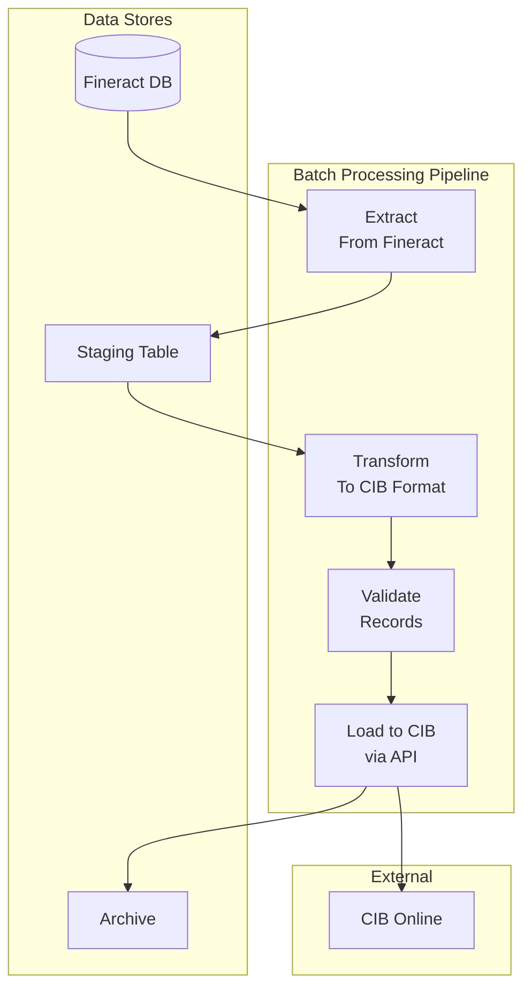

**Document Control**

| Field | Value |
|-------|-------|
| **Document Title** | CIB Batch Processing Design - Monthly Batch to Bangladesh Bank |
| **Project Name** | Unisoft Loan Management System (ULMS) v2.0 |
| **Document Version** | 1.0 |
| **Date** | 2026-02-05 |
| **Prepared By** | Technical Lead |
| **Reviewed By** | Solution Architect |
| **Classification** | Confidential |
| **Status** | Draft |

**Revision History**

| Version | Date | Author | Description |
|---------|------|--------|-------------|
| 1.0 | 2026-02-05 | Technical Lead | Initial version |

---

# CIB Batch Processing Design - Monthly Batch to Bangladesh Bank

## Table of Contents

1. [Introduction](#1-introduction)
2. [Batch Architecture](#2-batch-architecture)
3. [Batch Job Configuration](#3-batch-job-configuration)
4. [Data Extraction](#4-data-extraction)
5. [Data Transformation](#5-data-transformation)
6. [Data Loading](#6-data-loading)
7. [Error Handling](#7-error-handling)
8. [Monitoring and Reporting](#8-monitoring-and-reporting)
9. [Performance Optimization](#9-performance-optimization)
10. [Scheduling and Operations](#10-scheduling-and-operations)

---

## 1. Introduction

### 1.1 Purpose

This document describes the design for monthly batch processing of loan data submission to Bangladesh Bank's Credit Information Bureau (CIB) Online system.

### 1.2 Batch Schedule

| Batch Type | Frequency | Schedule |
|------------|-----------|----------|
| Monthly Full Batch | Monthly | 5th of month, 2:00 AM |
| Incremental Update | Daily | 11:00 PM |
| Retry Failed Records | Hourly | Every hour |

---

## 2. Batch Architecture

### 2.1 High-Level Architecture



### 2.2 Component Design

```java
package com.unisoft.ulms.cib.batch;

import lombok.RequiredArgsConstructor;
import org.springframework.batch.core.Job;
import org.springframework.batch.core.Step;
import org.springframework.batch.core.configuration.annotation.EnableBatchProcessing;
import org.springframework.batch.core.job.builder.JobBuilder;
import org.springframework.batch.core.launch.support.RunIdIncrementer;
import org.springframework.batch.core.repository.JobRepository;
import org.springframework.batch.core.step.builder.StepBuilder;
import org.springframework.context.annotation.Bean;
import org.springframework.context.annotation.Configuration;
import org.springframework.transaction.PlatformTransactionManager;

@Configuration
@EnableBatchProcessing
@RequiredArgsConstructor
public class CibBatchJobConfiguration {
    
    private final JobRepository jobRepository;
    private final PlatformTransactionManager transactionManager;
    
    @Bean
    public Job monthlyCibBatchJob() {
        return new JobBuilder("monthlyCibBatchJob", jobRepository)
            .incrementer(new RunIdIncrementer())
            .start(extractStep())
            .next(transformStep())
            .next(validateStep())
            .next(uploadStep())
            .next(verifyStep())
            .next(archiveStep())
            .build();
    }
    
    @Bean
    public Step extractStep() {
        return new StepBuilder("extractStep", jobRepository)
            .<Loan, CibSubjectRaw>chunk(1000, transactionManager)
            .reader(loanDataReader())
            .processor(rawDataProcessor())
            .writer(stagingTableWriter())
            .build();
    }
    
    @Bean
    public Step transformStep() {
        return new StepBuilder("transformStep", jobRepository)
            .<CibSubjectRaw, CibSubject>chunk(500, transactionManager)
            .reader(stagingTableReader())
            .processor(subjectTransformer())
            .writer(transformedDataWriter())
            .build();
    }
    
    @Bean
    public Step validateStep() {
        return new StepBuilder("validateStep", jobRepository)
            .<CibSubject, ValidatedSubject>chunk(500, transactionManager)
            .reader(transformedDataReader())
            .processor(validationProcessor())
            .writer(validatedDataWriter())
            .faultTolerant()
            .skip(ValidationException.class)
            .skipLimit(100)
            .build();
    }
    
    @Bean
    public Step uploadStep() {
        return new StepBuilder("uploadStep", jobRepository)
            .<ValidatedSubject, CibUploadResult>chunk(100, transactionManager)
            .reader(validatedDataReader())
            .processor(cibUploadProcessor())
            .writer(uploadResultWriter())
            .faultTolerant()
            .retry(CibApiException.class)
            .retryLimit(3)
            .build();
    }
}
```

---

## 3. Batch Job Configuration

### 3.1 Job Properties

```yaml
ulms:
  cib:
    batch:
      # Monthly batch configuration
      monthly:
        cron: "0 0 2 5 * ?"  # 5th of every month at 2:00 AM
        chunk-size: 1000
        retry-max-attempts: 3
        retry-interval: 300000  # 5 minutes
        
      # Data extraction
      extraction:
        page-size: 5000
        parallel-threads: 4
        
      # Validation
      validation:
        strict-mode: true
        skip-invalid-records: true
        max-skip-limit: 1000
        
      # Upload
      upload:
        batch-size: 100  # Records per API call
        concurrent-uploads: 5
        timeout-seconds: 300
        
      # Archive
      archive:
        enabled: true
        retention-days: 2555  # 7 years
```

---

## 4. Data Extraction

### 4.1 Loan Data Reader

```java
package com.unisoft.ulms.cib.batch.reader;

import lombok.RequiredArgsConstructor;
import org.springframework.batch.item.database.JdbcPagingItemReader;
import org.springframework.batch.item.database.Order;
import org.springframework.batch.item.database.PagingQueryProvider;
import org.springframework.batch.item.database.support.SqlPagingQueryProviderFactoryBean;
import org.springframework.context.annotation.Bean;
import org.springframework.stereotype.Component;

import javax.sql.DataSource;
import java.util.HashMap;
import java.util.Map;

@Component
@RequiredArgsConstructor
public class CibLoanDataReader {
    
    private final DataSource dataSource;
    
    @Bean
    public JdbcPagingItemReader<Loan> loanDataReader() throws Exception {
        JdbcPagingItemReader<Loan> reader = new JdbcPagingItemReader<>();
        reader.setDataSource(dataSource);
        reader.setPageSize(5000);
        reader.setQueryProvider(queryProvider());
        reader.setRowMapper(new LoanRowMapper());
        return reader;
    }
    
    private PagingQueryProvider queryProvider() throws Exception {
        SqlPagingQueryProviderFactoryBean factory = new SqlPagingQueryProviderFactoryBean();
        factory.setDataSource(dataSource);
        factory.setSelectClause("""
            SELECT 
                l.id,
                l.account_no,
                l.external_id,
                l.loan_status_id,
                l.disbursedon_date,
                l.approved_principal,
                l.principal_disbursed_derived,
                l.principal_outstanding_derived,
                l.total_outstanding_derived,
                c.id as client_id,
                c.firstname,
                c.lastname,
                c.display_name,
                c.date_of_birth,
                c.mobile_no,
                c.external_id as client_external_id
            """);
        factory.setFromClause("""
            FROM m_loan l
            JOIN m_client c ON l.client_id = c.id
            LEFT JOIN ulms_cib_subject_mapping sm ON c.id = sm.internal_subject_id
            """);
        factory.setWhereClause("""
            l.loan_status_id IN (300, 600, 601, 602)
            AND l.disbursedon_date IS NOT NULL
            AND (sm.active IS NULL OR sm.active = true)
            """);
        
        Map<String, Order> sortKeys = new HashMap<>();
        sortKeys.put("l.id", Order.ASCENDING);
        factory.setSortKeys(sortKeys);
        
        return factory.getObject();
    }
}
```

### 4.2 Parallel Extraction

```java
package com.unisoft.ulms.cib.batch.extractor;

import lombok.RequiredArgsConstructor;
import org.springframework.scheduling.annotation.Async;
import org.springframework.stereotype.Component;

import java.util.List;
import java.util.concurrent.CompletableFuture;

@Component
@RequiredArgsConstructor
public class ParallelDataExtractor {
    
    private final LoanRepository loanRepository;
    
    @Async("batchTaskExecutor")
    public CompletableFuture<List<Loan>> extractChunk(Long startId, Long endId) {
        List<Loan> loans = loanRepository.findByIdBetween(startId, endId);
        return CompletableFuture.completedFuture(loans);
    }
}
```

---

## 5. Data Transformation

### 5.1 Subject Transformer

```java
package com.unisoft.ulms.cib.batch.processor;

import lombok.RequiredArgsConstructor;
import org.springframework.batch.item.ItemProcessor;
import org.springframework.stereotype.Component;

@Component
@RequiredArgsConstructor
public class SubjectTransformer implements ItemProcessor<CibSubjectRaw, CibSubject> {
    
    private final CibMappingService mappingService;
    private final AddressEnrichmentService addressService;
    
    @Override
    public CibSubject process(CibSubjectRaw raw) throws Exception {
        return CibSubject.builder()
            .subjectId(generateSubjectId(raw))
            .subjectType(determineSubjectType(raw))
            .subjectName(formatName(raw))
            .fatherName(raw.getFatherName())
            .motherName(raw.getMotherName())
            .dateOfBirth(raw.getDateOfBirth())
            .nidNumber(validateNid(raw.getNidNumber()))
            .mobileNumber(formatMobile(raw.getMobileNumber()))
            .presentAddress(addressService.enrichAddress(raw.getAddressId()))
            .sectorCode(mappingService.getSectorCode(raw.getLoanPurpose()))
            .build();
    }
    
    private String generateSubjectId(CibSubjectRaw raw) {
        return "SUB-" + raw.getClientId() + "-" + raw.getLoanId();
    }
    
    private String determineSubjectType(CibSubjectRaw raw) {
        return raw.getClientType() == ClientType.BUSINESS ? "CORPORATE" : "INDIVIDUAL";
    }
    
    private String formatName(CibSubjectRaw raw) {
        return String.format("%s %s", 
            raw.getFirstName(), 
            raw.getLastName()).trim();
    }
}
```

### 5.2 Contract Transformer

```java
package com.unisoft.ulms.cib.batch.processor;

import lombok.RequiredArgsConstructor;
import org.springframework.batch.item.ItemProcessor;
import org.springframework.stereotype.Component;

import java.math.BigDecimal;

@Component
@RequiredArgsConstructor
public class ContractTransformer implements ItemProcessor<Loan, CibContract> {
    
    private final ClassificationService classificationService;
    private final CurrencyConverter currencyConverter;
    
    @Override
    public CibContract process(Loan loan) throws Exception {
        BrpdClassification classification = classificationService
            .getCurrentClassification(loan.getId());
        
        return CibContract.builder()
            .contractId(generateContractId(loan))
            .subjectId(mapSubjectId(loan.getClientId()))
            .facilityType(mapFacilityType(loan.getLoanProduct()))
            .contractPhase(determinePhase(loan))
            .sanctionDate(loan.getApprovedOnDate())
            .disbursementDate(loan.getDisbursementDate())
            .maturityDate(loan.getMaturityDate())
            .sanctionAmount(loan.getApprovedPrincipal())
            .disbursementAmount(loan.getPrincipalDisbursed())
            .currency("BDT")
            .interestRate(loan.getAnnualNominalInterestRate())
            .purposeCode(mapPurposeCode(loan.getLoanPurpose()))
            .economicSector(mapSectorCode(loan.getSector()))
            .contractStatus(mapStatus(loan.getStatus(), classification))
            .build();
    }
}
```

---

## 6. Data Loading

### 6.1 CIB Upload Processor

```java
package com.unisoft.ulms.cib.batch.processor;

import lombok.RequiredArgsConstructor;
import lombok.extern.slf4j.Slf4j;
import org.springframework.batch.item.ItemProcessor;
import org.springframework.stereotype.Component;

@Component
@RequiredArgsConstructor
@Slf4j
public class CibUploadProcessor implements ItemProcessor<ValidatedSubject, CibUploadResult> {
    
    private final CibBatchApiClient cibClient;
    
    @Override
    public CibUploadResult process(ValidatedSubject subject) throws Exception {
        try {
            BatchSubjectResponse response = cibClient.uploadSubject(subject);
            
            return CibUploadResult.builder()
                .subjectId(subject.getSubjectId())
                .cibSubjectId(response.getCibSubjectId())
                .status(UploadStatus.SUCCESS)
                .timestamp(LocalDateTime.now())
                .build();
                
        } catch (CibValidationException e) {
            log.error("Validation failed for subject {}: {}", 
                subject.getSubjectId(), e.getMessage());
            
            return CibUploadResult.builder()
                .subjectId(subject.getSubjectId())
                .status(UploadStatus.VALIDATION_FAILED)
                .errorMessage(e.getMessage())
                .timestamp(LocalDateTime.now())
                .build();
                
        } catch (CibApiException e) {
            log.error("API error for subject {}: {}", 
                subject.getSubjectId(), e.getMessage());
            
            return CibUploadResult.builder()
                .subjectId(subject.getSubjectId())
                .status(UploadStatus.API_ERROR)
                .errorMessage(e.getMessage())
                .retryable(e.isRetryable())
                .timestamp(LocalDateTime.now())
                .build();
        }
    }
}
```

### 6.2 Batch API Client

```java
package com.unisoft.ulms.cib.batch.client;

import lombok.RequiredArgsConstructor;
import org.springframework.core.ParameterizedTypeReference;
import org.springframework.stereotype.Component;
import org.springframework.web.reactive.function.client.WebClient;
import reactor.core.publisher.Mono;

import java.util.List;

@Component
@RequiredArgsConstructor
public class CibBatchApiClient {
    
    private final WebClient cibWebClient;
    private final CibAuthenticationProvider authProvider;
    
    public BatchUploadResponse uploadBatch(BatchUploadRequest request) {
        return cibWebClient.post()
            .uri("/batch/upload")
            .headers(headers -> headers.addAll(authProvider.getAuthenticatedHeaders()))
            .bodyValue(request)
            .retrieve()
            .bodyToMono(BatchUploadResponse.class)
            .block();
    }
    
    public BatchStatusResponse checkBatchStatus(String batchId) {
        return cibWebClient.get()
            .uri("/batch/status/{batchId}", batchId)
            .headers(headers -> headers.addAll(authProvider.getAuthenticatedHeaders()))
            .retrieve()
            .bodyToMono(BatchStatusResponse.class)
            .block();
    }
}
```

---

## 7. Error Handling

### 7.1 Skip Policy

```java
package com.unisoft.ulms.cib.batch.policy;

import org.springframework.batch.core.step.skip.SkipLimitExceededException;
import org.springframework.batch.core.step.skip.SkipPolicy;
import org.springframework.stereotype.Component;

@Component
public class CibBatchSkipPolicy implements SkipPolicy {
    
    @Override
    public boolean shouldSkip(Throwable t, long skipCount) throws SkipLimitExceededException {
        // Skip validation errors (business data issues)
        if (t instanceof ValidationException) {
            return true;
        }
        
        // Don't skip API errors (system issues)
        if (t instanceof CibApiException) {
            return false;
        }
        
        // Skip other non-critical errors
        return true;
    }
}
```

### 7.2 Retry Listener

```java
package com.unisoft.ulms.cib.batch.listener;

import lombok.extern.slf4j.Slf4j;
import org.springframework.retry.RetryCallback;
import org.springframework.retry.RetryContext;
import org.springframework.retry.listener.RetryListenerSupport;
import org.springframework.stereotype.Component;

@Component
@Slf4j
public class CibBatchRetryListener extends RetryListenerSupport {
    
    @Override
    public <T, E extends Throwable> void onError(RetryContext context, 
            RetryCallback<T, E> callback, Throwable throwable) {
        log.warn("Batch retry attempt {}: {}", 
            context.getRetryCount(), 
            throwable.getMessage());
    }
    
    @Override
    public <T, E extends Throwable> void close(RetryContext context, 
            RetryCallback<T, E> callback, Throwable throwable) {
        if (throwable != null) {
            log.error("Batch item failed after {} retries", 
                context.getRetryCount(), 
                throwable);
        }
    }
}
```

---

## 8. Monitoring and Reporting

### 8.1 Batch Job Listener

```java
package com.unisoft.ulms.cib.batch.listener;

import lombok.RequiredArgsConstructor;
import lombok.extern.slf4j.Slf4j;
import org.springframework.batch.core.JobExecution;
import org.springframework.batch.core.JobExecutionListener;
import org.springframework.stereotype.Component;

@Component
@RequiredArgsConstructor
@Slf4j
public class CibBatchJobListener implements JobExecutionListener {
    
    private final NotificationService notificationService;
    private final BatchMetricsService metricsService;
    
    @Override
    public void beforeJob(JobExecution jobExecution) {
        log.info("Starting CIB batch job: {}", jobExecution.getJobInstance().getJobName());
        metricsService.recordJobStart(jobExecution.getJobId());
    }
    
    @Override
    public void afterJob(JobExecution jobExecution) {
        BatchSummary summary = createSummary(jobExecution);
        
        log.info("CIB batch job completed. Status: {}, Summary: {}",
            jobExecution.getStatus(),
            summary);
        
        // Send notification
        if (jobExecution.getStatus().isUnsuccessful()) {
            notificationService.sendBatchFailureAlert(summary);
        } else {
            notificationService.sendBatchSuccessNotification(summary);
        }
        
        metricsService.recordJobCompletion(jobExecution.getJobId(), summary);
    }
}
```

---

## 9. Performance Optimization

### 9.1 Partitioning Strategy

```java
package com.unisoft.ulms.cib.batch.partition;

import org.springframework.batch.core.partition.support.Partitioner;
import org.springframework.batch.item.ExecutionContext;
import org.springframework.stereotype.Component;

import java.util.HashMap;
import java.util.Map;

@Component
public class LoanDataPartitioner implements Partitioner {
    
    @Override
    public Map<String, ExecutionContext> partition(int gridSize) {
        Map<String, ExecutionContext> partitions = new HashMap<>();
        
        long totalLoans = loanRepository.count();
        long partitionSize = totalLoans / gridSize;
        
        for (int i = 0; i < gridSize; i++) {
            ExecutionContext context = new ExecutionContext();
            context.putLong("minId", i * partitionSize);
            context.putLong("maxId", (i + 1) * partitionSize);
            partitions.put("partition" + i, context);
        }
        
        return partitions;
    }
}
```

---

## 10. Scheduling and Operations

### 10.1 Scheduler Configuration

```java
package com.unisoft.ulms.cib.batch.scheduler;

import lombok.RequiredArgsConstructor;
import org.springframework.batch.core.Job;
import org.springframework.batch.core.JobParameters;
import org.springframework.batch.core.JobParametersBuilder;
import org.springframework.batch.core.launch.JobLauncher;
import org.springframework.scheduling.annotation.Scheduled;
import org.springframework.stereotype.Component;

import java.time.YearMonth;

@Component
@RequiredArgsConstructor
public class CibBatchScheduler {
    
    private final JobLauncher jobLauncher;
    private final Job monthlyCibBatchJob;
    
    @Scheduled(cron = "${ulms.cib.batch.monthly.cron}", zone = "Asia/Dhaka")
    public void runMonthlyBatch() throws Exception {
        YearMonth reportingMonth = YearMonth.now().minusMonths(1);
        
        JobParameters parameters = new JobParametersBuilder()
            .addString("reportingMonth", reportingMonth.toString())
            .addLong("runId", System.currentTimeMillis())
            .toJobParameters();
        
        jobLauncher.run(monthlyCibBatchJob, parameters);
    }
}
```

---

## Related Documents

| Document | Description |
|----------|-------------|
| [CIB]_CIB_Service_Technical_Specification_v1.0.md | Service specification |
| [CIB]_CIB_Service_Implementation_Guide_v1.0.md | Implementation guide |
| [FIN]_Fineract_Scheduler_Customization_v1.0.md | Scheduler customization |

---

*© 2026 Unisoft Systems Limited. All Rights Reserved.*
