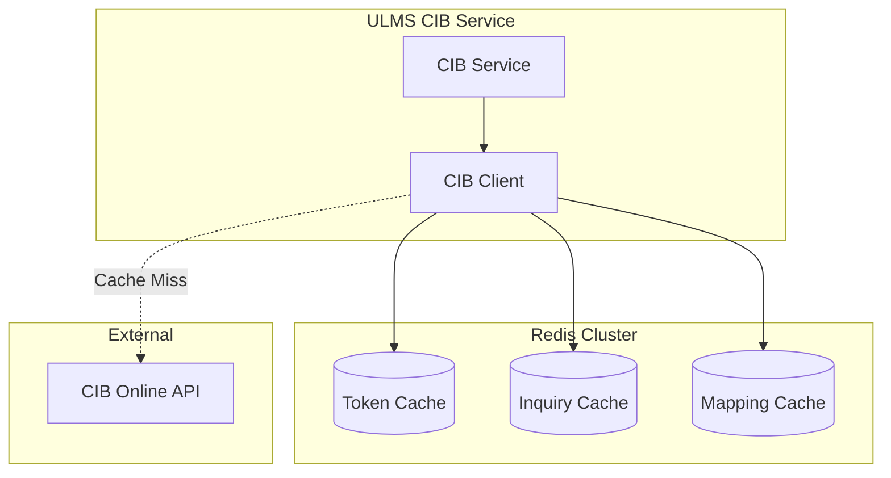

**Document Control**

| Field | Value |
|-------|-------|
| **Document Title** | CIB Caching Strategy - Redis Implementation |
| **Project Name** | Unisoft Loan Management System (ULMS) v2.0 |
| **Document Version** | 1.0 |
| **Date** | 2026-02-05 |
| **Prepared By** | Technical Lead |
| **Reviewed By** | Solution Architect |
| **Classification** | Internal |
| **Status** | Draft |

**Revision History**

| Version | Date | Author | Description |
|---------|------|--------|-------------|
| 1.0 | 2026-02-05 | Technical Lead | Initial version |

---

# CIB Caching Strategy - Redis Implementation

## Table of Contents

1. [Introduction](#1-introduction)
2. [Cache Architecture](#2-cache-architecture)
3. [Redis Configuration](#3-redis-configuration)
4. [Caching Patterns](#4-caching-patterns)
5. [Token Caching](#5-token-caching)
6. [Inquiry Response Caching](#6-inquiry-response-caching)
7. [Cache Invalidation](#7-cache-invalidation)
8. [Monitoring](#8-monitoring)
9. [Performance Tuning](#9-performance-tuning)

---

## 1. Introduction

### 1.1 Purpose

This document defines the caching strategy for CIB operations using Redis to minimize API calls to Bangladesh Bank and improve response times.

### 1.2 Cache Policies

| Cache Type | TTL | Purpose |
|------------|-----|---------|
| OAuth Token | 55 minutes | Reduce authentication overhead |
| Inquiry Response | 1 hour | Avoid repeated credit checks |
| Subject Mapping | 24 hours | Cache ID mappings |
| Rate Limit Status | 1 minute | Throttling awareness |

---

## 2. Cache Architecture



---

## 3. Redis Configuration

```java
package com.unisoft.ulms.cib.cache.config;

import org.springframework.context.annotation.Bean;
import org.springframework.context.annotation.Configuration;
import org.springframework.data.redis.connection.RedisClusterConfiguration;
import org.springframework.data.redis.connection.RedisConnectionFactory;
import org.springframework.data.redis.connection.lettuce.LettuceClientConfiguration;
import org.springframework.data.redis.connection.lettuce.LettuceConnectionFactory;
import org.springframework.data.redis.core.ReactiveRedisTemplate;
import org.springframework.data.redis.serializer.Jackson2JsonRedisSerializer;
import org.springframework.data.redis.serializer.RedisSerializationContext;
import org.springframework.data.redis.serializer.StringRedisSerializer;

import java.time.Duration;

@Configuration
public class CibRedisConfiguration {
    
    @Bean
    public RedisConnectionFactory redisConnectionFactory(CibProperties properties) {
        LettuceClientConfiguration clientConfig = LettuceClientConfiguration.builder()
            .commandTimeout(Duration.ofSeconds(5))
            .shutdownTimeout(Duration.ZERO)
            .build();
        
        if (properties.getRedis().isClusterEnabled()) {
            RedisClusterConfiguration clusterConfig = new RedisClusterConfiguration(
                properties.getRedis().getClusterNodes());
            clusterConfig.setPassword(properties.getRedis().getPassword());
            return new LettuceConnectionFactory(clusterConfig, clientConfig);
        }
        
        return new LettuceConnectionFactory(
            new RedisStandaloneConfiguration(
                properties.getRedis().getHost(),
                properties.getRedis().getPort()),
            clientConfig);
    }
    
    @Bean
    public ReactiveRedisTemplate<String, CibInquiryResponse> inquiryRedisTemplate(
            RedisConnectionFactory factory) {
        
        Jackson2JsonRedisSerializer<CibInquiryResponse> serializer = 
            new Jackson2JsonRedisSerializer<>(CibInquiryResponse.class);
        
        RedisSerializationContext<String, CibInquiryResponse> context = 
            RedisSerializationContext.<String, CibInquiryResponse>newSerializationContext(
                new StringRedisSerializer())
                .value(serializer)
                .build();
        
        return new ReactiveRedisTemplate<>(factory, context);
    }
}
```

---

## 4. Caching Patterns

### 4.1 Cache-Aside Pattern

```java
package com.unisoft.ulms.cib.cache;

import lombok.RequiredArgsConstructor;
import org.springframework.data.redis.core.ReactiveRedisTemplate;
import org.springframework.stereotype.Component;
import reactor.core.publisher.Mono;

import java.time.Duration;

@Component
@RequiredArgsConstructor
public class CibCacheManager {
    
    private final ReactiveRedisTemplate<String, CibInquiryResponse> inquiryTemplate;
    private final CibProperties properties;
    
    /**
     * Cache-Aside pattern for CIB inquiry
     */
    public Mono<CibInquiryResponse> getInquiryWithCache(
            String subjectId,
            Mono<CibInquiryResponse> fetchFromApi) {
        
        String cacheKey = buildInquiryCacheKey(subjectId);
        
        return inquiryTemplate.opsForValue()
            .get(cacheKey)
            .switchIfEmpty(
                fetchFromApi
                    .flatMap(response -> cacheInquiryResponse(cacheKey, response))
            );
    }
    
    private Mono<CibInquiryResponse> cacheInquiryResponse(
            String key, 
            CibInquiryResponse response) {
        
        return inquiryTemplate.opsForValue()
            .set(key, response, Duration.ofHours(1))
            .thenReturn(response);
    }
    
    private String buildInquiryCacheKey(String subjectId) {
        return String.format("cib:inquiry:%s", subjectId);
    }
}
```

---

## 5. Token Caching

```java
package com.unisoft.ulms.cib.cache;

import lombok.RequiredArgsConstructor;
import lombok.extern.slf4j.Slf4j;
import org.springframework.data.redis.core.ReactiveStringRedisTemplate;
import org.springframework.stereotype.Component;
import reactor.core.publisher.Mono;

import java.time.Duration;

@Component
@RequiredArgsConstructor
@Slf4j
public class CibTokenCache {
    
    private static final String TOKEN_KEY = "cib:oauth:token";
    private static final Duration TOKEN_TTL = Duration.ofMinutes(55);
    
    private final ReactiveStringRedisTemplate redisTemplate;
    
    public Mono<String> getToken() {
        return redisTemplate.opsForValue()
            .get(TOKEN_KEY)
            .doOnSubscribe(s -> log.debug("Checking token cache"))
            .doOnSuccess(token -> {
                if (token != null) {
                    log.debug("Token found in cache");
                } else {
                    log.debug("Token cache miss");
                }
            });
    }
    
    public Mono<Boolean> setToken(String token) {
        return redisTemplate.opsForValue()
            .set(TOKEN_KEY, token, TOKEN_TTL)
            .doOnSuccess(result -> log.debug("Token cached for {} minutes", 
                TOKEN_TTL.toMinutes()));
    }
    
    public Mono<Boolean> invalidateToken() {
        return redisTemplate.delete(TOKEN_KEY)
            .map(count -> count > 0)
            .doOnSuccess(result -> log.debug("Token cache invalidated"));
    }
}
```

---

## 6. Inquiry Response Caching

```java
package com.unisoft.ulms.cib.cache;

import com.fasterxml.jackson.databind.ObjectMapper;
import lombok.RequiredArgsConstructor;
import lombok.SneakyThrows;
import org.springframework.data.redis.core.ReactiveStringRedisTemplate;
import org.springframework.stereotype.Component;
import reactor.core.publisher.Mono;

import java.time.Duration;

@Component
@RequiredArgsConstructor
public class CibInquiryCache {
    
    private static final Duration INQUIRY_TTL = Duration.ofHours(1);
    private static final String KEY_PREFIX = "cib:inquiry:";
    
    private final ReactiveStringRedisTemplate redisTemplate;
    private final ObjectMapper objectMapper;
    
    @SneakyThrows
    public Mono<CibInquiryResponse> get(String subjectId) {
        String key = KEY_PREFIX + subjectId;
        
        return redisTemplate.opsForValue()
            .get(key)
            .map(json -> objectMapper.readValue(json, CibInquiryResponse.class));
    }
    
    @SneakyThrows
    public Mono<Boolean> put(String subjectId, CibInquiryResponse response) {
        String key = KEY_PREFIX + subjectId;
        String json = objectMapper.writeValueAsString(response);
        
        return redisTemplate.opsForValue()
            .set(key, json, INQUIRY_TTL);
    }
    
    public Mono<Boolean> evict(String subjectId) {
        return redisTemplate.delete(KEY_PREFIX + subjectId)
            .map(count -> count > 0);
    }
}
```

---

## 7. Cache Invalidation

```java
package com.unisoft.ulms.cib.cache;

import lombok.RequiredArgsConstructor;
import org.springframework.data.redis.core.ReactiveStringRedisTemplate;
import org.springframework.scheduling.annotation.Scheduled;
import org.springframework.stereotype.Component;

@Component
@RequiredArgsConstructor
public class CibCacheInvalidation {
    
    private final ReactiveStringRedisTemplate redisTemplate;
    
    /**
     * Invalidate all inquiry caches daily at midnight
     */
    @Scheduled(cron = "0 0 0 * * ?", zone = "Asia/Dhaka")
    public void invalidateDaily() {
        redisTemplate.keys("cib:inquiry:*")
            .flatMap(redisTemplate::delete)
            .subscribe();
    }
    
    /**
     * Invalidate specific subject inquiry
     */
    public void invalidateSubjectInquiry(String subjectId) {
        redisTemplate.delete("cib:inquiry:" + subjectId).subscribe();
    }
}
```

---

## 8. Monitoring

```java
package com.unisoft.ulms.cib.cache.metrics;

import io.micrometer.core.instrument.Counter;
import io.micrometer.core.instrument.MeterRegistry;
import io.micrometer.core.instrument.Timer;
import lombok.RequiredArgsConstructor;
import org.springframework.data.redis.core.ReactiveStringRedisTemplate;
import org.springframework.stereotype.Component;

@Component
@RequiredArgsConstructor
public class CacheMetrics {
    
    private final MeterRegistry meterRegistry;
    
    public void recordCacheHit(String cacheName) {
        Counter.builder("cib.cache.hits")
            .tag("cache", cacheName)
            .register(meterRegistry)
            .increment();
    }
    
    public void recordCacheMiss(String cacheName) {
        Counter.builder("cib.cache.misses")
            .tag("cache", cacheName)
            .register(meterRegistry)
            .increment();
    }
    
    public Timer.Sample startTimer() {
        return Timer.start(meterRegistry);
    }
    
    public void recordLatency(Timer.Sample sample, String operation) {
        sample.stop(Timer.builder("cib.cache.latency")
            .tag("operation", operation)
            .register(meterRegistry));
    }
}
```

---

## 9. Performance Tuning

### 9.1 Redis Connection Pool

```yaml
spring:
  redis:
    lettuce:
      pool:
        max-active: 50
        max-idle: 20
        min-idle: 5
        max-wait: 5000ms
```

---

## Related Documents

| Document | Description |
|----------|-------------|
| [CIB]_CIB_Service_Technical_Specification_v1.0.md | Service specification |
| [CIB]_CIB_API_Client_Design_v1.0.md | WebClient design |

---

*© 2026 Unisoft Systems Limited. All Rights Reserved.*
