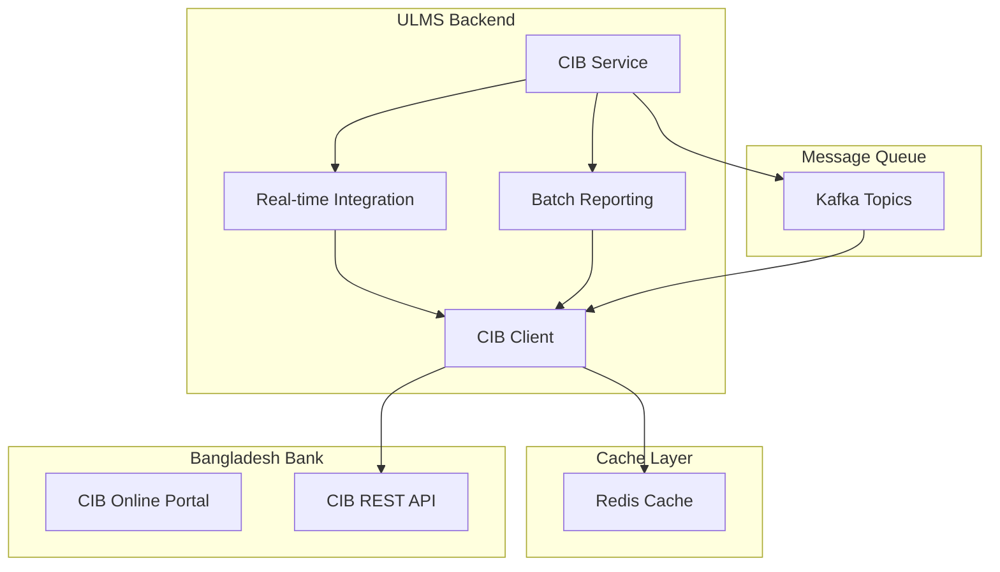
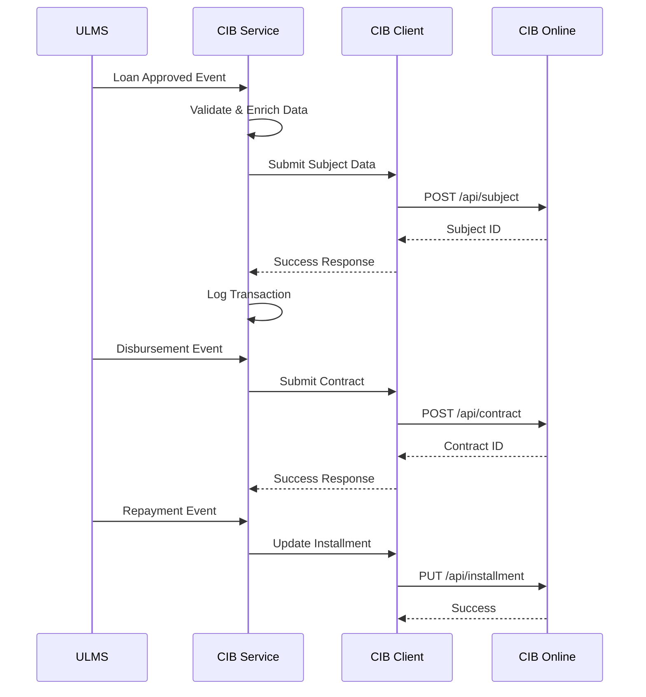

**Document Control**

| Field | Value |
|-------|-------|
| **Document Title** | CIB Service Technical Specification |
| **Project Name** | Unisoft Loan Management System (ULMS) v2.0 |
| **Document Version** | 1.0 |
| **Date** | 2026-02-05 |
| **Prepared By** | Technical Lead |
| **Reviewed By** | Solution Architect |
| **Classification** | Confidential |
| **Status** | Draft |

**Revision History**

| Version | Date | Author | Description |
|---------|------|--------|-------------|
| 1.0 | 2026-02-05 | Technical Lead | Initial version |

---

# CIB Service Technical Specification

## Table of Contents

1. [Introduction](#1-introduction)
2. [System Architecture](#2-system-architecture)
3. [CIB Integration Overview](#3-cib-integration-overview)
4. [Service Architecture](#4-service-architecture)
5. [Data Models](#5-data-models)
6. [API Specifications](#6-api-specifications)
7. [Security Requirements](#7-security-requirements)
8. [Error Handling](#8-error-handling)
9. [Performance Requirements](#9-performance-requirements)
10. [Monitoring and Alerting](#10-monitoring-and-alerting)

---

## 1. Introduction

### 1.1 Purpose

This document provides the technical specification for the CIB (Credit Information Bureau) Integration Service, which enables real-time and batch communication with Bangladesh Bank's Credit Information Bureau for loan data submission and inquiry.

### 1.2 Scope

- Real-time loan status updates to CIB
- Monthly batch reporting to CIB
- CIB inquiry for credit checking
- Error handling and retry mechanisms
- Audit trail and compliance logging

### 1.3 References

| Document | Description |
|----------|-------------|
| CIB Online API Specification | Bangladesh Bank CIB API documentation |
| BRPD Circular 15/2024 | Loan classification guidelines |
| ICT Security Guidelines V4.0 | Bangladesh Bank security requirements |

---

## 2. System Architecture

### 2.1 High-Level Architecture



### 2.2 Component Diagram

```
┌─────────────────────────────────────────────────────────────────┐
│                     CIB Service Module                           │
├─────────────────────────────────────────────────────────────────┤
│  ┌─────────────────┐  ┌─────────────────┐  ┌─────────────────┐ │
│  │  CIB API Client │  │ Batch Processor │  │ Real-time       │ │
│  │  (WebFlux)      │  │ (Spring Batch)  │  │ Event Handler   │ │
│  └────────┬────────┘  └────────┬────────┘  └────────┬────────┘ │
│           │                    │                    │          │
│  ┌────────▼────────────────────▼────────────────────▼────────┐ │
│  │              CIB Service Orchestrator                      │ │
│  │  - Request validation    - Response handling              │ │
│  │  - Retry management      - Audit logging                  │ │
│  └─────────────────────────────┬──────────────────────────────┘ │
│                                │                                │
│  ┌─────────────────────────────▼──────────────────────────────┐ │
│  │                    Data Access Layer                        │ │
│  │  - CIB Request Repository  - CIB Response Repository       │ │
│  │  - Retry Queue Repository  - Audit Log Repository          │ │
│  └────────────────────────────────────────────────────────────┘ │
└─────────────────────────────────────────────────────────────────┘
```

---

## 3. CIB Integration Overview

### 3.1 CIB Online Services

| Service | Type | Frequency | Purpose |
|---------|------|-----------|---------|
| Subject Inquiry | Real-time | On-demand | Check borrower credit history |
| Loan Subject Creation | Real-time | Event-driven | Register new borrower |
| Contract Reporting | Real-time | Event-driven | Report loan contract details |
| Installment Update | Real-time | Event-driven | Update repayment status |
| Monthly Batch | Batch | Monthly | Comprehensive data submission |

### 3.2 CIB Data Flow



---

## 4. Service Architecture

### 4.1 Service Layer Design

```java
package com.unisoft.ulms.cib.service;

/**
 * CIB Service Interface
 * Core service for CIB operations
 */
public interface CibService {
    
    /**
     * Submit subject (borrower) information to CIB
     */
    CibResponse<SubjectResponse> submitSubject(SubjectRequest request);
    
    /**
     * Submit loan contract information
     */
    CibResponse<ContractResponse> submitContract(ContractRequest request);
    
    /**
     * Update installment status
     */
    CibResponse<InstallmentResponse> updateInstallment(InstallmentRequest request);
    
    /**
     * Inquiry on subject credit history
     */
    CibResponse<InquiryResponse> inquirySubject(String subjectId);
    
    /**
     * Generate and submit monthly batch report
     */
    CibResponse<BatchResponse> submitMonthlyBatch(YearMonth reportingMonth);
}
```

### 4.2 Service Implementation

```java
package com.unisoft.ulms.cib.service;

import lombok.RequiredArgsConstructor;
import lombok.extern.slf4j.Slf4j;
import org.springframework.stereotype.Service;
import org.springframework.transaction.annotation.Transactional;

@Service
@RequiredArgsConstructor
@Slf4j
public class CibServiceImpl implements CibService {
    
    private final CibApiClient cibApiClient;
    private final CibRequestRepository requestRepository;
    private final CibResponseRepository responseRepository;
    private final CibAuditService auditService;
    private final CibRetryService retryService;
    
    @Override
    @Transactional
    public CibResponse<SubjectResponse> submitSubject(SubjectRequest request) {
        log.info("Submitting subject to CIB: {}", request.getSubjectId());
        
        // Validate request
        validateSubjectRequest(request);
        
        // Log request
        CibRequestEntity requestEntity = auditService.logRequest(request, SUBJECT_SUBMISSION);
        
        try {
            // Call CIB API
            SubjectResponse response = cibApiClient.submitSubject(request);
            
            // Log response
            auditService.logResponse(requestEntity, response);
            
            return CibResponse.success(response);
            
        } catch (CibApiException e) {
            log.error("CIB subject submission failed: {}", e.getMessage());
            auditService.logError(requestEntity, e);
            
            // Queue for retry if applicable
            if (e.isRetryable()) {
                retryService.scheduleRetry(requestEntity);
            }
            
            return CibResponse.failure(e.getErrorCode(), e.getMessage());
        }
    }
    
    private void validateSubjectRequest(SubjectRequest request) {
        if (StringUtils.isBlank(request.getNidNumber())) {
            throw new ValidationException("NID number is required");
        }
        if (StringUtils.isBlank(request.getSubjectName())) {
            throw new ValidationException("Subject name is required");
        }
        if (request.getDateOfBirth() == null) {
            throw new ValidationException("Date of birth is required");
        }
    }
}
```

---

## 5. Data Models

### 5.1 Core Entities

```java
package com.unisoft.ulms.cib.domain;

import jakarta.persistence.*;
import lombok.*;
import org.springframework.data.annotation.CreatedDate;

import java.time.LocalDateTime;

/**
 * CIB Request Entity
 * Tracks all requests sent to CIB
 */
@Entity
@Table(name = "ulms_cib_requests")
@Data
@Builder
@NoArgsConstructor
@AllArgsConstructor
public class CibRequestEntity {
    
    @Id
    @GeneratedValue(strategy = GenerationType.IDENTITY)
    private Long id;
    
    @Column(name = "request_id", unique = true, nullable = false)
    private String requestId;
    
    @Enumerated(EnumType.STRING)
    @Column(name = "request_type", nullable = false)
    private CibRequestType requestType;
    
    @Column(name = "subject_id")
    private String subjectId;
    
    @Column(name = "loan_id")
    private Long loanId;
    
    @Column(name = "request_payload", columnDefinition = "TEXT")
    private String requestPayload;
    
    @Enumerated(EnumType.STRING)
    @Column(name = "status")
    private CibRequestStatus status;
    
    @Column(name = "retry_count")
    private Integer retryCount;
    
    @CreatedDate
    @Column(name = "created_at")
    private LocalDateTime createdAt;
    
    @Column(name = "processed_at")
    private LocalDateTime processedAt;
    
    @Version
    private Long version;
}
```

### 5.2 Request/Response DTOs

```java
package com.unisoft.ulms.cib.dto;

import lombok.Builder;
import lombok.Data;

import java.math.BigDecimal;
import java.time.LocalDate;

/**
 * CIB Subject Request
 * Represents borrower information for CIB registration
 */
@Data
@Builder
public class SubjectRequest {
    
    private String subjectId;        // Internal reference
    private String subjectType;      // INDIVIDUAL / CORPORATE
    private String subjectName;
    private String fatherName;
    private String motherName;
    private String spouseName;
    private LocalDate dateOfBirth;
    private String nidNumber;
    private String passportNumber;
    private String tinNumber;
    private String gender;
    private String occupation;
    private String sectorCode;       // Bangladesh Bank sector code
    
    // Address
    private Address presentAddress;
    private Address permanentAddress;
    private Address businessAddress;
    
    // Contact
    private String mobileNumber;
    private String email;
}

@Data
@Builder
public class ContractRequest {
    
    private String contractId;
    private String subjectId;
    private String facilityType;     // TERM_LOAN, OVERDRAFT, etc.
    private String contractPhase;    // NEW, RESTRUCTURED, etc.
    private LocalDate sanctionDate;
    private LocalDate disbursementDate;
    private LocalDate maturityDate;
    private BigDecimal sanctionAmount;
    private BigDecimal disbursementAmount;
    private String currency;
    private String repaymentType;    // EMI, BULLET, etc.
    private Integer totalInstallments;
    private Integer paymentFrequency; // Monthly = 1
    private String interestType;
    private BigDecimal interestRate;
    private String securityType;
    private BigDecimal securityValue;
    private String purposeCode;      // Bangladesh Bank purpose code
    private String economicSector;   // Bangladesh Bank sector code
}
```

---

## 6. API Specifications

### 6.1 Internal REST API

```yaml
# CIB Service Internal API
openapi: 3.0.0
info:
  title: ULMS CIB Service API
  version: 1.0.0
  
paths:
  /api/v1/cib/subjects:
    post:
      summary: Submit subject to CIB
      requestBody:
        content:
          application/json:
            schema:
              $ref: '#/components/schemas/SubjectRequest'
      responses:
        200:
          description: Success
          content:
            application/json:
              schema:
                $ref: '#/components/schemas/CibResponse'
                
  /api/v1/cib/contracts:
    post:
      summary: Submit contract to CIB
      requestBody:
        content:
          application/json:
            schema:
              $ref: '#/components/schemas/ContractRequest'
      responses:
        200:
          description: Success
          
  /api/v1/cib/inquiry/{subjectId}:
    get:
      summary: Inquiry on subject
      parameters:
        - name: subjectId
          in: path
          required: true
          schema:
            type: string
      responses:
        200:
          description: Subject credit report
          
  /api/v1/cib/batch/submit:
    post:
      summary: Submit monthly batch
      requestBody:
        content:
          application/json:
            schema:
              type: object
              properties:
                year:
                  type: integer
                month:
                  type: integer
      responses:
        202:
          description: Batch submitted for processing
```

### 6.2 External CIB API Mapping

| ULMS Operation | CIB API Endpoint | Method |
|----------------|------------------|--------|
| Submit Subject | /api/v2/subjects | POST |
| Update Subject | /api/v2/subjects/{id} | PUT |
| Submit Contract | /api/v2/contracts | POST |
| Update Contract | /api/v2/contracts/{id} | PUT |
| Update Installment | /api/v2/installments | PUT |
| Subject Inquiry | /api/v2/inquiry/subjects/{id} | GET |
| Batch Upload | /api/v2/batch/upload | POST |
| Batch Status | /api/v2/batch/status/{batchId} | GET |

---

## 7. Security Requirements

### 7.1 Authentication

```java
package com.unisoft.ulms.cib.security;

import org.springframework.http.HttpHeaders;
import org.springframework.stereotype.Component;

/**
 * CIB API Authentication Provider
 * Manages OAuth 2.0 tokens for CIB API
 */
@Component
@RequiredArgsConstructor
public class CibAuthenticationProvider {
    
    private final CibProperties properties;
    private final TokenCache tokenCache;
    
    /**
     * Get authenticated headers for CIB API
     */
    public HttpHeaders getAuthenticatedHeaders() {
        HttpHeaders headers = new HttpHeaders();
        headers.setBearerAuth(getAccessToken());
        headers.setContentType(MediaType.APPLICATION_JSON);
        headers.set("X-API-Key", properties.getApiKey());
        headers.set("X-Institution-Code", properties.getInstitutionCode());
        return headers;
    }
    
    private String getAccessToken() {
        // Check cache first
        String cachedToken = tokenCache.getToken();
        if (cachedToken != null && !tokenCache.isExpired()) {
            return cachedToken;
        }
        
        // Fetch new token
        return refreshToken();
    }
    
    private String refreshToken() {
        // Call CIB OAuth endpoint
        OAuthTokenResponse response = webClient.post()
            .uri(properties.getTokenUrl())
            .contentType(MediaType.APPLICATION_FORM_URLENCODED)
            .bodyValue(buildTokenRequest())
            .retrieve()
            .bodyToMono(OAuthTokenResponse.class)
            .block();
        
        String token = response.getAccessToken();
        tokenCache.storeToken(token, response.getExpiresIn());
        
        return token;
    }
}
```

### 7.2 Data Encryption

```java
package com.unisoft.ulms.cib.security;

import org.springframework.stereotype.Component;

/**
 * CIB Data Encryption Service
 * Encrypts sensitive data before transmission
 */
@Component
public class CibEncryptionService {
    
    private final Cipher cipher;
    
    public String encryptSensitiveData(String plaintext) {
        try {
            byte[] encrypted = cipher.doFinal(plaintext.getBytes(StandardCharsets.UTF_8));
            return Base64.getEncoder().encodeToString(encrypted);
        } catch (Exception e) {
            throw new EncryptionException("Failed to encrypt data", e);
        }
    }
    
    public String decryptSensitiveData(String ciphertext) {
        try {
            byte[] decoded = Base64.getDecoder().decode(ciphertext);
            return new String(cipher.doFinal(decoded), StandardCharsets.UTF_8);
        } catch (Exception e) {
            throw new EncryptionException("Failed to decrypt data", e);
        }
    }
}
```

---

## 8. Error Handling

### 8.1 Error Codes

| Error Code | Description | Retryable |
|------------|-------------|-----------|
| CIB-001 | Connection timeout | Yes |
| CIB-002 | Invalid credentials | No |
| CIB-003 | Subject not found | No |
| CIB-004 | Duplicate subject | No |
| CIB-005 | Validation error | No |
| CIB-006 | Rate limit exceeded | Yes |
| CIB-007 | Service unavailable | Yes |
| CIB-008 | Data format error | No |

### 8.2 Exception Hierarchy

```java
package com.unisoft.ulms.cib.exception;

/**
 * Base CIB Exception
 */
public abstract class CibException extends RuntimeException {
    
    private final String errorCode;
    private final boolean retryable;
    
    public CibException(String errorCode, String message, boolean retryable) {
        super(message);
        this.errorCode = errorCode;
        this.retryable = retryable;
    }
    
    public CibException(String errorCode, String message, Throwable cause, boolean retryable) {
        super(message, cause);
        this.errorCode = errorCode;
        this.retryable = retryable;
    }
}

/**
 * CIB API Connection Exception
 */
public class CibConnectionException extends CibException {
    
    public CibConnectionException(String message) {
        super("CIB-001", message, true);
    }
}

/**
 * CIB Validation Exception
 */
public class CibValidationException extends CibException {
    
    private final List<ValidationError> validationErrors;
    
    public CibValidationException(String message, List<ValidationError> errors) {
        super("CIB-005", message, false);
        this.validationErrors = errors;
    }
}
```

---

## 9. Performance Requirements

### 9.1 Response Time SLAs

| Operation | Target | Maximum |
|-----------|--------|---------|
| Subject Inquiry | 2 seconds | 5 seconds |
| Subject Submission | 3 seconds | 10 seconds |
| Contract Submission | 3 seconds | 10 seconds |
| Installment Update | 2 seconds | 5 seconds |
| Batch Status Check | 1 second | 3 seconds |

### 9.2 Throughput Requirements

- Real-time operations: 100 TPS
- Batch processing: 10,000 records per minute
- Concurrent connections: 50

---

## 10. Monitoring and Alerting

### 10.1 Metrics

```java
package com.unisoft.ulms.cib.metrics;

import io.micrometer.core.instrument.Counter;
import io.micrometer.core.instrument.MeterRegistry;
import io.micrometer.core.instrument.Timer;
import lombok.RequiredArgsConstructor;
import org.springframework.stereotype.Component;

@Component
@RequiredArgsConstructor
public class CibMetrics {
    
    private final MeterRegistry meterRegistry;
    
    public void recordRequest(CibRequestType type, boolean success) {
        Counter.builder("cib.requests")
            .tag("type", type.name())
            .tag("status", success ? "success" : "failure")
            .register(meterRegistry)
            .increment();
    }
    
    public Timer.Sample startTimer() {
        return Timer.start(meterRegistry);
    }
    
    public void recordLatency(Timer.Sample sample, CibRequestType type) {
        sample.stop(Timer.builder("cib.latency")
            .tag("type", type.name())
            .register(meterRegistry));
    }
}
```

### 10.2 Health Checks

```java
package com.unisoft.ulms.cib.health;

import org.springframework.boot.actuate.health.Health;
import org.springframework.boot.actuate.health.HealthIndicator;
import org.springframework.stereotype.Component;

@Component
public class CibHealthIndicator implements HealthIndicator {
    
    private final CibApiClient cibClient;
    
    @Override
    public Health health() {
        try {
            CibStatus status = cibClient.checkStatus();
            if (status.isAvailable()) {
                return Health.up()
                    .withDetail("api_version", status.getApiVersion())
                    .withDetail("last_checked", LocalDateTime.now())
                    .build();
            } else {
                return Health.down()
                    .withDetail("reason", status.getUnavailableReason())
                    .build();
            }
        } catch (Exception e) {
            return Health.down()
                .withException(e)
                .build();
        }
    }
}
```

---

## Related Documents

| Document | Description |
|----------|-------------|
| [CIB]_CIB_Service_Implementation_Guide_v1.0.md | Implementation steps |
| [CIB]_CIB_API_Client_Design_v1.0.md | WebClient design |
| [CIB]_CIB_Batch_Processing_Design_v1.0.md | Monthly batch design |

---

*© 2026 Unisoft Systems Limited. All Rights Reserved.*
