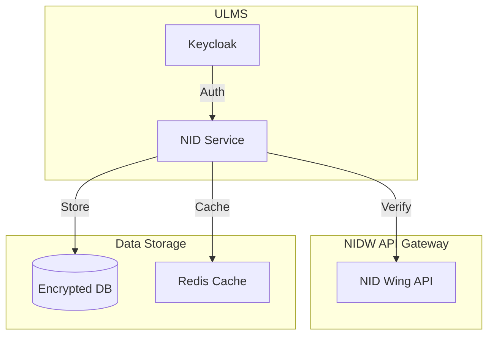

**Document Control**

| Field | Value |
|-------|-------|
| **Document Title** | NID/e-KYC Service Technical Specification |
| **Project Name** | Unisoft Loan Management System (ULMS) v2.0 |
| **Document Version** | 1.0 |
| **Date** | 2026-02-05 |
| **Prepared By** | Technical Lead |
| **Reviewed By** | Solution Architect |
| **Classification** | Confidential |
| **Status** | Draft |

**Revision History**

| Version | Date | Author | Description |
|---------|------|--------|-------------|
| 1.0 | 2026-02-05 | Technical Lead | Initial version |

---

# NID/e-KYC Service Technical Specification

## Table of Contents

1. [Introduction](#1-introduction)
2. [System Architecture](#2-system-architecture)
3. [NIDW Integration](#3-nidw-integration)
4. [Service Components](#4-service-components)
5. [Data Models](#5-data-models)
6. [Security Requirements](#6-security-requirements)
7. [API Specifications](#7-api-specifications)
8. [Error Handling](#8-error-handling)
9. [Performance Requirements](#9-performance-requirements)

---

## 1. Introduction

### 1.1 Purpose

This document specifies the technical requirements for the NID (National ID) and e-KYC (electronic Know Your Customer) verification service that integrates with Bangladesh Election Commission's NID Wing (NIDW) system.

### 1.2 Scope

- NID verification and auto-fill
- Biometric verification
- Address verification
- Photo verification
- Duplicate customer detection
- e-KYC compliance per BFIU guidelines

---

## 2. System Architecture



---

## 3. NIDW Integration

### 3.1 API Endpoints

| Operation | NIDW Endpoint | Method |
|-----------|---------------|--------|
| Verify NID | /api/nid/verify | POST |
| Get Details | /api/nid/details/{nid} | GET |
| Verify Photo | /api/nid/verify-photo | POST |
| Verify Address | /api/nid/address/{nid} | GET |

### 3.2 Authentication

```java
@Component
public class NidwAuthProvider {
    
    public HttpHeaders getAuthHeaders() {
        HttpHeaders headers = new HttpHeaders();
        headers.set("X-API-Key", apiKey);
        headers.set("X-Partner-Id", partnerId);
        headers.setBearerAuth(getAccessToken());
        return headers;
    }
}
```

---

## 4. Service Components

### 4.1 Service Interface

```java
public interface NidVerificationService {
    NidVerificationResult verifyNid(String nidNumber, String dateOfBirth);
    NidDetails getNidDetails(String nidNumber);
    boolean verifyPhoto(String nidNumber, byte[] photo);
    boolean verifyAddress(String nidNumber, String providedAddress);
}
```

### 4.2 Implementation

```java
@Service
@RequiredArgsConstructor
public class NidVerificationServiceImpl implements NidVerificationService {
    
    private final NidwApiClient nidwClient;
    private final NidDataRepository nidRepository;
    private final EncryptionService encryptionService;
    
    @Override
    @Transactional
    public NidVerificationResult verifyNid(String nidNumber, String dateOfBirth) {
        // Validate NID format
        validateNidFormat(nidNumber);
        
        // Check cache
        Optional<NidVerificationResult> cached = checkCache(nidNumber);
        if (cached.isPresent()) {
            return cached.get();
        }
        
        // Call NIDW API
        NidwResponse response = nidwClient.verifyNid(nidNumber, dateOfBirth);
        
        // Encrypt and store
        NidDataEntity entity = NidDataEntity.builder()
            .nidHash(hashNid(nidNumber))
            .encryptedData(encryptionService.encrypt(response.getData()))
            .verifiedAt(LocalDateTime.now())
            .build();
        
        nidRepository.save(entity);
        
        return mapToResult(response);
    }
    
    private void validateNidFormat(String nidNumber) {
        if (!nidNumber.matches("^\\d{10}$|^\\d{13}$|^\\d{17}$")) {
            throw new InvalidNidException("Invalid NID format");
        }
    }
}
```

---

## 5. Data Models

### 5.1 NID Data Entity

```java
@Entity
@Table(name = "ulms_nid_verifications")
@Data
@Builder
public class NidDataEntity {
    
    @Id
    @GeneratedValue(strategy = GenerationType.IDENTITY)
    private Long id;
    
    @Column(name = "nid_hash", unique = true, nullable = false)
    private String nidHash;  // SHA-256 hash for lookup
    
    @Column(name = "encrypted_data", columnDefinition = "TEXT")
    private String encryptedData;  // AES-256 encrypted NID data
    
    @Column(name = "verification_status")
    @Enumerated(EnumType.STRING)
    private VerificationStatus status;
    
    @Column(name = "verified_at")
    private LocalDateTime verifiedAt;
    
    @Column(name = "expires_at")
    private LocalDateTime expiresAt;
}
```

### 5.2 Verification Result

```java
@Data
@Builder
public class NidVerificationResult {
    private boolean verified;
    private String nameEn;
    private String nameBn;
    private String fatherName;
    private String motherName;
    private LocalDate dateOfBirth;
    private String gender;
    private Address address;
    private byte[] photo;
    private VerificationStatus status;
}
```

---

## 6. Security Requirements

### 6.1 Data Encryption

```java
@Component
public class NidEncryptionService {
    
    private static final String ALGORITHM = "AES/GCM/NoPadding";
    private static final int GCM_IV_LENGTH = 12;
    private static final int GCM_TAG_LENGTH = 16;
    
    public String encrypt(String plaintext) {
        try {
            byte[] iv = new byte[GCM_IV_LENGTH];
            SecureRandom.getInstanceStrong().nextBytes(iv);
            
            Cipher cipher = Cipher.getInstance(ALGORITHM);
            GCMParameterSpec parameterSpec = new GCMParameterSpec(
                GCM_TAG_LENGTH * 8, iv);
            cipher.init(Cipher.ENCRYPT_MODE, getSecretKey(), parameterSpec);
            
            byte[] encrypted = cipher.doFinal(plaintext.getBytes(StandardCharsets.UTF_8));
            
            // Combine IV + encrypted data
            ByteBuffer byteBuffer = ByteBuffer.allocate(iv.length + encrypted.length);
            byteBuffer.put(iv);
            byteBuffer.put(encrypted);
            
            return Base64.getEncoder().encodeToString(byteBuffer.array());
        } catch (Exception e) {
            throw new EncryptionException("Failed to encrypt NID data", e);
        }
    }
}
```

---

## 7. API Specifications

### 7.1 REST Endpoints

```yaml
paths:
  /api/v1/nid/verify:
    post:
      summary: Verify NID
      requestBody:
        content:
          application/json:
            schema:
              type: object
              properties:
                nidNumber:
                  type: string
                  pattern: '^\d{10}$|^\d{13}$|^\d{17}$'
                dateOfBirth:
                  type: string
                  format: date
      responses:
        200:
          description: Verification successful
          content:
            application/json:
              schema:
                $ref: '#/components/schemas/NidVerificationResponse'
                
  /api/v1/nid/details/{nid}:
    get:
      summary: Get NID details
      parameters:
        - name: nid
          in: path
          required: true
          schema:
            type: string
      responses:
        200:
          description: NID details retrieved
```

---

## 8. Error Handling

| Error Code | Description | Action |
|------------|-------------|--------|
| NID-001 | Invalid NID format | Return validation error |
| NID-002 | NID not found | Retry with NIDW |
| NID-003 | DOB mismatch | Request manual verification |
| NID-004 | NIDW service unavailable | Queue for retry |
| NID-005 | Rate limit exceeded | Implement backoff |

---

## 9. Performance Requirements

| Metric | Target |
|--------|--------|
| Verification Response Time | < 3 seconds |
| Cache Hit Ratio | > 80% |
| Concurrent Verifications | 100/sec |
| Data Encryption Time | < 100ms |

---

## Related Documents

| Document | Description |
|----------|-------------|
| [NID]_NID_Service_Implementation_Guide_v1.0.md | Implementation guide |
| [NID]_NID_Verification_Flow_v1.0.md | Verification flow design |
| [NID]_NID_Data_Model_v1.0.md | Data model details |

---

*© 2026 Unisoft Systems Limited. All Rights Reserved.*
