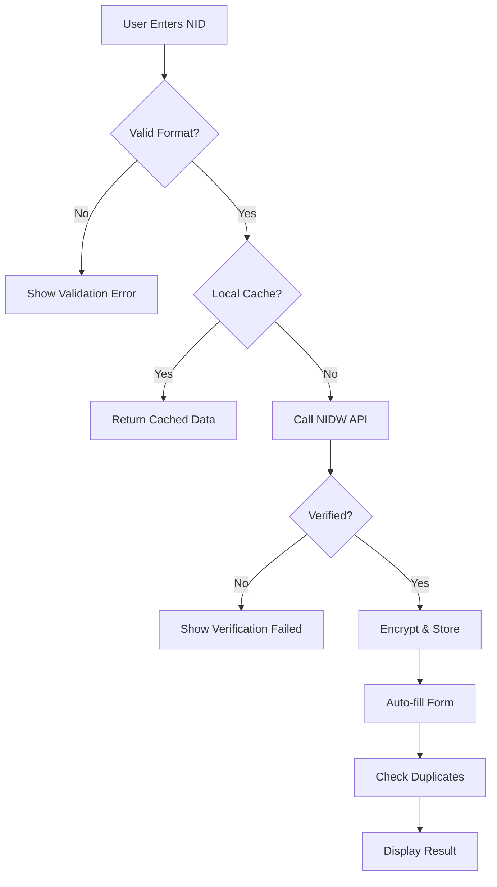
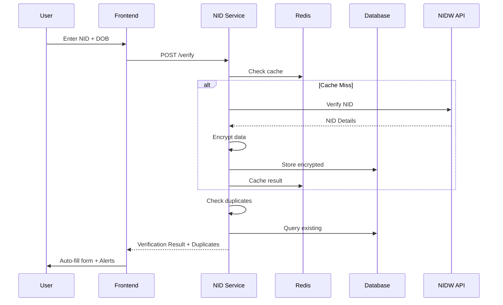

**Document Control**

| Field | Value |
|-------|-------|
| **Document Title** | NID Verification Flow - Auto-fill and Duplicate Detection |
| **Project Name** | Unisoft Loan Management System (ULMS) v2.0 |
| **Document Version** | 1.0 |
| **Date** | 2026-02-05 |
| **Prepared By** | Technical Lead |
| **Reviewed By** | Solution Architect |
| **Classification** | Internal |
| **Status** | Draft |

**Revision History**

| Version | Date | Author | Description |
|---------|------|--------|-------------|
| 1.0 | 2026-02-05 | Technical Lead | Initial version |

---

# NID Verification Flow - Auto-fill and Duplicate Detection

## Table of Contents

1. [Introduction](#1-introduction)
2. [Verification Flow](#2-verification-flow)
3. [Auto-fill Feature](#3-auto-fill-feature)
4. [Duplicate Detection](#4-duplicate-detection)
5. [Sequence Diagrams](#5-sequence-diagrams)
6. [Implementation](#6-implementation)

---

## 1. Introduction

This document describes the NID verification flow including auto-fill functionality and duplicate customer detection.

## 2. Verification Flow



## 3. Auto-fill Feature

### 3.1 Field Mapping

| NIDW Field | ULMS Field | Auto-fill |
|------------|-----------|-----------|
| nameEn | firstname, lastname | Yes |
| nameBn | displayName | Yes |
| fatherName | fatherName | Yes |
| motherName | motherName | Yes |
| dateOfBirth | dateOfBirth | Yes |
| gender | gender | Yes |
| presentAddress | address | Yes |
| mobile | mobileNo | Optional |

### 3.2 Auto-fill Service

```java
@Service
public class NidAutoFillService {
    
    public void autoFillClientData(Client client, NidVerificationResult nidData) {
        // Name parsing
        String[] nameParts = nidData.getNameEn().split(" ", 2);
        client.setFirstname(nameParts[0]);
        if (nameParts.length > 1) {
            client.setLastname(nameParts[1]);
        }
        
        // Direct mappings
        client.setDateOfBirth(nidData.getDateOfBirth());
        client.setGender(nidData.getGender());
        
        // Address mapping
        Address address = mapNidAddress(nidData.getAddress());
        client.setAddress(address);
        
        // Mark as verified
        client.setNidVerified(true);
        client.setNidVerifiedAt(LocalDateTime.now());
    }
}
```

## 4. Duplicate Detection

### 4.1 Duplicate Check Logic

```java
@Service
public class DuplicateDetectionService {
    
    public DuplicateCheckResult checkForDuplicates(String nidNumber, Long excludeClientId) {
        List<DuplicateCandidate> candidates = new ArrayList<>();
        
        // Check by NID hash
        List<Client> nidMatches = clientRepository.findByNidHash(hash(nidNumber));
        for (Client match : nidMatches) {
            if (!match.getId().equals(excludeClientId)) {
                candidates.add(DuplicateCandidate.builder()
                    .clientId(match.getId())
                    .matchType("NID_EXACT")
                    .confidence(100)
                    .build());
            }
        }
        
        // Check fuzzy name matches
        if (candidates.isEmpty()) {
            candidates.addAll(findFuzzyNameMatches(nidNumber));
        }
        
        return DuplicateCheckResult.builder()
            .hasDuplicates(!candidates.isEmpty())
            .candidates(candidates)
            .build();
    }
    
    private List<DuplicateCandidate> findFuzzyNameMatches(String nidNumber) {
        // Get NID details for name comparison
        NidDetails details = nidService.getDetails(nidNumber);
        
        // Use Levenshtein distance for fuzzy matching
        return clientRepository.findPotentialDuplicates(
            details.getNameEn(),
            details.getDateOfBirth(),
            details.getFatherName()
        );
    }
}
```

### 4.2 Duplicate Alert UI

```java
@Data
@Builder
public class DuplicateAlert {
    private String alertType;  // WARNING, BLOCKING
    private String message;
    private List<DuplicateMatch> matches;
    private boolean allowOverride;
}
```

## 5. Sequence Diagrams

### 5.1 Complete Verification Flow



## 6. Implementation

### 6.1 Verification Controller

```java
@RestController
@RequestMapping("/api/v1/nid")
@RequiredArgsConstructor
public class NidVerificationController {
    
    private final NidVerificationService verificationService;
    private final DuplicateDetectionService duplicateService;
    private final NidAutoFillService autoFillService;
    
    @PostMapping("/verify-and-fill")
    public ResponseEntity<VerificationAndFillResponse> verifyAndFill(
            @RequestBody @Valid NidVerificationRequest request) {
        
        // Step 1: Verify NID
        NidVerificationResult verification = verificationService.verify(
            request.getNidNumber(), 
            request.getDateOfBirth()
        );
        
        if (!verification.isVerified()) {
            return ResponseEntity.badRequest()
                .body(VerificationAndFillResponse.error("Verification failed"));
        }
        
        // Step 2: Check duplicates
        DuplicateCheckResult duplicates = duplicateService.checkForDuplicates(
            request.getNidNumber(), 
            request.getExcludeClientId()
        );
        
        // Step 3: Prepare auto-fill data
        AutoFillData autoFill = autoFillService.prepareAutoFill(verification);
        
        return ResponseEntity.ok(VerificationAndFillResponse.builder()
            .verified(true)
            .autoFillData(autoFill)
            .duplicateCheck(duplicates)
            .build());
    }
}
```

---

## Related Documents

| Document | Description |
|----------|-------------|
| [NID]_NID_Service_Technical_Specification_v1.0.md | Technical specification |
| [NID]_NID_Service_Implementation_Guide_v1.0.md | Implementation guide |

---

*© 2026 Unisoft Systems Limited. All Rights Reserved.*
