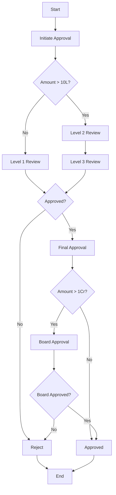

**Document Control**

| Field | Value |
|-------|-------|
| **Document Title** | BPMN Process Definitions |
| **Project Name** | Unisoft Loan Management System (ULMS) v2.0 |
| **Document Version** | 1.0 |
| **Date** | 2026-02-05 |
| **Prepared By** | Technical Lead |
| **Reviewed By** | Solution Architect |
| **Classification** | Internal |
| **Status** | Draft |

---

# BPMN Process Definitions

## Table of Contents

1. [Loan Approval Process](#1-loan-approval-process)
2. [7-Level Approval Workflow](#2-7-level-approval-workflow)
3. [BPMN XML Examples](#3-bpmn-xml-examples)
4. [Process Variables](#4-process-variables)

---

## 1. Loan Approval Process

### 1.1 Process Flow



## 2. 7-Level Approval Workflow

| Level | Role | Amount Range | SLA |
|-------|------|--------------|-----|
| 1 | Branch Officer | 0-10L | 4 hours |
| 2 | Branch Manager | 10L-50L | 8 hours |
| 3 | Area Manager | 50L-1Cr | 1 day |
| 4 | Regional Manager | 1Cr-5Cr | 2 days |
| 5 | Zonal Head | 5Cr-10Cr | 3 days |
| 6 | Head of Credit | 10Cr-25Cr | 5 days |
| 7 | Board/MD | >25Cr | 7 days |

## 3. BPMN XML Examples

### 3.1 7-Level Approval Process

```xml
<?xml version="1.0" encoding="UTF-8"?>
<bpmn:definitions xmlns:bpmn="http://www.omg.org/spec/BPMN/20100524/MODEL"
                  xmlns:zeebe="http://camunda.org/schema/zeebe/1.0"
                  id="Definitions_1"
                  targetNamespace="http://bpmn.io/schema/bpmn">
  
  <bpmn:process id="loan-approval-7-level" name="7-Level Loan Approval" isExecutable="true">
    
    <!-- Start Event -->
    <bpmn:startEvent id="StartEvent_1" name="Application Submitted">
      <bpmn:outgoing>Flow_1</bpmn:outgoing>
    </bpmn:startEvent>
    
    <!-- Level 1: Branch Officer -->
    <bpmn:userTask id="Task_Level1" name="Level 1: Branch Officer Review">
      <bpmn:extensionElements>
        <zeebe:taskDefinition type="level1-review" />
        <zeebe:assignmentDefinition assignee="=reviewerLevel1" />
      </bpmn:extensionElements>
      <bpmn:incoming>Flow_1</bpmn:incoming>
      <bpmn:outgoing>Flow_2</bpmn:outgoing>
    </bpmn:userTask>
    
    <!-- Gateway: Level 1 Decision -->
    <bpmn:exclusiveGateway id="Gateway_Level1" name="Level 1 Approved?">
      <bpmn:incoming>Flow_2</bpmn:incoming>
      <bpmn:outgoing>Flow_L1_Approve</bpmn:outgoing>
      <bpmn:outgoing>Flow_L1_Reject</bpmn:outgoing>
    </bpmn:exclusiveGateway>
    
    <!-- Level 2: Branch Manager -->
    <bpmn:userTask id="Task_Level2" name="Level 2: Branch Manager Review">
      <bpmn:extensionElements>
        <zeebe:taskDefinition type="level2-review" />
      </bpmn:extensionElements>
      <bpmn:incoming>Flow_L1_Approve</bpmn:incoming>
      <bpmn:outgoing>Flow_3</bpmn:outgoing>
    </bpmn:userTask>
    
    <!-- Level 3: Area Manager -->
    <bpmn:userTask id="Task_Level3" name="Level 3: Area Manager Review">
      <bpmn:extensionElements>
        <zeebe:taskDefinition type="level3-review" />
      </bpmn:extensionElements>
      <bpmn:incoming>Flow_3</bpmn:incoming>
      <bpmn:outgoing>Flow_4</bpmn:outgoing>
    </bpmn:userTask>
    
    <!-- Level 4: Regional Manager -->
    <bpmn:userTask id="Task_Level4" name="Level 4: Regional Manager Review">
      <bpmn:extensionElements>
        <zeebe:taskDefinition type="level4-review" />
      </bpmn:extensionElements>
      <bpmn:incoming>Flow_4</bpmn:incoming>
      <bpmn:outgoing>Flow_5</bpmn:outgoing>
    </bpmn:userTask>
    
    <!-- Level 5: Zonal Head -->
    <bpmn:userTask id="Task_Level5" name="Level 5: Zonal Head Review">
      <bpmn:extensionElements>
        <zeebe:taskDefinition type="level5-review" />
      </bpmn:extensionElements>
      <bpmn:incoming>Flow_5</bpmn:incoming>
      <bpmn:outgoing>Flow_6</bpmn:outgoing>
    </bpmn:userTask>
    
    <!-- Level 6: Head of Credit -->
    <bpmn:userTask id="Task_Level6" name="Level 6: Head of Credit Review">
      <bpmn:extensionElements>
        <zeebe:taskDefinition type="level6-review" />
      </bpmn:extensionElements>
      <bpmn:incoming>Flow_6</bpmn:incoming>
      <bpmn:outgoing>Flow_7</bpmn:outgoing>
    </bpmn:userTask>
    
    <!-- Level 7: Board/MD -->
    <bpmn:userTask id="Task_Level7" name="Level 7: Board Approval">
      <bpmn:extensionElements>
        <zeebe:taskDefinition type="level7-review" />
      </bpmn:extensionElements>
      <bpmn:incoming>Flow_7</bpmn:incoming>
      <bpmn:outgoing>Flow_8</bpmn:outgoing>
    </bpmn:userTask>
    
    <!-- Service Task: Update Loan Status -->
    <bpmn:serviceTask id="Task_Approve" name="Approve Loan">
      <bpmn:extensionElements>
        <zeebe:taskDefinition type="approve-loan" />
      </bpmn:extensionElements>
      <bpmn:incoming>Flow_8</bpmn:incoming>
      <bpmn:outgoing>Flow_Approved</bpmn:outgoing>
    </bpmn:serviceTask>
    
    <!-- Service Task: Reject Loan -->
    <bpmn:serviceTask id="Task_Reject" name="Reject Loan">
      <bpmn:extensionElements>
        <zeebe:taskDefinition type="reject-loan" />
      </bpmn:extensionElements>
      <bpmn:incoming>Flow_L1_Reject</bpmn:incoming>
      <bpmn:outgoing>Flow_Rejected</bpmn:outgoing>
    </bpmn:serviceTask>
    
    <!-- End Events -->
    <bpmn:endEvent id="EndEvent_Approved" name="Loan Approved">
      <bpmn:incoming>Flow_Approved</bpmn:incoming>
    </bpmn:endEvent>
    
    <bpmn:endEvent id="EndEvent_Rejected" name="Loan Rejected">
      <bpmn:incoming>Flow_Rejected</bpmn:incoming>
    </bpmn:endEvent>
    
    <!-- Sequence Flows -->
    <bpmn:sequenceFlow id="Flow_1" sourceRef="StartEvent_1" targetRef="Task_Level1" />
    <bpmn:sequenceFlow id="Flow_2" sourceRef="Task_Level1" targetRef="Gateway_Level1" />
    <bpmn:sequenceFlow id="Flow_L1_Approve" name="Approved" 
      sourceRef="Gateway_Level1" targetRef="Task_Level2">
      <bpmn:conditionExpression>=level1Decision = "APPROVE"</bpmn:conditionExpression>
    </bpmn:sequenceFlow>
    <bpmn:sequenceFlow id="Flow_L1_Reject" name="Rejected" 
      sourceRef="Gateway_Level1" targetRef="Task_Reject">
      <bpmn:conditionExpression>=level1Decision = "REJECT"</bpmn:conditionExpression>
    </bpmn:sequenceFlow>
    <bpmn:sequenceFlow id="Flow_3" sourceRef="Task_Level2" targetRef="Task_Level3" />
    <bpmn:sequenceFlow id="Flow_4" sourceRef="Task_Level3" targetRef="Task_Level4" />
    <bpmn:sequenceFlow id="Flow_5" sourceRef="Task_Level4" targetRef="Task_Level5" />
    <bpmn:sequenceFlow id="Flow_6" sourceRef="Task_Level5" targetRef="Task_Level6" />
    <bpmn:sequenceFlow id="Flow_7" sourceRef="Task_Level6" targetRef="Task_Level7" />
    <bpmn:sequenceFlow id="Flow_8" sourceRef="Task_Level7" targetRef="Task_Approve" />
    <bpmn:sequenceFlow id="Flow_Approved" sourceRef="Task_Approve" targetRef="EndEvent_Approved" />
    <bpmn:sequenceFlow id="Flow_Rejected" sourceRef="Task_Reject" targetRef="EndEvent_Rejected" />
    
  </bpmn:process>
</bpmn:definitions>
```

## 4. Process Variables

| Variable | Type | Description |
|----------|------|-------------|
| loanId | Long | Loan application ID |
| amount | BigDecimal | Loan amount |
| applicantName | String | Applicant name |
| currentLevel | Integer | Current approval level |
| levelXDecision | String | Decision at level X (APPROVE/REJECT) |
| levelXComments | String | Comments at level X |
| finalDecision | String | Final decision |
| approvedAt | DateTime | Approval timestamp |

---

*© 2026 Unisoft Systems Limited. All Rights Reserved.*
