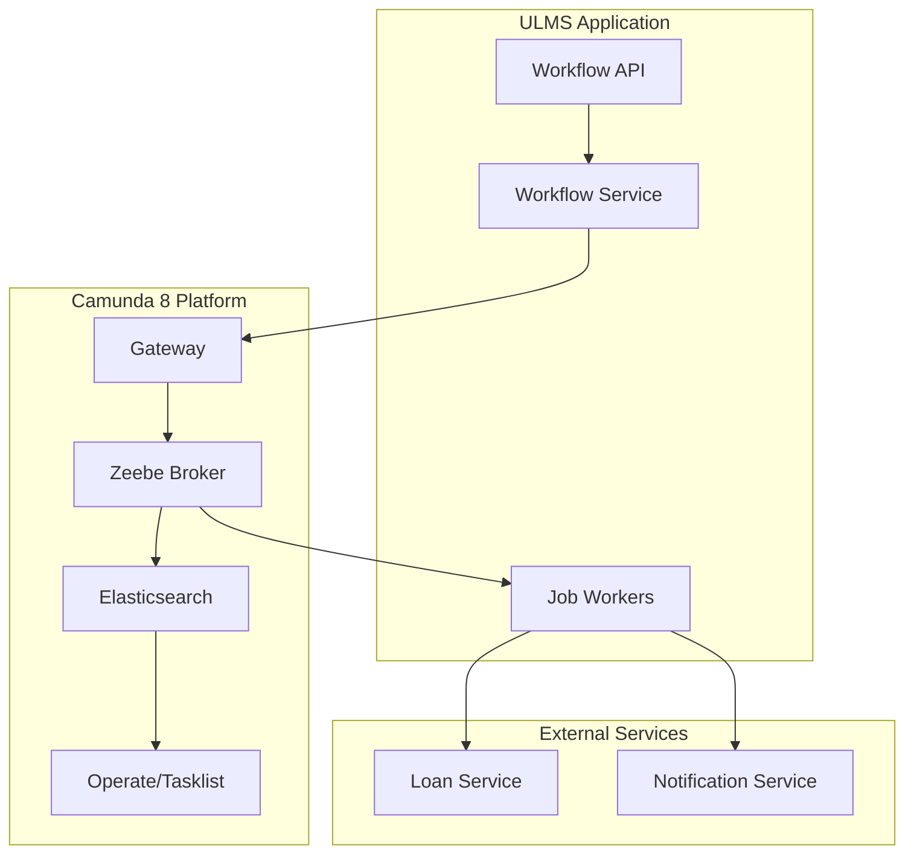

**Document Control**

| Field | Value |
|-------|-------|
| **Document Title** | Camunda 8.3 Integration Architecture |
| **Project Name** | Unisoft Loan Management System (ULMS) v2.0 |
| **Document Version** | 1.0 |
| **Date** | 2026-02-05 |
| **Prepared By** | Technical Lead |
| **Reviewed By** | Solution Architect |
| **Classification** | Confidential |
| **Status** | Draft |

---

# Camunda 8.3 Integration Architecture

## Table of Contents

1. [Introduction](#1-introduction)
2. [Architecture Overview](#2-architecture-overview)
3. [Camunda 8 Components](#3-camunda-8-components)
4. [Integration Patterns](#4-integration-patterns)
5. [Service Architecture](#5-service-architecture)
6. [Deployment Architecture](#6-deployment-architecture)
7. [Security](#7-security)

---

## 1. Introduction

This document describes the architecture for integrating Camunda Platform 8.3 with ULMS for loan approval workflows.

## 2. Architecture Overview



## 3. Camunda 8 Components

### 3.1 Zeebe Broker Configuration

```yaml
zeebe:
  client:
    broker:
      gateway-address: localhost:26500
    security:
      plaintext: false
      certificate-path: /path/to/cert.pem
  worker:
    defaultName: ulms-worker
    defaultType: ulms
    threads: 10
```

### 3.2 Job Worker Implementation

```java
@Component
public class LoanApprovalJobWorker {
    
    private final LoanService loanService;
    private final NotificationService notificationService;
    
    @JobWorker(type = "loan-approval-review", autoComplete = false)
    public void handleReviewJob(final JobClient client, final ActivatedJob job) {
        Map<String, Object> variables = job.getVariablesAsMap();
        Long loanId = (Long) variables.get("loanId");
        String reviewerRole = (String) variables.get("reviewerRole");
        
        try {
            // Perform review logic
            ReviewResult result = loanService.performReview(loanId, reviewerRole);
            
            // Complete job with variables
            client.newCompleteCommand(job.getKey())
                .variables(Map.of(
                    "reviewDecision", result.getDecision(),
                    "reviewComments", result.getComments(),
                    "reviewedAt", LocalDateTime.now()
                ))
                .send()
                .join();
                
        } catch (Exception e) {
            // Fail job
            client.newFailCommand(job.getKey())
                .retries(job.getRetries() - 1)
                .errorMessage(e.getMessage())
                .send()
                .join();
        }
    }
}
```

## 4. Integration Patterns

### 4.1 Command Pattern

```java
@Service
public class WorkflowCommandService {
    
    private final ZeebeClient zeebeClient;
    
    public long startLoanApprovalProcess(Long loanId, BigDecimal amount) {
        ProcessInstanceResult result = zeebeClient
            .newCreateInstanceCommand()
            .bpmnProcessId("loan-approval-v1")
            .latestVersion()
            .variables(Map.of(
                "loanId", loanId,
                "amount", amount,
                "requestedAt", LocalDateTime.now(),
                "currentLevel", 1
            ))
            .withResult()
            .send()
            .join();
        
        return result.getProcessInstanceKey();
    }
    
    public void completeUserTask(String taskId, Map<String, Object> variables) {
        zeebeClient.newCompleteCommand(Long.parseLong(taskId))
            .variables(variables)
            .send()
            .join();
    }
}
```

### 4.2 Event Subscription

```java
@Component
public class WorkflowEventListener {
    
    @EventListener
    public void handleProcessCompleted(ProcessCompletedEvent event) {
        // Update loan status
        loanService.updateWorkflowStatus(
            event.getProcessInstanceKey(),
            LoanWorkflowStatus.COMPLETED
        );
    }
    
    @EventListener
    public void handleIncidentCreated(IncidentCreatedEvent event) {
        // Alert operations team
        alertService.sendIncidentAlert(event);
    }
}
```

## 5. Service Architecture

```java
public interface WorkflowService {
    long startProcess(String processId, Map<String, Object> variables);
    void cancelProcess(long processInstanceKey);
    List<TaskDto> getUserTasks(String assignee);
    void completeTask(String taskId, Map<String, Object> variables);
    ProcessStatus getProcessStatus(long processInstanceKey);
}

@Service
public class WorkflowServiceImpl implements WorkflowService {
    
    private final ZeebeClient zeebeClient;
    
    @Override
    public long startProcess(String processId, Map<String, Object> variables) {
        ProcessInstanceEvent event = zeebeClient
            .newCreateInstanceCommand()
            .bpmnProcessId(processId)
            .latestVersion()
            .variables(variables)
            .send()
            .join();
        
        return event.getProcessInstanceKey();
    }
    
    @Override
    public List<TaskDto> getUserTasks(String assignee) {
        // Query Tasklist API
        return tasklistClient.getTasks(assignee);
    }
}
```

## 6. Deployment Architecture

```yaml
# docker-compose.yml for Camunda 8
version: '3'
services:
  zeebe:
    image: camunda/zeebe:8.3.0
    ports:
      - "26500:26500"
    environment:
      - ZEEBE_LOG_LEVEL=info
    volumes:
      - zeebe-data:/usr/local/zeebe/data
      
  elasticsearch:
    image: docker.elastic.co/elasticsearch/elasticsearch:8.9.0
    environment:
      - discovery.type=single-node
      - xpack.security.enabled=false
    volumes:
      - elastic-data:/usr/share/elasticsearch/data
      
  operate:
    image: camunda/operate:8.3.0
    ports:
      - "8081:8080"
    environment:
      - CAMUNDA_OPERATE_ZEEBE_GATEWAYADDRESS=zeebe:26500
      - CAMUNDA_OPERATE_ELASTICSEARCH_URL=http://elasticsearch:9200
      
  tasklist:
    image: camunda/tasklist:8.3.0
    ports:
      - "8082:8080"
    environment:
      - CAMUNDA_TASKLIST_ZEEBE_GATEWAYADDRESS=zeebe:26500
      - CAMUNDA_TASKLIST_ELASTICSEARCH_URL=http://elasticsearch:9200

volumes:
  zeebe-data:
  elastic-data:
```

## 7. Security

### 7.1 Authentication

```java
@Configuration
public class CamundaSecurityConfig {
    
    @Bean
    public ZeebeClient zeebeClient() {
        OAuthCredentialsProvider credentialsProvider = 
            new OAuthCredentialsProviderBuilder()
                .authorizationServerUrl("https://auth.camunda.io/oauth/token")
                .audience("zeebe.camunda.io")
                .clientId("client-id")
                .clientSecret("client-secret")
                .build();
        
        return ZeebeClient.newClientBuilder()
            .gatewayAddress("cluster-id.zeebe.camunda.io:443")
            .credentialsProvider(credentialsProvider)
            .build();
    }
}
```

---

*© 2026 Unisoft Systems Limited. All Rights Reserved.*
