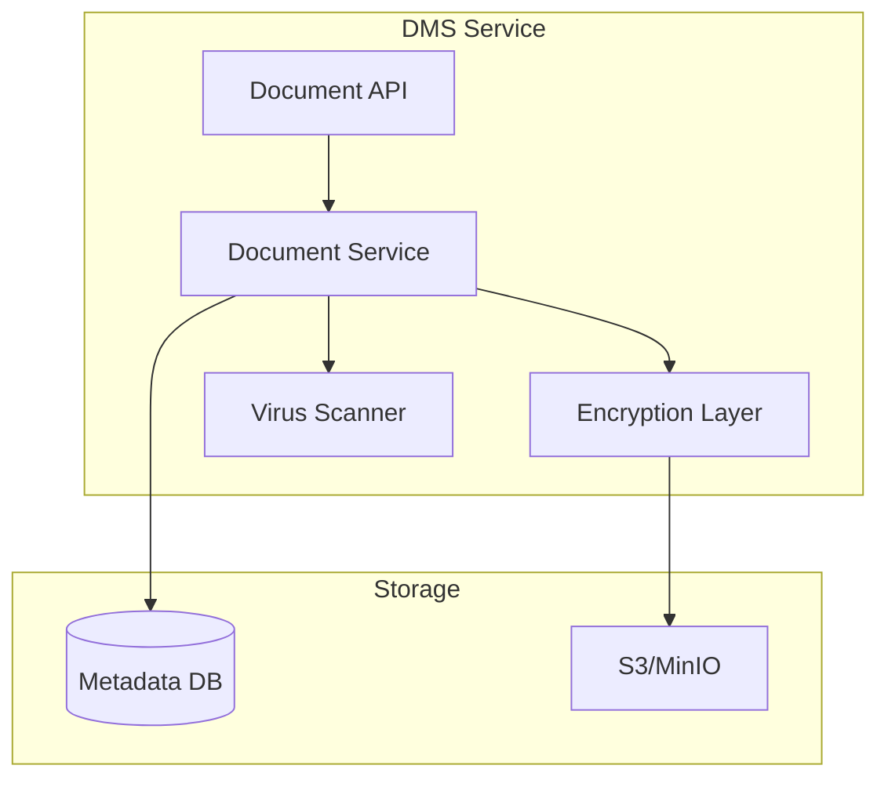

**Document Control**

| Field | Value |
|-------|-------|
| **Document Title** | Document Management Service Technical Specification |
| **Project Name** | Unisoft Loan Management System (ULMS) v2.0 |
| **Document Version** | 1.0 |
| **Date** | 2026-02-05 |
| **Prepared By** | Technical Lead |
| **Reviewed By** | Solution Architect |
| **Classification** | Confidential |
| **Status** | Draft |

---

# Document Management Service Technical Specification

## Table of Contents

1. [Introduction](#1-introduction)
2. [Architecture](#2-architecture)
3. [Storage Backend](#3-storage-backend)
4. [Security](#4-security)
5. [API Specification](#5-api-specification)

---

## 1. Introduction

This document specifies the technical requirements for the Document Management Service handling loan documents with encryption and access control.

## 2. Architecture



## 3. Storage Backend

| Storage Type | Purpose | Retention |
|--------------|---------|-----------|
| Hot Storage | Active loans | 7 years |
| Cold Storage | Closed loans | 7 years |
| Archive | Legal hold | Indefinite |

## 4. Security

### 4.1 Encryption

```java
@Service
public class DocumentEncryptionService {
    
    public EncryptedDocument encrypt(byte[] content, String documentId) {
        // Generate unique key for each document
        SecretKey key = generateKey();
        
        // Encrypt content
        byte[] encrypted = aesEncrypt(content, key);
        
        // Encrypt key with master key
        String encryptedKey = rsaEncrypt(key.getEncoded());
        
        return EncryptedDocument.builder()
            .content(encrypted)
            .encryptedKey(encryptedKey)
            .build();
    }
}
```

### 4.2 Virus Scanning

```java
@Component
public class VirusScanService {
    
    public ScanResult scan(byte[] content) {
        // Integration with ClamAV
        ClamAVClient clamav = new ClamAVClient(clamavHost, clamavPort);
        byte[] reply = clamav.scan(content);
        
        if (ClamAVClient.isCleanReply(reply)) {
            return ScanResult.clean();
        } else {
            return ScanResult.infected();
        }
    }
}
```

## 5. API Specification

### Endpoints

| Endpoint | Method | Description |
|----------|--------|-------------|
| /documents | POST | Upload document |
| /documents/{id} | GET | Download document |
| /documents/{id}/metadata | GET | Get metadata |
| /documents/{id} | DELETE | Delete document |
| /documents/search | POST | Search documents |

---

*© 2026 Unisoft Systems Limited. All Rights Reserved.*
