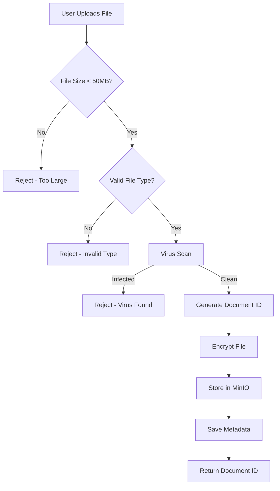

**Document Control**

| Field | Value |
|-------|-------|
| **Document Title** | Document Upload Flow |
| **Project Name** | Unisoft Loan Management System (ULMS) v2.0 |
| **Document Version** | 1.0 |
| **Date** | 2026-02-05 |
| **Prepared By** | Technical Lead |
| **Reviewed By** | Solution Architect |
| **Classification** | Internal |
| **Status** | Draft |

---

# Document Upload Flow

## Flow Diagram



## Validation Rules

| Check | Rule | Action |
|-------|------|--------|
| File Size | Max 50MB | Reject |
| File Type | PDF, JPG, PNG, DOCX | Reject |
| Virus | Clean required | Reject |
| Encryption | AES-256 | Required |

## Implementation

```java
@Component
public class DocumentUploadFlow {
    
    private static final long MAX_FILE_SIZE = 50 * 1024 * 1024;
    private static final Set<String> ALLOWED_TYPES = Set.of(
        "application/pdf",
        "image/jpeg",
        "image/png",
        "application/vnd.openxmlformats-officedocument.wordprocessingml.document"
    );
    
    public DocumentUploadResponse execute(MultipartFile file, DocumentMetadata metadata) {
        // Validation
        validateFile(file);
        
        // Virus scan
        ScanResult scan = virusScanService.scan(file.getBytes());
        if (!scan.isClean()) {
            throw new VirusDetectedException();
        }
        
        // Processing
        String documentId = UUID.randomUUID().toString();
        EncryptedDocument encrypted = encryptionService.encrypt(file.getBytes(), documentId);
        
        // Storage
        storageService.store(documentId, encrypted.getContent());
        
        // Metadata
        metadataService.save(documentId, metadata, encrypted.getEncryptedKey());
        
        return new DocumentUploadResponse(documentId, "SUCCESS");
    }
    
    private void validateFile(MultipartFile file) {
        if (file.getSize() > MAX_FILE_SIZE) {
            throw new FileTooLargeException();
        }
        if (!ALLOWED_TYPES.contains(file.getContentType())) {
            throw new InvalidFileTypeException();
        }
    }
}
```

---

*© 2026 Unisoft Systems Limited. All Rights Reserved.*
